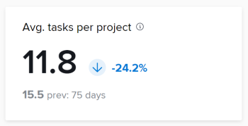

# KPI-Abfragen

Sie können die Abfragen in diesem Artikel verwenden, um Datenvisualisierungen zu erstellen, die denen in Enhanced Analytics ähneln.

>[!IMPORTANT]
>
>Abfragen führen zu ähnlichen Ergebnissen wie die in Enhanced Analytics gezeigten, aber sie stimmen möglicherweise nicht genau überein.


## Voraussetzungen

Bevor Sie beginnen, müssen Sie

1. Stellen Sie eine Verbindung mit Ihrem Business Intelligence-Tool (BI) her:
   1. [Erstellen eines Leserkontos oder einer Verbindung für Snowflake](/help/quicksilver/reports-and-dashboards/data-lake/create-a-reader-account.md)
   1. [Herstellen einer Verbindung mit Workfront Data Connect](/help/quicksilver/reports-and-dashboards/data-lake/share-data-externally.md)

Nachdem Sie eine Verbindung hergestellt haben, können Sie die Abfragen in diesem Artikel verwenden, um Daten zu extrahieren und zu visualisieren.

## Abgeschlossene Projekte

Der KPI Abgeschlossene Projekte gibt an, wie viele Projekte innerhalb des gefilterten Zeitraums abgeschlossen wurden und wie der Prozentsatz seit dem vorherigen Zeitraum gestiegen oder gesunken ist. Unter diesen Zahlen sehen Sie die Anzahl der Projekte, die im vorherigen Zeitraum abgeschlossen wurden, sowie die Anzahl der Tage im vorherigen Zeitraum.


### Abfrage

```
WITH completedProjectsInRange as ( 
SELECT COUNT(t0.PROJECTID) as PROJECT_COUNT FROM PROJECTS_CURRENT t0 
WHERE t0.ACTUALCOMPLETIONDATE >= '2025-01-01' 
AND t0.ACTUALCOMPLETIONDATE <= '2025-01-31' 
), completedProjectsPreviousRange as ( 
SELECT COUNT(t0.PROJECTID) as PROJECT_COUNT FROM PROJECTS_CURRENT t0 
WHERE t0.ACTUALCOMPLETIONDATE >= '2024-12-01' 
AND t0.ACTUALCOMPLETIONDATE <= '2024-12-31' 
), rawChange as ( 
SELECT (a.PROJECT_COUNT - b.PROJECT_COUNT) as CHANGE_FROM_PREVIOUS_PERIOD FROM completedProjectsInRange a, completedProjectsPreviousRange b 
), percentChange as ( 
SELECT  
CASE 
WHEN a.PROJECT_COUNT = b.PROJECT_COUNT THEN 0.00 
WHEN b.PROJECT_COUNT > 0 THEN ((a.PROJECT_COUNT - b.PROJECT_COUNT) / b.PROJECT_COUNT * 100) 
END AS PERCENT_CHANGE_FROM_PREVIOUS_PERIOD 
FROM completedProjectsInRange a, completedProjectsPreviousRange b 
) 
SELECT 
a.PROJECT_COUNT, 
b.PROJECT_COUNT as PREVIOUS_PROJECT_COUNT, 
c.CHANGE_FROM_PREVIOUS_PERIOD, 
d.PERCENT_CHANGE_FROM_PREVIOUS_PERIOD 
FROM completedProjectsInRange a, completedProjectsPreviousRange b, rawChange c, 
percentChange d
```

## Termingerecht abgeschlossene Projekte

Der KPI „Termingerecht abgeschlossene Projekte“ zeigt den Prozentsatz der Projekte innerhalb des gefilterten Zeitraums, die termingerecht abgeschlossen wurden, sowie den Anstieg oder Rückgang des Prozentsatzes seit dem vorherigen Zeitraum. Unter diesen Zahlen sehen Sie den Prozentsatz der Projekte, die im vorherigen Zeitraum termingerecht abgeschlossen wurden, sowie die Anzahl der Tage im vorherigen Zeitraum.


## Durchschnitt Projektdauer

Der Durchschnitt. Der KPI der Projektdauer gibt die durchschnittliche Dauer der Fertigstellung von Projekten mit tatsächlichen Enddaten innerhalb des gefilterten Zeitraums an (in Tagen, Wochen oder Jahren) und gibt an, wie der Prozentsatz seit dem vorherigen Zeitraum erhöht oder verringert wurde. Unter diesen Zahlen sehen Sie die durchschnittliche Abschlusszeit für Projekte mit tatsächlichen Enddaten im vorherigen Zeitraum sowie die Anzahl der Tage im vorherigen Zeitraum.


## Durchschnittliche Aufgaben pro Projekt

Der KPI Durchschn. Aufgaben pro Projekt gibt die durchschnittliche Anzahl der Aufgaben an, die Projekten innerhalb des gefilterten Zeitraums zugewiesen wurden, sowie den prozentualen Anstieg oder Rückgang seit dem vorherigen Zeitraum. Unter diesen Zahlen sehen Sie die durchschnittliche Anzahl der Aufgaben, die Projekten im vorherigen Zeitraum zugewiesen wurden, sowie die Anzahl der Tage im vorherigen Zeitraum.

