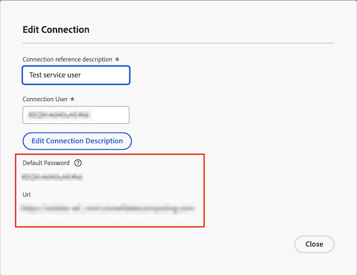

# Power BI-Tool kann mit dem angegebenen Kennwort keine Verbindung herstellen

## Problem

Wenn Sie versuchen, sich von Ihrem Power BI-Tool aus bei Data Connect anzumelden, wird der folgende Fehler angezeigt:

`Cannot connect from BI tool with provided password`

## Ursache

Beim Erstellen der JDBC-Verbindung stellt Workfront ein temporäres Kennwort für die Datenverbindung bereit.

Bevor Sie über Power BI auf Data Connect zugreifen können, müssen Sie sich zunächst mit den bereitgestellten Verbindungsdetails anmelden, das temporäre Kennwort aktualisieren und dann mit Ihrer Anmeldung fortfahren.

## Lösung

Setzen Sie das Verbindungskennwort in Workfront zurück und erstellen Sie dann ein neues Kennwort mit dem Link im Dialogfeld „Verbindung bearbeiten“.

### Zurücksetzen des Verbindungskennworts in Workfront

1. Wechseln Sie zu Workfront > Einrichtung > System > Datenverbindung.
1. Suchen Sie die Verbindung in der Liste und öffnen Sie sie.
1. Markieren **unter „Verbindungskennwort zurücksetzen** das Kontrollkästchen, um zu bestätigen, dass Sie das Kennwort zurücksetzen möchten.
1. Klicken Sie **Verbindungskennwort zurücksetzen**.
   
1. Fahren Sie mit dem folgenden Abschnitt fort.

### Neues Kennwort für die Verbindung erstellen

1. Kopieren Sie die URL und fügen Sie sie in eine neue Browser-Registerkarte ein.
1. Kopieren Sie in Workfront den Benutzernamen für die Verbindung und fügen Sie das Standardkennwort in die neue Browser-Registerkarte ein.
   
1. Klicken Sie auf **Anmelden**.
1. Geben Sie ein neues Kennwort ein und klicken Sie dann auf **Senden**.
1. Wechseln Sie zu Ihrem Power BI-Tool und melden Sie sich mit dem neuen Kennwort an.
