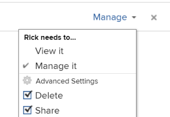

# Kalenderbericht freigeben

Sie können einen Kalender für andere Benutzer freigeben und öffentlich verfügbar machen, sodass ihn jemand ohne [!DNL Adobe Workfront] Lizenz anzeigen kann.

## Zugriffsanforderungen

+++ Erweitern Sie , um die Zugriffsanforderungen für die -Funktion in diesem Artikel anzuzeigen.

Sie müssen über folgenden Zugriff verfügen, um die Schritte in diesem Artikel ausführen zu können:

<table style="table-layout:auto"> 
 <col> 
 </col> 
 <col> 
 </col> 
 <tbody> 
  <tr> 
   <td role="rowheader">[!DNL Adobe Workfront plan]</td> 
   <td> 
Beliebig
 </td> 
  </tr> 
  <tr> 
   <td role="rowheader">[!DNL Adobe Workfront] Lizenz</td> 
   <td>
Neu: Leicht

       
oder

       
Aktuell: Überprüfung
</td> 
  </tr> 
  <tr> 
   <td role="rowheader">Konfigurationen der Zugriffsebene</td> 
   <td> 
Zugriff auf [!UICONTROL View] oder höher auf [!UICONTROL Reports], [!UICONTROL Dashboards] und [!UICONTROL Calenders]
</td> 
  </tr> 
  <tr> 
   <td role="rowheader">Objektberechtigungen</td> 
   <td>[!UICONTROL Anzeigen] oder höhere Berechtigungen für den Kalenderbericht, mit Zugriff auf die Freigabe</td> 
  </tr> 
 </tbody> 
</table>

Weitere Informationen zu den Informationen in dieser Tabelle finden Sie unter [Zugriffsanforderungen in der Dokumentation zu Workfront](/help/quicksilver/administration-and-setup/add-users/access-levels-and-object-permissions/access-level-requirements-in-documentation.md).

+++

## Kalender für [!DNL Workfront] Benutzer freigeben {#share-a-calendar-with-workfront-users}

Die Freigabe eines Kalenders ähnelt der Freigabe anderer Objekte. Weitere Informationen zum Freigeben von Objekten in [!DNL Adobe Workfront] finden Sie unter [Übersicht über Berechtigungen zum Freigeben von Objekten](../../../workfront-basics/grant-and-request-access-to-objects/sharing-permissions-on-objects-overview.md).

Kalender, die für Sie freigegeben wurden, werden mit einem Sternchen (&#42;) neben dem Kalendernamen angezeigt.

So geben Sie einen Kalender in [!DNL Workfront] frei:

1. Wechseln Sie zu dem Kalender, den Sie freigeben möchten.
1. Klicken Sie **[!UICONTROL Kalenderaktionen]** und dann auf **[!UICONTROL Freigabe]**.

1. Beginnen Sie im Feld **[!UICONTROL Kalenderzugriff erteilen an]** mit der Eingabe des Namens des Benutzers, Teams, der Rolle, der Gruppe oder des Unternehmens, für den bzw. die Sie den Kalender freigeben möchten, und klicken Sie dann auf den Namen, wenn er in der Dropdown-Liste angezeigt wird.\
   Weitere Informationen zum Festlegen von Berechtigungen finden Sie unter [Übersicht über Freigabeberechtigungen für Objekte](../../../workfront-basics/grant-and-request-access-to-objects/sharing-permissions-on-objects-overview.md).

1. (Optional) Wiederholen Sie Schritt 3 für jeden Benutzer, jedes Team, jede Rolle oder jede Gruppe, dem bzw. der Sie Zugriff auf den Kalender gewähren möchten.
1. Geben Sie die Berechtigungen für jeden Benutzer, jedes Team, jede Rolle, jede Gruppe oder jedes Unternehmen an, die bzw. das Sie in Schritt 3 hinzugefügt haben, indem Sie auf das Dropdown-Menü klicken, und wählen Sie dann die Berechtigungsstufe aus, die Sie gewähren möchten:

   * **[!UICONTROL Anzeigen]:** Benutzer können den Kalender überprüfen und freigeben.

     

   * **[!UICONTROL Verwalten]:** Benutzer haben vollen Zugriff auf den Kalender abzüglich Administratorrechten, die auf Zugriffsebene gewährt werden, sowie alle Anzeigeberechtigungen.

     

     >[!NOTE]
     >
     >Der [!DNL Workfront] und der Ersteller des Kalenders können Berechtigungen aus diesen Entitäten entfernen.

1. (Optional) Abhängig von der Rolle eines Benutzers können Sie möglicherweise auf **[!UICONTROL Erweiterte Optionen]** und dann auf **[!UICONTROL Freigeben]** klicken&#x200B; damit der Benutzer den Kalender für andere Benutzer freigeben kann.

   Weitere Informationen zu den Berechtigungsebenen finden Sie unter [Übersicht über die Freigabe von Berechtigungen für Objekte](../../../workfront-basics/grant-and-request-access-to-objects/sharing-permissions-on-objects-overview.md).

1. (Optional) Um den Kalender für alle [!DNL Workfront] Benutzer verfügbar zu machen, klicken Sie auf das Zahnradsymbol und dann im Dropdown-Menü auf **[!UICONTROL Systemweit sichtbar machen]** um das Objekt für alle [!DNL Workfront] Benutzer verfügbar zu machen.\
   Alle Benutzer können das -Objekt basierend auf den von Ihnen festgelegten Berechtigungen sehen.

1. Klicken Sie auf **[!UICONTROL Speichern]**.

## Kalender über einen öffentlichen Link freigeben

Sie können einen Kalender öffentlich machen und einen Link für Personen freigeben, die keine [!DNL Workfront] haben.

1. Wechseln Sie zu dem Kalender, den Sie freigeben möchten.
1. Klicken Sie **[!UICONTROL Kalenderaktionen]** und dann auf **[!UICONTROL Freigabe]**.

1. Klicken Sie auf das Zahnradsymbol und dann auf **[!UICONTROL Für externe Benutzer veröffentlichen]**.
1. Klicken Sie **[!UICONTROL Link kopieren]**.
1. Klicken Sie auf **[!UICONTROL Speichern]**.

## Kalender über einen privaten Link freigeben

Sie können einen Link für einen privaten Kalender für [!DNL Workfront] Benutzer freigeben. Benutzer müssen sich anmelden, um den Kalender anzuzeigen, wenn sie den Link verwenden.

1. Wechseln Sie zu dem Kalender, den Sie freigeben möchten.
1. Klicken Sie auf **[!UICONTROL Kalenderaktionen]** und dann auf **[!UICONTROL Freigabe-Link abrufen]**.

1. Klicken Sie **[!UICONTROL Link kopieren]**.

   >[!NOTE]
   >
   >[!DNL Workfront] Benutzer müssen Zugriff auf den Kalender haben, damit sie mit dem Link darauf zugreifen können. Informationen zum Gewähren des Zugriffs finden Sie unter [Freigeben eines Kalenders für  [!DNL Workfront] Benutzer](#share-a-calendar-with-workfront-users).\
   >Wenn Benutzende keinen Zugriff haben, können sie ihn anfordern, nachdem sie den Link in ihren Browser eingefügt haben.
