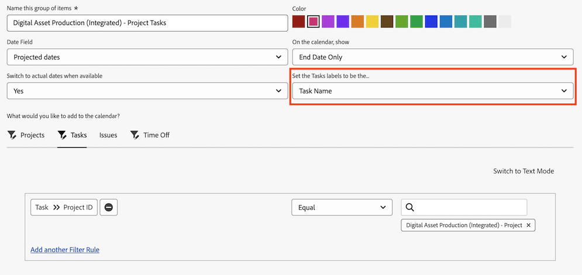

# Verwenden [!UICONTROL &#x200B; „Geplante &#x200B;]&quot; in einem Kalenderbericht

<!--
The highlighted information on this page refers to functionality not yet generally available. It is available only in the Preview Sandbox environment. 
-->

Ein Kalenderbericht ist ein dynamischer Bericht, der Ihre Arbeit visuell darstellt. Sie können [!UICONTROL Geplantes Datum] Felder in einem Kalenderbericht für die folgenden Objekte verwenden:

* Aufgaben
* Probleme
* Projekte

## Zugriffsanforderungen

+++ Erweitern, um die Zugriffsanforderungen für die in diesem Artikel beschriebene Funktionalität anzuzeigen.

<table style="table-layout:auto"> 
 <col> 
 </col> 
 <col> 
 </col> 
 <tbody> 
  <tr> 
   <td role="rowheader">Adobe Workfront-Paket</td> 
   <td> 
Beliebig
 </td> 
  </tr> 
  <tr> 
   <td role="rowheader">Adobe Workfront-Lizenz</td> 
   <td>
Standard

       
Abo
</td> 
  </tr> 
  <tr> 
   <td role="rowheader">Konfigurationen der Zugriffsebene</td> 
   <td> 
Zugriff auf Berichte, Dashboards und Kalender bearbeiten
</td> 
  </tr> 
  <tr> 
   <td role="rowheader">Objektberechtigungen</td> 
   <td>Zugriff auf den Kalenderbericht verwalten</td> 
  </tr> 
 </tbody> 
</table>

Weitere Details zu den Informationen in dieser Tabelle finden Sie unter [Zugriffsanforderungen in der Dokumentation zu Workfront](/help/quicksilver/administration-and-setup/add-users/access-levels-and-object-permissions/access-level-requirements-in-documentation.md).

+++

## Elementgruppe einrichten

Sie können festlegen, wie die Gruppe von Elementen in Ihrem Kalender angezeigt werden soll.

{{step1-to-calendars}}

1. Wählen Sie den Kalender aus, dem Sie eine neue Gruppe von Elementen hinzufügen möchten.
oder
Klicken Sie auf **[!UICONTROL + Neuer Kalender]** und geben Sie den Kalendernamen ein.

   >[!NOTE]
   >
   >Sie müssen Bearbeitungszugriff auf Berichte, Dashboards und Kalender in Ihrer Zugriffsebene haben, um einen Kalenderbericht zu erstellen.

1. Klicken Sie links auf **[!UICONTROL Zum Kalender hinzufügen]** und anschließend auf **[!UICONTROL Erweiterte Elemente hinzufügen]**.

1. Geben Sie Folgendes an:

   <table style="table-layout:auto">
    <col>
    <col>
    <tbody>
     <tr>
      <td role="rowheader"><strong>[!UICONTROL Diese Gruppe von Elementen benennen]</strong></td>
      <td>Geben Sie einen Namen für die Gruppe von Elementen ein.</td>
     </tr>
     <tr>
      <td role="rowheader"><strong>[!UICONTROL color]</strong></td>
      <td>Wählen Sie eine Farbe für die Gruppe von Elementen. Alle Elemente werden im Kalenderbericht in der ausgewählten Farbe angezeigt.</td>
     </tr>
     <tr>
      <td role="rowheader"><strong>[!UICONTROL Datumsfeld]</strong></td>
      <td>
Wählen Sie <strong>[!UICONTROL Geplante Termine]</strong>. Weitere Informationen über geplante Termine finden Sie unter 

       <ul>
        <li><a href="../../../manage-work/projects/planning-a-project/project-planned-start-date.md" class="MCXref xref">Überblick über das geplante Startdatum des Projekts</a></li>
        <li><a href="../../../manage-work/tasks/task-information/task-planned-start-date.md" class="MCXref xref">Überblick über das geplante Startdatum der Aufgabe</a></li>
        <li><a href="../../../manage-work/tasks/task-information/task-planned-completion-date.md" class="MCXref xref">Überblick über das geplante Abschlussdatum der Aufgabe</a></li>
        <li><a href="../../../manage-work/projects/planning-a-project/project-planned-completion-date.md" class="MCXref xref">Festlegen des geplanten Abschlussdatums für das Projekt</a> </li>
       </ul></td>
     </tr>
     <tr>
      <td role="rowheader"><strong>Im Kalender anzeigen</strong></td>
      <td>
Wählen Sie aus, wie die Daten angezeigt werden sollen:

       <ul>
        <li><strong>[!UICONTROL Nur Startdatum]</strong>: Der Kalender zeigt das Objekt an einem einzelnen Datum an.</li>
        <li><strong>[!UICONTROL Nur Enddatum]</strong>: Der Kalender zeigt das Objekt an einem einzelnen Datum an.</li>
        <li><strong>[!UICONTROL Duration] (Anfang bis Ende)</strong>: Der Kalender zeigt das Objekt über einen Zeitraum von Tagen an.</li>
       </ul></td>
     </tr>
     <tr data-mc-conditions="">
      <td role="rowheader"><strong>[!UICONTROL Zu tatsächlichen Daten wechseln, falls verfügbar]</strong></td>
      <td>
Der Kalender wechselt automatisch zu tatsächlichen Daten, wenn sie verfügbar sind.  Wählen Sie <strong>[!UICONTROL Yes]</strong> oder <strong>[!UICONTROL No]</strong>, um zu den tatsächlichen Daten zu wechseln, sofern verfügbar. Weitere Informationen über tatsächliche Termine finden Sie unter

       <ul>
        <li><a href="../../../manage-work/projects/planning-a-project/project-actual-start-date.md" class="MCXref xref">Überblick über das tatsächliche Startdatum des Projekts </a></li>
        <li><a href="../../../manage-work/projects/planning-a-project/project-actual-completion-date.md" class="MCXref xref">Überblick über das tatsächliche Abschlussdatum des Projekts </a></li>
       </ul></td>
     </tr>
    </tbody>
   </table>

1. Fahren Sie mit dem folgenden Abschnitt fort.

## Hinzufügen von Objekten zur Gruppe von Elementen in der Vorschau

Nachdem Sie eingerichtet haben, wie Elemente angezeigt werden sollen, müssen Sie die Objekte, die im Kalender angezeigt werden sollen, zur Gruppierung hinzufügen.

1. Im **[!UICONTROL Was möchten Sie dem Kalender hinzufügen?]** auswählen

   * **[!UICONTROL Aufgaben]**
   * **[!UICONTROL Projekte]**
   * **[!UICONTROL Probleme]**

1. Klicken Sie **[!UICONTROL Aufgaben hinzufügen]**, **[!UICONTROL Projekte hinzufügen]** oder **[!UICONTROL Probleme hinzufügen]** je nach dem Objekttyp, den Sie dem Kalender hinzufügen.

1. Geben Sie im Dropdown-Menü den Feldnamen ein und wählen Sie dann die Feldquelle des Objekts aus, das Sie im Kalender anzeigen möchten (z. B. **[!UICONTROL Aufgaben]**).
1. Eine Bedingungsanweisung für die Kalendergruppierung festlegen.

   

   Informationen zum Festlegen von Bedingungen finden Sie unter [Filter und Bedingungsmodifikatoren](../../../reports-and-dashboards/reports/reporting-elements/filter-condition-modifiers.md).

1. (Optional) Geben Sie zusätzliche Objekte für die Kalendergruppierung an, indem Sie die Schritte 1-4 wiederholen.

1. Wählen **[!UICONTROL im Feld Aufgaben/Projekte/Probleme als]** festlegen aus, wie die Objekte in dieser Kalendergruppierung im Kalender gekennzeichnet werden sollen.

   >[!NOTE]
   >
   >Wenn die standardmäßigen Beschriftungsoptionen für ein bestimmtes Objekt nicht verfügbar sind, wird stattdessen der Objektname angezeigt. Wenn beispielsweise die Beschriftung [!UICONTROL Übergeordnete Aufgabe] ausgewählt ist und dem Objekt keine übergeordnete Aufgabe zugeordnet ist, zeigt [!DNL Adobe Workfront] den Objektnamen an, den Sie im Kalender anzeigen.

   
1. Klicken Sie auf **[!UICONTROL Speichern]**.

1. Klicken Sie auf **[!UICONTROL Speichern]**.

