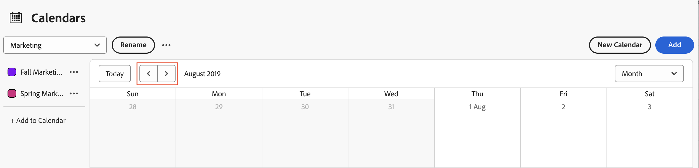
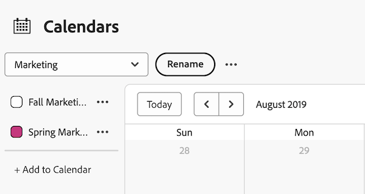

# Anzeigen von Kalenderberichten und Ereignisdetails

Sie können Kalenderberichte und Ereignisdetails anzeigen, die Sie in Adobe Workfront erstellt haben oder die für Sie freigegeben wurden.

## Zugriffsanforderungen

+++ Erweitern, um die Zugriffsanforderungen für die in diesem Artikel beschriebene Funktionalität anzuzeigen.

<table style="table-layout:auto"> 
 <col> 
 </col> 
 <col> 
 </col> 
 <tbody> 
  <tr> 
   <td role="rowheader">Adobe Workfront-Paket</td> 
   <td> 
Beliebig
 </td> 
  </tr> 
  <tr> 
   <td role="rowheader">Adobe Workfront-Lizenz</td> 
   <td>
Mitwirkender oder Mitwirkende

       
Anfrage
</td> 
  </tr> 
  <tr> 
   <td role="rowheader">Konfigurationen der Zugriffsebene</td> 
   <td> 
Anzeigen oder erweitern des Zugriffs auf Berichte, Dashboards und Kalender
</td> 
  </tr> 
  <tr> 
   <td role="rowheader">Objektberechtigungen</td> 
   <td>Anzeigen von oder höheren Berechtigungen für den Kalenderbericht</td> 
  </tr> 
 </tbody> 
</table>

Weitere Details zu den Informationen in dieser Tabelle finden Sie unter [Zugriffsanforderungen in der Dokumentation zu Workfront](/help/quicksilver/administration-and-setup/add-users/access-levels-and-object-permissions/access-level-requirements-in-documentation.md).

+++

## Kalenderbericht anzeigen

<!--{{step1-to-calendars}}-->

1. Klicken Sie auf das **[!UICONTROL Hauptmenü]**-Symbol  in der oberen rechten Ecke von Adobe Workfront oder (falls verfügbar) klicken Sie auf das **[!UICONTROL Hauptmenü]**-Symbol  in der oberen linken Ecke und dann auf **[!UICONTROL Kalender]**.

   Je nach Zugriffsebene werden möglicherweise die folgenden Kalender aufgelistet:

   * Ihr [!DNL Adobe Workfront]-Standardkalender

     Workfront erstellt einen Kalender für Sie basierend auf den Projekten, Vorgängen und Problemen, die Ihnen zugewiesen sind oder die Teams, Gruppen oder Rollen zugewiesen sind, denen Sie zugewiesen sind.

   * Kalender, die Sie erstellt haben

     Weitere Informationen zum Erstellen von Kalendern finden Sie unter [Übersicht über Kalenderberichte](../../../reports-and-dashboards/reports/calendars/calendar-reports-overview.md).

   * Kalender, die andere Benutzer für Sie freigegeben haben

     Weitere Informationen zum Freigeben von Kalendern finden Sie unter [[!UICONTROL Freigeben ] Kalenders](../../../reports-and-dashboards/reports/calendars/share-a-calendar-report.md).

1. (Bedingt) Klicken Sie auf die **[!UICONTROL Ansicht]** und wählen Sie dann die Kalenderdauer aus, die Sie anzeigen möchten.
   
Sie können aus den folgenden Kalenderberichtsansichten wählen:

   * **[!UICONTROL Monat]**: Zeigt vier Wochen des Kalenders an
   * **[!UICONTROL Woche]**: Zeigt eine Woche des Kalenders an
   * **[!UICONTROL Gantt]**: Zeigt eine fortlaufende Ansicht des Kalenders an.

     Sie können weitere Ereignisse in einer **Gantt**-Ansicht anzeigen, indem Sie nach unten oder seitwärts scrollen. Ein Ladesymbol wird angezeigt, wenn die Daten für die Ansicht ausgefüllt sind.

   >[!NOTE]
   >
   >In den Ansichten **Monat** und **Woche** haben Ereignisse, die aktuell oder zukünftig sind (einschließlich Ereignisse, die sich über mehrere Tage erstrecken, solange sie heute oder einen zukünftigen Tag enthalten) eine Schattierung, die der Farbe in der Projekt- oder Kalendergruppierung entspricht. Ältere Ereignisse weisen eine hellere Schattierung auf, um anzuzeigen, dass sie nicht mehr aktuell sind. Sie können diese Ereignisse jedoch weiterhin auswählen und anzeigen.

1. (Optional) Wenn Sie den Kalender in den Ansichten **Monat** oder **Woche** anzeigen, können Sie die Kalenderansicht mit den folgenden Optionen ändern:

   <!--   * To include or exclude weekends:
      1. On the **[!UICONTROL Calendar]** toolbar, click **[!UICONTROL Calendar Actions]**, then from the drop-down list select either **[!UICONTROL Show Weekend]** or **[!UICONTROL Hide Weekend]**.-->

   * So ändern Sie die angezeigten Daten schnell:

      1. Klicken Sie in **[!UICONTROL Kalender]**-Symbolleiste auf den linken Pfeil der Datumsanzeige, um im Kalender zurückzukehren, oder auf den rechten Pfeil, um fortzufahren.

         

         Die angezeigten Datumswerte werden durch ein Intervall angepasst, das auf Ihrer aktuellen Kalenderansicht basiert. Wenn Sie beispielsweise den Kalender in der Ansicht **Woche** anzeigen, wird der Kalender je nach ausgewähltem Pfeil entweder eine Woche vorwärts oder eine Woche zurück angezeigt.

      1. (Optional) Um zum aktuellen Tag zurückzukehren, klicken Sie auf [!UICONTROL **Heute**].

1. (Optional) Um die Ereignisse für eine mit dem Kalender verknüpfte Projekt- oder Kalendergruppierung auszublenden, löschen Sie die Projekt- oder Kalendergruppierung in der Projektliste.
   
Sie können die Ereignisse wieder sichtbar machen, indem Sie die [!UICONTROL Projekt]- oder Kalendergruppierung in der Projektliste auswählen.

## Kalenderbericht-Ereignisdetails anzeigen

Sie können die Details eines Ereignisses in einem Kalender anzeigen, sowohl für aktuelle als auch für frühere Ereignisse.

1. Wechseln Sie zu dem Ereignis, für das Sie die Details wissen möchten, und klicken Sie dann auf das Ereignis. Die Details werden in einem Bedienfeld auf der rechten Seite geöffnet.
1. (Optional) Klicken Sie auf den Titel des Objekts, um das verknüpfte Projekt, die zugehörige Aufgabe oder das zugehörige Problem zu öffnen.
