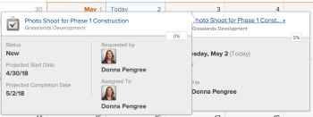

# Kalenderberichte und Ereignisdetails anzeigen

Sie können Kalenderberichte und Ereignisdetails anzeigen, die Sie in Adobe Workfront erstellt haben oder für Sie freigegeben wurden.

## Zugriffsanforderungen

Sie müssen über folgenden Zugriff verfügen, um die Schritte in diesem Artikel ausführen zu können:

<table style="table-layout:auto"> 
 <col> 
 </col> 
 <col> 
 </col> 
 <tbody> 
  <tr> 
   <td role="rowheader"><strong>[!DNL Adobe Workfront plan*]</strong></td> 
   <td> 
Beliebig
 </td> 
  </tr> 
  <tr> 
   <td role="rowheader"><strong>[!DNL Adobe Workfront] license*</strong></td> 
   <td> 
[!UICONTROL Anforderung] oder höher
 </td> 
  </tr> 
  <tr> 
   <td role="rowheader"><strong>Konfigurationen auf Zugriffsebene*</strong></td> 
   <td> 
[!UICONTROL Ansicht] oder höher Zugriff auf [!UICONTROL Berichte], [!UICONTROL Dashboards] und [!UICONTROL Kalender]
 
Hinweis: Wenn Sie noch keinen Zugriff haben, fragen Sie Ihren [!DNL Workfront] Administrator , wenn sie zusätzliche Einschränkungen für Ihre Zugriffsebene festlegen. Für Informationen zur [!DNL Workfront] Administrator kann Ihre Zugriffsebene ändern, siehe <a href="../../../administration-and-setup/add-users/configure-and-grant-access/create-modify-access-levels.md" class="MCXref xref">Benutzerdefinierte Zugriffsebenen erstellen oder ändern</a>.
 </td> 
  </tr> 
  <tr> 
   <td role="rowheader"><strong>Objektberechtigungen</strong></td> 
   <td> 
[!UICONTROL Ansicht] oder höhere Berechtigungen für den Kalenderbericht
 
Informationen zum Anfordern von zusätzlichem Zugriff finden Sie unter <a href="../../../workfront-basics/grant-and-request-access-to-objects/request-access.md" class="MCXref xref">Zugriff auf Objekte anfordern</a>.
 </td> 
  </tr> 
 </tbody> 
</table>

&#42;Wenden Sie sich an Ihren [!DNL Workfront] Administrator.

## Kalenderberichte anzeigen

1. Klicken Sie auf **[!UICONTROL Hauptmenü]** icon  in der oberen rechten Ecke von [!DNL Adobe Workfront]Klicken Sie auf **[!UICONTROL Kalender]**.

   Je nach Zugriffsebene werden möglicherweise die folgenden Kalender angezeigt:

   * Ihre Standardeinstellung [!DNL Adobe Workfront] calendar\

      Workfront erstellt einen Kalender für Sie basierend auf den Projekten, Aufgaben und Problemen, die Ihnen zugewiesen sind oder die Teams, Gruppen oder Rollen zugewiesen sind, denen Sie zugewiesen sind.
   * Von Ihnen erstellte Kalender\

      Weitere Informationen zum Erstellen von Kalendern finden Sie unter [Kalenderberichte - Übersicht](../../../reports-and-dashboards/reports/calendars/calendar-reports-overview.md).

   * Kalender, die andere Benutzer für Sie freigegeben haben\

      Weitere Informationen zum Freigeben von Kalendern finden Sie unter [[!UICONTROL Kalender freigeben] Bericht](../../../reports-and-dashboards/reports/calendars/share-a-calendar-report.md).

1. (Bedingt) Klicken Sie auf die **[!UICONTROL Ansicht]** und wählen Sie dann die Kalenderdauer aus, die Sie anzeigen möchten.\
   \
   Sie können aus den folgenden Kalenderberichtsansichten auswählen:

   * **[!UICONTROL Monat]**: Zeigt vier Kalenderwochen an
   * **[!UICONTROL Woche]**: Zeigt eine Woche des Kalenders an
   * **[!UICONTROL Gantt]**: Zeigt eine fortlaufende Ansicht des Kalenders an\

      ![[!UICONTROL Gantt] Kalenderbericht](assets/gantt-calendar-report.png)
Sie können weitere Ereignisse in einer [!UICONTROL Gantt] -Ansicht durch Scrollen nach unten oder seitlich. Ein Ladesymbol wird angezeigt, wenn Daten für die Ansicht aufgefüllt werden.
   >[!NOTE]
   >
   >Im [!UICONTROL Monat] und [!UICONTROL Woche] Ansichten, Ereignisse, die aktuell oder zukünftig sind (einschließlich Ereignissen, die mehrere Tage umfassen, solange sie heute oder einen künftigen Tag enthalten), haben eine Schattierung, die der Farbe im Projekt oder in der Kalendergruppierung entspricht. Frühere Ereignisse haben eine hellere Schattierung, um anzuzeigen, dass sie nicht mehr aktuell sind. Sie können diese Ereignisse jedoch weiterhin auswählen und anzeigen.

1. (Optional) Wenn Sie den Kalender im [!UICONTROL Monat] oder [!UICONTROL Woche] -Ansichten können Sie Ihre Kalenderansicht mit den folgenden Optionen ändern:

   * So schließen Sie Wochenenden ein oder aus:

      1. Im **[!UICONTROL Kalender]** Symbolleiste, klicken Sie auf **[!UICONTROL Kalenderaktionen]** und wählen Sie dann aus der Dropdownliste entweder **[!UICONTROL Wochenende anzeigen]** oder **[!UICONTROL Wochenende ausblenden]**.
   * So ändern Sie schnell die angezeigten Daten:

      1. Im **[!UICONTROL Kalender]** klicken Sie auf den linken Pfeil der Datumsanzeige, um im Kalender zurückzukehren, oder auf den Pfeil nach rechts, um fortzufahren.\

         \
         Die angezeigten Daten werden nach einem Intervall angepasst, das auf Ihrer aktuellen Kalenderansicht basiert. Wenn Sie beispielsweise den Kalender im [!UICONTROL Woche] angezeigt, zeigt der Kalender je nach ausgewähltem Pfeil entweder eine Woche vor oder eine Woche zurück an.

      1. (Optional) Um zum aktuellen Tag zurückzukehren, klicken Sie auf **Today**.

1. (Optional) Um einen Kalender im Vollbildmodus anzuzeigen, klicken Sie auf die Pfeile im Vollbildmodus auf der rechten Seite des **[!UICONTROL Kalender]** Symbolleiste.
   \
   Drücken Sie Esc , um zur normalen Ansicht des Kalenders zurückzukehren.

1. (Optional) Um die Ereignisse für ein mit dem Kalender verknüpftes Projekt oder eine mit dem Kalender verknüpfte Kalendergruppierung auszublenden, löschen Sie das Projekt oder die Kalendergruppierung in der Projektliste.
   \
   Sie können die Ereignisse erneut sichtbar machen, indem Sie die [!UICONTROL Projekt] oder der Kalendergruppierung in der Projektliste.

## Kalenderberichtereignisdetails anzeigen

Sie können die Details eines Ereignisses in einem Kalender sowohl für aktuelle als auch für vergangene Ereignisse anzeigen.

1. Gehen Sie zu dem Ereignis, für das Sie die Details kennen möchten, und klicken Sie dann auf das Ereignis.\
   Eine Detailseite für das Ereignis wird geöffnet.\
   

1. (Optional) So zeigen Sie zusätzliche Details zum Objekt an:

   1. Bewegen Sie den Mauszeiger über das Projekt, die Aufgabe oder den Namen des Problems.

      Für das Objekt wird eine Detailseite geöffnet.\
      

   1. (Optional) Klicken Sie auf den Titel des Objekts, um das zugehörige Projekt, die Aufgabe oder das Problem zu öffnen.
   1. (Optional) Klicken Sie zum Schließen aller geöffneten Detailseiten auf eine beliebige Stelle außerhalb der Ereignisdetailseiten.
