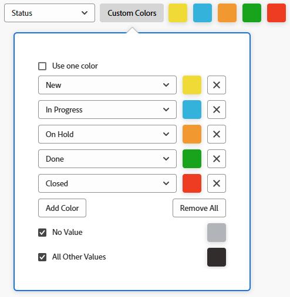

# Diagramm zu einem Bericht hinzufügen

<!--Audited: 11/2024-->

Sie können Ihre Berichte verbessern, indem Sie ein Diagramm hinzufügen. Sie können Diagramme zu vorhandenen Berichten oder zu Berichten hinzufügen, die Sie gerade erstellen.

Bevor Sie ein Diagramm zu einem Bericht hinzufügen, sollten Sie eine Ansicht und eine Gruppierung für den Bericht erstellen.

Sie können den meisten Berichten nur dann Diagramme hinzufügen, wenn Sie die Informationen im Bericht zuerst gruppieren. Das einzige Diagramm, das ohne Gruppierung hinzugefügt werden kann, ist ein Messdiagramm.

Weitere Informationen zu Ansichten finden Sie unter [Ansichten - Übersicht in Adobe Workfront](../../../reports-and-dashboards/reports/reporting-elements/views-overview.md).

Weitere Informationen zu Gruppierungen finden Sie unter [Gruppierungen - Übersicht in Adobe Workfront](../../../reports-and-dashboards/reports/reporting-elements/groupings-overview.md).

Wenn Ihr Bericht zu viele Elemente anzeigt, wird kein Diagramm erstellt. In diesem Fall müssen Sie dem Bericht auch einen Filter hinzufügen, um die Anzahl der Ergebnisse in Ihrem Bericht zu reduzieren.

Weitere Informationen zu Filtern finden Sie unter [Filter - Übersicht](../../../reports-and-dashboards/reports/reporting-elements/filters-overview.md).

## Zugriffsanforderungen

+++ Erweitern Sie , um die Zugriffsanforderungen für die -Funktion in diesem Artikel anzuzeigen.

Sie müssen über folgenden Zugriff verfügen, um die Schritte in diesem Artikel ausführen zu können:

<table style="table-layout:auto"> 
 <col> 
 <col> 
 <tbody> 
  <tr> 
   <td role="rowheader">Adobe Workfront-Plan</td> 
   <td> 
Beliebig
 </td> 
  </tr> 
  <tr> 
   <td role="rowheader">Adobe Workfront-Lizenz*</td> 
   <td> 
      
Neu:

         <ul>
         <li>
Standard
</li>
         </ul>
      
Aktuell:

         <ul>
         <li>
Plan
</li>
         </ul>
   </td>
  </tr> 
  <tr> 
   <td role="rowheader">Konfiguration der Zugriffsebene</td> 
   <td> 
Zugriff auf Berichte, Dashboards, Kalender bearbeiten
 
Zugriff auf Filter, Ansichten, Gruppierungen bearbeiten
 </td> 
  </tr> 
  <tr> 
   <td role="rowheader">Objektberechtigungen</td> 
   <td> 
Verwalten von Berechtigungen für einen Bericht
  </td> 
  </tr> 
 </tbody> 
</table>

*Weitere Informationen finden Sie unter [Zugriffsanforderungen in der Dokumentation zu Workfront](/help/quicksilver/administration-and-setup/add-users/access-levels-and-object-permissions/access-level-requirements-in-documentation.md).

+++

## Diagramm zu einem Bericht hinzufügen

1. Zu einem vorhandenen Bericht gehen oder einen neuen Bericht erstellen. Weitere Informationen zum Erstellen eines neuen Berichts finden Sie unter [Erstellen eines benutzerdefinierten Berichts](../../../reports-and-dashboards/reports/creating-and-managing-reports/create-custom-report.md).

1. (Bedingt) Wenn Sie zu einem vorhandenen Bericht gewechselt sind, klicken Sie auf **Berichtsaktionen** > **Bearbeiten**.

1. Stellen Sie sicher, dass **Registerkarte (Spalten (Ansicht** aktualisiert wurde, um die Informationen anzuzeigen, die Sie im Bericht grafisch darstellen möchten.

   Informationen zum Erstellen oder Ändern der Ansicht für den Bericht finden Sie unter [Erstellen oder Bearbeiten von Ansichten in Adobe Workfront](/help/quicksilver/reports-and-dashboards/reports/reporting-elements/create-edit-views.md).

1. Klicken Sie auf **Gruppierungen** und fügen Sie eine Gruppierung hinzu.

   >[!TIP]
   >
   >* Sie können ein Diagramm nur dann zu einem Bericht hinzufügen, wenn die Berichtsergebnisse gruppiert sind.
   >* Textmodusgruppierungen werden in Diagrammen nicht unterstützt. Weitere Informationen zu Textmodusgruppierungen finden Sie unter [Gruppierung im Textmodus bearbeiten](../../../reports-and-dashboards/reports/text-mode/edit-text-mode-in-grouping.md).
   >* Wenn Sie eine einzelne Gruppierung hinzufügen, die eine Metrik darstellt, zeigen alle Diagramme außer einem Tortendiagramm jedes Ergebnis in der Gruppierung in derselben Farbe an.

   Weitere Informationen zum Erstellen von Gruppierungen finden Sie unter [Gruppierungen in Adobe Workfront erstellen](/help/quicksilver/reports-and-dashboards/reports/reporting-elements/create-groupings.md).

1. Wählen Sie die Registerkarte **Diagramm** aus.

1. Klicken Sie auf einen Diagrammtyp, um ihn auszuwählen.\
   

1. Wählen Sie aus den folgenden Diagrammtypen:

   * [Säulendiagramm](#column-chart)
   * [Balkendiagramm](#bar-chart)
   * [Tortendiagramm](#pie-chart)
   * [Liniendiagramm](#line-chart)
   * [Messdiagramm](#gauge-chart)
   * [Blasendiagramm](#bubble-chart)

1. Klicken Sie **Speichern + Schließen**, um das Diagramm und den Bericht zu speichern.

### Säulendiagramm {#column-chart}

So fügen Sie ein **Spalten**-Diagramm zu Ihrem Bericht hinzu:

1. Fügen Sie Ihrem Bericht ein Diagramm hinzu, wie in [Hinzufügen eines Diagramms zu einem Bericht](#add-a-chart-to-a-report) beschrieben.

1. Wählen Sie im Feld **Linke Achse (Y** die Werte aus, die Sie in die Y-Achse des Diagramms aufnehmen möchten, und wählen Sie dann aus, wie die Informationen im Feld **Zusammenfassung nach** zusammengefasst werden sollen.

1. (Optional) Klicken Sie **Benutzerdefinierte Farben**, um jeder der Spalten bevorzugte Farben zuzuweisen.\
   Weitere Informationen zum Anpassen von Diagrammfarben finden Sie unter [Anpassen von Diagrammfarben](#customize-chart-colors).

1. Wählen Sie **Feld „Untere Achse (X** die Gruppierung aus, die Sie in das Diagramm aufnehmen möchten.

1. (Optional) Klicken Sie auf **In 3D anzeigen**, um das Diagramm in einer 3-dimensionalen Ansicht anzuzeigen.

1. (Optional) **Spalten gruppieren**: Wählen Sie diese Option, um festzulegen, wie die Spalten gruppiert werden sollen.\
   Wählen Sie aus den folgenden Optionen aus:

   * Klicken Sie auf eine der folgenden Optionen, um festzulegen, wie die gruppierten Spalten angezeigt werden sollen:

      * **Nebeneinander**
      * **Gestapelt**
      * **Auf 100 % gestapelt**

   * Wählen Sie die Gruppierung, die Sie in das Diagramm aufnehmen möchten, aus dem Dropdown **Menü** Gruppieren nach“.
   * (Optional) Klicken Sie auf **Benutzerdefinierte Farben**, um die Farben der Spalten anzupassen.\
     Weitere Informationen zum Anpassen von Diagrammfarben finden Sie unter [Anpassen von Diagrammfarben](#customize-chart-colors).

1. (Optional) Klicken Sie **Kombinationsdiagramm**, um einen zusätzlichen Wert in das Diagramm aufzunehmen und anzugeben, wie die Informationen zusammengefasst werden sollen.\
   Erwägen Sie die folgenden Optionen:

   * **Auf Sekundärer Achse**: Wählen Sie diese Option, um die Daten auf der rechten Seite des Diagramms darzustellen.
   * **Diagrammtyp**: Wählen Sie aus, ob dieser zusätzliche Wert als Linie oder dritte Spalte angezeigt werden soll.

1. Klicken Sie **Speichern + Schließen**, um das Diagramm und den Bericht zu speichern.

### Balkendiagramm {#bar-chart}

So fügen Sie ein **Balkendiagramm** zu Ihrem Bericht hinzu:

1. Fügen Sie Ihrem Bericht ein Diagramm hinzu, wie in [Hinzufügen eines Diagramms zu einem Bericht](#add-a-chart-to-a-report) beschrieben.

1. Wählen Sie im Feld **Untere Achse (X** die Werte aus, die Sie in die X-Achse des Diagramms aufnehmen möchten, und wählen Sie dann aus, wie die Informationen im Feld **Zusammenfassung nach** zusammengefasst werden sollen.

1. (Optional) Klicken Sie auf **Benutzerdefinierte Farben**, um die Farben der Balken anzupassen.\
   Weitere Informationen zum Anpassen von Diagrammfarben finden Sie unter [Anpassen von Diagrammfarben](#customize-chart-colors).

1. Wählen Sie im Feld **Linke Achse (Y** die Gruppierung aus, die Sie in das Diagramm aufnehmen möchten.

1. (Optional) Klicken Sie auf **In 3D anzeigen**, um das Diagramm in einer 3-dimensionalen Ansicht anzuzeigen.

1. (Optional) Klicken Sie auf **Balken gruppieren**, um festzulegen, wie die Balken gruppiert werden sollen.\
   Wählen Sie aus den folgenden Optionen aus:

   * Klicken Sie auf eine der folgenden Optionen, um festzulegen, wie die gruppierten Balken angezeigt werden sollen:

      * **Nebeneinander**
      * **Gestapelt**
      * **Auf 100 % gestapelt**

   * Wählen Sie aus dem Dropdown-Menü **Daten gruppieren nach** aus, wie Sie die Informationen im Diagramm gruppieren möchten.
   * (Optional) Klicken Sie auf **Benutzerdefinierte Farben**, um die Farben Ihrer Spalten anzupassen.\
     Weitere Informationen zum Anpassen von Diagrammfarben finden Sie unter [Anpassen von Diagrammfarben](#customize-chart-colors).

1. (Optional) Klicken Sie **Kombinationsdiagramm**, um einen zusätzlichen Wert in das Diagramm aufzunehmen und anzugeben, wie die Informationen zusammengefasst werden sollen.

1. Klicken Sie **Speichern + Schließen**, um das Diagramm und den Bericht zu speichern.

>[!IMPORTANT]
>
>Balkendiagramme auf 23 oder weniger Balken beschränken, da Balkendiagramme, die mehr als 23 Balken enthalten, nicht alle Balkenbeschriftungen ordnungsgemäß anzeigen.

### Tortendiagramm {#pie-chart}

So fügen Sie **Bericht** Tortendiagramm hinzu:

1. Fügen Sie Ihrem Bericht ein Diagramm hinzu, wie in [Hinzufügen eines Diagramms zu einem Bericht](#add-a-chart-to-a-report) beschrieben.

1. Wählen Sie im Feld **Werte** die Werte aus, die im Bericht angezeigt werden sollen, und wählen Sie dann aus, wie die Informationen im Feld **Zusammenfassung nach** zusammengefasst werden sollen.\
   Wählen **im Feld** die Gruppierung aus, die Sie in das Diagramm aufnehmen möchten. Die Gruppierung wird durch die Keile des Diagramms dargestellt.

1. (Optional) Klicken Sie auf **Benutzerdefinierte Farben**, um die Farben der Keile im Diagramm anzupassen.\
   Weitere Informationen zum Anpassen von Diagrammfarben finden Sie unter [Anpassen von Diagrammfarben](#customize-chart-colors).

1. (Optional) Klicken Sie auf **In 3D anzeigen**, um das Diagramm in einer 3-dimensionalen Ansicht anzuzeigen.

1. Wählen Sie im Feld **Ergebnisse anzeigen als** aus, wie die Ergebnisse in der Grafik angezeigt werden sollen. Erwägen Sie die folgenden Optionen:

   * **Prozentsatz**: Die Diagrammergebnisse werden als Prozentsatz angezeigt.
   * **Zahlen**: Die Diagrammergebnisse werden als Zahl angezeigt.

1. Klicken Sie **Speichern + Schließen**, um das Diagramm und den Bericht zu speichern.

### Liniendiagramm {#line-chart}

So fügen Sie **Bericht** Liniendiagramm hinzu:

1. Fügen Sie Ihrem Bericht ein Diagramm hinzu, wie in [Hinzufügen eines Diagramms zu einem Bericht](#add-a-chart-to-a-report) beschrieben.

1. Wählen Sie im Feld **Linke Achse (Y** die Werte aus, die Sie in die Y-Achse des Diagramms aufnehmen möchten, und wählen Sie dann aus, wie die Informationen im Feld **Zusammenfassung nach** zusammengefasst werden sollen.

1. Wählen Sie **Feld „Untere Achse (X** die Gruppierung aus, die Sie in das Diagramm aufnehmen möchten.

1. (Optional) Klicken Sie **Linien gruppieren**, um eine zusätzliche Gruppierung für das Diagramm auszuwählen.\
   (Optional) Klicken Sie auf **Benutzerdefinierte Farben**, um die Farben für Ihre neue Gruppierung anzupassen.\
   Weitere Informationen zum Anpassen von Diagrammfarben finden Sie unter [Anpassen von Diagrammfarben](#customize-chart-colors).

1. (Optional) Klicken Sie auf **Kombinationsdiagramm**, um Ihre Linien durch einen zusätzlichen Wert zu kombinieren.\
   Ziehen Sie aus den folgenden Optionen in Betracht:

   * Wählen Sie den Wert aus, den Sie in das Diagramm aufnehmen möchten, sowie die Art und Weise, wie die Informationen zusammengefasst werden sollen.
   * Klicken Sie auf **Feld Auf Sekundärer Achse**, um die Daten auf der rechten Seite des Diagramms darzustellen.

1. Klicken Sie **Speichern + Schließen**, um das Diagramm und den Bericht zu speichern.

### Messdiagramm {#gauge-chart}

Ein **Tacho**-Diagramm zeigt die Anzahl der Datensätze in einem Tachoformat an, die bestimmte Kriterien erfüllen. Der Indikator des Messgeräts verweist auf die Anzahl der Datensätze, die den in der Ansicht und Gruppierung des Berichts ausgewählten Kriterien entsprechen. Zum Konfigurieren eines Messdiagramms ist keine Berichtsgruppierung erforderlich.

So fügen Sie ein **Tacho**-Diagramm zu Ihrem Bericht hinzu:

1. Fügen Sie Ihrem Bericht ein Diagramm hinzu, wie in [Hinzufügen eines Diagramms zu einem Bericht](#add-a-chart-to-a-report) beschrieben.

1. Wählen Sie im Feld **Werte** die Werte aus, die im Bericht angezeigt werden sollen, und wählen Sie dann aus, wie die Informationen im Feld **Zusammenfassung nach** zusammengefasst werden sollen. Wenn Sie **Anzahl aufzeichnen** auswählen, sind die angezeigten Werte das Objekt des Berichts.

1. Wählen **im Feld** die Gruppierung aus, die Sie in das Diagramm aufnehmen möchten. Die Gruppierung wird durch die Indikatorlinie im Diagramm dargestellt.\
   Wenn Sie eine Gruppierung haben, die zwei Elemente enthält, werden im Diagramm zwei Indikatoren angezeigt.\
   Wenn Sie beispielsweise den Projektstatus gruppieren und es zwei Projektstatus (Aktuell und Halten) gibt, enthält Ihr Tacho-Diagramm zwei Tacho-Indikatoren. Sie verweisen auf die Anzahl der Projekte, die sich in diesem Status befinden.\
   (Optional) Wählen Sie **Summe** im Feld **Indikatoren** aus, um die Summe der im Feld **Werte** ausgewählten Objekte anzuzeigen.

1. (Optional) Klicken Sie auf **Weiteren Wertbereich hinzufügen**, um dem Diagramm einen Wertbereich hinzuzufügen.

1. (Optional) Geben Sie im Feld **Wertebereich** den Wertebereich und die Farbe für die Werte an, die im Messdiagramm angezeigt werden sollen.

1. Klicken Sie **Speichern + Schließen**, um das Diagramm und den Bericht zu speichern.

### Blasendiagramm {#bubble-chart}

Sie können bis zu drei Felder eines Objekts in einem **Bubble**-Diagramm anzeigen. Dies bedeutet, dass Sie bis zu vier Datenpunkte in einem Blasendiagramm anzeigen können. Jedes Objekt mit drei zugehörigen Feldern wird als Kreis angezeigt, der zwei der Felder innerhalb seiner Position innerhalb der X- und Y-Achse ausdrückt. Das dritte Feld wird durch die Größe des Kreises dargestellt.

So fügen Sie **Bericht ein** hinzu:

1. Fügen Sie Ihrem Bericht ein Diagramm hinzu, wie in [Hinzufügen eines Diagramms zu einem Bericht](#add-a-chart-to-a-report) beschrieben.

1. Wählen Sie im Feld **Linke Achse (Y** die Werte aus, die Sie auf der Y-Achse des Diagramms einbeziehen möchten. Die Werte stammen aus der Ansicht des Berichts. Geben Sie an, wie die Informationen im Feld **Zusammenfassung nach“ zusammengefasst** sollen.

1. Wählen Sie **Feld „Untere Achse (X** die Werte aus, die Sie auf der X-Achse des Diagramms einbeziehen möchten. Die Werte stammen aus der Ansicht des Berichts. Geben Sie an, wie die Informationen zusammengefasst werden sollen.

   >[!NOTE]
   >
   >Stellen Sie sicher, dass Sie mindestens eine Spalte haben, die zusammengefasst ist, damit dieses Feld aktiv ist.\
   >Weitere Informationen zum Zusammenfassen der Informationen in einer Berichtsspalte finden Sie unter [Erstellen eines benutzerdefinierten Berichts](../../../reports-and-dashboards/reports/creating-and-managing-reports/create-custom-report.md).

1. Wählen **im Feld** die Werte aus, die durch die Größe der Blasen im Diagramm dargestellt werden sollen. Die Werte stammen aus der Ansicht des Berichts. Geben Sie an, wie die Informationen zusammengefasst werden sollen.

   >[!NOTE]
   >
   >Stellen Sie sicher, dass Sie mindestens eine Spalte haben, die zusammengefasst ist, damit dieses Feld aktiv ist.\
   >Weitere Informationen zum Zusammenfassen der Informationen in einer Berichtsspalte finden Sie unter [Erstellen eines benutzerdefinierten Berichts](../../../reports-and-dashboards/reports/creating-and-managing-reports/create-custom-report.md).

1. Wählen **im Feld** die Gruppierung aus, die Sie in das Diagramm aufnehmen möchten. Die Gruppierung wird durch die Platzierung der Blasen im Diagramm dargestellt.

1. Wählen **Feld &quot;**&quot; das Feld aus, das durch die Farben der Blasen dargestellt werden soll.

   Die **Sprechblasenfarbe** kann eine Gruppierung sein, die Sie im Bericht definieren, aber die Option ist nur verfügbar, wenn Sie eine Gruppierung im Feld **Sprechblasen** wählen, die den **Namen** eines übergeordneten Objekts relativ zum Objekt des Berichts enthält, z. B. **Projektname** für einen Aufgabenbericht oder **Programmname** für einen Projektbericht.

   Wenn Sie beispielsweise **Projektname** in einem Aufgabenbericht ausgewählt haben, können Sie **Aufgabenstatus** als Feld **Sprechblasenfarbe** hinzufügen.

   

   Wenn Sie jedoch **Aufgabenstatus** für das Feld **Blasen** ausgewählt haben, können Sie kein Feld **Bubble Color** auswählen. Außerdem können Sie für das Feld **Bubble Color** nicht **Projektname** auswählen, selbst wenn Sie **Projektname** für das Feld **Bubbles** auswählen.

   

1. Klicken Sie **Speichern + Schließen**, um die Änderungen am Interface Builder zu speichern.

## Anpassen der Diagrammfarben {#customize-chart-colors}

Sie können Workfront die Farben der Elemente in Ihrem Diagramm auswählen lassen oder diese beim Hinzufügen eines Diagramms zu Ihren Berichten anpassen. Wenn Ihr Diagramm eine einzelne Gruppierung enthält, die für eine Metrik steht, z. B. einen Aufgabenbericht, der die Anzahl der Aufgaben nach dem tatsächlichen Abschlussdatum gruppiert ausgibt, wird jedes Ergebnis in der Gruppierung in derselben Farbe angezeigt.

Sie können nur eine Farbe für Felder auswählen, die in der Ansicht des Berichts angezeigt werden. Sie können mehrere Farben - eine für jede Option - für Felder auswählen, die in der Gruppierung des Berichts angezeigt werden.

>[!IMPORTANT]
>
>Für Datumsfelder können Sie nur eine Farbe für Ihre Diagrammelemente auswählen.

So passen Sie Diagrammfarben an:

1. Wechseln Sie beim Erstellen eines Berichts zur Registerkarte **Diagramm** im Report Builder.

1. Diagrammtyp auswählen, der dem Bericht hinzugefügt werden soll.\
   Weitere Informationen zum Hinzufügen eines Diagramms zu einem Bericht finden Sie unter [Hinzufügen eines Diagramms zu einem Bericht](#add-a-chart-to-a-report).

1. Klicken Sie auf **Benutzerdefinierte Farben**, wenn dieses Feld verfügbar ist.\
   Das Dialogfeld Benutzerdefinierte Farben wird angezeigt.\
   

   >[!NOTE]
   >
   >Sie können benutzerdefinierte Farben mit jedem Feld, nach dem Sie gruppieren können, und mit einigen Feldern verknüpfen, die in einer Ansicht angezeigt werden können, einschließlich benutzerdefinierter Felder. Bei den benutzerdefinierten Feldern oder Optionen der Felder, die Sie im Dialogfeld Benutzerdefinierte Farbe auswählen, wird zwischen Groß- und Kleinschreibung unterschieden.

1. Erwägen Sie die Auswahl einer der folgenden Optionen:

   * **Eine Farbe verwenden**: Alle Elemente des Diagramms werden in der ausgewählten Farbe angezeigt.
   * **Farbe hinzufügen**: Fügen Sie eine benutzerdefinierte Farbe für einen möglichen Wert des ausgewählten Felds hinzu.
   * **Alle entfernen**: Wählen Sie diese Option, um alle oben angegebenen Feldwerte und Farben zu entfernen.
   * **Kein Wert**: Wählen Sie dieses Feld und eine benutzerdefinierte Farbe aus, um die Diagrammspalte anzuzeigen, die Elemente ohne Wert gruppiert. Hierbei handelt es sich um Elemente, die nicht nach Optionen des Felds gruppiert werden können, das in der Gruppierung ausgewählt wurde.
   * **Alle anderen Werte**: Wählen Sie dieses Feld und eine benutzerdefinierte Farbe aus, um alle anderen Diagrammelemente anzuzeigen, deren Optionen oben nicht definiert sind.

     >[!NOTE]
     >
     >Die zuletzt bearbeiteten Farben werden rechts neben der Schaltfläche **Benutzerdefinierte Farben** angezeigt. Wenn Sie den Mauszeiger über eine Farbe bewegen, wird der Name des zugehörigen Felds angezeigt. Sie können auch auf eine Farbe klicken, um sie zu bearbeiten, ohne sie erneut zu öffnen **Benutzerdefinierte Farben**.

1. So wählen Sie eine Farbe:
Klicken Sie in die Farbauswahl, um eine Farbe auszuwählen.
ODER
Geben Sie einen hexadezimalen Farbwert für Ihre Farbe an.

1. Klicken Sie auf eine beliebige Stelle außerhalb des Dialogfelds „Benutzerdefinierte Farben“, um es zu schließen. Die ausgewählten Farben werden automatisch gespeichert.

1. Klicken Sie **Speichern + Schließen**, um das Diagramm zu speichern und den Bericht auszuführen.

## Exportieren eines Diagramms

Sie können ein Diagramm in eine PDF-Datei exportieren.

So exportieren Sie ein Diagramm:

1. Klicken Sie auf der Registerkarte Diagramm eines Berichts auf **Exportieren**, um das Diagramm als PDF zu exportieren.\
   Eine PDF-Datei wird auf Ihren Computer heruntergeladen.

1. Öffnen Sie die PDF-Datei.\
   Die exportierte Datei enthält die folgenden Informationen:

   * Ein Bild des Diagramms.
   * Ein Titel, der der Name des Berichts ist.
   * Ein eindeutiger Dateiname, der auf dem Namen des Berichts basiert.
   * Eine Fußzeile mit Datum und Uhrzeit des Exports des Berichts und der Seitennummer.

## Entfernen eines Diagramms aus einem Bericht

So entfernen Sie ein Diagramm aus einem Bericht:

1. Öffnen Sie die **Diagramm** des Report Builders.

1. Klicken Sie auf die Schaltfläche „x“ rechts neben den Diagrammtypen, um das Diagramm zu entfernen.

1. Klicken Sie auf **Speichern + schließen**.

## Einschränkungen beim Arbeiten mit Diagrammen

Beachten Sie bei der Arbeit mit Diagrammen die folgenden Einschränkungen:

* Der **Diagrammvorschau** rechts von Report Builder enthält keine tatsächlichen Daten aus Ihrem Bericht. Sie müssen das Diagramm speichern und auf der Registerkarte **Diagramm** anzeigen, damit das Diagramm mit Ihren Daten angezeigt wird.

* Einige Diagrammelemente können nicht bearbeitet werden:

   * Sie können weder den Schrifttyp noch die Größe der Werte der einzelnen Elemente ändern.
   * Die Namen der Achsen im Diagramm können nicht geändert werden.

* Die Legende des Diagramms kann nicht bearbeitet werden.
* Wenn Sie berechnete Felder für Ihre Gruppierungen verwenden, können Sie nicht auf die Diagrammelemente klicken.
* In einem Blasendiagramm können Sie maximal vier Datenpunkte anzeigen. Alle anderen Diagrammtypen zeigen zwei oder maximal drei Datenpunkte an.
