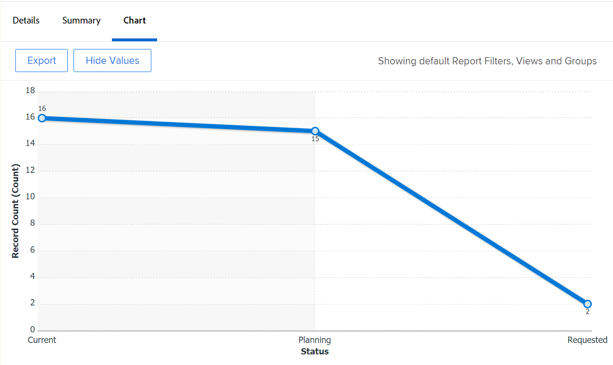

# Diagramm zu einem Bericht hinzufügen

Sie können Ihre Berichte durch Hinzufügen eines Diagramms erweitern. Sie können Diagramme zu vorhandenen Berichten oder zu Berichten hinzufügen, die Sie erstellen.

Bevor Sie einem Bericht ein Diagramm hinzufügen, sollten Sie eine Ansicht und eine Gruppierung für den Bericht erstellen. Die meisten Diagramme können nur hinzugefügt werden, wenn die Informationen im Bericht gruppiert sind. Das einzige Diagramm, das ohne Gruppierung hinzugefügt werden kann, ist ein Lichtraumdiagramm.\
Informationen zum Erstellen einer Ansicht finden Sie unter [Ansichten - Übersicht in Adobe Workfront](../../../reports-and-dashboards/reports/reporting-elements/views-overview.md).\
Weitere Informationen zu Gruppierungen finden Sie unter [Gruppierungsübersicht in Adobe Workfront](../../../reports-and-dashboards/reports/reporting-elements/groupings-overview.md).

Wenn Ihr Bericht zu viele Elemente anzeigt, wird kein Diagramm erstellt. In diesem Fall müssen Sie dem Bericht auch einen Filter hinzufügen, um die Anzahl der Ergebnisse in Ihrem Bericht zu reduzieren.\
Weitere Informationen zu Filtern finden Sie unter [Filterübersicht in Adobe Workfront](../../../reports-and-dashboards/reports/reporting-elements/filters-overview.md).

## Zugriffsanforderungen

Sie müssen über folgenden Zugriff verfügen, um die Schritte in diesem Artikel ausführen zu können:

<table style="table-layout:auto"> 
 <col> 
 <col> 
 <tbody> 
  <tr> 
   <td role="rowheader">Adobe Workfront-Plan*</td> 
   <td> 
Beliebig
 </td> 
  </tr> 
  <tr> 
   <td role="rowheader">Adobe Workfront-Lizenz*</td> 
   <td> 
Plan 
 </td> 
  </tr> 
  <tr> 
   <td role="rowheader">Konfigurationen auf Zugriffsebene*</td> 
   <td> 
Zugriff auf Berichte, Dashboards und Kalender bearbeiten
 
Zugriff auf Filter, Ansichten, Gruppierungen bearbeiten
 
Hinweis: Wenn Sie immer noch keinen Zugriff haben, fragen Sie Ihren Workfront-Administrator, ob er zusätzliche Zugriffsbeschränkungen für Ihre Zugriffsebene festlegt. Informationen dazu, wie ein Workfront-Administrator Ihre Zugriffsebene ändern kann, finden Sie unter <a href="../../../administration-and-setup/add-users/configure-and-grant-access/create-modify-access-levels.md" class="MCXref xref">Benutzerdefinierte Zugriffsebenen erstellen oder ändern</a>.
 </td> 
  </tr> 
  <tr> 
   <td role="rowheader">Objektberechtigungen</td> 
   <td> 
Berechtigungen für einen Bericht verwalten
 
Informationen zum Anfordern von zusätzlichem Zugriff finden Sie unter <a href="../../../workfront-basics/grant-and-request-access-to-objects/request-access.md" class="MCXref xref">Zugriff auf Objekte anfordern </a>.
 </td> 
  </tr> 
 </tbody> 
</table>

&#42;Wenden Sie sich an Ihren Workfront-Administrator, um zu erfahren, welchen Plan, welchen Lizenztyp oder welchen Zugriff Sie haben.

## Diagramm zu einem Bericht hinzufügen

1. Gehen Sie zu einem vorhandenen Bericht oder erstellen Sie einen neuen Bericht. Weitere Informationen zur Erstellung eines neuen Berichts finden Sie unter [Benutzerdefinierten Bericht erstellen](../../../reports-and-dashboards/reports/creating-and-managing-reports/create-custom-report.md).
1. (Bedingt) Wenn Sie zu einem vorhandenen Bericht gewechselt sind, klicken Sie auf **Berichtaktionen** > **Bearbeiten**.

1. Stellen Sie sicher, dass **Spalten (Ansicht)** wurde entsprechend den Anforderungen des Berichts aktualisiert.\
   Informationen zum Erstellen oder Ändern der Ansicht für den Bericht finden Sie unter [Ansichten - Übersicht in Adobe Workfront](../../../reports-and-dashboards/reports/reporting-elements/views-overview.md).

1. Klicken Sie auf **Gruppierungen** und fügen Sie eine Gruppierung hinzu.

   >[!TIP]
   >
   >* Sie können einem Bericht nur dann eine Grafik hinzufügen, wenn die Berichtsergebnisse gruppiert sind.
   >* Gruppierungen im Textmodus werden in Diagrammen nicht unterstützt. Weitere Informationen zu Textmodusgruppierungen finden Sie unter [Textmodus in einer Gruppierung bearbeiten](../../../reports-and-dashboards/reports/text-mode/edit-text-mode-in-grouping.md).
   >* Wenn Sie eine einzelne Gruppierung hinzufügen, die eine Metrik darstellt, werden in allen Grafiken mit Ausnahme eines Kreisdiagramms alle Ergebnisse in der Gruppierung in derselben Farbe angezeigt.

   Weitere Informationen zu Gruppierungen finden Sie unter [Gruppierungsübersicht in Adobe Workfront](../../../reports-and-dashboards/reports/reporting-elements/groupings-overview.md).

1. Wählen Sie die **Diagramm** Registerkarte.
1. Klicken Sie auf einen Diagrammtyp, um ihn auszuwählen.\
   

1. Sie können die folgenden Diagrammtypen zu einem Adobe Workfront-Bericht hinzufügen:

   * [Spaltendiagramm](#column-chart)
   * [Balkendiagramm](#bar-chart)
   * [Tortendiagramm](#pie-chart)
   * [Liniendiagramm](#line-chart)
   * [Diagrammdiagramm](#gauge-chart)
   * [Punktdiagramm](#bubble-chart)

1. Klicken **Speichern und schließen** um die Grafik und den Bericht zu speichern.

### Spaltendiagramm {#column-chart}

So fügen Sie eine **Spalte** Diagramm zu Ihrem Bericht hinzufügen:

1. Fügen Sie Ihrem Bericht ein Diagramm hinzu, wie beschrieben in [Diagramm zu einem Bericht hinzufügen](#add-a-chart-to-a-report).
1. Im **Linke (Y) Achse** auswählen, die Werte, die Sie auf der Y-Achse des Diagramms einbeziehen möchten, sowie die Art und Weise, wie die Informationen zusammengefasst werden sollen.
1. Im **Untere (X) Achse** Wählen Sie die Gruppierung aus, die Sie in die Grafik aufnehmen möchten.
1. (Optional) Wählen Sie **Benutzerdefinierte Farben** , um jeder Spalte die gewünschten Farben zuzuweisen.\
   Weitere Informationen zum Anpassen der Diagrammfarben finden Sie unter [Grafikfarben anpassen](#customize-chart-colors).

1. (Optional) Wählen Sie **In 3D anzeigen** um das Diagramm in einer dreidimensionalen Ansicht anzuzeigen.
1. (Optional) **Gruppenspalten**: Wählen Sie diese Option aus, um festzulegen, wie die Spalten gruppiert werden sollen.\
   Wählen Sie aus den folgenden Optionen aus:

   * Klicken Sie auf eine der folgenden Optionen, um festzulegen, wie die gruppierten Spalten angezeigt werden sollen:\
      **- Seite an Seite**

      **- Gestapelt**
      **- Gestapelt zu 100 %**

   * Wählen Sie die Gruppierung aus, die Sie in die Grafik aufnehmen möchten.
   * (Optional) Wählen Sie **Benutzerdefinierte Farben** um die Farben der Spalten anzupassen.\
      Weitere Informationen zum Anpassen der Diagrammfarben finden Sie unter [Grafikfarben anpassen](#customize-chart-colors).

1. (Optional) Wählen Sie **Kombinationsdiagramm** , um einen zusätzlichen Wert in das Diagramm aufzunehmen und festzulegen, wie die Informationen zusammengefasst werden sollen.\
   Beachten Sie die folgenden Optionen:

   * **Diagramm für eine Sekundäre Achse**: Wählen Sie diese Option, um die Daten auf der rechten Seite der Grafik darzustellen.
   * **Diagrammtyp**: Wählen Sie aus, ob dieser zusätzliche Wert als Zeile oder dritte Spalte angezeigt werden soll.\
      

1. Klicken **Speichern und schließen** um die Grafik und den Bericht zu speichern.

### Balkendiagramm {#bar-chart}

So fügen Sie eine **Balken** Diagramm zu Ihrem Bericht hinzufügen:

1. Fügen Sie Ihrem Bericht ein Diagramm hinzu, wie beschrieben in [Diagramm zu einem Bericht hinzufügen](#add-a-chart-to-a-report).
1. Im **Untere (X) Achse** auswählen, die Werte, die Sie auf der X-Achse des Diagramms aufnehmen möchten, sowie die Art und Weise, wie die Informationen zusammengefasst werden sollen.
1. Im **Linke (Y) Achse** Wählen Sie die Gruppierung aus, die Sie in die Grafik aufnehmen möchten.
1. (Optional) Wählen Sie **Benutzerdefinierte Farben** um die Farben der Balken anzupassen.\
   Weitere Informationen zum Anpassen der Diagrammfarben finden Sie unter [Grafikfarben anpassen](#customize-chart-colors).

1. (Optional) Wählen Sie **In 3D anzeigen** um das Diagramm in einer dreidimensionalen Ansicht anzuzeigen.
1. (Optional)**Gruppenbalken**: Wählen Sie diese Option aus, um festzulegen, wie die Balken gruppiert werden sollen.\
   Wählen Sie aus den folgenden Optionen aus:

   * Klicken Sie auf eine der folgenden Optionen, um festzulegen, wie die gruppierten Balken angezeigt werden sollen:\
      **- Seite an Seite**

      **- Gestapelt**
      **- Gestapelt zu 100 %**

   * Wählen Sie die Gruppierung aus, die Sie in die Grafik aufnehmen möchten.
   * (Optional) Wählen Sie **Benutzerdefinierte Farben** um die Farben Ihrer Spalten anzupassen.\
      Weitere Informationen zum Anpassen der Diagrammfarben finden Sie unter [Grafikfarben anpassen](#customize-chart-colors).

1. (Optional) Wählen Sie **Kombinationsdiagramm** , um einen zusätzlichen Wert in das Diagramm aufzunehmen und festzulegen, wie die Informationen zusammengefasst werden sollen.\
   

1. Klicken **Speichern und schließen** um die Grafik und den Bericht zu speichern.

### Tortendiagramm {#pie-chart}

So fügen Sie eine **Torte** Diagramm zu Ihrem Bericht hinzufügen:

1. Fügen Sie Ihrem Bericht ein Diagramm hinzu, wie beschrieben in [Diagramm zu einem Bericht hinzufügen](#add-a-chart-to-a-report).
1. Im **Werte** auswählen, die Werte, die im Bericht angezeigt werden sollen, sowie die Art und Weise, wie sie zusammengefasst werden sollen.\
   Im **Keile** Wählen Sie die Gruppierung aus, die Sie in die Grafik aufnehmen möchten. Die Gruppierung wird durch die Kanten der Grafik dargestellt.

1. (Optional) Wählen Sie **Benutzerdefinierte Farben** , um die Farben der Keile im Diagramm anzupassen.\
   Weitere Informationen zum Anpassen der Diagrammfarben finden Sie unter [Grafikfarben anpassen](#customize-chart-colors).

1. (Optional) Wählen Sie **In 3D anzeigen** um das Diagramm in einer dreidimensionalen Ansicht anzuzeigen.
1. Im **Ergebnisse anzeigen als** auswählen, wie die Ergebnisse in der Grafik angezeigt werden sollen. Beachten Sie die folgenden Optionen:

   * **Prozentsatz**: Die Diagrammergebnisse werden als Prozentsatz angezeigt.
   * **Zahlen**: Die Diagrammergebnisse werden als Zahl angezeigt.\
      

1. Klicken **Speichern und schließen** um die Grafik und den Bericht zu speichern.

### Liniendiagramm {#line-chart}

So fügen Sie eine **Linie** Diagramm zu Ihrem Bericht hinzufügen:

1. Fügen Sie Ihrem Bericht ein Diagramm hinzu, wie beschrieben in [Diagramm zu einem Bericht hinzufügen](#add-a-chart-to-a-report).
1. Im **Linke (Y) Achse** auswählen, die Werte, die Sie auf der Y-Achse des Diagramms einbeziehen möchten, sowie die Art und Weise, wie die Informationen zusammengefasst werden sollen.
1. Im **Untere (X) Achse** Wählen Sie die Gruppierung aus, die Sie in die Grafik aufnehmen möchten.
1. (Optional) Wählen Sie eine Farbe, um die Farbe der Linie anzupassen.
1. (Optional) Wählen Sie **Gruppenlinien**, um eine zusätzliche Gruppierung für das Diagramm auszuwählen.\
   (Optional) Wählen Sie **Benutzerdefinierte Farben** um die Farben für die neue Gruppierung anzupassen.\
   Weitere Informationen zum Anpassen der Diagrammfarben finden Sie unter [Grafikfarben anpassen](#customize-chart-colors).

1. (Optional) Wählen Sie **Kombinationsdiagramm** um Ihre Zeilen mit einem zusätzlichen Wert zu kombinieren.\
   Beachten Sie die folgenden Optionen:

   * Wählen Sie den Wert aus, den Sie in die Grafik aufnehmen möchten, sowie die Art und Weise, wie die Informationen zusammengefasst werden sollen.
   * Wählen Sie die **Diagramm für eine Sekundäre Achse**-Feld, um die Daten auf der rechten Seite des Diagramms darzustellen.\
      

1. Klicken **Speichern und schließen** um die Grafik und den Bericht zu speichern.

### Diagrammdiagramm {#gauge-chart}

A **Messung** zeigt die Anzahl der Datensätze an, die bestimmte Kriterien im Spurformat erfüllen. Der Indikator der Messung zeigt die Anzahl der Datensätze an, die den in der Ansicht und Gruppierung des Berichts ausgewählten Kriterien entsprechen. Zum Konfigurieren eines Diagramms ist keine Berichtsgruppierung erforderlich.

So fügen Sie eine **Messung** Diagramm zu Ihrem Bericht hinzufügen:

1. Fügen Sie Ihrem Bericht ein Diagramm hinzu, wie beschrieben in [Diagramm zu einem Bericht hinzufügen](#add-a-chart-to-a-report).
1. Im **Werte** auswählen, die Werte, die im Bericht angezeigt werden sollen, sowie die Art und Weise, wie sie zusammengefasst werden sollen. Wenn Sie **Datensatzanzahl**, sind die angezeigten Werte das Objekt des Berichts.

1. Im **Indikatoren** Wählen Sie die Gruppierung aus, die Sie in die Grafik aufnehmen möchten. Die Gruppierung wird durch die Indikatorlinie im Diagramm dargestellt.\
   Wenn die Gruppierung zwei Elemente enthält, werden zwei Indikatoren im Diagramm angezeigt.\
   Wenn Sie z. B. eine Gruppierung des Projektstatus haben und zwei Projektstatus vorliegen (Aktuell und Bei Halten), enthält Ihr Bilddiagramm zwei Kennzahlindikatoren. Sie werden auf die Anzahl der Projekte verweisen, die sich in diesem Status befinden.\
   (Optional) Wählen Sie **Ingesamt** im **Indikatoren** -Feld, um die Gesamtzahl der im Feld **Werte** -Feld.

1. Im **Wertebereich** Geben Sie den Wertebereich und die Farbe an, die für die Werte gelten sollen, die im Diagramm dargestellt werden sollen.
1. (Optional) Klicken Sie auf **Einen weiteren Wertbereich hinzufügen** , um dem Diagramm weitere Wertebereiche hinzuzufügen.\
   

1. Klicken **Speichern und schließen** um die Grafik und den Bericht zu speichern.

### Punktdiagramm {#bubble-chart}

Sie können bis zu drei Felder eines Objekts in einem **Blase** Diagramm. Das bedeutet, dass Sie bis zu vier Datenpunkte in einem Punktdiagramm anzeigen können. Jede Entität mit drei verbundenen Feldern wird als Kreis angezeigt, der zwei der Felder innerhalb ihrer Position innerhalb der X- und Y-Achsen ausdrückt. Das dritte Feld wird durch die Größe des Kreises dargestellt.

So fügen Sie eine **Blase** Diagramm zu Ihrem Bericht hinzufügen:

1. Fügen Sie Ihrem Bericht ein Diagramm hinzu, wie beschrieben in [Diagramm zu einem Bericht hinzufügen](#add-a-chart-to-a-report).
1. Im **Linke (Y) Achse** -Feld die Werte auswählen, die Sie auf der Y-Achse des Diagramms einbeziehen möchten. Die Werte stammen aus der Sicht des Berichts. Geben Sie an, wie die Informationen zusammengefasst werden sollen.
1. Im **Feld &quot;Untere(X) Achse&quot;**, wählen Sie die Werte aus, die Sie in die X-Achse des Diagramms aufnehmen möchten. Die Werte stammen aus der Sicht des Berichts. Geben Sie an, wie die Informationen zusammengefasst werden sollen.

   >[!NOTE]
   >
   >Stellen Sie sicher, dass Sie mindestens eine Spalte haben, die zusammengefasst ist, damit dieses Feld aktiv ist.\
   >Weitere Informationen zur Zusammenfassung der Informationen in einer Berichtsspalte finden Sie unter [Benutzerdefinierten Bericht erstellen](../../../reports-and-dashboards/reports/creating-and-managing-reports/create-custom-report.md).

1. Im **Blasengröße** die Werte, die Sie anhand der Größe der Blasen in der Grafik darstellen möchten. Die Werte stammen aus der Sicht des Berichts. Geben Sie an, wie die Informationen zusammengefasst werden sollen.

   >[!NOTE]
   >
   >Stellen Sie sicher, dass Sie mindestens eine Spalte haben, die zusammengefasst ist, damit dieses Feld aktiv ist.\
   >Weitere Informationen zur Zusammenfassung der Informationen in einer Berichtsspalte finden Sie unter [Benutzerdefinierten Bericht erstellen](../../../reports-and-dashboards/reports/creating-and-managing-reports/create-custom-report.md).

1. Im **Blasen** Wählen Sie die Gruppierung aus, die Sie in die Grafik aufnehmen möchten. Die Gruppierung wird durch die Platzierung der Punkte im Diagramm dargestellt.
1. Im **Blasenfarbe** auswählen, wählen Sie das Feld aus, das durch die Farben der Blasen dargestellt werden soll. Die **Blasenfarbe** kann eine Gruppierung sein, die Sie im Bericht definieren, aber es kann sich nur um Felder aus dem Objekt handeln, das Sie als **Blasen**. Wenn Sie beispielsweise &quot;Task Name&quot;ausgewählt haben, können Sie den Aufgabenstatus, jedoch nicht den Projektstatus als **Blasenfarbe**.\
   

1. Klicken **Speichern und schließen** , um die Änderungen am Interface Builder zu speichern.

## Grafik exportieren

Sie können ein Diagramm in eine PDF-Datei exportieren.

So exportieren Sie eine Grafik:

1. Klicken **Export** um die Grafik in .pdf zu exportieren.\
   Eine PDF-Datei wird auf Ihren Computer heruntergeladen.

1. Öffnen Sie die PDF-Datei.\
   Die exportierte Datei enthält die folgenden Informationen:

   * Ein Bild des Diagramms.
   * Ein Titel, der den Namen des Berichts angibt.
   * Ein eindeutiger Dateiname, der den Namen des Berichts angibt.
   * Fußzeile mit Datum und Uhrzeit des Exports des Berichts und der Seitenzahl.

## Grafikfarben anpassen {#customize-chart-colors}

Sie können Workfront die Farben der Elemente in Ihrem Diagramm auswählen lassen oder diese anpassen, während Sie Ihren Berichten ein Diagramm hinzufügen. Wenn Ihr Diagramm eine Gruppierung enthält, die eine Metrik darstellt, z. B. einen Aufgabenbericht, der die Anzahl der nach dem tatsächlichen Abschlussdatum gruppierten Aufgaben anzeigt, wird jedes Ergebnis in der Gruppierung in derselben Farbe angezeigt.

Sie können nur eine Farbe für die in der Berichtansicht angezeigten Felder auswählen. Für die in der Berichtsgruppierung angezeigten Felder können Sie mehrere Farben auswählen - eine für jede Option.

>[!IMPORTANT]
>
>Bei Datumsfeldern können Sie nur eine Farbe für Ihre Diagrammelemente auswählen.

So passen Sie Diagrammfarben an:

1. Gehen Sie beim Erstellen eines Berichts zum **Diagramm** in der Berichterstellung.
1. Wählen Sie einen Diagrammtyp aus, den Sie Ihrem Bericht hinzufügen möchten.\
   Weitere Informationen zum Hinzufügen eines Diagramms zu Ihrem Bericht finden Sie unter [Diagramm zu einem Bericht hinzufügen](#add-a-chart-to-a-report).

1. Klicken **Benutzerdefinierte Farben** wenn dieses Feld verfügbar ist.\
   Das Dialogfeld Benutzerdefinierte Farben wird angezeigt.\
   

   >[!NOTE]
   >
   >Sie können benutzerdefinierte Farben mit jedem Feld verknüpfen, das Sie gruppieren können, und mit einigen Feldern, die in einer Ansicht angezeigt werden können, einschließlich benutzerdefinierten Feldern. Bei den benutzerdefinierten Feldern oder benutzerdefinierten Optionen der Felder, die Sie im Dialogfeld &quot;Benutzerdefinierte Farbe&quot;auswählen, wird zwischen Groß- und Kleinschreibung unterschieden.

1. Wählen Sie eine der folgenden Optionen aus:

   * **Eine Farbe verwenden**: Alle Elemente des Diagramms werden in der ausgewählten Farbe angezeigt.

      1. Geben Sie den Namen einer Option des ausgewählten Felds ein und wählen Sie dann eine Farbe aus. Diese Option wird in der ausgewählten Farbe des Diagramms angezeigt.
      1. (Optional) Geben Sie einen hexadezimalen Farbwert für Ihre Farbe an, anstatt einen aus den verfügbaren Farbbeispielen auszuwählen.\
         Oder\
         Klicken Sie auf die Farbauswahl, die nach dem Klicken auf den Hexadezimalcode angezeigt wird, und wählen Sie eine andere Farbe aus.
   * **Farbe hinzufügen**: Fügen Sie weiterhin benutzerdefinierte Farben für alle anderen möglichen Optionen des ausgewählten Felds hinzu.
   * **Alle löschen**: Wählen Sie diese Option, um alle Farben und Optionen des oben ausgewählten Felds zu entfernen.
   * **Erweiterte Optionen**: Wählen Sie eine der folgenden Optionen aus:

      * **Kein Wert**: Wählen Sie dieses Feld und eine benutzerdefinierte Farbe aus, um die Spalte des Diagramms anzuzeigen, in der Elemente ohne Wert gruppiert sind. Dies sind Elemente, die nicht nach einer der Optionen des in Ihrer Gruppierung ausgewählten Felds gruppiert werden können.
      * **Alle anderen Werte**: Wählen Sie dieses Feld und eine benutzerdefinierte Farbe aus, um alle anderen Diagrammelemente anzuzeigen, deren Optionen oben nicht ausgewählt sind.

         >[!NOTE]
         >
         >Die zuletzt verwendeten Farben werden oben im Dialogfeld Benutzerdefinierte Farben angezeigt. Wenn Sie den Mauszeiger über eine Farbe bewegen, die kürzlich verwendet wurde, wird der Name des damit verknüpften Felds angezeigt.

1. Klicken Sie auf das &quot;x&quot;in der oberen rechten Ecke der benutzerdefinierten Farben, um das Dialogfeld Benutzerdefinierte Farben zu schließen. Die ausgewählten Farben werden automatisch gespeichert.
1. Klicken **Speichern und schließen** , um die Grafik zu speichern und den Bericht auszuführen.

## Grafiken aus Berichten entfernen

So entfernen Sie ein Diagramm aus einem Bericht:

1. Öffnen Sie die **Diagramm** Registerkarte ReportBuilder.
1. Bewegen Sie den Mauszeiger über das Symbol des gewählten Diagrammtyps und oben rechts im Symbol wird die Schaltfläche &quot;x&quot; angezeigt.
1. Klicken Sie auf das &quot;x&quot;, um das Diagramm zu entfernen.
1. Klicken **Speichern und schließen**.

## Einschränkungen beim Arbeiten mit Diagrammen

Beachten Sie beim Arbeiten mit Diagrammen die folgenden Einschränkungen:

* Die **Diagrammvorschau** -Abschnitt rechts neben ReportBuilder keine tatsächlichen Daten aus Ihrem Bericht enthält. Sie müssen das Diagramm speichern und im **Diagramm** um die Grafik mit Ihren Daten anzuzeigen.

* Einige Diagrammelemente können nicht bearbeitet werden:

   * Sie können den Schrifttyp und die Größe der Werte der einzelnen Elemente nicht ändern.
   * Die Namen der Achsen im Diagramm können nicht geändert werden.

* Die Legende des Diagramms kann nicht bearbeitet werden.
* Bei der Verwendung berechneter Felder für Gruppierungen ist ein Klick auf die Diagrammelemente nicht möglich.
* Die meisten Datenpunkte, die Sie in einem Diagramm anzeigen können, sind vier in einem Punktdiagramm. Alle anderen Diagrammtypen zeigen zwei oder maximal drei Datenpunkte an.
