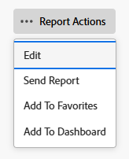

# Erstellen einer Kopie eines Berichts

<!-- Audited: 11/2024 -->

Sie können eine Kopie jedes Berichts erstellen, auf den Sie Zugriff haben. Sie können entweder eine exakte Kopie eines benutzerdefinierten Berichts erstellen oder eine neue Version eines Standardberichts speichern. Nachdem Sie einen Bericht kopiert haben, werden Sie Eigentümer des kopierten Berichts und er wird im Abschnitt Meine Berichte angezeigt.

## Zugriffsanforderungen

+++ Erweitern Sie , um die Zugriffsanforderungen für die -Funktion in diesem Artikel anzuzeigen.

Sie müssen über folgenden Zugriff verfügen, um die Schritte in diesem Artikel ausführen zu können:

<table style="table-layout:auto"> 
 <col> 
 <col> 
 <tbody> 
  <tr> 
   <td role="rowheader">Adobe Workfront-Plan*</td> 
   <td> 
Beliebig
 </td> 
  </tr> 
  <tr> 
   <td role="rowheader">Adobe Workfront-Lizenz*</td> 
   <td> 
      
Neu:

         <ul>
         <li>
Standard
</li>
         </ul>
      
Aktuell:

         <ul>
         <li>
Plan
</li>
         </ul>
   </td>
  </tr> 
  <tr> 
   <td role="rowheader">Konfigurationen der Zugriffsebene*</td> 
   <td> 
Zugriff auf Berichte, Dashboards, Kalender bearbeiten
 
Zugriff auf Filter, Ansichten, Gruppierungen bearbeiten
</td> 
  </tr> 
  <tr> 
   <td role="rowheader">Objektberechtigungen*</td> 
   <td>
Anzeigen von Berechtigungen für einen Bericht
</td> 
  </tr> 
 </tbody> 
</table>

*Weitere Informationen finden Sie unter [Zugriffsanforderungen in der Dokumentation zu Workfront](/help/quicksilver/administration-and-setup/add-users/access-levels-and-object-permissions/access-level-requirements-in-documentation.md).

+++

## Erstellen einer exakten Kopie eines Berichts

Wenn Sie eine Kopie eines benutzerdefinierten Berichts erstellen möchten, gehen Sie wie folgt vor:

1. Klicken Sie auf das **[!UICONTROL Hauptmenü]**-Symbol  in der oberen rechten Ecke von Adobe Workfront oder (falls verfügbar) klicken Sie auf das **[!UICONTROL Hauptmenü]**-Symbol  in der oberen linken Ecke und klicken Sie dann auf **[!UICONTROL Berichte]**.

1. Klicken Sie **Alle Berichte** und öffnen Sie dann einen Bericht.

1. Klicken Sie **Berichtsaktionen** und dann **Kopieren**.

   >[!TIP]
   >
   >Wenn es sich bei dem Bericht um einen Standardbericht handelt, wird die Option Kopieren nicht im Menü Berichtsaktionen angezeigt.\
   >Informationen zum Erstellen einer Kopie eines Standardberichts finden Sie unter [Erstellen einer neuen Version eines Berichts](#create-a-new-version-of-a-report).

   

   Eine Kopie des ursprünglichen Berichts wird mit dem Standardnamen (Name _[ursprünglichen Berichts) ]Kopie)_. Beispielsweise würde eine Kopie des Berichts „Abgeschlossene Aufgaben im 4. Quartal“ als „Abgeschlossene Aufgaben im 4. Quartal (Kopie)“ bezeichnet.

1. (Optional) Um den Bericht umzubenennen, klicken Sie auf **Berichtsaktionen** und dann **Bearbeiten**. Geben Sie oben links im Textfeld einen neuen Namen ein und klicken Sie anschließend auf **Speichern + Schließen**.

1. (Optional) Um die neue Version des Berichts für andere Benutzer freizugeben, klicken Sie auf **Berichtsaktionen** und dann auf **Freigabe**.

   >[!NOTE]
   >
   >Die Freigabeinformationen werden nicht von der Originalversion in den kopierten Bericht übertragen.\
   >Informationen dazu, wie Sie sehen können, für wen der vorherige Bericht freigegeben wurde, finden Sie unter [Erstellen eines Berichts zu Berichtsaktivitäten](../../../reports-and-dashboards/reports/report-usage/create-report-reporting-activities.md#identify).

1. (Optional) Wenn Sie über Verwaltungsberechtigungen für den Originalbericht verfügen und der Originalbericht nicht mehr benötigt wird, können Sie ihn löschen, um unnötige doppelte Berichte in Workfront zu entfernen.

   Gehen Sie wie folgt vor, um den ursprünglichen Bericht zu löschen:

   1. Navigieren Sie zum Bericht.

   1. Klicken Sie **Berichtsaktionen** und dann **Löschen**.

   1. Klicken Sie **Ja, löschen** um zu bestätigen, dass Sie den Bericht löschen möchten.

## Erstellen einer neuen Version eines Berichts {#create-a-new-version-of-a-report}

Wenn Sie eine Kopie eines Standardberichts erstellen möchten, gehen Sie wie folgt vor:

1. Klicken Sie auf **Hauptmenü** Symbol  in der rechten oberen Ecke von Adobe Workfront.

1. Klicken Sie **Berichte** und dann **Alle Berichte**.
1. Klicken Sie auf den Namen eines Standardberichts, um ihn zu öffnen.
1. Klicken Sie **Berichtsaktionen** und dann **Bearbeiten**.

   

1. Nehmen Sie auf den folgenden Registerkarten des Berichts die erforderlichen Änderungen vor:

   * **Spalten (Ansicht)**: Weitere Informationen zum Anpassen von Ansichten finden Sie im Artikel [Ansichten - Übersicht in Adobe Workfront](../../../reports-and-dashboards/reports/reporting-elements/views-overview.md).
   * **Gruppierungen**: Weitere Informationen zum Anpassen von Gruppierungen finden Sie im Artikel [Gruppierungen - Übersicht in Adobe Workfront](../../../reports-and-dashboards/reports/reporting-elements/groupings-overview.md).
   * **Filter**: Weitere Informationen zum Anpassen von Filtern finden Sie im Artikel [Filter - Übersicht](../../../reports-and-dashboards/reports/reporting-elements/filters-overview.md).
   * **Diagramm**: Weitere Informationen zum Anpassen eines Berichtsdiagramms finden Sie im Artikel [Hinzufügen eines Diagramms zu einem Bericht](../../../reports-and-dashboards/reports/creating-and-managing-reports/add-chart-report.md).

1. Klicken Sie oben rechts auf **Berichteinstellungen**.
1. Geben Sie **Feld „Berichtstitel** einen neuen Namen für den Bericht ein.
1. Klicken Sie **Fertig**.
1. Klicken Sie **Als neuen Bericht speichern**.

   

1. (Optional) Um die neue Version des Berichts für andere Benutzer freizugeben, klicken Sie auf **Berichtsaktionen** und dann auf **Freigabe**.
