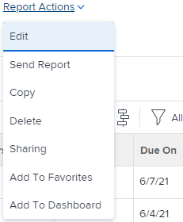

# Berichtkopie erstellen

Sie können eine Kopie jedes Berichts erstellen, auf den Sie Zugriff haben. Sie können entweder eine exakte Kopie eines benutzerspezifischen Berichts erstellen oder eine neue Version eines Standardberichts speichern. Nachdem Sie einen Bericht kopiert haben, werden Sie zum Eigentümer des kopierten Berichts und dieser wird im Abschnitt Meine Berichte angezeigt.

## Zugriffsanforderungen

Sie müssen über folgenden Zugriff verfügen, um die Schritte in diesem Artikel ausführen zu können:

<table style="table-layout:auto"> 
 <col> 
 <col> 
 <tbody> 
  <tr> 
   <td role="rowheader">Adobe Workfront-Plan*</td> 
   <td> 
Alle
 </td> 
  </tr> 
  <tr> 
   <td role="rowheader">Adobe Workfront-Lizenz*</td> 
   <td> 
Plan 
 </td> 
  </tr> 
  <tr> 
   <td role="rowheader">Konfigurationen auf Zugriffsebene*</td> 
   <td> 
Zugriff auf Berichte, Dashboards und Kalender bearbeiten
 
Zugriff auf Filter, Ansichten, Gruppierungen bearbeiten
 
Hinweis: Wenn Sie immer noch keinen Zugriff haben, fragen Sie Ihren Workfront-Administrator, ob er zusätzliche Zugriffsbeschränkungen für Ihre Zugriffsebene festlegt. Informationen dazu, wie ein Workfront-Administrator Ihre Zugriffsebene ändern kann, finden Sie unter <a href="../../../administration-and-setup/add-users/configure-and-grant-access/create-modify-access-levels.md" class="MCXref xref">Benutzerdefinierte Zugriffsebenen erstellen oder ändern</a>.
 </td> 
  </tr> 
  <tr> 
   <td role="rowheader">Objektberechtigungen</td> 
   <td> 
Berechtigungen für einen Bericht anzeigen
 
Weitere Informationen zum Anfordern von zusätzlichem Zugriff finden Sie unter <a href="../../../workfront-basics/grant-and-request-access-to-objects/request-access.md" class="MCXref xref">Anfordern des Zugriffs auf Objekte </a>.
 </td> 
  </tr> 
 </tbody> 
</table>

&#42;Wenden Sie sich an Ihren Workfront-Administrator, um zu erfahren, welchen Plan, welchen Lizenztyp oder welchen Zugriff Sie haben.

## Erstellen einer exakten Kopie eines Berichts

Wenn Sie eine Kopie eines Berichts erstellen möchten, dessen Eigentümer Sie sind, gehen Sie wie folgt vor:

1. Klicken Sie oben rechts in Adobe Workfront auf das Symbol **Hauptmenü** .

1. Klicken Sie auf **Berichte** und dann auf **Alle Berichte**.
1. Öffnen Sie einen Bericht.
1. Klicken Sie auf **Berichtaktionen** und dann auf **Kopieren**.

   >[!TIP]
   >
   >Wenn es sich bei dem Bericht um einen Standardbericht handelt, wird die Option Kopieren nicht im Menü Berichtaktionen angezeigt.\
   >Informationen zum Erstellen einer Kopie eines Standardberichts finden Sie unter [Erstellen einer neuen Version eines Berichts](#create-a-new-version-of-a-report).

   

   Eine Kopie des ursprünglichen Berichts wird mit dem Standardnamen *Kopie von [Name des ursprünglichen Berichts]* erstellt. Zum Beispiel hätte der Bericht &quot;Abgeschlossene Aufgaben im 4. Quartal&quot;den Namen &quot;Kopie der abgeschlossenen Aufgaben im 4. Quartal&quot;.

1. (Optional) Um den Bericht umzubenennen, geben Sie einen neuen Namen ein.

   >[!TIP]
   >
   >Wenn Sie die Auswahl des Titels aufheben, bevor Sie den neuen Namen eingeben, wählen Sie den Berichtstitel aus, löschen Sie den Namen und geben Sie den neuen Namen ein.

1. (Optional) Um die neue Version des Berichts für andere Benutzer freizugeben, klicken Sie auf **Berichtaktionen** und dann auf **Freigabe**.

   >[!NOTE]
   >
   >Die Freigabeinformationen werden nicht von der Originalversion in den kopierten Bericht übertragen.\
   >Informationen dazu, wie Sie sehen, für wen der vorherige Bericht freigegeben wurde, finden Sie unter [Erstellen eines Berichts über Berichterstellungsaktivitäten](../../../reports-and-dashboards/reports/report-usage/create-report-reporting-activities.md#identify).

1. (Optional) Wenn Sie über Verwaltungsberechtigungen für den ursprünglichen Bericht verfügen und der Originalbericht nicht mehr benötigt wird, können Sie ihn löschen, um unnötige duplizierte Berichte in Workfront zu entfernen.

   Gehen Sie wie folgt vor, um den ursprünglichen Bericht zu löschen:

   1. Navigieren Sie zum Bericht.
   1. Klicken Sie auf **Berichtaktionen** und dann auf **Löschen**.

   1. Klicken Sie auf **Ja, löschen Sie ihn** , um zu bestätigen, dass Sie den Bericht löschen möchten.

## Neue Berichtversion erstellen {#create-a-new-version-of-a-report}

Wenn Sie eine Kopie eines Standardberichts erstellen möchten, gehen Sie wie folgt vor:

1. Klicken Sie oben rechts in Adobe Workfront auf das Symbol **Hauptmenü** .

1. Klicken Sie auf **Berichte** und dann auf **Alle Berichte**.
1. Klicken Sie auf den Namen eines Standardberichts, um ihn zu öffnen.
1. Klicken Sie auf **Berichtaktionen** und dann auf **Bearbeiten**.

   

1. Nehmen Sie in den folgenden Registerkarten des Berichts die erforderlichen Änderungen vor:

   * **Spalten (Ansicht)**: Weitere Informationen zum Anpassen von Ansichten finden Sie im Artikel [Übersicht über Ansichten in Adobe Workfront](../../../reports-and-dashboards/reports/reporting-elements/views-overview.md).
   * **Gruppierungen**: Weitere Informationen zum Anpassen von Gruppierungen finden Sie im Artikel [Gruppierungsübersicht in Adobe Workfront](../../../reports-and-dashboards/reports/reporting-elements/groupings-overview.md).
   * **Filter**: Weitere Informationen zum Anpassen von Filtern finden Sie im Artikel [Filterübersicht](../../../reports-and-dashboards/reports/reporting-elements/filters-overview.md).
   * **Diagramm**: Weitere Informationen zum Anpassen eines Berichtdiagramms finden Sie im Artikel [Hinzufügen eines Diagramms zu einem Bericht](../../../reports-and-dashboards/reports/creating-and-managing-reports/add-chart-report.md) .

1. Klicken Sie oben rechts auf **Berichtseinstellungen**.
1. Geben Sie im Feld **Berichttitel** einen neuen Namen für den Bericht ein.
1. Klicken Sie auf **Fertig**.
1. Klicken Sie auf **Als neuen Bericht speichern**.

   

1. (Optional) Um die neue Version des Berichts für andere Benutzer freizugeben, klicken Sie auf **Berichtaktionen** und dann auf **Freigabe**.
