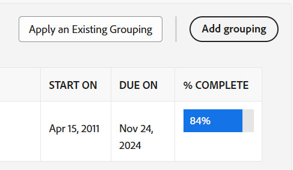
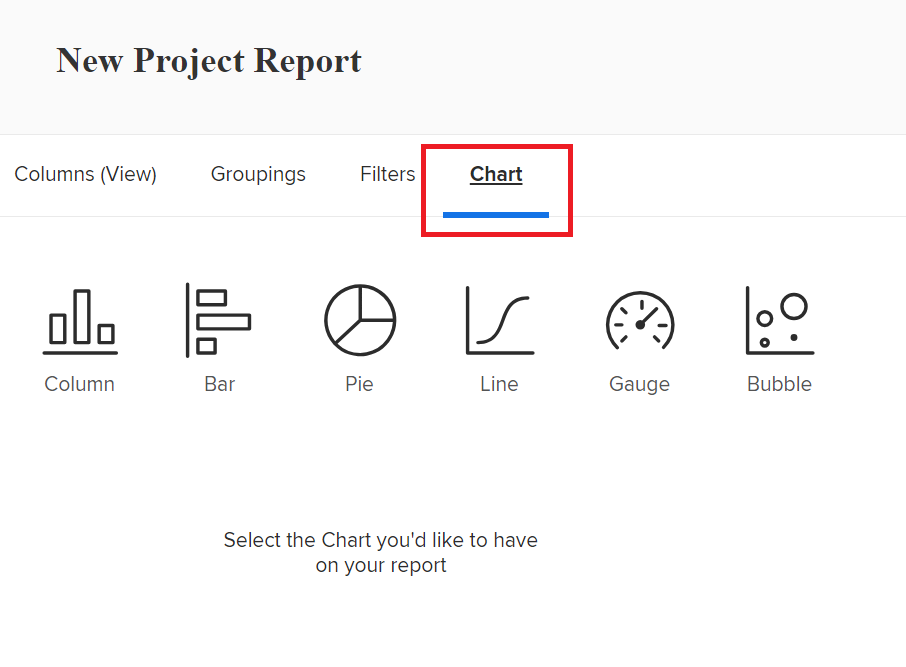

# Benutzerdefinierten Bericht erstellen

Die Erstellung von Berichten hilft Ihnen dabei, auf die Informationen zuzugreifen, die Ihr Unternehmen in Adobe Workfront benötigt. Sie können einen der integrierten Berichte verwenden, die in Workfront verfügbar sind, oder Sie können Ihre eigenen Berichte von Grund auf neu erstellen.

Weitere Informationen zu integrierten Berichten finden Sie unter [Integrierte Adobe Workfront-Berichte verwenden](../../../reports-and-dashboards/reports/using-built-in-reports/use-workfront-built-in-reports.md).

Informationen zum Erstellen eines Berichts durch Kopieren finden Sie unter [Berichtkopie erstellen](../../../reports-and-dashboards/reports/creating-and-managing-reports/create-copy-report.md).

Weitere Informationen zum Erstellen und Verwalten von Berichten, einschließlich Klassen, Videos und Tutorials, finden Sie im Abschnitt &quot;Lernen&quot;auf der Adobe Experience League-Site.

## Zugriffsanforderungen

Sie müssen über folgenden Zugriff verfügen, um die Schritte in diesem Artikel ausführen zu können:

<table style="table-layout:auto"> 
 <col> 
 <col> 
 <tbody> 
  <tr> 
   <td role="rowheader">Adobe Workfront-Plan*</td> 
   <td> 
Beliebig
 </td> 
  </tr> 
  <tr> 
   <td role="rowheader">Adobe Workfront-Lizenz*</td> 
   <td> 
Plan 
 </td> 
  </tr> 
  <tr> 
   <td role="rowheader">Konfigurationen auf Zugriffsebene*</td> 
   <td> 
Zugriff auf Berichte, Dashboards und Kalender bearbeiten
 
Zugriff auf Filter, Ansichten, Gruppierungen bearbeiten
 
Hinweis: Wenn Sie immer noch keinen Zugriff haben, fragen Sie Ihren Workfront-Administrator, ob er zusätzliche Zugriffsbeschränkungen für Ihre Zugriffsebene festlegt. Informationen dazu, wie ein Workfront-Administrator Ihre Zugriffsebene ändern kann, finden Sie unter <a href="../../../administration-and-setup/add-users/configure-and-grant-access/create-modify-access-levels.md" class="MCXref xref">Benutzerdefinierte Zugriffsebenen erstellen oder ändern</a>.
 </td> 
  </tr> 
  <tr> 
   <td role="rowheader">Objektberechtigungen</td> 
   <td> 
Sie erhalten Verwaltungsberechtigungen für den erstellten Bericht.
 
Informationen zum Anfordern von zusätzlichem Zugriff finden Sie unter <a href="../../../workfront-basics/grant-and-request-access-to-objects/request-access.md" class="MCXref xref">Zugriff auf Objekte anfordern </a>.
 </td> 
  </tr> 
 </tbody> 
</table>

&#42;Wenden Sie sich an Ihren Workfront-Administrator, um zu erfahren, welchen Plan, welchen Lizenztyp oder welchen Zugriff Sie haben.

## Bericht erstellen {#create-a-report}

Ein Video über die Erstellung eines Berichts finden Sie in diesem [Benutzerdefinierten Bericht erstellen](#Walk-thr) unten.

1. Klicken Sie auf **Hauptmenü** icon  in der oberen rechten Ecke und klicken Sie auf **Berichte**.
1. Klicks **Neuer Bericht** und wählen Sie dann den Objekttyp aus, den Sie für den Bericht verwenden möchten.

   Die Berichterstellung wird geladen.

   Weitere Informationen zu verfügbaren Objektberichten finden Sie im Abschnitt . [Berichte zu Objekten](../../../workfront-basics/navigate-workfront/workfront-navigation/understand-objects.md#reporting-on-objects) im Artikel [Objekte in Adobe Workfront verstehen](../../../workfront-basics/navigate-workfront/workfront-navigation/understand-objects.md).

   

   >[!TIP]
   >
   >Sie können auch einen Bericht erstellen, indem Sie eine Kopie eines vorhandenen Berichts erstellen. Weitere Informationen finden Sie unter [Berichtkopie erstellen](../../../reports-and-dashboards/reports/creating-and-managing-reports/create-copy-report.md).

1. Fügen Sie Ihrem Bericht in ReportBuilder Folgendes hinzu:

   <table style="table-layout:auto"> 
    <col> 
    <col> 
    <thead> 
     <tr> 
      <th>Funktion</th> 
      <th>Beschreibung</th> 
     </tr> 
    </thead> 
    <tbody> 
     <tr> 
      <td>Spalten (Ansicht)</td> 
      <td> 
Durch das Hinzufügen von Spalten zu Ihrem Bericht wird bestimmt, welche Informationen Ihr Bericht enthält.
 
Informationen zum Hinzufügen einer Spalte finden Sie unter <a href="#add-columns-view-to-a-report" class="MCXref xref">Spalten (Ansicht) zu einem Bericht hinzufügen</a>. 
 </td> 
     </tr> 
     <tr> 
      <td>Gruppierungen</td> 
      <td> 
Durch das Hinzufügen von Gruppierungen zu Ihrem Bericht wird bestimmt, wie Ihr Bericht organisiert ist.
 
Informationen zum Hinzufügen einer Gruppierung finden Sie unter <a href="#add-groupings-to-a-report" class="MCXref xref">Gruppierungen zu einem Bericht hinzufügen</a>.
 </td> 
     </tr> 
     <tr> 
      <td>Filter</td> 
      <td> 
Durch das Hinzufügen von Filterregeln zu Ihrem Bericht werden die in Ihrem Bericht angezeigten Informationen bestimmt.
 
Informationen zum Hinzufügen eines Filters finden Sie unter <a href="#add-filters-to-a-report" class="MCXref xref">Filter zu einem Bericht hinzufügen</a>.
 </td> 
     </tr> 
     <tr> 
      <td>Diagramm</td> 
      <td> 
Durch das Hinzufügen eines Diagramms zu Ihrem Bericht wird bestimmt, wie die Informationen in Ihrem Bericht visuell dargestellt werden.
 
Informationen zum Hinzufügen eines Diagramms finden Sie unter <a href="#add-a-chart-to-a-report" class="MCXref xref">Diagramm zu einem Bericht hinzufügen</a>.
 </td> 
     </tr> 
    </tbody> 
   </table>

1. Klicken Sie während der Berichterstellung auf **Anwenden** , um Ihre Änderungen zu speichern.
1. Klicken Sie nach Abschluss auf **Speichern und schließen**.

### Spalten (Ansicht) zu einem Bericht hinzufügen {#add-columns-view-to-a-report}

1. Erstellen Sie einen Bericht, wie im Abschnitt [Bericht erstellen](#create-a-report) in diesem Artikel beschrieben.
1. Wählen Sie in ReportBuilder die **Spalten (Ansicht)** um die Spalten zu identifizieren, die im Bericht angezeigt werden sollen.
1. (Optional) Klicken Sie auf **Anwenden einer vorhandenen Ansicht** , um eine vorhandene Ansicht zu verwenden.

   Weitere Informationen zum Erstellen einer neuen Ansicht finden Sie unter [Ansichten - Übersicht in Adobe Workfront](../../../reports-and-dashboards/reports/reporting-elements/views-overview.md).

1. Um eine neue Spalte hinzuzufügen, klicken Sie auf **Spalte hinzufügen**.

   Oder

   Um eine vorhandene Spalte zu ändern, wählen Sie die Spalte aus, die Sie ändern möchten, und klicken Sie dann auf (x) neben dem aktuellen Namen.

1. Beginnen Sie mit der Eingabe des Felds, das Sie hinzufügen möchten. Wenn das Feld verfügbar ist, wird es für jedes Objekt gefüllt, mit dem es verknüpft werden kann. Klicken Sie auf den Namen des Felds, um es der Spalte hinzuzufügen.

   Weitere Informationen zu den Feldern, die in den Spalten angezeigt werden, finden Sie unter [Glossar der Adobe Workfront-Terminologie](../../../workfront-basics/navigate-workfront/workfront-navigation/workfront-terminology-glossary.md).

   

1. (Optional) Im **Spalteneinstellungen** Bereich, auswählen **Nach dieser Spalte sortieren** um die Werte in der Spalte in aufsteigender alphabetischer Reihenfolge zu sortieren, und geben Sie an, ob die Liste diese Spalte als erste sortieren soll.

   Sie können in einer Berichtsansicht mehrere Sortierungsebenen haben, wenn Sie zuerst nach dem Wert in einer Spalte, dann nach dem Wert in einer zweiten Spalte usw. sortieren möchten.

   Wenn mehrere Ergebnisse anhand der ersten Sortierungskriterien identisch sind, werden sie in der Reihenfolge der zweiten Sortierungskriterien sortiert. Wenn mehrere Ergebnisse anhand der ersten und zweiten Sortierungskriterien identisch sind, werden sie nach der dritten Sortierung sortiert usw.

   >[!NOTE]
   >
   >Wenn Sie ein Feld hinzufügen, das auf ein Objekt verweist, das zu weit von dem Objekt entfernt ist, über das Sie Berichte erstellen, können Sie möglicherweise nicht nach diesem Feld sortieren.\
   >Beispielsweise kann ein Problembericht nicht nach dem Feld &quot;Projekteigentümer&quot;sortieren, da er auf 3 zusätzliche Objekte verweist: Projekt, Inhaber und Name. Sie können dieses Feld jedoch dennoch zu einem Problembericht hinzufügen und die Informationen dafür anzeigen.

   <!--outdated: To learn more about cross-object references in reports, see the section "Advanced Reporting Part 1 of 3" in the [Reports and Dashboards Learning Path](https://one.workfront.com/s/learningpath2/workfront-reporting-MC7MZT2BOL2ZC2LMJ4MA3EMHOCNY?tabset-dc70e=2).-->

1. (Optional) Wenn Sie Gruppierungen verwenden und die Informationen in einer Spalte zusammenfassen (aggregieren) möchten, klicken Sie auf die Schaltfläche **Zusammenfassen dieser Spalte nach** Dropdown-Liste im **Spalteneinstellungen** und wählen Sie dann die Option aus, mit der Sie die Informationen in der Spalte aggregieren möchten.

   Die aggregierten Informationen werden in der Spalte der Gruppierungszeilen angezeigt.

   

   Weitere Informationen zur Zusammenfassung von Daten in einer Spalte finden Sie unter [Ansichten - Übersicht in Adobe Workfront](../../../reports-and-dashboards/reports/reporting-elements/views-overview.md).

   >[!NOTE]
   >
   >Die folgenden Ausnahmen gelten für übergeordnete Objekte (z. B. übergeordnete Aufgaben), wenn Sie Werte für die folgenden Felder in Gruppierungen aggregieren:
   >
   >* Alle Zahlungs- und Währungsfelder außer &quot;Tatsächliche Stunden&quot;(z. B. geplante/tatsächliche Arbeitskosten, Geplante/tatsächliche Kosten, Geplante/tatsächliche Kosten, Geplante/tatsächliche Kosten, Geplante Stunden) aggregieren nur die Werte für die untergeordneten Aufgaben und eigenständigen Aufgaben. Sie aggregieren nicht die Werte für die übergeordneten Aufgaben oder die übergeordneten Elemente der übergeordneten Aufgaben.
   >* Die tatsächlichen Stunden aggregieren die Werte für die Hauptaufgaben und Einzelaufgaben; sie aggregieren nicht die Zahlen für die übergeordneten Aufgaben oder die untergeordneten Aufgaben.
   >* Benutzerdefinierte Datenfelder für Zahlungs- und Währungswerte aggregieren alle Aufgaben: Eltern, Kinder, Eltern und eigenständige Aufgaben.

   Weitere Informationen zur Verwendung von Gruppierungen in einem Bericht finden Sie unter [Gruppierungsübersicht in Adobe Workfront](../../../reports-and-dashboards/reports/reporting-elements/groupings-overview.md).

1. (Optional) Klicken Sie auf **Erweiterte Optionen** um die folgenden Informationen für die Spalte anzugeben:

   <table style="table-layout:auto"> 
    <col> 
    <col> 
    <tbody> 
     <tr> 
      <td role="rowheader">Benutzerdefinierte Spaltenbeschriftung</td> 
      <td> 
Geben Sie eine benutzerdefinierte Bezeichnung für die Spalte an. Diese Bezeichnung ersetzt die Standardbeschriftung.
 </td> 
     </tr> 
     <tr> 
      <td role="rowheader">Feldformat</td> 
      <td> 
Wählen Sie das Format aus, in dem die Werte für die Felder der Spalte angezeigt werden sollen.
 </td> 
     </tr> 
     <tr> 
      <td role="rowheader">Diese Spalte im Dashboard anzeigen</td> 
      <td> 
Aktivieren Sie diese Option, um diese Spalte im Dashboard anzuzeigen, wenn der Bericht zusammen mit einem anderen Bericht nebeneinander angezeigt wird. Wenn diese Option deaktiviert ist, wird diese Spalte nicht angezeigt, wenn der Bericht in einem Dashboard angezeigt wird, in dem Berichte nebeneinander angezeigt werden.
 </td> 
     </tr> 
     <tr> 
      <td role="rowheader">Spaltenregeln</td> 
      <td> 
Klicks <strong>Eine Regel für diese Spalte hinzufügen</strong> , um der Spalte bedingte Formatierungen hinzuzufügen. Nachdem Sie eine Regel hinzugefügt haben, können Sie Feld- und Textstile definieren, anhand derer Felder angezeigt werden, die dieser Regel entsprechen. Klicks <strong>Regel hinzufügen</strong> nach der Definition der Regel. Weitere Informationen zur bedingten Formatierung in einer Ansicht finden Sie unter <a href="../../../reports-and-dashboards/reports/reporting-elements/use-conditional-formatting-views.md" class="MCXref xref">Bedingte Formatierung in Ansichten verwenden</a>.
 </td> 
     </tr> 
    </tbody> 
   </table>

1. Klicks **Anwenden** um Ihre bisherigen Änderungen anzuwenden und mit der Bearbeitung des Berichts mit den folgenden Optionen fortzufahren.

   Klicks **Speichern und schließen** wenn Sie mit der Bearbeitung der Spalten des Berichts fertig sind und den Bericht speichern möchten.

### Gruppierungen zu einem Bericht hinzufügen {#add-groupings-to-a-report}

1. Erstellen Sie einen Bericht, wie im Abschnitt [Bericht erstellen](#create-a-report) in diesem Artikel beschrieben.
1. Wählen Sie in ReportBuilder die **Gruppierungen** um anzugeben, wie Sie Elemente im Bericht gruppieren möchten.
1. Klicks **Gruppierung hinzufügen** um eine neue Gruppierung hinzuzufügen.

   Oder

   Auswählen **Vorhandene Gruppierung anwenden** , um eine bestehende Gruppierung auszuwählen
   

1. Geben Sie das Feld ein, das Sie als Gruppierung hinzufügen möchten. Wenn das Feld verfügbar ist, wird es für jedes Objekt gefüllt, mit dem es verknüpft werden kann. Klicken Sie auf den Namen des Felds, um es dieser Gruppierung hinzuzufügen.
1. (Optional) Sie können eine Gruppierung im Textmodus erstellen, indem Sie auf **In den Textmodus wechseln**. Weitere Informationen zur Verwendung des Textmodus finden Sie unter [Textmodus - Übersicht](../../../reports-and-dashboards/reports/text-mode/understand-text-mode.md).

   Weitere Informationen zum Erstellen neuer Gruppierungen finden Sie unter [Gruppierungsübersicht in Adobe Workfront](../../../reports-and-dashboards/reports/reporting-elements/groupings-overview.md).

1. (Optional) Wählen Sie **Diese Gruppierung standardmäßig reduzieren** wenn die Ergebnisse in dieser Gruppierung minimiert anstatt erweitert angezeigt werden sollen.

   Diese Einstellung ist standardmäßig deaktiviert und die Ergebnisse der Gruppierung werden immer in einer erweiterten Liste angezeigt.

   >[!TIP]
   >
   >* Wenn Sie Gruppierungen bei der Anzeige einer Liste manuell anpassen, behält sich Workfront Ihre manuellen Voreinstellungen vor, bis Sie sich abmelden. Wenn Sie sich wieder anmelden, wird die Liste entsprechend dieser Einstellung angezeigt.
   >* Die Ergebnisse einer Gruppierung werden immer erweitert, nachdem sie über ein Diagrammelement aufgerufen wurden.

1. (Optional) Sie können eine Matrixgruppierung erstellen, um Ihre Ergebnisse in einem Rasterformat anzuzeigen.

   Weitere Informationen zum Erstellen eines Matrix-Berichts finden Sie unter [Erstellen eines Matrix-Berichts](../../../reports-and-dashboards/reports/creating-and-managing-reports/create-matrix-report.md).

1. Klicks **Anwenden** um Ihre bisherigen Änderungen anzuwenden und mit der Bearbeitung des Berichts mit den folgenden Optionen fortzufahren.

   Klicks **Speichern und schließen** wenn Sie mit der Bearbeitung der Gruppierungen im Bericht fertig sind und den Bericht speichern möchten.

### Filter zu einem Bericht hinzufügen {#add-filters-to-a-report}

1. Erstellen Sie einen Bericht, wie im Abschnitt [Bericht erstellen](#create-a-report) in diesem Artikel beschrieben.
1. Wählen Sie in ReportBuilder die **Filter** um die Menge an Informationen zu identifizieren, die der Bericht enthalten soll.
1. Klicks **Filterregel hinzufügen** , um einen benutzerdefinierten Filter hinzuzufügen.\
   Oder\
   Auswählen **Vorhandenen Filter anwenden** , um einen vorhandenen Filter zu verwenden.

   

1. Wenn Sie auf **Filterregel hinzufügen** eingeben, beginnen Sie mit der Eingabe des Felds, das Sie als Filter hinzufügen möchten. Wenn das Feld verfügbar ist, wird es für jedes Objekt gefüllt, mit dem es verknüpft werden kann. Klicken Sie auf den Namen des Felds, um ihn diesem Filter hinzuzufügen.\
   Verwenden Sie Filter-Modifikatoren, um Ihren Filter zu erstellen. Weitere Informationen zu Filtermodifikatoren finden Sie unter [Filter- und Bedingungs-Modifikatoren](../../../reports-and-dashboards/reports/reporting-elements/filter-condition-modifiers.md).

   Weitere Informationen zum Erstellen neuer Filter finden Sie unter [Filterübersicht in Adobe Workfront](../../../reports-and-dashboards/reports/reporting-elements/filters-overview.md).

1. (Optional) Sie können einen Filter im Textmodus erstellen, indem Sie auf **In den Textmodus wechseln**.

   Weitere Informationen zur Verwendung des Textmodus finden Sie unter [Textmodus - Übersicht](../../../reports-and-dashboards/reports/text-mode/understand-text-mode.md).

1. Klicks **Anwenden** Wenn Sie mit der Bearbeitung der Filter im Bericht fertig sind, wenden Sie Ihre Änderungen bis jetzt an und bearbeiten Sie den Bericht mit den folgenden Optionen.

   Klicks **Speichern und schließen** , wenn der Bericht angezeigt wird und Sie den Bericht speichern möchten.

### Diagramm zu einem Bericht hinzufügen {#add-a-chart-to-a-report}

1. Erstellen Sie einen Bericht, wie im Abschnitt [Bericht erstellen](#create-a-report) in diesem Artikel beschrieben.
1. Wählen Sie in ReportBuilder die **Diagramm** und wählen Sie dann den Grafiktyp aus, den Sie hinzufügen möchten.

   

   Weitere Informationen zum Erstellen einer Grafik in einem Bericht finden Sie unter [Diagramm zu einem Bericht hinzufügen](../../../reports-and-dashboards/reports/creating-and-managing-reports/add-chart-report.md).

1. Klicks **Anwenden** um Ihre bisherigen Änderungen anzuwenden und mit der Bearbeitung des Berichts mit den folgenden Optionen fortzufahren.

   Klicks **Speichern und schließen** wenn Sie mit der Bearbeitung des Berichts fertig sind und den Bericht speichern möchten.
