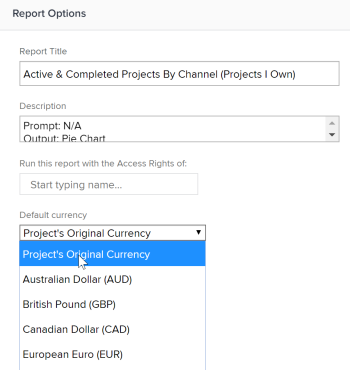

# Erstellen von Finanzdatenberichten mit eindeutigen Wechselkursen

Wenn in Adobe Workfront mehrere Wechselkurse konfiguriert wurden, können Sie Finanzwerte in Berichten und Listen so festlegen, dass sie in einer anderen Währung als der Standardwährung angezeigt werden.

>[!IMPORTANT]
>
>Wenn Sie in einer Ansicht eine andere Währung als die Standardwährung auswählen, werden die Links &quot;**Weitere Aufgaben hinzufügen**&quot;und &quot;**Weitere Probleme hinzufügen**&quot;nicht mehr unten in der Projektliste angezeigt.

Informationen zum Ändern der Standardwährung für ein bestimmtes Projekt finden Sie unter [Ändern der Projektwährung](../../../manage-work/projects/project-finances/change-project-currency.md).

Wenn es im Bericht Projekte mit einer einheitlichen Währung gibt, werden die Summen in Gruppierungen auch in der Standardwährung des Systems angezeigt.

## Zugriffsanforderungen

Sie müssen über folgenden Zugriff verfügen, um die Schritte in diesem Artikel ausführen zu können:

<table style="table-layout:auto"> 
 <col> 
 <col> 
 <tbody> 
  <tr> 
   <td role="rowheader">Adobe Workfront-Plan*</td> 
   <td> 
Alle
 </td> 
  </tr> 
  <tr> 
   <td role="rowheader">Adobe Workfront-Lizenz*</td> 
   <td> 
Plan 
 </td> 
  </tr> 
  <tr> 
   <td role="rowheader">Konfigurationen auf Zugriffsebene*</td> 
   <td> 
Zugriff auf Berichte, Dashboards und Kalender bearbeiten
 
Zugriff auf Filter, Ansichten, Gruppierungen bearbeiten
 
Hinweis: Wenn Sie immer noch keinen Zugriff haben, fragen Sie Ihren Workfront-Administrator, ob er zusätzliche Zugriffsbeschränkungen für Ihre Zugriffsebene festlegt. Informationen dazu, wie ein Workfront-Administrator Ihre Zugriffsebene ändern kann, finden Sie unter <a href="../../../administration-and-setup/add-users/configure-and-grant-access/create-modify-access-levels.md" class="MCXref xref">Benutzerdefinierte Zugriffsebenen erstellen oder ändern</a>.
 </td> 
  </tr> 
  <tr> 
   <td role="rowheader">Objektberechtigungen</td> 
   <td> 
Berechtigungen für einen Bericht verwalten
 
Weitere Informationen zum Anfordern von zusätzlichem Zugriff finden Sie unter <a href="../../../workfront-basics/grant-and-request-access-to-objects/request-access.md" class="MCXref xref">Anfordern des Zugriffs auf Objekte </a>.
 </td> 
  </tr> 
 </tbody> 
</table>

&#42;Wenden Sie sich an Ihren Workfront-Administrator, um zu erfahren, welchen Plan, welchen Lizenztyp oder welchen Zugriff Sie haben.

## Voraussetzungen

Bevor Sie alternative Währungen wie in diesem Abschnitt beschrieben anzeigen können, muss der Workfront-Administrator zunächst mehrere Währungen im Setup-Bereich von Workfront aktivieren und konfigurieren. Weitere Informationen finden Sie unter [Einrichten von Wechselkursen](../../../administration-and-setup/manage-workfront/exchange-rates/set-up-exchange-rates.md).

## Anwenden von Finanzwerten auf einen Bericht {#apply-financial-values-to-a-report}

So konvertieren Sie bei der Arbeit mit Berichten Finanzwerte zwischen Währungen:

1. Gehen Sie zum Bericht, in den Sie Finanzwerte in eine andere Währung konvertieren möchten.
1. Klicken Sie auf die Dropdownliste **Anzeigen**, klicken Sie auf **Währung ändern** und wählen Sie dann eine der folgenden Währungen aus, in denen Finanzwerte angezeigt werden sollen:

   * Originalwährung des Projekts
   * Eine der anderen Währungen

     >[!TIP]
     >
     >Sie können nur die Währungen auswählen, die zuvor in der Einrichtung ausgewählt wurden.

   Mit dieser Option können Sie Finanzwerte in einem Bericht schnell zwischen den Kurswerten konvertieren.

   

   <!--
   
(NOTE: drafted this tip because I think this is confusing; this is in the step above.)

   -->

   <!--
   <note type="tip">
   You can also select the Change Currency option to convert financial values in other lists.
    
   
    
    
   </note>
   -->

## Anzeigen der Standardwährung für mehrere Projekte mit unterschiedlichen Währungen

Wenn Sie die Währung auf Projektebene anpassen und Informationen aus allen Projekten im selben Bericht anzeigen möchten, gibt es die folgenden Szenarien:

* Wenn Sie einen Bericht erstellen, der Finanzinformationen aus zwei oder mehr Projekten mit unterschiedlichen Währungen enthält, spiegelt die Gruppierungszusammenfassung standardmäßig die Standardwährung des Systems wider, die vom Workfront-Administrator ausgewählt wurde.
* Wenn Sie einen Bericht für zwei oder mehr Projekte erstellen, die dieselbe Währung haben, aber von der Standardwährung des Systems abweichen, werden die Summen in den Gruppierungen unter Verwendung der Standardwährung des Systems angezeigt.
* Wenn Sie einen Bericht für zwei oder mehr Projekte erstellen, denen mit einer Währungsüberschreibung eine Aufgabenrollenzuweisung zugeordnet ist, wandelt Workfront die Finanzinformationen aus den überschriebenen Währungskursen der Auftragsrolle entweder in die Projektwährung (wenn Sie in der Ansicht die Originalwährung des Projekts auswählen) oder in eine andere Währung um, die Sie beim Anzeigen des Berichts auswählen. Weitere Informationen zum Überschreiben der Währung einer Auftragsrolle finden Sie unter [Erstellen und Verwalten von Auftragsrollen](../../../administration-and-setup/set-up-workfront/organizational-setup/create-manage-job-roles.md).

So zeigen Sie zwei Projekte mit benutzerdefinierten Währungen in einem Bericht an:

1. Erstellen Sie zwei Projekte mit unterschiedlichen Währungen.

   

1. Melden Sie Stunden für beide Projekte an.

   Weitere Informationen zur Protokollierungszeit finden Sie unter [Protokollzeit](../../../timesheets/create-and-manage-timesheets/log-time.md).

1. Klicken Sie auf das Symbol **Hauptmenü**  und dann auf **Berichterstellung**.
1. Klicken Sie auf **Neuer Bericht** und dann auf **Projektbericht**.
1. Fügen Sie auf der Registerkarte **Spalten (Ansicht)** die Spalte **Tatsächliche Kosten** hinzu und fassen Sie sie anhand von **Summe** zusammen.

   Informationen zum Erstellen einer Spalte finden Sie unter [Übersicht über Ansichten in Adobe Workfront](../../../reports-and-dashboards/reports/reporting-elements/views-overview.md).

1. Wenden Sie auf der Registerkarte **Gruppierungen** eine Gruppierung des Typs **Vorgesehenes Abschlussdatum** an.

   Informationen zum Erstellen einer Gruppierung finden Sie unter [Gruppierungsübersicht in Adobe Workfront](../../../reports-and-dashboards/reports/reporting-elements/groupings-overview.md).

1. Fügen Sie auf der Registerkarte **Filter** einen Filter für **Projektname** hinzu und wählen Sie die beiden Projekte mit den verschiedenen Währungen aus.

   Informationen zum Erstellen eines Filters finden Sie unter [Filterübersicht](../../../reports-and-dashboards/reports/reporting-elements/filters-overview.md).

1. Klicken Sie auf **Speichern + schließen**.

   Die Gesamtsumme der **tatsächlichen Kosten** wird in der Gruppierung unter Verwendung der Standardwährung des Systems angezeigt, unabhängig von der Währung der Projekte im Bericht.

   

   Wenn die beiden Projekte unterschiedliche Währungen haben, wird die Standardwährung des Systems auch in der Gruppierung des Berichts angezeigt.

## Anzeigen der Projektwährung in einem Bericht auf Projektebene

Wenn eine Gruppierung auf eine Aufgaben- oder Stundenliste innerhalb eines Projekts angewendet wird, werden die Summen in der Gruppierung in der Währung des Projekts angezeigt.

1. Erstellen Sie ein Projekt mit einer benutzerdefinierten Währung, die sich von der Standardwährung des Systems unterscheidet.
1. Wechseln Sie zum Projekt und stellen Sie sicher, dass es Stunden enthält, die für Aufgaben protokolliert wurden.

   Weitere Informationen zur Protokollierungszeit finden Sie unter [Protokollzeit](../../../timesheets/create-and-manage-timesheets/log-time.md).

   >[!NOTE]
   >
   >Die Aufgaben sollten Benutzern oder Auftragsrollen mit Kostensätzen pro Stunde zugewiesen werden.

1. Klicken Sie auf **Aufgaben**.
1. Erweitern Sie das Dropdownmenü **Ansicht** und wählen Sie **Neue Ansicht** aus.
1. Fügen Sie **Tatsächliche Kosten** in die neue Ansicht als neue Spalte ein und fassen Sie sie anhand von **Summe** zusammen.
1. Klicken Sie auf **Fertig** und dann auf **Ansicht speichern**.
1. Erweitern Sie das Dropdownmenü **Gruppierung** und wählen Sie **Neue Gruppierung** aus.
1. Fügen Sie **Tatsächliches Abschlussdatum** in der neuen Gruppierung als neues Feld hinzu und klicken Sie dann auf **Gruppierung speichern**.

   Die Spalte **Tatsächliche Kosten** fasst die neue Gruppierung zusammen und zeigt die Gesamtsumme in der Währung des Projekts an.

## Berichte mit eindeutigen Währungen bearbeiten

Die Finanzfelder in einem Bericht können erst bearbeitet werden, wenn Sie die Berichtseinstellung so ändern, dass die ursprüngliche Währung für Projekte angezeigt wird.

So bearbeiten Sie ein Finanzfeld in einem Bericht:

1. Navigieren Sie zu einem Bericht.

   >[!NOTE]
   >
   >Wenn die Standardwährung für eine Liste in keinem anderen Bereich angezeigt wird, können Sie die Ansicht bearbeiten, um die Standardwährung anzuzeigen.\
   >Informationen zum Ändern der Währung in einer Ansicht finden Sie im Abschnitt in diesem Artikel [Anwenden von Finanzwerten auf einen Bericht](#apply-financial-values-to-a-report).

1. Klicken Sie auf **Berichtaktionen** und wählen Sie dann **Bearbeiten** aus.
1. Klicken Sie auf **Berichtseinstellungen**.
1. Klicken Sie auf die Dropdownliste **Standardwährung** und wählen Sie dann die Originalwährung des Projekts **3} aus.**

   

1. Klicken Sie auf **Fertig**.
