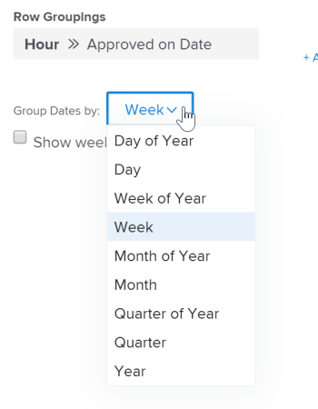

# Erstellen eines Matrix-Berichts

Matrix-Berichte präsentieren zusammenfassende Informationen in aggregierter Tabellenform, wodurch die Anzeige einfacher wird, als wenn sie in einer Liste wie in einem herkömmlichen Bericht angezeigt würden.

## Verwendung eines Matrixberichts

Sie können für jeden Bericht, der zwei oder mehr Gruppierungen enthält, einen Matrixbericht erstellen. Ein herkömmlicher Bericht kann bis zu 3 Gruppierungen enthalten, und ein Matrixbericht kann bis zu 4 Gruppierungen enthalten.

Beispiel: Sie möchten einen Stundenbericht erstellen, der die während eines Zeitraums von drei Monaten protokollierten Stunden ausgibt, und Sie möchten, dass der Bericht nach dem Eintritt der Stunden sowie nach Monat und Woche organisiert ist.

## Anzeige von Daten in einem Matrixbericht

Informationen im Matrixbericht werden immer als numerischer Wert angezeigt. In den meisten Fällen sind Spalten mit einem numerischen Wert am besten für die Anzeige in einem Matrixbericht geeignet (z. B. protokollierte Stunden und Istkosten).

Andere Spalten (z. B. Status ) können jedoch weiterhin im Matrixbericht angezeigt werden, wie in der folgenden Grafik dargestellt:\

## Zugriffsanforderungen

+++ Erweitern Sie , um die Zugriffsanforderungen für die -Funktion in diesem Artikel anzuzeigen.

Sie müssen über folgenden Zugriff verfügen, um die Schritte in diesem Artikel ausführen zu können:

<table style="table-layout:auto"> 
 <col> 
 <col> 
 <tbody> 
  <tr> 
   <td role="rowheader">Adobe Workfront-Plan*</td> 
   <td> 
Beliebig
 </td> 
  </tr> 
  <tr> 
   <td role="rowheader">Adobe Workfront-Lizenz*</td> 
      <td> 
      
Neu:

         <ul>
         <li>
Standard
</li>
         </ul>
      
Aktuell:

         <ul>
         <li>
Plan
</li>
         </ul>
   </td>
  </tr> 
  <tr> 
   <td role="rowheader">Konfigurationen der Zugriffsebene*</td> 
   <td>
Zugriff auf Berichte, Dashboards, Kalender bearbeiten
 
Zugriff auf Filter, Ansichten, Gruppierungen bearbeiten
</td> 
  </tr> 
  <tr> 
   <td role="rowheader">Objektberechtigungen</td> 
   <td> 
Verwalten von Berechtigungen für einen Bericht
</td> 
  </tr> 
 </tbody> 
</table>

*Weitere Informationen finden Sie unter [Zugriffsanforderungen in der Dokumentation zu Workfront](/help/quicksilver/administration-and-setup/add-users/access-levels-and-object-permissions/access-level-requirements-in-documentation.md).

+++

## Matrixbericht einrichten

1. Erstellen Sie einen herkömmlichen Bericht, der numerische Daten in der Berichtsausgabe enthält.\
   Informationen zum Erstellen eines Berichts finden Sie unter [Erstellen eines benutzerdefinierten Berichts](../../../reports-and-dashboards/reports/creating-and-managing-reports/create-custom-report.md).

1. Wechseln Sie zu dem Bericht, den Sie in Schritt 1 erstellt haben, klicken Sie auf **Berichtsaktionen** und wählen Sie dann **Bearbeiten** aus.

1. (Bedingt) Wenn Sie eine Ansicht bereits erstellt haben und Sie sie auf diesen Bericht anwenden möchten, klicken Sie auf **Vorhandene Ansicht anwenden** und wählen Sie dann die Ansicht aus der Dropdown-Liste aus.
1. (Bedingt) Wenn Sie eine neue Ansicht für den Bericht erstellen möchten, führen Sie die folgenden Schritte aus:

   1. Klicken Sie auf **Spalten (Ansicht)** und wählen Sie dann eine Spalte aus, die Sie im Matrixbericht zusammenfassen möchten.
   1. Klicken Sie im Bereich **Spalteneinstellungen** auf die Dropdown-Liste **Diese Spalte zusammenfassen nach** und wählen Sie dann eine der verfügbaren Optionen für die Zusammenfassung der Informationen aus.

      >[!IMPORTANT]
      >
      >Wenn diese Option nicht ausgewählt ist, werden die Informationen aus der Spalte im Matrixbericht nicht korrekt angezeigt.

      

   1. Wiederholen Sie diesen Vorgang für jede Spalte auf der Registerkarte Spalten (Ansicht) und klicken Sie dann auf **Fertig**.

1. Klicken Sie auf **Registerkarte** Gruppierungen“.
1. (Bedingt) Wenn Sie eine Gruppierung bereits erstellt haben und Sie sie auf diesen Bericht anwenden möchten, klicken Sie auf **Vorhandene Gruppierung anwenden** und wählen Sie die Gruppierung dann aus der Dropdown-Liste aus.
1. (Bedingt) Wenn Sie eine neue Gruppierungsmatrix für den Bericht erstellen möchten, führen Sie die folgenden Schritte aus:

   1. Wählen **Zu Matrix-Gruppierung wechseln** in der oberen rechten Ecke der Builder-Benutzeroberfläche aus.
   1. Identifizieren Sie **Abschnitt &quot;**&quot; die Zeilengruppierung, die die horizontalen Gruppierungen der Tabelle festlegt.
   1. (Optional) Um eine zusätzliche Zeilengruppierung hinzuzufügen, klicken Sie auf **Sekundäre Zeilengruppierung hinzufügen**.
   1. Geben Sie im Abschnitt **Spaltengruppierungen** die Spaltengruppierung an, die die vertikalen Gruppierungen der Tabelle festlegt.
   1. (Optional) Um eine zusätzliche Spaltengruppierung hinzuzufügen, klicken Sie auf **Sekundäre Spaltengruppierung hinzufügen**.
   1. (Bedingt) Wenn Sie eine Gruppierung nach Datum hinzufügen, geben Sie auch an, ob die Ergebnisse nach Tag, Woche, Monat, Quartal oder Jahr gruppiert werden sollen.\
      

   1. (Bedingt) Wenn Sie beispielsweise ausgewählt haben, dass die Ergebnisse nach Datum gruppiert und nach Quartal angezeigt werden sollen, geben Sie an, ob Quartale ohne Daten angezeigt werden sollen, indem Sie das Kontrollkästchen **Quartale ohne Ergebnisse anzeigen** aktivieren.\
      

      >[!NOTE]
      >
      >Das Feld **Quartale ohne Ergebnisse anzeigen** ist nur für Matrixgruppierungen verfügbar, nicht für Standardgruppierungen.\
      >Nur Quartale ohne Daten, die sich zwischen zwei Quartalen mit gültigen Daten befinden, zeigen Null für die Datenwerte auf der Registerkarte Matrix an. Die Quartale, die keine Daten haben, die am Anfang und am Ende des von Ihrem Filter ausgewählten Zeitrahmens liegen, werden überhaupt nicht in der Matrixgruppierung angezeigt. Die Quartale ohne Ergebnisse werden nicht in einer Gruppierung auf der Registerkarte Details des Berichts angezeigt.

1. (Optional und bedingt) Klicken Sie **Matrixeinstellungen** und wählen Sie dann eine der folgenden Optionen aus:\
   **Anzahl der Einträge anzeigen:** Wählen Sie diese Option, um eine Zeile mit der Gesamtzahl der Einträge für das jeweilige Feld anzuzeigen.\
   **Wertspalte anzeigen** Wählen Sie diese Option, um die folgenden Informationen in der Matrix anzuzeigen:

   * Anzahl der Einträge
   * Die Spalte Wert

     >[!NOTE]
     >
     >Diese Spalte enthält Informationen, die beschreiben, was die Daten in den einzelnen Zeilen darstellen.\
     >Die folgenden Ausnahmen gelten für übergeordnete Objekte (z. B. übergeordnete Aufgaben), wenn Sie Werte für die folgenden Felder in Gruppierungen aggregieren:
     >
     >   
     >   
     >   * Alle Zahlen- und Währungsfelder mit Ausnahme der tatsächlichen Stunden (z. B. geplante/Ist-Arbeitskosten, geplante/Ist-Ausgaben-Kosten, geplante/Ist-Kosten, geplante Stunden) aggregieren nur die Werte für die untergeordneten Aufgaben und eigenständigen Aufgaben. Sie aggregieren nicht die Werte für die übergeordneten Aufgaben oder die übergeordneten Aufgaben.
     >   * Tatsächliche Stunden aggregieren die Werte für die übergeordnete Hauptaufgabe und die eigenständigen Aufgaben. Sie aggregieren nicht die Zahlen für die übergeordneten Aufgaben oder die untergeordneten Aufgaben.
     >   * Benutzerdefinierte Datenfelder für Zahlen- und Währungswerte aggregieren alle Aufgaben: Eltern, Kinder, Eltern von Eltern und eigenständige Aufgaben. Wenn Sie den Matrixbericht erstellt haben, um die geplanten Stunden oder tatsächlichen Stunden in der Spalte **Wert** anzuzeigen, beachten Sie, dass Stunden- oder Kosteninformationen für alle übergeordneten Objekte (z. B. übergeordnete Aufgaben) nicht im Matrixbericht angezeigt werden. Um Stunden für übergeordnete Objekte anzuzeigen, müssen Sie die Registerkarte **Details** anzeigen.
     >   
     >   
     >

   **Bedingte Regeln:** Richten Sie Formatierungsregeln für aggregierte Werte ein.\
   Nachdem Sie eine Regel hinzugefügt haben, können Sie Feld- und Textstile dafür definieren, wie Felder, die dieser Regel entsprechen, angezeigt werden. Klicken Sie **Regel hinzufügen** nachdem Sie die Regel definiert haben, und klicken Sie dann auf **Fertig**, um die Regel zu speichern.

1. Klicken Sie auf **Filter**, um festzulegen, welche Informationen im Bericht angezeigt werden.
1. (Bedingt) Wenn Sie bereits einen Filter erstellt haben und Sie ihn auf diesen Bericht anwenden möchten, klicken Sie auf **Vorhandenen Filter anwenden** und wählen Sie dann den Filter aus der Dropdown-Liste aus.
1. (Bedingt) Wenn Sie einen neuen Filter für diesen Bericht erstellen möchten, finden Sie weitere Informationen unter [Filter und Bedingungsmodifikatoren](../../../reports-and-dashboards/reports/reporting-elements/filter-condition-modifiers.md)

   <!--
   <MadCap:conditionalText data-mc-conditions="QuicksilverOrClassic.Draft mode">
   and
   <a href="../../../reports-and-dashboards/reports/reporting-elements/advanced-filter-condition-qualifiers.md" class="MCXref xref">Advanced Filter and condition qualifiers </a>
   </MadCap:conditionalText>
   -->

   für Informationen zu den verschiedenen Kriterien, die Sie beim Erstellen von Filtern verwenden können.

1. Klicken Sie **Speichern+Schließen**, um den Matrixbericht zu speichern und anzuzeigen.
