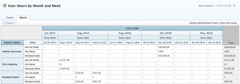
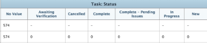
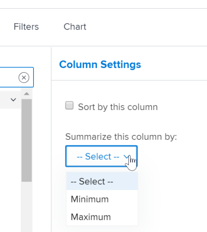
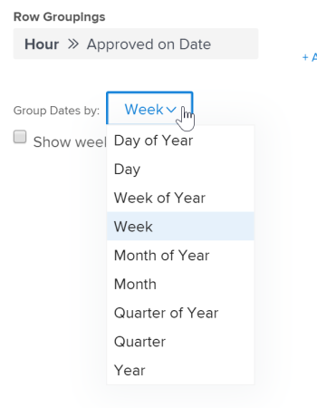
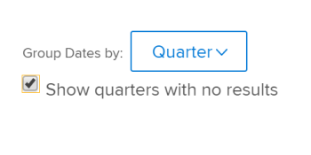

# Erstellen eines Matrix-Berichts

Matrixberichte enthalten zusammenfassende Informationen in einem aggregierten Tabellenformat, sodass sie leichter anzuzeigen sind, als wenn sie in einer Liste wie in einem herkömmlichen Bericht angezeigt würden.

## Verwendung eines Matrixberichts

Sie können einen Matrixbericht für jeden Bericht erstellen, der zwei oder mehr Gruppierungen enthält. Ein herkömmlicher Bericht kann bis zu drei Gruppierungen enthalten, ein Matrixbericht bis zu vier Gruppierungen.

Sie möchten z. B. einen Stundenbericht erstellen, der die protokollierten Stunden während eines dreimonatigen Zeitraums anzeigt, und Sie möchten, dass der Bericht danach organisiert wird, wer die Stunden eingegeben hat, sowie nach Monat und Woche.

## Wie Daten in einem Matrixbericht angezeigt werden

Informationen im Matrixbericht werden immer als numerischer Wert angezeigt. In den meisten Fällen sind Spalten, die einen numerischen Wert enthalten, am besten für die Anzeige in einem Matrixbericht geeignet (z. B. protokollierte Stunden und tatsächliche Kosten).

Andere Spalten (z. B. Status) können jedoch weiterhin im Matrixbericht angezeigt werden, wie in der folgenden Grafik dargestellt:\

## Zugriffsanforderungen

+++ Erweitern, um die Zugriffsanforderungen für die in diesem Artikel beschriebene Funktionalität anzuzeigen. 

<table style="table-layout:auto"> 
 <col> 
 <col> 
 <tbody> 
  <tr> 
   <td role="rowheader">Adobe Workfront-Paket</td> 
   <td> 
Beliebig
 </td> 
  </tr> 
  <tr> 
   <td role="rowheader">Adobe Workfront-Lizenz</td> 
   <td> 
      
Standard

      
Plan

   </td>
  </tr> 
  <tr> 
   <td role="rowheader">Konfiguration auf Zugriffsebene</td> 
   <td> 
Zugriff auf Berichte, Dashboards, Kalender bearbeiten
 
Bearbeitungszugriff auf Filter, Ansichten, Gruppierungen
 </td> 
  </tr> 
  <tr> 
   <td role="rowheader">Objektberechtigungen</td> 
 <td> 
Berechtigungen für einen Bericht verwalten
</td>  
  </tr> 
 </tbody> 
</table>

Weitere Details zu den Informationen in dieser Tabelle finden Sie unter [Zugriffsanforderungen in der Dokumentation zu Workfront](/help/quicksilver/administration-and-setup/add-users/access-levels-and-object-permissions/access-level-requirements-in-documentation.md).

+++

## Einrichten eines Matrixberichts

1. Erstellen Sie einen herkömmlichen Bericht, der numerische Daten in der Berichtsausgabe enthält.\
   Informationen zum Erstellen eines Berichts finden Sie unter [Erstellen eines benutzerdefinierten Berichts](../../../reports-and-dashboards/reports/creating-and-managing-reports/create-custom-report.md).

1. Wechseln Sie zu dem Bericht, den Sie in Schritt 1 erstellt haben, klicken Sie auf **Berichtsaktionen**, und wählen Sie dann **Bearbeiten**.

1. (Bedingt) Wenn Sie bereits eine Ansicht erstellt haben und diese auf diesen Bericht anwenden möchten, klicken Sie auf **Vorhandene Ansicht anwenden** und wählen Sie dann die Ansicht aus der Dropdownliste aus.
1. (Bedingt) Wenn Sie eine neue Ansicht für den Bericht erstellen möchten, führen Sie die folgenden Schritte aus:

   1. Klicken Sie auf die Registerkarte **Spalten (Ansicht)** und wählen Sie dann eine Spalte aus, die Sie im Matrixbericht zusammenfassen möchten.
   1. Klicken Sie im Bereich **Spalteneinstellungen** auf die Dropdownliste **Diese Spalte zusammenfassen nach**, und wählen Sie dann eine der verfügbaren Optionen zum Zusammenfassen der Informationen aus.

      >[!IMPORTANT]
      >
      >Wenn diese Option nicht aktiviert ist, werden die Informationen aus der Spalte im Matrixbericht nicht korrekt angezeigt.

      

   1. Wiederholen Sie diesen Vorgang für jede Spalte auf der Registerkarte &quot;Spalten (Ansicht)&quot; und klicken Sie dann auf **Fertig**.

1. Klicken Sie auf die Registerkarte **Gruppierungen**.
1. (Bedingt) Wenn Sie bereits eine Gruppierung erstellt haben und diese auf diesen Bericht anwenden möchten, klicken Sie auf **Vorhandene Gruppierung anwenden**, und wählen Sie dann die Gruppierung aus der Dropdownliste aus.
1. (Bedingt) Wenn Sie eine neue Matrixgruppierung für den Bericht erstellen möchten, führen Sie die folgenden Schritte aus:

   1. Wählen Sie **Zu Matrixgruppierung wechseln** in der oberen rechten Ecke der Builder-Schnittstelle aus.
   1. Identifizieren Sie im Abschnitt **Zeilengruppierungen** die Zeilengruppierung, die die horizontalen Gruppierungen der Tabelle festlegt.
   1. (Optional) Klicken Sie auf **Sekundäre Zeilengruppierung hinzufügen**, um eine zusätzliche Zeilengruppierung hinzuzufügen.
   1. Identifizieren Sie im Abschnitt **Spaltengruppierungen** die Spaltengruppierung, die die vertikalen Gruppierungen der Tabelle festlegt.
   1. (Optional) Um eine zusätzliche Spaltengruppierung hinzuzufügen, klicken Sie auf **Sekundäre Spaltengruppierung hinzufügen**.
   1. (Bedingt) Wenn Sie eine Gruppierung nach Datum hinzufügen, geben Sie auch an, ob die Ergebnisse nach Tag, Woche, Monat, Quartal oder Jahr gruppiert sind.\
      

   1. (Bedingt) Wenn Sie beispielsweise ausgewählt haben, nach Datum zu gruppieren und Ergebnisse nach Quartal anzuzeigen, geben Sie an, ob Quartale ohne Daten angezeigt werden sollen, indem Sie das Kontrollkästchen **Quartale ohne Ergebnisse anzeigen** aktivieren.\
      

      >[!NOTE]
      >
      >Das Feld **Quartale ohne Ergebnisse anzeigen** ist nur für Matrixgruppierungen verfügbar, nicht aber für Standardgruppierungen.\
      >Nur die Quartale ohne Daten, die sich zwischen zwei Quartalen mit gültigen Daten befinden, zeigen Null für die Datenwerte auf der Registerkarte &quot;Matrix&quot; an. Die Quartale ohne Daten, die sich am Anfang und am Ende des vom Filter ausgewählten Zeitrahmens befinden, werden in der Matrixgruppierung überhaupt nicht angezeigt. Quartale ohne Ergebnisse werden nicht in einer Gruppe auf der Registerkarte Details des Berichts angezeigt.

1. (Optional und bedingt) Klicken Sie auf **Matrixeinstellungen** und wählen Sie dann eine der folgenden Optionen aus:\
   **Datensatzzähler anzeigen:** Wählen Sie diese Option aus, um eine Zeile mit der Gesamtanzahl von Einträgen für das angegebene Feld anzuzeigen.\
   **Wertespalte anzeigen:** Wählen Sie diese Option aus, um die folgenden Informationen in der Matrix anzuzeigen:

   * Rekordanzahl
   * Die Spalte &quot;Wert&quot;

     >[!NOTE]
     >
     >Diese Spalte enthält Informationen, die beschreiben, was die Daten in den einzelnen Zeilen darstellen.\
     >Die folgenden Ausnahmen gelten für übergeordnete Objekte (z. B. übergeordnete Vorgänge), wenn Sie Werte für die folgenden Felder in Gruppierungen aggregieren:
     >
     >   
     >   
     >   * Alle Zahlen- und Währungsfelder außer &quot;Aktuelle Stunden&quot; (z. B. &quot;Geplante/Ist-Arbeitskosten&quot;, &quot;Geplante/Ist-Kosten&quot;, &quot;Geplante/Ist-Kosten&quot;, &quot;Geplante Stunden&quot;) aggregieren nur die Werte für die untergeordneten Vorgänge und eigenständigen Vorgänge. Sie aggregieren nicht die Werte für die übergeordneten Aufgaben oder übergeordneten Aufgaben der übergeordneten Elemente.
     >   * Aktuelle Stunden aggregieren die Werte für die übergeordneten und die eigenständigen Hauptaufgaben. Sie aggregieren nicht die Zahlen für die übergeordneten oder untergeordneten Aufgaben.
     >   * Benutzerdefinierte Datenfelder für Zahlen- und Währungswerte aggregieren alle Vorgänge: übergeordnete Elemente, untergeordnete Elemente, übergeordnete Elemente von übergeordneten Elementen und eigenständige Vorgänge. Wenn Sie den Matrixbericht erstellt haben, um geplante Stunden oder aktuelle Stunden in der Spalte **Wert** anzuzeigen, beachten Sie, dass Stunden- oder Kosteninformationen für übergeordnete Objekte (z. B. übergeordnete Aufgaben) nicht im Matrixbericht angezeigt werden. Um Stunden für übergeordnete Objekte anzuzeigen, müssen Sie die Registerkarte **Details** anzeigen.
     >   
     >   
     >

   **Bedingte Regeln:** Richten Sie Formatierungsregeln für aggregierte Werte ein.\
   Nachdem Sie eine Regel hinzugefügt haben, können Sie Feld- und Textformate definieren, die festlegen, wie Felder angezeigt werden, die mit dieser Regel übereinstimmen. Klicken Sie auf **Regel hinzufügen**, nachdem Sie die Definition der Regel abgeschlossen haben, und **Fertig**, um die Regel zu speichern.

1. Klicken Sie auf die Registerkarte **Filter**, um festzulegen, welche Informationen im Bericht angezeigt werden.
1. (Bedingt) Wenn Sie bereits einen Filter erstellt haben und ihn auf diesen Bericht anwenden möchten, klicken Sie auf **Vorhandenen Filter anwenden** und wählen Sie dann den Filter aus der Dropdownliste aus.
1. (Bedingt) Informationen zum Erstellen eines neuen Filters für diesen Bericht finden Sie unter [Filter und Bedingungsmodifizierer](../../../reports-and-dashboards/reports/reporting-elements/filter-condition-modifiers.md).

   <!--
   <MadCap:conditionalText data-mc-conditions="QuicksilverOrClassic.Draft mode">
   and
   <a href="../../../reports-and-dashboards/reports/reporting-elements/advanced-filter-condition-qualifiers.md" class="MCXref xref">Advanced Filter and condition qualifiers </a>
   </MadCap:conditionalText>
   -->

   für Informationen zu den verschiedenen Qualifizierern, die Sie beim Erstellen von Filtern verwenden können.

1. Klicken Sie auf **Speichern+Schließen**, um den Matrixbericht zu speichern und anzuzeigen.
