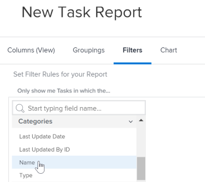

# Referenzieren eines benutzerdefinierten Formulars in einem Bericht

<!-- Audited: 11/2024 -->

Sie können die benutzerdefinierten Formulare eines Objekts in den Ansichten, Filtern und Gruppierungen eines Berichts für dieses Objekt referenzieren.

Sie können auf den Inhalt von benutzerdefinierten Formularen verweisen, die in einen Bericht aufgenommen werden sollen, oder Sie können auf Informationen über die benutzerdefinierten Formulare selbst verweisen, die in einen Bericht aufgenommen werden sollen.

## Zugriffsanforderungen

+++ Erweitern Sie , um die Zugriffsanforderungen für die -Funktion in diesem Artikel anzuzeigen.

Sie müssen über folgenden Zugriff verfügen, um die Schritte in diesem Artikel ausführen zu können:

<table style="table-layout:auto"> 
 <col> 
 <col> 
 <tbody> 
  <tr> 
   <td role="rowheader">Adobe Workfront-Plan*</td> 
   <td> 
Beliebig
 </td> 
  </tr> 
  <tr> 
   <td role="rowheader">Adobe Workfront-Lizenz*</td> 
      <td> 
      
Neu:

         <ul>
         <li>
Standard
</li>
         </ul>
      
Aktuell:

         <ul>
         <li>
Plan
</li>
         </ul>
   </td>
  </tr> 
  <tr> 
   <td role="rowheader">Konfigurationen der Zugriffsebene*</td> 
   <td> 
Zugriff auf Berichte, Dashboards, Kalender bearbeiten
 
Zugriff auf Filter, Ansichten, Gruppierungen bearbeiten
</td> 
  </tr> 
  <tr> 
   <td role="rowheader">Objektberechtigungen</td> 
   <td> 
Verwalten von Berechtigungen für einen Bericht
</td> 
  </tr> 
 </tbody> 
</table>

*Weitere Informationen finden Sie unter [Zugriffsanforderungen in der Dokumentation zu Workfront](/help/quicksilver/administration-and-setup/add-users/access-levels-and-object-permissions/access-level-requirements-in-documentation.md).

+++

## Voraussetzungen

Das benutzerdefinierte Formular muss vorhanden sein, damit Sie in einem Bericht darauf verweisen können.

Weitere Informationen zum Erstellen benutzerdefinierter Formulare finden Sie unter [Erstellen eines benutzerdefinierten Formulars](/help/quicksilver/administration-and-setup/customize-workfront/create-manage-custom-forms/form-designer/design-a-form/design-a-form.md).

## Referenzieren des Inhalts von benutzerdefinierten Formularen

Sie können auf Felder in benutzerdefinierten Formularen verweisen. Nachdem ein benutzerdefiniertes Formular auf ein Objekt angewendet wurde, können alle mit diesem benutzerdefinierten Formular verknüpften Felder in einem Bericht wie jedes andere Feld im Objekt referenziert werden.

>[!NOTE]
>
>Für Felder mit mehreren Optionen sind alle Optionen in den Filtern und Eingabeaufforderungen des Berichts verfügbar, einschließlich ausgeblendeter Optionen.\
>Weitere Informationen zum Ausblenden von Auswahlmöglichkeiten in einem benutzerdefinierten Feld mit mehreren Optionen finden Sie im Artikel [Erstellen eines benutzerdefinierten Formulars](/help/quicksilver/administration-and-setup/customize-workfront/create-manage-custom-forms/form-designer/design-a-form/design-a-form.md).

Verwenden Sie beim Erstellen des Berichts einfach den Objekttyp des Formulars als Feldquelle und verwenden Sie den Namen des benutzerdefinierten Felds als Feldnamen.

Beispielsweise könnte ein benutzerdefiniertes Formular auf alle Projekte angewendet werden, das das benutzerdefinierte Feld (**)**. Um einen Bericht zu erstellen, der alle Projekte auflistet, bei denen Olivia Kim Beraterin ist, verwenden Sie **Objekttyp** Projekt“ als Feldquelle und verwenden Sie **Berater** als Feldnamen. Setzen Sie den Filterqualifizierer auf **Gleich** und geben Sie dann Olivia Kim ein.

Weitere Informationen zum Erstellen eines Berichts finden Sie im Artikel [Erstellen eines benutzerdefinierten Berichts](../../../reports-and-dashboards/reports/creating-and-managing-reports/create-custom-report.md).

## Referenzinformationen zu benutzerdefinierten Formularen

Sie können auf Informationen über benutzerdefinierte Formulare verweisen, wie z. B. den Namen aller benutzerdefinierten Formulare, die mit einem Objekt verknüpft sind.

&#x200B;Je nach Element (Ansicht, Filter oder Gruppierung) können Sie auf Folgendes verweisen:

* Das primäre benutzerdefinierte Formular, das auf ein Objekt angewendet wird:

  Dies ist das Formular, das zuerst auf der Detailseite des -Objekts angezeigt wird.

* Alle benutzerdefinierten Formulare (wenn mehr als ein benutzerdefiniertes Formular auf ein Objekt angewendet wird)

Sie können benutzerdefinierte Formulare für Ansichten, Filter und Gruppierungen referenzieren:

* [Referenzieren von benutzerdefinierten Formularen in einer Berichtsansicht (Spalte)](#reference-custom-forms-in-a-report-view-column)
* [Verweisen auf benutzerdefinierte Formulare in einem Berichtsfilter](#reference-custom-forms-in-a-report-filter)
* [Referenzieren benutzerdefinierter Formulare in einer Berichtsgruppierung](#reference-custom-forms-in-a-report-grouping)

### Referenzieren benutzerdefinierter Formulare in einer Berichtsansicht (Spalte) {#reference-custom-forms-in-a-report-view-column}

So zeigen Sie alle benutzerdefinierten Formulare an, die mit einem Objekt verknüpft sind:

1. Beginnen Sie mit der Erstellung eines Berichts, wie im Artikel [Erstellen eines benutzerdefinierten Berichts](../../../reports-and-dashboards/reports/creating-and-managing-reports/create-custom-report.md) beschrieben.
1. Erweitern Sie auf **Registerkarte** den Objekttyp, auf den das benutzerdefinierte Formular angewendet wird, auf das Sie verweisen möchten, und klicken Sie dann auf **Kategoriename**.\
   Um beispielsweise alle benutzerdefinierten Formulare anzuzeigen, die mit einer Aufgabe verknüpft sind, erweitern Sie die Feldquelle **Aufgabe** und klicken Sie dann auf den Feldnamen **Kategoriename**.\
   

So zeigen Sie nur das primäre benutzerdefinierte Formular an, das mit dem -Objekt verknüpft ist:

1. Beginnen Sie mit der Erstellung eines Berichts, wie im Artikel [Erstellen eines benutzerdefinierten Berichts](../../../reports-and-dashboards/reports/creating-and-managing-reports/create-custom-report.md) beschrieben.
1. Erweitern Sie auf **Registerkarte** die Feldquelle **Kategorie** und klicken Sie dann auf den Feldnamen **Name**.\
   

### Referenzieren benutzerdefinierter Formulare in einem Berichtsfilter {#reference-custom-forms-in-a-report-filter}

So filtern Sie nach allen benutzerdefinierten Formularen, die mit dem Objekttyp verknüpft sind:

1. Beginnen Sie mit der Erstellung eines Berichts, wie im Artikel [Erstellen eines benutzerdefinierten Berichts](../../../reports-and-dashboards/reports/creating-and-managing-reports/create-custom-report.md) beschrieben.
1. Erweitern Sie auf **Registerkarte** Filter **die Option Kategorien** und klicken Sie dann auf **Name**.\
   

1. Wählen Sie den Bedingungsqualifizierer aus, den Sie verwenden möchten:

   * Leer
   * Nicht leer
   * Enthält
   * Enthält nicht
   * Gleich (ignoriert Groß- und Kleinschreibung)
   * Ungleich

   Weitere Informationen zu den einzelnen Qualifizierern finden Sie im Artikel [Filter- und Bedingungsmodifikatoren](../../../reports-and-dashboards/reports/reporting-elements/filter-condition-modifiers.md).

   >[!NOTE]
   >
   >Wenn das Feld, nach dem gefiltert werden soll, mehrere Optionen hat und Sie die **Ungleich** oder **Enthält nicht** verwenden, werden die Ergebnisse herausgefiltert, die nur die angegebene Auswahl enthalten. Wenn das Feld zusätzliche Optionen enthält, einschließlich der angegebenen, werden diese Ergebnisse nicht aus dem Bericht gefiltert. Dazu gehört das Filtern nach mehreren benutzerdefinierten Forms, wenn sie mit demselben Objekt verbunden sind.

1. Geben Sie den Namen des benutzerdefinierten Formulars ein, nach dem Sie filtern möchten, und klicken Sie dann auf den Namen, wenn er in der Dropdown-Liste angezeigt wird.
1. (Optional) Klicken Sie auf **Weitere Filterregel hinzufügen** und wiederholen Sie dann die Schritte 2-4, um zusätzliche Filterregeln zu erstellen.
1. Klicken Sie **Speichern+Schließen**.

So filtern Sie nur nach dem primären benutzerdefinierten Formular, das mit dem Objekttyp verknüpft ist:

1. Beginnen Sie mit der Erstellung eines Berichts, wie im Artikel [Erstellen eines benutzerdefinierten Berichts](../../../reports-and-dashboards/reports/creating-and-managing-reports/create-custom-report.md) beschrieben.
1. Erweitern Sie auf **Registerkarte** die Feldquelle **Kategorie** und klicken Sie dann auf den Feldnamen **Name**.\
   

1. Wählen Sie den Bedingungsqualifizierer aus, den Sie verwenden möchten:

   * Leer
   * Nicht leer
   * Enthält
   * Enthält nicht
   * Gleich (ignoriert Groß- und Kleinschreibung)
   * Ungleich

   Weitere Informationen zu den einzelnen Qualifizierern finden Sie im Artikel [Filter- und Bedingungsmodifikatoren](../../../reports-and-dashboards/reports/reporting-elements/filter-condition-modifiers.md).

1. Geben Sie den Namen des benutzerdefinierten Formulars ein, nach dem Sie filtern möchten, und klicken Sie dann auf den Namen, wenn er in der Dropdown-Liste angezeigt wird.
1. (Optional) Klicken Sie auf **Weitere Filterregel hinzufügen** und wiederholen Sie dann die Schritte 2-4, um zusätzliche Filterregeln zu erstellen.
1. Klicken Sie **Speichern+Schließen**.

### Referenzieren benutzerdefinierter Formulare in einer Berichtsgruppierung {#reference-custom-forms-in-a-report-grouping}

>[!NOTE]
>
>Sie können Elemente nur anhand des primären benutzerdefinierten Formulars gruppieren, das mit dem Objekt verknüpft ist. Sie können Elemente nicht nach allen Formularen gruppieren, die mit dem Objekt verknüpft sind.

1. Beginnen Sie mit der Erstellung eines Berichts, wie im Artikel [Erstellen eines benutzerdefinierten Berichts](../../../reports-and-dashboards/reports/creating-and-managing-reports/create-custom-report.md) beschrieben.
1. Erweitern Sie auf der **Gruppierungen** die Option **Kategorie** und klicken Sie dann auf **Name**.\
   
