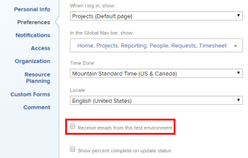

# Senden eines Berichts in der Sandbox-Umgebung in der Vorschau

<!-- Audited: 11/2024 -->

Die Informationen auf dieser Seite beziehen sich auf Funktionen, die nur in der Vorschau und in benutzerdefinierten Sandbox-Aktualisierungsumgebungen verfügbar sind. Diese Funktion ist in der Produktionsumgebung nicht verfügbar.

Sie können die Optionen für die Berichtbereitstellung in jeder beliebigen Adobe Workfront-Testumgebung einrichten.

<!--

For information about the Workfront test environments, see the "Workfront Testing Environments" section. (NOTE:&nbsp;drafted - link this section)

-->

Die Testumgebungen sollen zwar so nah wie möglich an der Produktionsumgebung funktionieren, einige Funktionen unterscheiden sich jedoch von der Produktionsumgebung.

Sie können Berichte in den Testumgebungen planen, die Art und Weise, wie sie bereitgestellt werden, unterscheidet sich jedoch von der Art und Weise, wie sie in der Produktionsumgebung bereitgestellt werden.

Informationen zur Planung von Berichten für die Bereitstellung in der Produktionsumgebung finden Sie unter [Übersicht über die Berichtlieferung](../../../reports-and-dashboards/reports/creating-and-managing-reports/set-up-report-deliveries.md).

Je nachdem, wo Sie die Berichte planen, unterscheidet sich die Versandfunktionalität zwischen der Vorschau und der benutzerdefinierten Aktualisierungs-Sandbox.

## Zugriffsanforderungen

+++ Erweitern, um die Zugriffsanforderungen für die in diesem Artikel beschriebene Funktionalität anzuzeigen. 

<table style="table-layout:auto"> 
 <col> 
 <col> 
 <tbody> 
  <tr> 
   <td role="rowheader">Adobe Workfront-Paket</td> 
   <td> 
Beliebig
 </td> 
  </tr> 
  <tr> 
   <td role="rowheader">Adobe Workfront-Lizenz</td> 
   <td> 
      
Standard

      
Abo

   </td>
  </tr> 
  <tr> 
   <td role="rowheader">Konfigurationen der Zugriffsebene</td> 
   <td> 
Zugriff auf Berichte, Dashboards, Kalender bearbeiten

   
Zugriff auf Filter, Ansichten, Gruppierungen bearbeiten

   </td> 
  </tr> 
  <tr> 
   <td role="rowheader">Objektberechtigungen</td> 
     <td> 
Verwalten von Berechtigungen für einen Bericht
</td> 
  </tr> 
 </tbody> 
</table>

Weitere Details zu den Informationen in dieser Tabelle finden Sie unter [Zugriffsanforderungen in der Dokumentation zu Workfront](/help/quicksilver/administration-and-setup/add-users/access-levels-and-object-permissions/access-level-requirements-in-documentation.md).

+++

## Berichte in der Vorschau-Umgebung planen

* [Berichte in der Vorschau-Umgebung planen](#schedule-reports-in-the-preview-environment)

### Berichte in der Vorschau-Umgebung planen

Ob ein zugestellter Bericht in der Vorschau-Umgebung erstellt wird oder nicht, hängt davon ab, ob **E-Mails von dieser Testumgebung empfangen** aktiviert ist oder nicht.

Informationen zur Aktivierung von E-Mails aus der Sandbox-Umgebung finden Sie unter [Aktivieren des Versands von E-Mails aus der Sandbox-Vorschau-Umgebung](../../../workfront-basics/using-notifications/enable-delivery-emails-from-preview-sandbox-environment.md).

Die Planung von Berichten für den Versand in der Vorschau -Umgebung ist identisch mit der Planung von Berichten in der Produktionsumgebung. Informationen zur Planung eines Berichts für den Versand finden Sie unter [Übersicht über den Berichtsversand](../../../reports-and-dashboards/reports/creating-and-managing-reports/set-up-report-deliveries.md).

Wenn Sie einen Bericht für die Bereitstellung in der Vorschau-Umgebung planen, gibt es die folgenden Szenarien:

* Wenn **E-Mails von dieser Testumgebung empfangen** für den Benutzer deaktiviert ist, der den Bericht erhält, wird beim Planen des Berichts für den Versand keine Datei erstellt.
* Wenn **E-Mails von dieser Testumgebung empfangen** für den Benutzer aktiviert ist, der den Bericht erhält, wird die Datei, die bei der Planung des Berichts für den Versand erstellt wird, auf der Registerkarte Dokumente des Benutzers hinzugefügt.

## Berichte in der benutzerdefinierten Sandbox-Aktualisierungsumgebung planen

Ob ein bereitgestellter Bericht in der benutzerdefinierten Aktualisierungs-Sandbox erstellt wird oder nicht, hängt davon ab, ob die Einstellung E-Mails von dieser Testumgebung empfangen aktiviert ist oder nicht.

Informationen zur Aktivierung von E-Mails in der Vorschau-Umgebung finden Sie im Abschnitt [Anzeigen und Ändern Ihrer E-Mail](../../../workfront-basics/using-notifications/activate-or-deactivate-your-own-event-notifications.md#view)Benachrichtigungseinstellungen im Artikel [Ändern Ihrer eigenen E-Mail-Benachrichtigungen](../../../workfront-basics/using-notifications/activate-or-deactivate-your-own-event-notifications.md).

Die Planung von Berichten für die Bereitstellung in der benutzerdefinierten Aktualisierungs-Sandbox-Umgebung ist identisch mit der Planung von Berichten in der Produktionsumgebung. Informationen zur Planung eines Berichts für den Versand finden Sie unter [Übersicht über den Berichtsversand](../../../reports-and-dashboards/reports/creating-and-managing-reports/set-up-report-deliveries.md).

Wenn Sie einen Bericht für die Bereitstellung in der benutzerdefinierten Aktualisierungs-Sandbox-Umgebung planen, gibt es die folgenden Szenarien:

* Wenn die Option E-Mails von dieser Testumgebung empfangen für den Benutzer, der den Bericht erhält, deaktiviert ist, wird bei der Planung des Berichts für den Versand keine Datei erstellt.
* Wenn die Option E-Mails von dieser Testumgebung empfangen für den Benutzer aktiviert ist, der den Bericht erhält, wird der Bericht als Anhang an die mit dem Benutzer verknüpfte E-Mail-Adresse gesendet.

## Benachrichtigung externer Benutzer

Externe Benutzende erhalten weder Berichte, die über die Workfront-Testumgebungen gesendet werden, noch eine E-Mail-Benachrichtigung.

Externe Benutzer erhalten E-Mail-Berichte nur, wenn sie von einer Produktionsumgebung bereitgestellt werden.
