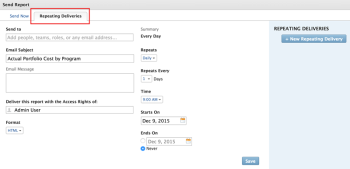

# Berichtversand - Übersicht

<!--

(NOTE: This is linked to the UI in the Send Report box inside the Preview sandbox. If you change title, log bug for Dev to fix the link) 

-->

Sie können Berichte so planen, dass sie den Benutzern automatisch nach einem festgelegten Zeitplan bereitgestellt werden, oder Sie können Berichte einmalig manuell senden. Wenn Sie einen Bericht von Adobe Workfront senden, erhält der Benutzer eine E-Mail mit dem Workfront-Bericht in einem separaten Anhang.

Informationen zum Einrichten eines Berichts für die Bereitstellung finden Sie im Artikel [Planen einer automatischen Berichtbereitstellung](../../../reports-and-dashboards/reports/creating-and-managing-reports/set-up-automatic-report-delivery.md).

Sie können die Bereitstellung von Berichten nicht planen und sie auch nicht manuell in der Vorschau-Sandbox-Umgebung bereitstellen. Weitere Informationen zur Vorschau-Sandbox finden Sie im Artikel [Die Adobe Workfront-Vorschau-Sandbox-Umgebung](../../../administration-and-setup/set-up-workfront/workfront-testing-environments/wf-preview-sandbox-environment.md).\
Weitere Informationen zum Bereitstellen von Berichten in der Vorschau-Sandbox-Umgebung finden Sie im Artikel [Senden eines Berichts in der Vorschau-Sandbox-Umgebung](../../../reports-and-dashboards/reports/creating-and-managing-reports/send-report-preview-sandbox-environment.md).

## Versandbeschränkungen für Berichte

<!--

(NOTE: [! This information is shared between "Exporting Data" and "Setting Up Report Deliveries."])

-->

Beachten Sie Folgendes bei der Planung von Berichten für die Bereitstellung:

* Sie können für jeden Bericht bis zu 10 sich wiederholende Berichtbereitstellungen planen.
* Sie können die Bereitstellung eines Berichts nur planen, wenn Sie der Ersteller des Berichts sind. Wenn Sie einen nicht erstellten Bericht versenden müssen, können Sie ihn manuell versenden.

## Ausfuhrbeschränkungen

Es gibt verschiedene Größenbeschränkungen, die beeinflussen, wie Berichte in Workfront angezeigt werden und wie sie über einen manuellen Export, einen gelieferten Bericht oder über die API exportiert werden:

* **5 MB Dateigröße:** Maximale Dateigröße für exportierte Berichte, die für die Bereitstellung geplant sind. Wenn eine an eine E-Mail angehängte exportierte Datei größer als 5 MB ist, wird ein Link, über den die Datei heruntergeladen werden kann, per E-Mail anstelle des angehängten exportierten Berichts gesendet.

  >[!NOTE]
  >
  >Excel .xlsx-Dateien, die größer als 5 MB sind, generieren keine E-Mail. Sie können den Bericht manuell in dieses Format exportieren. Informationen zum Exportieren von Berichten finden Sie unter [Daten exportieren](../../../reports-and-dashboards/reports/creating-and-managing-reports/export-data.md).

* **50.000 Zeilen:** Die Anzahl der Datenzeilen, die in einem Berichtsexport für PDF- und tabulatorgetrennte Dateien zulässig sind.

  Bei Excel .xls-Dateien beträgt diese Beschränkung **65.000 Zeilen**.

  Bei Excel .xlsx-Dateien beträgt diese Beschränkung **100.000 Zeilen**.

  Diese Beschränkungen schließen die Spaltenüberschriften sowie die Zeilen für Gruppierungen im Bericht aus. Wenn beispielsweise ein Bericht 6 Gruppierungen und 50.000 Datenzeilen enthält, enthält die exportierte Datei 50.000 Zeilen.

  Wenn Ihr Bericht mehr Elemente enthält, die diese Beschränkungen überschreiten, erhalten Sie eine Fehlermeldung, dass der Export und die Bereitstellung des Berichts nicht erfolgreich sind. Reduzieren Sie die Anzahl der Elemente auf dem Bildschirm auf eine Zahl, die kleiner oder gleich diesen Beschränkungen ist, um die Ergebnisse liefern zu können. Wenn Sie alle Daten exportieren möchten, empfehlen wir, Filter zu verwenden, um kleinere Datenmengen abzurufen, und dann mehrere Exporte durchzuführen. Weitere Informationen finden Sie unter [Filterübersicht](../../../reports-and-dashboards/reports/reporting-elements/filters-overview.md).

  Diese Beschränkungen gelten für:

   * Ein manueller Export eines Berichts.
   * Ein terminierter Bericht.
   * Export über eine API-Integration.
   * Daten, die über einen Kick-Start exportiert wurden.

     Weitere Informationen zum Exportieren von Daten über Kick-Start finden Sie im Artikel [Daten aus Adobe Workfront über Kick-Starts exportieren](../../../administration-and-setup/manage-workfront/using-kick-starts/export-data-from-wf-via-kick-starts.md).

     >[!NOTE]
     >
     >Sie können 50.000 Zeilen in einer Schnellstartdatei exportieren, jedoch nur in eine Excel-Formatdatei.

   * Exportieren von Nutzungsinformationen für ein Projekt.

     Weitere Informationen zum Exportieren von Nutzungsinformationen für ein Projekt finden Sie unter [Überblick über den Bericht &quot;Ressourcenauslastung&quot;](../../../reports-and-dashboards/reports/using-built-in-reports/resource-utilization-report.md).

* **65.530 Hyperlinks:** Dies ist eine Beschränkung, die Excel für Dokumente mit mehr als 65.530 Hyperlinks vorschreibt. Diese Dokumente können nicht geöffnet werden, wenn sie manuell exportiert oder in einem gelieferten Bericht gesendet werden. Beachten Sie, dass ein Excel-Dokument möglicherweise nur 200 Datenzeilen enthält. Wenn jedoch mehr als 65.530 Links innerhalb des Dokuments vorhanden sind, wird das Dokument nicht geöffnet. Diese Beschränkung gilt nur für Excel-Dateien, nicht aber für die anderen unterstützten Formate.
* **256 Spalten**: Dies ist eine Begrenzung, die Excel für Dokumente mit mehr als 256 Spalten vorgibt. Diese Dokumente können nicht manuell exportiert oder in einem gelieferten Bericht gesendet werden. Diese Beschränkung gilt nur für Excel-Dateien, nicht aber für die anderen unterstützten Formate.

Wenn Sie versuchen, Daten über den Grenzwert hinaus zu exportieren, erhalten Sie möglicherweise nicht alle erwarteten Daten im Export. Stattdessen wird ein geänderter Bericht innerhalb der Grenze erstellt.

Darüber hinaus werden Berichte angehalten, deren Ausführung länger als 60 Minuten dauert.

Wenden Sie sich an den technischen Support von Workfront, wenn Sie Bedenken oder Probleme bezüglich Ihrer Beschränkung haben.

## Zeitstempel in gelieferten Berichten

<!--

(NOTE: Note about if this is delivered at a time based on the user's time zone settings?)

-->

Wenn Sie einen Bericht in einer E-Mail erhalten, stimmen der Zeitstempel und das Zeitformat des Berichts möglicherweise nicht mit denen in Workfront überein, wenn Sie den Bericht in Workfront zum gleichen Zeitpunkt wie bei der Bereitstellung anzeigen möchten.

Beachten Sie Folgendes:

* Beim Anzeigen eines Berichts im Browser stimmen Zeitstempel und Format des Berichts mit dem Gebietsschema und der Zeitzone Ihres Browsers überein, wie in den Browsereinstellungen definiert.
* Wenn der Bericht in einer E-Mail zugestellt wird, wird der Bericht mit dem Zeitstempel und dem Format bereitgestellt, die dem Gebietsschema und der Zeitzone des Benutzers entsprechen, wie sie in Ihrem Workfront-Profil angegeben sind.\
  Weitere Informationen zum Gebietsschema und zur Zeitzone von Benutzern in Workfront finden Sie im Artikel [Benutzerprofil bearbeiten](../../../administration-and-setup/add-users/create-and-manage-users/edit-a-users-profile.md) .

## Berichte mit einer speziellen Ansicht {#reports-with-a-special-view}

Wenn Sie eine spezielle Ansicht auf einen Bericht anwenden, wird die spezielle Ansicht im Tab Details des Berichts in Workfront angezeigt.

Wenn Sie den Versand eines Berichts mit einer speziellen Ansicht planen, wird der Tab Details anstelle der speziellen Ansicht im Anhang der gesendeten E-Mail bereitgestellt.

Die folgenden Ansichten werden als besondere Ansichten betrachtet:

* Meilensteinansicht eines Projektberichts
* Gantt-Ansicht für einen Projekt- oder Aufgabenbericht
* Berichte mit einem Diagramm als Standardregisterkarte

>[!NOTE]
>
>Wenn der Bericht zusätzlich zur Standardregisterkarte mit einer speziellen Ansicht auch eine Matrix -Registerkarte enthält, wird der Bericht so bereitgestellt, wie er auf der Registerkarte Matrix angezeigt wird.

Weitere Informationen zum Anwenden einer speziellen Ansicht auf einen Bericht finden Sie im Artikel [Benutzerspezifischen Bericht erstellen](../../../reports-and-dashboards/reports/creating-and-managing-reports/create-custom-report.md) .

## Die bereitgestellte Datei verwenden

Wenn Sie einen Bericht von Workfront senden, erhält der Benutzer eine E-Mail mit dem Bericht in einem separaten Anhang.

* [Betreffzeile, Anlagenname und Berichtstitel](#subject-line-attachment-name-and-report-title)
* [Zeitstempel](#timestamps)
* [Branding](#branding)
* [Formatierung](#formatting)
* [Links](#links)

### Betreffzeile, Anlagenname und Berichtstitel {#subject-line-attachment-name-and-report-title}

Weitere Informationen zur Betreffzeile der zugestellten Berichts-E-Mail finden Sie unter [Planen eines automatischen Berichtversands](../../../reports-and-dashboards/reports/creating-and-managing-reports/set-up-automatic-report-delivery.md).

Der Name des angehängten Berichts lautet: *The_Name_Of_The_Report* gefolgt vom exportierten Dateiformat.

Wenn Sie die Formatierung des gelieferten Berichts als PDF- oder HTML-Datei geplant haben, lautet der Titel des Berichts:

*Der Name des Berichts.*

Berichte, deren Bereitstellung im Excel-, Excel- (.xlsx) oder TSV-Format geplant ist, haben keinen Titel.

>[!NOTE]
>
>Wenn der Bericht eine Beschreibung enthält, wird er in die exportierte Datei aufgenommen, wenn die Datei als PDF- oder HTML-Datei formatiert ist.

### Zeitstempel {#timestamps}

Ein Zeitstempel wird nur dann in der angehängten Datei angezeigt, wenn das Dateiformat .pdf ist. Der Zeitstempel befindet sich in der Fußzeile der angehängten Datei.

Der Zeitstempel umfasst:

* Datum
* Uhrzeit
* Zeitzone, in der der Bericht gesendet wurde

### Branding {#branding}

Wenn Ihr Workfront-Administrator Ihrer Workfront-Instanz benutzerdefiniertes Branding hinzugefügt hat, enthalten die im .pdf -Format gesendeten Berichte auch Ihr personalisiertes Logo.

Berichte, die in allen anderen Formaten gesendet werden, können nicht mit Ihrem Logo personalisiert werden.

Weitere Informationen zum Branding Ihrer Workfront-Instanz finden Sie im Artikel [Markenbezeichnung Ihrer Adobe Workfront-Instanz](../../../administration-and-setup/customize-workfront/brand-workfront/brand-your-workfront-instance.md).

### Formatierung {#formatting}

Wenn ein Bericht versendet oder für einen Versand geplant ist, erhalten Sie immer den Tab Details eines Berichts, es sei denn, der Bericht verfügt über eine spezielle Ansicht.

Wenn Ihr Bericht in der Webanwendung eine besondere Formatierung aufweist, sollte der Bericht mit der speziellen Formatierung bereitgestellt werden, wenn die Registerkarten Details und Matrix nur für PDF- und Excel-Dateien bereitgestellt werden.

Der Filter, die Ansicht oder die Gruppierung des Berichts sind nicht in der bereitgestellten Datei enthalten. Die Berichtbeschreibung ist nur enthalten, wenn Sie den Bericht als PDF-Datei versenden.

Weitere Informationen zum Empfang von Berichten mit einer speziellen Ansicht finden Sie im Artikel [Berichte mit einer speziellen Ansicht](#reports-with-a-special-view).\
Weitere Informationen zur Auswahl der Standardregisterkarte eines Berichts und zur speziellen Formatierung finden Sie unter [Benutzerspezifischen Bericht erstellen](../../../reports-and-dashboards/reports/creating-and-managing-reports/create-custom-report.md).

### Links {#links}

Wenn Sie einen Bericht aus Workfront an das PDF- oder Excel-Format senden, bleiben alle im Originaldokument vorhandenen Arbeitslinks in der gesendeten Datei erhalten. Links können auf jedes Objekt in Workfront verweisen, das Verknüpfungen unterstützt.

Der Name des Berichts in der E-Mail-Nachricht ist ebenfalls ein Link.

## Bericht zu terminierten Berichten

Sie können sehen, ob ein Bericht für die Bereitstellung konfiguriert wurde, indem Sie Folgendes erstellen:

* **Eine Ansicht** für das Berichtsobjekt in einer Liste oder in einem Bericht für Berichte: Erstellen Sie eine Ansicht auf einer Liste von Berichten oder in einem Bericht für Berichte und fügen Sie der Ansicht die folgende Spalte hinzu:\
  *Name des terminierten Berichts.\
  *Die Namen aller für diesen Bericht geplanten Sendungen werden in der Spalte mit Aufzählungszeichen aufgeführt.\
  

* **Ein Filter** für das Berichtsobjekt: Erstellen Sie einen Filter für eine Liste von Berichten oder einen Bericht für Berichte mit der folgenden Anweisung: *Geplante Berichts-ID ist nicht leer*.\
  Dadurch werden nur Berichte angezeigt, die in Ihrer Liste oder Ihrem Bericht geplant wurden.\
  \
  Weitere Informationen zum Erstellen von Berichten finden Sie unter [Benutzerdefinierten Bericht erstellen](../../../reports-and-dashboards/reports/creating-and-managing-reports/create-custom-report.md). Informationen zum Erstellen eines Berichts für Berichte finden Sie unter [Erstellen eines Berichts über Berichterstellungsaktivitäten](../../../reports-and-dashboards/reports/report-usage/create-report-reporting-activities.md).

<!--
<h2 data-mc-conditions="QuicksilverOrClassic.Draft mode">Scheduling a Repeating Report Delivery</h2>
-->

<!--

You can schedule up to 10 repeating report deliveries for any given report.

-->

<!--

You can schedule a report to be delivered only if you are the creator of the report. If you need to send a report that you did not create, you can send it on a manual basis.

-->

<!--

To schedule a report for automatic delivery or to edit an existing report delivery: ​

-->

<!--
   <li value="1" data-mc-conditions="QuicksilverOrClassic.Draft mode">Navigate to and click the name of the report for which you want to schedule delivery. </li>
   -->

<!--
   <li value="2" data-mc-conditions="QuicksilverOrClassic.Draft mode">Click <strong>Report Actions</strong>, then <strong>Send Report</strong>.  The <strong>Send Report</strong> dialog box is displayed.</li>
   -->

<!--
   <li value="3" data-mc-conditions="QuicksilverOrClassic.Draft mode">Select the <strong>Repeating Deliveries</strong> tab. </li>
   -->

<!--
   <li value="4" data-mc-conditions="QuicksilverOrClassic.Draft mode">(Conditional) To modify an existing repeating report delivery, select the report delivery in the <strong>Repeating Deliveries</strong> section.</li>
   -->

<!--
   <li value="5" data-mc-conditions="QuicksilverOrClassic.Draft mode">Specify the following information:
   <ul>
   <li data-mc-conditions="QuicksilverOrClassic.Draft mode"><strong>Send to:</strong> Begin typing the name of the user, group, team, or role who you want to send the report to, then click the name when it appears in the drop-down list. Or Specify the email address of a person external to the Workfront system who you want to have access to the report.  Repeat this process to send the report to multiple users, groups, teams, or roles.</li>
   <li data-mc-conditions="QuicksilverOrClassic.Draft mode"><strong>Email Subject:</strong> Specify a subject for the email notification.  By default, the email subject is: <em>Workfront Report: <Name of the report> Date of the Export</em>.<strong></strong></li>
   <li data-mc-conditions="QuicksilverOrClassic.Draft mode"><strong>Email Message:</strong> Specify a message to include in the email. By default, the email message is: <em>Attached is the <report frequency> report <Name of the report> generated by Workfront on <Date>.</em> 
   <note type="note">
   For reports delivered as an Excel file only, the following message is also added to the email: "Please be aware that with MS Excel (XLS) file types, there is a limit (65,530) on the number of hyperlinks these file types support. If you exceed those limits, your file will not open and it is recommended to resend without the hyperlinks. Please go back to the report scheduler to remove hyperlinks and resend the report." The "please go back to the report scheduler" phrase is a link back to the report. 
   </note>
   </li>
   <li data-mc-conditions="QuicksilverOrClassic.Draft mode"><strong>Deliver this report with the Access Rights of:</strong> Begin typing the name of a user who has access to the report, then click the name when it appears in the drop-down list. Users who receive the report will be granted the same level of access to the report as the user that you specify here.  For more information, see <a href="../../../reports-and-dashboards/reports/creating-and-managing-reports/run-deliver-report-access-rights-another-user.md" class="MCXref xref">Run and deliver a report with the access rights of another user</a>
   <note type="note">
   This field does not support wildcards. For example, using the wildcard $$User.ID does not run the report with the access rights of the user who is receiving the report.
   </note>
   </li>
   <li data-mc-conditions="QuicksilverOrClassic.Draft mode"><strong>Format:</strong> Select in which of the following formats you want the report to be delivered:
   <ul>
   <li data-mc-conditions="QuicksilverOrClassic.Draft mode"> HTML</li>
   <li data-mc-conditions="QuicksilverOrClassic.Draft mode">PDF</li>
   <li data-mc-conditions="QuicksilverOrClassic.Draft mode">MS Excel</li>
   <li data-mc-conditions="QuicksilverOrClassic.Draft mode">MS Excel (.xlsx)</li>
   <li data-mc-conditions="QuicksilverOrClassic.Draft mode">TSV  </li>
   </ul></li>
   <li data-mc-conditions="QuicksilverOrClassic.Draft mode"><strong>Include Links:</strong> This option is available only when <strong>MS Excel</strong> is selected in the <strong>Format</strong> drop-down menu. When this option is enabled, any hyperlinks are included in the exported Excel document.  Documents that contain more than 65,530 links cannot be opened. If the exported document will contain more than 65,530 links, deselect this option. This option is enabled by default. </li>
   <li data-mc-conditions="QuicksilverOrClassic.Draft mode"><strong>Summary:</strong> Displays a summary of when the delivery repeats.</li>
   <li data-mc-conditions="QuicksilverOrClassic.Draft mode"><strong>Repeats:</strong> Select whether the report should be delivered daily, weekly, monthly, or yearly.</li>
   <li data-mc-conditions="QuicksilverOrClassic.Draft mode"><strong>Repeats Every:</strong> Select the frequency with which you want the delivery to repeat. The value you select for this option is based on the option that is selected in the <strong>Repeats</strong> drop-down list.</li>
   <li data-mc-conditions="QuicksilverOrClassic.Draft mode"><strong>Time:</strong> Select the time of day for the delivery to be sent.</li>
   
<strong>Repeats On:</strong> This option is available when the <strong>Repeats</strong> option is set to either <strong>Weekly</strong> or <strong>Monthly</strong>.

   <li data-mc-conditions="QuicksilverOrClassic.Draft mode">When the <strong>Repeats</strong> option is set to <strong>Weekly</strong>: Select the days of the week that the delivery is sent.</li>
   <li data-mc-conditions="QuicksilverOrClassic.Draft mode">When the <strong>Repeats</strong> option is set to <strong>Monthly</strong>: Select whether the delivery is sent on the day of the month, day of the week, or last day of the month (these options leverage the date that you select in the <strong>Starts On</strong> field).</li>
   <li data-mc-conditions="QuicksilverOrClassic.Draft mode"><strong>Starts On:</strong> Select the date for the scheduled delivery to begin.</li>
   <li data-mc-conditions="QuicksilverOrClassic.Draft mode"><strong>Ends On:</strong> Select a date for the scheduled delivery to end.  Or</li>
   <li data-mc-conditions="QuicksilverOrClassic.Draft mode">Select <strong>Never</strong> if you want the scheduled delivery to last indefinitely.</li>
   -->

<!--
   <li value="6" data-mc-conditions="QuicksilverOrClassic.Draft mode">Click <strong>Save</strong> to save the report delivery.  The report is saved in the <strong>Repeating Deliveries</strong> section (in the <strong>Send Report</strong> dialog box).  The report will be sent at the schedule time Or To manually send the report, click <strong>Send Now</strong>. For more information about sending the report instantly or manually, see .</li>
   -->

<!--
<h2 data-mc-conditions="QuicksilverOrClassic.Draft mode">Deleting a Scheduled Report Delivery</h2>
-->

<!--
   <li value="1" data-mc-conditions="QuicksilverOrClassic.Draft mode">Go to the report with the delivery you want to delete.</li>
   -->

<!--
   <li value="2" data-mc-conditions="QuicksilverOrClassic.Draft mode">Click <strong>Report Actions</strong>, then <strong>Send Report</strong>. </li>
   -->

<!--
   <li value="3" data-mc-conditions="QuicksilverOrClassic.Draft mode">Click <strong>Repeating Deliveries</strong>. </li>
   -->

<!--
   <li value="4" data-mc-conditions="QuicksilverOrClassic.Draft mode">Click the name of the scheduled delivery you want to delete, then click <strong>Delete</strong>. The report is no longer set up for the scheduled delivery. </li>
   -->

<!--
<h2 data-mc-conditions="QuicksilverOrClassic.Draft mode">Sending a Report Manually, on a One-Time Basis</h2>
-->

<!--

You can manually send a report that has been previously scheduled, or you can create a single-use report delivery.​

-->

<!--
  <li data-mc-conditions="QuicksilverOrClassic.Draft mode"><a title="Setting Up Report Deliveries" href="#sending-a-scheduled-report-now" class="MCXref xref">Sending a Scheduled Report Now</a> </li>
  -->

<!--
  <li data-mc-conditions="QuicksilverOrClassic.Draft mode"><a title="Setting Up Report Deliveries" href="#sending-a-report-one-time-only" class="MCXref xref">Sending a Report (One Time Only)</a> </li>
  -->

<!--
<h3 data-mc-conditions="QuicksilverOrClassic.Draft mode" id="sending-a-scheduled-report-now">Sending a Scheduled Report Now</h3>
-->

<!--

After a scheduled report has been set up, you can manually send the report rather than waiting until the scheduled time.

-->

<!--
   <li value="1" data-mc-conditions="QuicksilverOrClassic.Draft mode">Navigate to and click the name of the report that you want to send now.</li>
   -->

<!--
   <li value="2" data-mc-conditions="QuicksilverOrClassic.Draft mode">Click <strong>Report Actions</strong>, then <strong>Send Report</strong>.  The Send Report dialog box is displayed.</li>
   -->

<!--
   <li value="3" data-mc-conditions="QuicksilverOrClassic.Draft mode">Click the <strong>Repeating Deliveries</strong> tab.</li>
   -->

<!--
   <li value="4" data-mc-conditions="QuicksilverOrClassic.Draft mode">In the <strong>Repeating Deliveries</strong> section, select the report delivery that was previously created. </li>
   -->

<!--
   <li value="5" data-mc-conditions="QuicksilverOrClassic.Draft mode">Click <strong>Send Now</strong>.  The report is sent to all users identified in the scheduled delivery.</li>
   -->

<!--
<h3 data-mc-conditions="QuicksilverOrClassic.Draft mode" id="sending-a-report-one-time-only">Sending a Report (One Time Only)</h3>
-->

<!--

You can manually send a report at any time. When you send a report in this way, delivery information (such as the users you are sending to and the email subject) are not saved. If you want to create a report delivery that you can save for later use, create a repeating scheduled report. 

-->

<!--

To send a report to users (one time only):

-->

<!--
   <li value="1" data-mc-conditions="QuicksilverOrClassic.Draft mode">Navigate to and click the name of the report that you want to send now.</li>
   -->

<!--
   <li value="2" data-mc-conditions="QuicksilverOrClassic.Draft mode">Click <strong>Report Actions</strong>, then <strong>Send Report</strong>.  The <strong>Send Report</strong> dialog box is displayed. </li>
   -->

<!--
   <li value="3" data-mc-conditions="QuicksilverOrClassic.Draft mode">On the <strong>Send Now</strong> tab, specify the following information:
   <ul>
   <li data-mc-conditions="QuicksilverOrClassic.Draft mode"><strong>Send to:</strong> Begin typing the name of the user, group, team, or role who you want to send the report to, then click the name when it appears in the drop-down list. Or, specify the email address of a person external to the Workfront system who you want to have access to the report.  Repeat this process to send the report to multiple users, groups, teams, or roles.</li>
   <li data-mc-conditions="QuicksilverOrClassic.Draft mode"><strong>Email Subject:</strong> Specify a subject for the email notification.  By default, the email subject is: <em>Workfront Report: <Name of the report> Date of the Export</em>.</li>
   <li data-mc-conditions="QuicksilverOrClassic.Draft mode"><strong>Email Message:</strong> Specify a message to include in the email. By default, the email message is: <em>Attached is the <report frequency> report <Name of the report> generated by Workfront on <Date>.</em> 
   <note type="note">
   For reports delivered as an Excel file only, the following message is also added to the email: "Please be aware that with MS Excel (XLS) file types, there is a limit (65,530) on the number of hyperlinks these file types support. If you exceed those limits, your file will not open and it is recommended to resend without the hyperlinks. Please go back to the report scheduler to remove hyperlinks and resend the report." The "please go back to the report scheduler" phrase is a link back to the report. 
   </note>
   </li>
   <li data-mc-conditions="QuicksilverOrClassic.Draft mode"><strong>Deliver this report with the Access Rights of:</strong> Begin typing the name of a user who has access to the report, then click the name when it appears in the drop-down list. Users who receive the report will be granted the same level of access to the report as the user that you specify here.  For more information, see <a href="../../../reports-and-dashboards/reports/creating-and-managing-reports/run-deliver-report-access-rights-another-user.md" class="MCXref xref">Run and deliver a report with the access rights of another user</a>.
   <note type="note">
   This field does not support wildcards. For example, using the wildcard $$User.ID does not run the report with the access rights of the user who is receiving the report.
   </note>
   </li>
   <li data-mc-conditions="QuicksilverOrClassic.Draft mode"><strong>Format:</strong> Select in which of the following formats you want the report to be delivered:
   <ul>
   <li data-mc-conditions="QuicksilverOrClassic.Draft mode"> HTML</li>
   <li data-mc-conditions="QuicksilverOrClassic.Draft mode">PDF</li>
   <li data-mc-conditions="QuicksilverOrClassic.Draft mode">MS Excel</li>
   <li data-mc-conditions="QuicksilverOrClassic.Draft mode">MS Excel (.xlsx)</li>
   <li data-mc-conditions="QuicksilverOrClassic.Draft mode">TSV</li>
   </ul></li>
   <li data-mc-conditions="QuicksilverOrClassic.Draft mode"><strong>Include Links:</strong> This option is available only when <strong>MS Excel</strong> is selected in the <strong>Format</strong> drop-down menu. When this option is enabled, any hyperlinks are included in the exported Excel document.  Documents that contain more than 65,000 links cannot be opened. If the exported document will contain more than 65,000 links, deselect this option. This option is enabled by default.</li>
   </ul></li>
   -->

<!--
   <li value="4" data-mc-conditions="QuicksilverOrClassic.Draft mode">Click <strong>Send Now</strong>.  The report is sent to all users that you identified.  Or  Click <strong>Make Repeating Delivery</strong> if you want to set up a scheduled delivery with this same information, then complete the additional information regarding the frequency of when the report is sent.</li>
   -->
