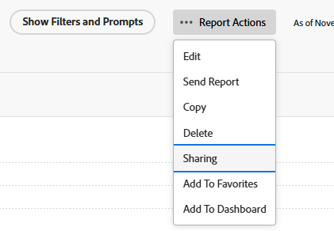

# Bericht in Adobe Workfront freigeben

<!-- Audited: 11/2024 -->

Ihr Adobe Workfront-Administrator gewährt Benutzern Zugriff auf das Anzeigen oder Bearbeiten von Berichten, wenn sie Zugriffsebenen zuweisen. Weitere Informationen zur Gewährung des Zugriffs auf Probleme finden Sie unter [Gewähren des Zugriffs auf Berichte, Dashboards und Kalender](../../../administration-and-setup/add-users/configure-and-grant-access/grant-access-reports-dashboards-calendars.md).

Neben der Zugriffsebene, auf die Benutzer zugreifen können, können Sie ihnen auch Berechtigungen zum Anzeigen oder Verwalten bestimmter Berichte erteilen, auf die Sie Zugriff haben. Weitere Informationen zu Zugriffsebenen und Berechtigungen finden Sie unter [Wie Zugriffsebenen und -berechtigungen zusammenarbeiten](../../../administration-and-setup/add-users/access-levels-and-object-permissions/how-access-levels-permissions-work-together.md).

Berechtigungen beziehen sich auf ein Element in Workfront und legen fest, welche Aktionen für dieses Element durchgeführt werden können.

>[!NOTE]
>
>Ein Workfront-Administrator kann allen Elementen im System Berechtigungen hinzufügen oder entfernen, ohne Eigentümer dieser Elemente zu sein.

## Zugriffsanforderungen

+++ Erweitern Sie , um die Zugriffsanforderungen für die Funktionalität in diesem Artikel anzuzeigen.

Sie müssen über Folgendes verfügen, um Objekte freizugeben:

<table style="table-layout:auto"> 
 <col> 
 <col> 
 <tbody> 
  <tr> 
   <td role="rowheader">Adobe Workfront-Plan*</td> 
   <td> 
Alle 
 </td> 
  </tr> 
  <tr> 
   <td role="rowheader">Adobe Workfront-Lizenz*</td> 
      <td> 
      
Neu:

         <ul>
         <li>
Licht oder höher
</li>
         </ul>
      
Aktuell:

         <ul>
         <li>
Überprüfen oder höher
</li>
         </ul>
   </td>
  </tr> 
  <tr> 
   <td role="rowheader">Konfigurationen auf Zugriffsebene*</td> 
   <td> 
Zugriff auf Berichte, Dashboards, Kalender oder höher anzeigen
</td> 
  </tr> 
  <tr> 
   <td role="rowheader">Objektberechtigungen</td> 
   <td> 
Anzeigen von Berechtigungen oder höher für den Bericht
</td> 
  </tr> 
 </tbody> 
</table>

*Weitere Informationen finden Sie unter [Zugriffsanforderungen in der Workfront-Dokumentation](/help/quicksilver/administration-and-setup/add-users/access-levels-and-object-permissions/access-level-requirements-in-documentation.md).

+++

## Überlegungen zur Freigabe von Berichten

Weitere Informationen finden Sie unter [Berichte, Dashboards und Kalender freigeben](../../../workfront-basics/grant-and-request-access-to-objects/permissions-reports-dashboards-calendars.md).

* Sie können von Ihnen erstellte Berichte für andere Personen, Teams, Gruppen, Rollen oder Unternehmen freigeben. Sie können auch Berichte freigeben, die erstellt und für Sie freigegeben wurden.
* Sie können sie auch für Ihre gesamte Organisation freigeben oder veröffentlichen. Wenn Sie einen Bericht öffentlich machen, wird eine URL generiert, die für andere freigegeben werden kann.
* Sie können einen einzelnen Bericht freigeben oder mehrere Berichte aus einer Liste von Berichten freigeben.

## Möglichkeiten zum Freigeben von Berichten

Sie können Berichte in Workfront wie folgt freigeben:

* Manuell, wie im Abschnitt [Bericht freigeben](#share-a-report) unten beschrieben.
* automatisch durch Vererben der Anzeigeberechtigungen von einem Dashboard, das den freigegebenen Bericht enthält. Weitere Informationen zum Anzeigen von geerbten Berechtigungen für Objekte finden Sie unter [Vererbte Berechtigungen für Objekte anzeigen](../../../workfront-basics/grant-and-request-access-to-objects/view-inherited-permissions-on-objects.md).

## Bericht freigeben {#share-a-report}

Die Freigabe eines oder mehrerer Berichte aus einer Liste ist identisch.

1. Wechseln Sie zu einer Liste von Berichten, wählen Sie einen oder mehrere Berichte aus und klicken Sie auf **Freigeben** .

   Oder

   Klicken Sie auf den Namen eines Berichts und dann auf **Berichtsaktionen >****Freigabe**.

   

1. Geben Sie in dem angezeigten Feld &quot;**Personen, Teams, Rollen, Gruppen oder Unternehmen hinzufügen...**&quot;den Namen des Benutzers, Teams, der Rolle, der Gruppe oder des Unternehmens ein, für den/die Sie den Bericht freigeben möchten, und drücken Sie dann die Eingabetaste **Enter** , wenn der Name angezeigt wird.

1. Um die Zugriffsebene für einen hinzugefügten Namen anzupassen, klicken Sie auf das Dropdown-Menü rechts neben dem Namen und wählen Sie dann eine der folgenden Optionen aus.

   <table style="table-layout:auto"> 
    <col> 
    <col> 
    <tbody> 
     <tr> 
      <td role="rowheader">Anzeigen</td> 
      <td> 
Ermöglicht Ihrem Empfänger den Zugriff auf den Bericht im Bereich <strong>Berichte</strong> und führt ihn aus.
 
Sie können auf <strong>Erweiterte Einstellungen</strong> klicken, um anzugeben, ob der Benutzer oder die Benutzer diese für alle Benutzer im System freigeben können sollen.<strong></strong>
 </td> 
     </tr> 
     <tr> 
      <td role="rowheader">Verwalten</td> 
      <td> 
Ermöglicht dem Empfänger die vollständige Bearbeitung des Berichts.
 
Sie können auf <strong>Erweiterte Einstellungen</strong> klicken, um anzugeben, ob der Benutzer oder die Benutzer den Bericht aus dem System löschen und <strong>mit allen anderen Benutzern im System teilen können sollen.<strong></strong></strong>
 </td> 
     </tr> 
    </tbody> 
   </table>

1. (Optional) Wiederholen Sie die beiden vorherigen Schritte, um der Liste weitere Namen hinzuzufügen und ihre Optionen zu konfigurieren.
1. (Optional) Klicken Sie im Freigabefeld auf das Dropdown-Menü **Nur eingeladene Personen können auf** zugreifen und wählen Sie dann eine der folgenden Optionen aus:

   * **Nur eingeladene Personen können auf den Bericht zugreifen** Wählen Sie diese Option aus, damit nur Benutzer, denen Zugriff auf den Bericht gewährt wurde, ihn anzeigen können.

   * **Alle Benutzer im System können diese Option anzeigen** Wählen Sie diese Option aus, damit jeder in Workfront mit Zugriff auf Berichte den Bericht anzeigen kann.

1. (Optional) Klicken Sie oben rechts im Freigabefeld auf das Symbol **Zahnrad**  und wählen Sie optional die folgende Option aus:

   * **Gestalten Sie diese für externe Benutzer öffentlich** Wählen Sie diese Option, um eine URL zu generieren, die für andere freigegeben werden kann. Jeder mit der URL kann auf den Bericht zugreifen, ohne über eine Adobe Workfront-Lizenz zu verfügen.

     >[!CAUTION]
     >
     >Es wird empfohlen, bei der Freigabe eines Objekts mit vertraulichen Informationen für externe Benutzer Vorsicht walten zu lassen. Auf diese Weise können sie Informationen anzeigen, ohne Workfront-Benutzer oder Teil Ihres Unternehmens zu sein.

     >[!NOTE]
     >
     >Wenn der Bericht eine Eingabeaufforderung enthält und Sie ihn öffentlich freigeben, können Benutzer, die den Bericht über den öffentlichen Freigabe-Link ausführen, den Bericht nicht über die Eingabeaufforderung ausführen. Der Bericht wird angezeigt, ohne dass die Eingabeaufforderung darauf angewendet wird, es sei denn, er meldet sich bei Workfront an und greift auf den Bericht zu, ohne den öffentlichen Freigabe-Link zu verwenden. Weitere Informationen zu den Einschränkungen bei der Freigabe von Berichten für Aufforderungen finden Sie im Abschnitt [Einschränkungen für die Freigabe erforderlicher Berichte](../../../reports-and-dashboards/reports/creating-and-managing-reports/add-prompt-report.md#limitations-of-running-public-prompted-reports) im Artikel [Eingabeaufforderung zu einem Bericht hinzufügen](../../../reports-and-dashboards/reports/creating-and-managing-reports/add-prompt-report.md).

1. Klicken Sie auf **Speichern**.
