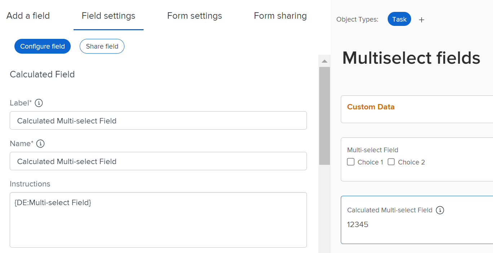
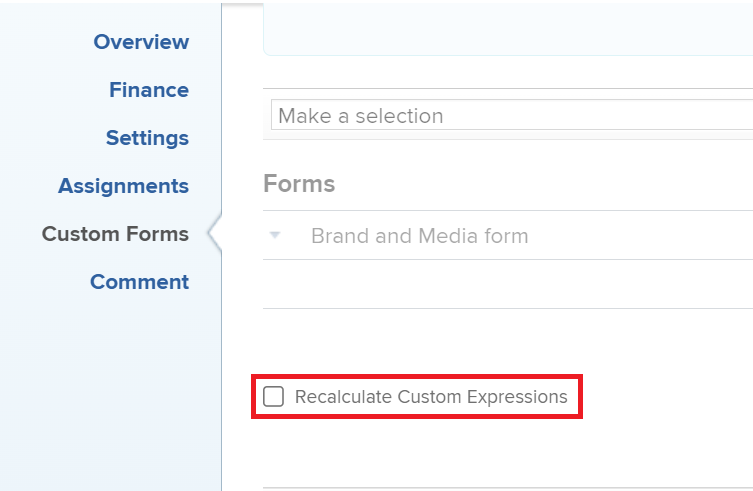

# Bericht anhand eines benutzerdefinierten Mehrfachauswahlfelds grafisch darstellen

<!--The highlighted information on this page refers to functionality not yet generally available. It is available for all customers in the Preview environment and for a select group of customers in the Production environment.-->

Anstatt ein Diagramm mit einem benutzerdefinierten Mehrfachfeld zu erstellen, empfehlen wir, für jede Option eines benutzerdefinierten Mehrfachfelds separate Felder zu erstellen.

Beispiele für benutzerdefinierte Mehrfachauswahl-Felder:

* Kontrollkästchen
* Dropdown-Menüs mit Mehrfachauswahl

Informationen zur Verwendung des Textmodus finden Sie im Artikel [Textmodus - Übersicht](../../../reports-and-dashboards/reports/text-mode/understand-text-mode.md) .

Wenn es jedoch nicht möglich ist, für jede Option eines Mehrfachauswahlfelds separate Felder zu verwenden, können Sie einen Bericht nach einem benutzerdefinierten Feld mit Mehrfachauswahl kartieren, indem Sie berechnete benutzerdefinierte Felder verwenden, um die Optionen aus dem Mehrfachauswahlfeld zuerst zu gruppieren. Danach können Sie den Bericht nach den berechneten Feldern ordnen.

>[!NOTE]
>
>Elemente mit einer der ausgewählten Optionen werden nur einmal gezählt.
>
>Wenn Sie beispielsweise über ein benutzerdefiniertes Kontrollkästchen mit Auswahl 1 und Auswahl 2 als Optionen verfügen und das Formular an Aufgaben anhängen, werden die Aufgaben mit Auswahl 1 und Auswahl 2 in einem separaten Diagrammelement angezeigt als die Aufgaben, für die nur Auswahl 1 oder Auswahl 2 ausgewählt ist.
>
>Aufgaben, für die Auswahl 1 ausgewählt ist, werden nicht im selben Diagrammelement angezeigt wie die Aufgaben, für die die Optionen Auswahl 1 und Auswahl 2 ausgewählt sind.

## Zugriffsanforderungen

Sie müssen über folgenden Zugriff verfügen, um die Schritte in diesem Artikel ausführen zu können:

<table style="table-layout:auto"> 
 <col> 
 <col> 
 <tbody> 
  <tr> 
   <td role="rowheader">Adobe Workfront-Plan*</td> 
   <td> 
Alle
 </td> 
  </tr> 
  <tr> 
   <td role="rowheader">Adobe Workfront-Lizenz*</td> 
   <td> 
Plan 
 </td> 
  </tr> 
  <tr> 
   <td role="rowheader">Konfigurationen auf Zugriffsebene*</td> 
   <td> 
Zugriff auf Berichte, Dashboards und Kalender bearbeiten
 
Zugriff auf Filter, Ansichten, Gruppierungen bearbeiten
 
Hinweis: Wenn Sie immer noch keinen Zugriff haben, fragen Sie Ihren Workfront-Administrator, ob er zusätzliche Zugriffsbeschränkungen für Ihre Zugriffsebene festlegt. Informationen dazu, wie ein Workfront-Administrator Ihre Zugriffsebene ändern kann, finden Sie unter <a href="../../../administration-and-setup/add-users/configure-and-grant-access/create-modify-access-levels.md" class="MCXref xref">Benutzerdefinierte Zugriffsebenen erstellen oder ändern</a>.
 </td> 
  </tr> 
  <tr> 
   <td role="rowheader">Objektberechtigungen</td> 
   <td> 
Berechtigungen für einen Bericht verwalten
 
Weitere Informationen zum Anfordern von zusätzlichem Zugriff finden Sie unter <a href="../../../workfront-basics/grant-and-request-access-to-objects/request-access.md" class="MCXref xref">Anfordern des Zugriffs auf Objekte </a>.
 </td> 
  </tr> 
 </tbody> 
</table>

&#42;Wenden Sie sich an Ihren Workfront-Administrator, um zu erfahren, welchen Plan, welchen Lizenztyp oder welchen Zugriff Sie haben.

## Voraussetzungen

Bevor Sie beginnen, müssen Sie ein berechnetes benutzerdefiniertes Feld erstellen, das die aus dem benutzerdefinierten Mehrfachfeld ausgewählten Werte anzeigt. Weitere Informationen finden Sie im Abschnitt [Erstellen eines berechneten benutzerdefinierten Felds, das auf ein mehrausgewähltes benutzerdefiniertes Feld verweist](#build-a-calculated-custom-field-that-references-a-multi-select-custom-field) in diesem Artikel.

## Bericht mit Mehrfachauswahl benutzerdefinierter Felder im Diagramm darstellen

<!--

(NOTE: this moved to its own article, linked in the Note above!)

-->

Sie können kein Diagramm in einem Bericht erstellen, indem Sie auf ein benutzerdefiniertes Feld mit Mehrfachauswahl verweisen. Stattdessen können Sie ein berechnetes Feld erstellen, das die Werte des benutzerdefinierten Mehrfachfelds für ein bestimmtes Objekt und eine bestimmte Gruppe anhand des berechneten Felds aufzeichnet. 

* [Erstellen Sie ein berechnetes benutzerdefiniertes Feld, das auf ein benutzerdefiniertes Mehrfachauswahlfeld verweist](#build-a-calculated-custom-field-that-references-a-multi-select-custom-field)
* [Erstellen Sie ein Diagramm, das auf ein berechnetes benutzerdefiniertes Feld verweist.](#build-a-chart-that-references-a-calculated-custom-field)

### Erstellen Sie ein berechnetes benutzerdefiniertes Feld, das auf ein benutzerdefiniertes Mehrfachauswahlfeld verweist. {#build-a-calculated-custom-field-that-references-a-multi-select-custom-field}

Um ein berechnetes Feld zu erstellen, das auf ein benutzerdefiniertes Mehrfachauswahlfeld verweist, müssen folgende Voraussetzungen erfüllt sein:

* Ein benutzerdefiniertes Feld mit mehreren Auswahlen in einem benutzerdefinierten Formular.\
  Informationen zum Erstellen benutzerdefinierter Formulare und zum Hinzufügen benutzerdefinierter Felder finden Sie im Artikel [Erstellen eines benutzerdefinierten Formulars](/help/quicksilver/administration-and-setup/customize-workfront/create-manage-custom-forms/form-designer/design-a-form/design-a-form.md).

* Ein benutzerdefiniertes Formular mit dem benutzerdefinierten Mehrfachauswahlfeld, das an Objekte angehängt ist.
* Werte für das benutzerdefinierte Mehrfachauswahlfeld für jedes Objekt.

So erstellen Sie das berechnete benutzerdefinierte Feld, das auf das benutzerdefinierte Mehrfachauswahlfeld verweist:

1. Erstellen Sie ein benutzerdefiniertes Formular oder bearbeiten Sie ein vorhandenes.

   Weitere Informationen zum Erstellen benutzerdefinierter Formulare finden Sie unter [Erstellen eines benutzerdefinierten Formulars](/help/quicksilver/administration-and-setup/customize-workfront/create-manage-custom-forms/form-designer/design-a-form/design-a-form.md).

1. Wählen Sie das Objekt oder die Objekte aus, die Sie für das benutzerdefinierte Formular verwenden möchten.
1. Klicken Sie auf **Feld hinzufügen** und dann auf **Berechnet** , um das benutzerdefinierte Feld mit Mehrfachauswahl zum Formular hinzuzufügen.

1. Benennen Sie im Feld **Beschriftung** das neue berechnete Feld, um anzugeben, dass es auf das benutzerdefinierte Feld mit Mehrfachauswahl verweist.

   Beispiel: &quot;Berechnetes Mehrfachauswahlfeld-Feld&quot;.

1. Geben Sie in das Feld **Berechnung** den folgenden Code ein:

   `{DE:Multi-select Custom Field}`

   Dadurch werden die im benutzerdefinierten Mehrfachfeld ausgewählten Auswahlmöglichkeiten zum berechneten Feld hinzugefügt. Wenn das Formular beispielsweise mit Aufgaben verknüpft ist und Auswahl 1 aus dem benutzerdefinierten Mehrfachfeld ausgewählt ist, zeigt das berechnete benutzerdefinierte Feld den Wert &quot;Auswahl 1&quot;an. Wenn für eine andere Aufgabe Auswahl 1 und Auswahl 2 ausgewählt sind, zeigt das berechnete benutzerdefinierte Feld den Wert &quot;Auswahl 1, Auswahl 2&quot;an.

1. Ersetzen Sie &quot;Benutzerdefiniertes Feld mit Mehrfachauswahl&quot;durch den tatsächlichen Namen Ihres benutzerdefinierten Mehrfachauswahlfelds, wie er in Workfront angezeigt wird.

   

1. (Optional) Wenn sich das benutzerdefinierte Feld mit mehreren Auswahlen bereits in diesem Formular befindet und dieses Formular bereits an Objekte angehängt ist, aktivieren Sie die Option **Vorherige Berechnungen aktualisieren (im Hintergrund)** .

   Dadurch wird sichergestellt, dass das neue berechnete Feld automatisch mit dem Wert aus dem benutzerdefinierten Mehrfachfeld ausgefüllt wird, da es zu den Formularen hinzugefügt wird, die bereits an die Objekte angehängt sind.

1. Klicken Sie auf **Fertig**.
1. Klicken Sie auf **Speichern + schließen**.

   Das berechnete benutzerdefinierte Feld wird dem benutzerdefinierten Formular hinzugefügt. Wenn das Formular derzeit an Objekte angehängt ist, wird das Feld mit Informationen aus dem benutzerdefinierten Mehrfachfeld gefüllt.

### Erstellen Sie ein Diagramm, das auf ein berechnetes benutzerdefiniertes Feld verweist. {#build-a-chart-that-references-a-calculated-custom-field}

1. (Optional) Um sicherzustellen, dass alle berechneten Felder, nach denen Sie ein Diagramm erstellen möchten, mit Werten gefüllt werden, wählen Sie im Tab Details des Berichts alle Objekte aus, die das benutzerdefinierte Formular mit dem benutzerdefinierten Mehrfachfeld und dem berechneten Feld enthalten, und klicken Sie dann auf **Bearbeiten**.
1. (Optional und bedingt) Wählen Sie das Feld **Benutzerdefinierte Ausdrücke neu berechnen** und klicken Sie dann auf **Änderungen speichern**.\
   

   >[!NOTE]
   >
   >Diese Option wurde aus der Massenbearbeitung von Projekten entfernt.  Sie können Ausdrücke für Projekte weiterhin stapelweise neu berechnen, indem Sie oben in einer Projektliste auf das Symbol **Mehr**  und dann auf **Ausdrücke neu berechnen** klicken.

1. Rufen Sie den Bericht auf, in dem Sie die Grafik für das berechnete Feld hinzufügen möchten, das auf das benutzerdefinierte Feld mit Mehrfachauswahl verweist.
1. Klicken Sie auf **Berichtaktionen** und dann auf **Bearbeiten**.

1. Wählen Sie die Registerkarte <strong>Gruppierungen</strong> und klicken Sie dann auf <strong>Gruppierung hinzufügen</strong>.
1. Fügen Sie das <strong>berechnete Mehrfachauswahlfeld</strong> hinzu, das Sie als Gruppierung erstellt haben.
1. Wählen Sie die Registerkarte <strong>Diagramm</strong> aus und fügen Sie Ihrem Bericht ein Diagramm hinzu.

   Wählen Sie beispielsweise ein **Spalten** -Diagramm.
    Informationen zum Hinzufügen eines Diagramms zu einem Bericht finden Sie im Abschnitt <a href="../../../reports-and-dashboards/reports/creating-and-managing-reports/create-custom-report.md#add-a-chart" class="MCXref xref">Hinzufügen eines Diagramms zu einem Bericht</a> im Artikel <a href="../../../reports-and-dashboards/reports/creating-and-managing-reports/create-custom-report.md" class="MCXref xref">Erstellen eines benutzerdefinierten Berichts</a>.
1. Wählen Sie im Feld **Untere (X) Achse** das Feld <strong>Berechnetes Mehrfachauswahlfeld </strong> aus, das im Diagramm angezeigt werden soll.
1. Klicken Sie auf <strong>Speichern + schließen</strong>.

   Der Bericht zeigt die Ergebnisse, die nach dem Feld für die Mehrfachauswahl mit berechneten Werten in einer Grafik gruppiert sind.

   