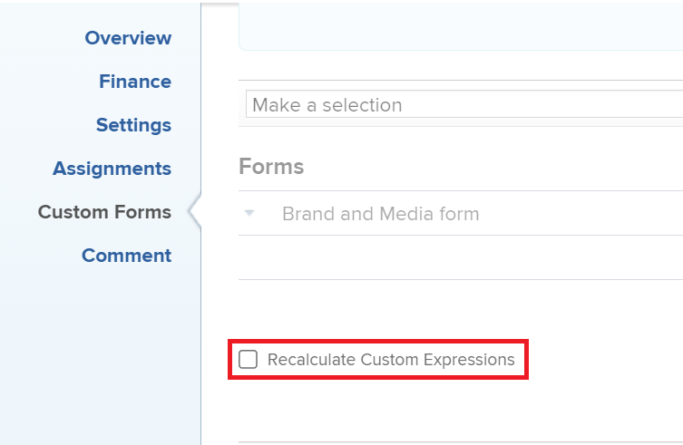

# Erstellen eines Diagramms für einen Bericht mit einem benutzerdefinierten Mehrfachauswahlfeld

<!--Audited: 11/2024-->

<!--The highlighted information on this page refers to functionality not yet generally available. It is available for all customers in the Preview environment and for a select group of customers in the Production environment.-->

Anstatt ein Diagramm mit einem benutzerdefinierten Feld mit mehreren Auswahlen zu erstellen, empfehlen wir Ihnen, separate Felder für jede Option eines benutzerdefinierten Felds mit mehreren Auswahlen zu erstellen.

Beispiele für benutzerdefinierte Felder mit Mehrfachauswahl:

* Kontrollkästchen
* Dropdown-Menüs mit mehreren Auswahlmöglichkeiten

Weitere Informationen zur Verwendung des Textmodus finden Sie im Artikel [Übersicht über den Textmodus](../../../reports-and-dashboards/reports/text-mode/understand-text-mode.md).

Wenn es jedoch nicht möglich ist, separate Felder für jede Option eines Mehrfachauswahlfelds zu verwenden, können Sie einen Bericht durch ein benutzerdefiniertes Mehrfachauswahlfeld diagrammen, indem Sie berechnete benutzerdefinierte Felder verwenden, um die Auswahlmöglichkeiten aus dem Mehrfachauswahlfeld zuerst zu gruppieren. Danach können Sie den Bericht nach den berechneten Feldern diagrammen.

>[!NOTE]
>
>Elemente, für die eine der Auswahlmöglichkeiten ausgewählt wurde, werden nur einmal gezählt.
>
>Wenn Sie beispielsweise ein benutzerdefiniertes Kontrollkästchen mit Auswahl 1 und Auswahl 2 als Optionen haben und das Formular an Aufgaben anhängen, werden die Aufgaben, für die sowohl Auswahl 1 als auch Auswahl 2 ausgewählt sind, in einem separaten Diagrammelement angezeigt als die Aufgaben, für die nur Auswahl 1 oder Auswahl 2 ausgewählt ist.
>
>Aufgaben, für die Auswahl 1 ausgewählt ist, werden nicht im selben Diagrammelement angezeigt wie die Aufgaben, für die Auswahl 1 und Auswahl 2 ausgewählt sind.

## Zugriffsanforderungen

+++ Erweitern, um die Zugriffsanforderungen für die in diesem Artikel beschriebene Funktionalität anzuzeigen. 

<table style="table-layout:auto"> 
 <col> 
 <col> 
 <tbody> 
  <tr> 
   <td role="rowheader">Adobe Workfront-Paket</td> 
   <td> 
Beliebig
 </td> 
  </tr> 
  <tr> 
   <td role="rowheader">Adobe Workfront-Lizenz</td> 
   <td> 
   
Mitwirkender oder Anfrage zum Ändern eines Filters 

   
Standard oder Plan zum Ändern eines Berichts

  </tr> 
  <tr> 
   <td role="rowheader">Konfigurationen der Zugriffsebene</td> 
   <td> 
Zugriff auf Berichte, Dashboards und Kalender bearbeiten, um einen Bericht zu ändern
 
Bearbeitungszugriff auf Filter, Ansichten, Gruppierungen zum Ändern eines Filters
 </td> 
  </tr> 
  <tr> 
   <td role="rowheader">Objektberechtigungen</td> 
   <td> 
Berechtigungen für einen Bericht verwalten
  </td> 
  </tr> 
 </tbody> 
</table>

Weitere Details zu den Informationen in dieser Tabelle finden Sie unter [Zugriffsanforderungen in der Dokumentation zu Workfront](/help/quicksilver/administration-and-setup/add-users/access-levels-and-object-permissions/access-level-requirements-in-documentation.md).

+++

## Voraussetzungen

Bevor Sie beginnen, müssen Sie ein berechnetes benutzerdefiniertes Feld erstellen, in dem die aus dem benutzerdefinierten Mehrfachauswahlfeld ausgewählten Werte angezeigt werden. Weitere Informationen finden Sie im Abschnitt [Ein berechnetes benutzerdefiniertes Feld erstellen, das auf ein benutzerdefiniertes Feld mit Mehrfachauswahl verweist](#build-a-calculated-custom-field-that-references-a-multi-select-custom-field) in diesem Artikel.

## Erstellen eines Diagramms für einen Bericht durch Mehrfachauswahl benutzerdefinierter Felder

<!--

(NOTE: this moved to its own article, linked in the Note above!)

-->

Sie können kein Diagramm in einem Bericht erstellen, indem Sie auf ein benutzerdefiniertes Feld mit mehreren Auswahlen verweisen. Stattdessen können Sie ein berechnetes Feld erstellen, das die Werte des benutzerdefinierten Felds mit Mehrfachauswahl für ein bestimmtes Objekt und eine Gruppe nach dem berechneten Feld aufzeichnet. 

* [Ein berechnetes benutzerdefiniertes Feld erstellen, das auf ein benutzerdefiniertes Feld mit Mehrfachauswahl verweist](#build-a-calculated-custom-field-that-references-a-multi-select-custom-field)
* [Erstellen eines Diagramms, das auf ein berechnetes benutzerdefiniertes Feld verweist](#build-a-chart-that-references-a-calculated-custom-field)

### Erstellen eines berechneten benutzerdefinierten Felds, das auf ein mehrfach ausgewähltes benutzerdefiniertes Feld verweist {#build-a-calculated-custom-field-that-references-a-multi-select-custom-field}

Zum Erstellen eines berechneten Felds, das auf ein benutzerdefiniertes Feld mit Mehrfachauswahl verweist, müssen die folgenden Voraussetzungen erfüllt sein:

* Ein benutzerdefiniertes Feld mit mehreren Auswahlmöglichkeiten in einem benutzerdefinierten Formular.\
  Weitere Informationen zum Erstellen benutzerdefinierter Formulare und zum Hinzufügen benutzerdefinierter Felder finden Sie im Artikel [Erstellen eines benutzerdefinierten Formulars](/help/quicksilver/administration-and-setup/customize-workfront/create-manage-custom-forms/form-designer/design-a-form/design-a-form.md).

* Ein benutzerdefiniertes Formular, bei dem das benutzerdefinierte Mehrfachauswahlfeld an Objekte angehängt ist.
* Werte für das benutzerdefinierte Feld mit Mehrfachauswahl für jedes Objekt.

So erstellen Sie das berechnete benutzerdefinierte Feld, das auf das benutzerdefinierte Mehrfachauswahlfeld verweist:

1. Erstellen Sie ein benutzerdefiniertes Formular oder bearbeiten Sie ein vorhandenes.

   Informationen zum Erstellen benutzerdefinierter Formulare finden Sie unter [Erstellen eines benutzerdefinierten Formulars](/help/quicksilver/administration-and-setup/customize-workfront/create-manage-custom-forms/form-designer/design-a-form/design-a-form.md).

1. Wählen Sie das Objekt oder die Objekte aus, die Sie mit dem benutzerdefinierten Formular verwenden möchten.
1. Klicken Sie auf **Feld hinzufügen** und dann auf **Berechnet**, um das benutzerdefinierte Mehrfachauswahlfeld zum Formular hinzuzufügen.

1. Benennen **im Feld** das neue berechnete Feld, um anzugeben, dass es auf das benutzerdefinierte Feld mit Mehrfachauswahl verweist.

   Beispiel: „Berechnetes Mehrfachauswahlfeld.“

1. Geben Sie **Feld** den folgenden Code ein:

   `{DE:Multi-select Custom Field}`

   Dadurch werden die im benutzerdefinierten Mehrfachauswahl-Feld ausgewählten Auswahlmöglichkeiten zum berechneten benutzerdefinierten Feld hinzugefügt. Beispiel: Wenn das Formular an Aufgaben angehängt ist und Auswahl 1 aus dem benutzerdefinierten Mehrfachauswahl-Feld ausgewählt ist, zeigt das berechnete benutzerdefinierte Feld den Wert „Auswahl 1“ an. Wenn Auswahl 1 und Auswahl 2 für eine andere Aufgabe ausgewählt sind, zeigt das berechnete benutzerdefinierte Feld den Wert „Auswahl 1, Auswahl 2“ an.

1. Ersetzen Sie „Benutzerdefiniertes Mehrfachauswahlfeld“ durch den tatsächlichen Namen des benutzerdefinierten Mehrfachauswahlfelds, wie er in Workfront angezeigt wird.

   

1. (Optional) Wenn sich das benutzerdefinierte Mehrfachauswahlfeld bereits in diesem Formular befindet und dieses Formular bereits Objekten zugeordnet ist, aktivieren Sie die Option **Auf vorhandene Berechnungen anwenden**.

   Dadurch wird sichergestellt, dass das neue berechnete Feld automatisch mit dem Wert aus dem benutzerdefinierten Mehrfachauswahlfeld ausgefüllt wird, da es den Formularen hinzugefügt wird, die bereits mit den Objekten verknüpft sind.

1. Klicken Sie auf **Übernehmen**.
1. Klicken Sie auf **Speichern und schließen**.

   Das berechnete benutzerdefinierte Feld wird zum benutzerdefinierten Formular hinzugefügt. Wenn das Formular derzeit mit Objekten verbunden ist, wird das Feld mit Informationen aus dem benutzerdefinierten Mehrfachauswahl-Feld gefüllt.

### Erstellen eines Diagramms, das auf ein berechnetes benutzerdefiniertes Feld verweist {#build-a-chart-that-references-a-calculated-custom-field}

1. (Optional) Um sicherzustellen, dass alle berechneten Felder, nach denen Sie ein Diagramm erstellen möchten, mit Werten gefüllt werden, müssen Sie die benutzerdefinierten Ausdrücke für alle Objekte in Ihrem Bericht neu berechnen.
Informationen zur Neuberechnung von Ausdrücken finden Sie unter [Informationen in benutzerdefinierten Feldern bearbeiten](/help/quicksilver/workfront-basics/work-with-custom-forms/edit-custom-forms.md).

   <!--from the Details tab of the report select all the objects that contain the custom form with both the multi-select custom field and the calculated custom field, then click **Edit**. 
   1. (Optional and conditional) Select the **Recalculate Custom Expressions** field, then click **Save Changes**.  
    
   >[!NOTE]
   >
   >This option has been eliminated from editing projects in bulk.  You can still recalculate expressions for projects in bulk by clicking the **More** icon  at the top of a project list, then **Recalculate Expressions**. -->

1. Wechseln Sie zum Bericht, in dem Sie das Diagramm für das berechnete Feld hinzufügen möchten, das auf das benutzerdefinierte Feld mit Mehrfachauswahl verweist.
1. Klicken Sie auf **Aktionen melden** und anschließend auf **Bearbeiten**.

1. Wählen Sie die Registerkarte <strong>Gruppierungen</strong> aus, und klicken Sie dann auf <strong>Gruppierung hinzufügen</strong>.
1. Fügen Sie das <strong>Feld für berechnete Mehrfachauswahl</strong> hinzu, das Sie als Gruppierung erstellt haben.
1. Wählen Sie die Registerkarte <strong>Diagramm</strong> aus, und fügen Sie Ihrem Bericht ein Diagramm hinzu.

   Wählen Sie beispielsweise ein Diagramm **Spalte** aus.
    Informationen zum Hinzufügen eines Diagramms zu einem Bericht finden Sie im Abschnitt <a href="../../../reports-and-dashboards/reports/creating-and-managing-reports/create-custom-report.md#add-a-chart" class="MCXref xref">Hinzufügen eines Diagramms zu einem Bericht</a> im Artikel <a href="../../../reports-and-dashboards/reports/creating-and-managing-reports/create-custom-report.md" class="MCXref xref">Erstellen eines benutzerspezifischen Berichts</a>.
1. Wählen Sie im Feld **Untere (X) Achse** das <strong>Berechnete Mehrfachauswahlfeld</strong> aus, das im Diagramm angezeigt werden soll.
1. Klicken Sie auf <strong>Speichern + schließen</strong>.

   Der Bericht zeigt die Ergebnisse gruppiert nach dem berechneten Mehrfachauswahlfeld in einem Diagramm an.

   
