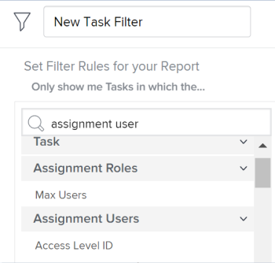

# Berichte oder Listen: Anzeigen von Benutzern, die mit einem Objekt verknüpft sind

Sie können in Berichten oder Listen Benutzer, Vorgangsrollen und Teams anzeigen, die mit Objekten verknüpft sind, und sie in Filtern referenzieren. Sie können keine Gruppe nach Benutzern, Auftragsrollen oder Teams erstellen, die mit Objekten verknüpft sind.

Sie können Benutzer, Auftragsrollen oder Teams, die mit den folgenden Objekten verbunden sind, anzeigen oder filtern:

<table style="table-layout:auto"> 
 <col> 
 <col> 
 <tbody> 
  <tr> 
   <td role="rowheader">Objekt</td> 
   <td>Zugehörige Benutzer oder Aufgabenrollen</td> 
  </tr> 
  <tr> 
   <td role="rowheader">Projekt</td> 
   <td> 
Sie können in einem Projektbericht alle Benutzer und die von ihnen erfüllten Vorgangsrollen im Projekt anzeigen. Sie können in einem Projektbericht nicht nach den Benutzern oder den ihnen zugeordneten Auftragseingaben filtern. 
 </td> 
  </tr> 
  <tr> 
   <td role="rowheader">Aufgaben</td> 
   <td>Sie können in einem Aufgabenbericht alle Benutzer, Auftragsrollen und Teams anzeigen und filtern, die einer Aufgabe zugewiesen sind.</td> 
  </tr> 
  <tr> 
   <td role="rowheader">Probleme</td> 
   <td>Sie können in einem Problembericht alle Benutzer, Auftragsrollen und Teams anzeigen und filtern, die einem Problem zugewiesen sind.</td> 
  </tr> 
  <tr> 
   <td role="rowheader">Portfolios</td> 
   <td>Sie können alle Benutzer und die ihnen im Projekt zugewiesenen Rollen in einem Projektbericht anzeigen und den Bericht nach Portfolio gruppieren. Sie können in einem Projektbericht nicht nach den Benutzern oder den ihnen zugeordneten Auftragseingaben filtern.</td> 
  </tr> 
  <tr> 
   <td role="rowheader">Programme</td> 
   <td>Sie können alle Benutzer und die Rollen, die sie im Projekt erfüllen, in einem Projektbericht anzeigen und den Bericht nach Programm gruppieren. Sie können in einem Projektbericht nicht nach den Benutzern oder den ihnen zugeordneten Auftragseingaben filtern.</td> 
  </tr> 
 </tbody> 
</table>

## Alle mit einem Projekt verknüpften Benutzer und Auftragsrollen anzeigen

Sie können alle mit dem Projekt verknüpften Benutzer in der Ansicht einer Projektliste oder eines Berichts anzeigen. Dies umfasst alle Benutzer, die im Abschnitt Personen des Projekts aufgeführt sind. Sie können auch die Rollen anzeigen, mit denen sie verknüpft sind, wenn sie Aufgaben oder Problemen im Projekt in einem Projektbericht zugewiesen sind.

Informationen zum Erstellen eines Projektberichts zur Anzeige aller Benutzer und ihrer Rollen im Projekt finden Sie unter [Ansicht: Liste der Projektbenutzer mit Auftragsprofilen](../../../reports-and-dashboards/reports/custom-view-filter-grouping-samples/view-project-user-list.md).

Sie können in einem Projektfilter nicht nach Benutzern oder Auftragsrollen filtern, die mit Projekten verknüpft sind.

## Anzeigen aller Benutzer, Auftragsrollen oder Teams, die einer Aufgabe zugewiesen sind

Sie können alle Benutzer, Rollen oder Teams, die einer Aufgabe zugewiesen sind, in der Ansicht einer Aufgabenliste oder eines Berichts anzeigen, indem Sie das Feld Zuweisungen zur Ansicht hinzufügen.

Sie können nach den den Aufgaben zugewiesenen Benutzern, Aufgabenrollen oder Teams filtern, indem Sie in einem Aufgabenfilter auf die folgenden Felder verweisen:

* Arbeitsauftrag – Benutzer
* Arbeitsauftrag – Aufgabengebiete
* Team

## Alle einem Problem zugewiesenen Benutzer, Jobrollen oder Teams anzeigen

Sie können alle einem Problem zugewiesenen Benutzer, Rollen oder Teams in der Ansicht einer Problemliste oder eines Berichts anzeigen, indem Sie das Feld Zuweisungen zur Ansicht hinzufügen.

Sie können nach den Benutzern, Aufgabenrollen oder Teams filtern, die Problemen zugewiesen sind, indem Sie in einem Problemfilter auf die folgenden Felder verweisen:

* Arbeitsauftrag – Benutzer
* Arbeitsauftrag – Aufgabengebiete
* Team

## Alle Benutzer und Auftragsrollen anzeigen, die mit einem Portfolio verknüpft sind

Sie können alle mit einem Portfolio verknüpften Benutzer und Rollen anzeigen, indem Sie sie in einem Projektbericht anzeigen und dann den Bericht nach Portfolio gruppieren.

Informationen zum Erstellen eines Projektberichts zur Anzeige aller Benutzer und ihrer Rollen im Projekt finden Sie unter [Ansicht: Liste der Projektbenutzer mit Auftragsprofilen](../../../reports-and-dashboards/reports/custom-view-filter-grouping-samples/view-project-user-list.md).

Sie können in einem Portfolio oder Projekt-Filter nicht nach Benutzern oder Stellenrollen filtern, die mit Projekten verknüpft sind.

## Alle mit einem Programm verknüpften Benutzer und Rollen anzeigen

Sie können alle mit einem Programm verknüpften Benutzer und Rollen anzeigen, indem Sie sie in einem Projektbericht anzeigen und dann den Bericht nach Programm gruppieren.

Informationen zum Erstellen eines Projektberichts zur Anzeige aller Benutzer und ihrer Rollen im Projekt finden Sie unter [Ansicht: Liste der Projektbenutzer mit Auftragsprofilen](../../../reports-and-dashboards/reports/custom-view-filter-grouping-samples/view-project-user-list.md).

Sie können in einem Programm- oder Projektfilter nicht nach Benutzern oder Stellenrollen filtern, die mit Projekten verknüpft sind.
