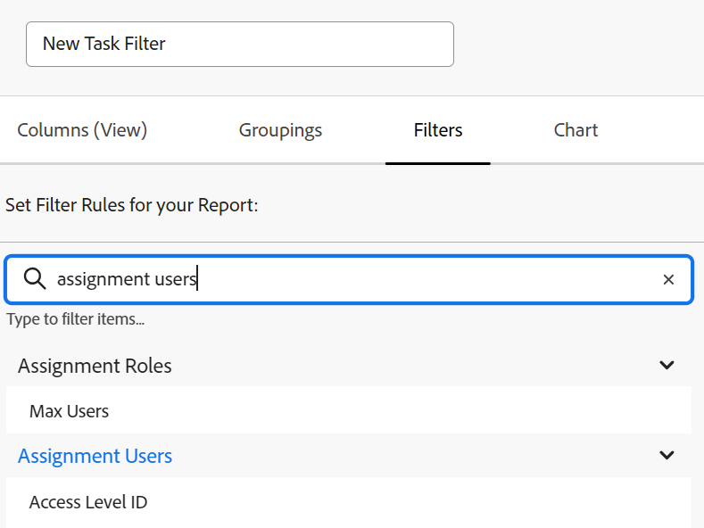

# Berichte oder Listen: Benutzende anzeigen, die mit einem Objekt verknüpft sind

Sie können Benutzer, Aufgabengebiete und Teams, die mit Objekten in Berichten oder Listen verknüpft sind, anzeigen und in Filtern auf diese verweisen. Sie können nicht nach Benutzern, Aufgabengebieten oder Teams gruppieren, die mit Objekten verknüpft sind.

Sie können nach Benutzern, Jobrollen oder Teams, die den folgenden Objekten zugeordnet sind, anzeigen oder filtern:

<table style="table-layout:auto"> 
 <col> 
 <col> 
 <tbody> 
  <tr> 
   <td role="rowheader">Objekt</td> 
   <td>Zugeordnete Benutzer oder Jobrollen</td> 
  </tr> 
  <tr> 
   <td role="rowheader">Projekt</td> 
   <td> 
Sie können alle Benutzer und die Auftragsrollen, die sie im Projekt erfüllen, in einem Projektbericht anzeigen. Sie können in einem Projektbericht nicht nach den Benutzern oder ihren zugeordneten Auftragsrollen filtern. 
 </td> 
  </tr> 
  <tr> 
   <td role="rowheader">Aufgaben</td> 
   <td>Sie können alle Benutzer, Jobrollen und Teams, die einer Aufgabe in einem Aufgabenbericht zugewiesen sind, anzeigen und filtern.</td> 
  </tr> 
  <tr> 
   <td role="rowheader">Probleme</td> 
   <td>Sie können in einem Problembericht nach allen Benutzern, Aufgabengebieten und Teams filtern, die einem Problem zugewiesen sind.</td> 
  </tr> 
  <tr> 
   <td role="rowheader">Portfolios</td> 
   <td>Sie können alle Benutzer und die Auftragsrollen, die sie für das Projekt erfüllen, in einem Projektbericht anzeigen und den Bericht nach Portfolio gruppieren. Sie können in einem Projektbericht nicht nach den Benutzern oder ihren zugeordneten Auftragsrollen filtern.</td> 
  </tr> 
  <tr> 
   <td role="rowheader">Programme</td> 
   <td>Sie können alle Benutzer und die Auftragsrollen, die sie für das Projekt erfüllen, in einem Projektbericht anzeigen und den Bericht nach Programm gruppieren. Sie können in einem Projektbericht nicht nach den Benutzern oder ihren zugeordneten Auftragsrollen filtern.</td> 
  </tr> 
 </tbody> 
</table>

## Alle Benutzer und Jobrollen anzeigen, die einem Projekt zugeordnet sind

Sie können alle Benutzer, die mit dem Projekt verknüpft sind, in der Ansicht einer Projektliste oder eines Berichts anzeigen. Dies schließt alle Benutzer ein, die im Abschnitt Personen des Projekts aufgeführt sind. Sie können in einem Projektbericht auch die Rollen anzeigen, mit denen sie verknüpft sind, wenn sie Vorgängen oder Problemen im Projekt zugewiesen werden.

Informationen zum Erstellen eines Projektberichts, in dem alle Benutzenden und ihre Rollen im Projekt angezeigt werden, finden Sie [Ansicht: Liste der Projektbenutzenden mit Aufgabengebieten](../../../reports-and-dashboards/reports/custom-view-filter-grouping-samples/view-project-user-list.md).

Sie können nicht nach Benutzern oder Aufgabengebieten filtern, die mit Projekten in einem Projektfilter verknüpft sind.

## Alle Benutzer, Aufgabengebiete oder Teams anzeigen, die einer Aufgabe zugewiesen sind

Sie können alle Benutzer, Rollen oder Teams, die einer Aufgabe zugewiesen sind, in der Ansicht einer Aufgabenliste oder eines Berichts anzeigen, indem Sie der Ansicht das Feld Zuweisungen hinzufügen.

Sie können nach Benutzern, Jobrollen oder Teams filtern, die Aufgaben zugewiesen sind, indem Sie auf die folgenden Felder in einem Aufgabenfilter verweisen:

* Arbeitsauftrag – Benutzer
* Arbeitsauftrag – Aufgabengebiete
* Team

## Alle Benutzer, Jobrollen oder Teams anzeigen, die einem Problem zugewiesen sind

Sie können alle Benutzenden, Rollen oder Teams, die einem Problem zugewiesen sind, in der Ansicht einer Problemliste oder eines Berichts anzeigen, indem Sie das Feld Zuweisungen zur Ansicht hinzufügen.

Sie können nach Benutzern, Aufgabengebieten oder Teams filtern, die Problemen zugewiesen sind, indem Sie in einem Problemfilter auf die folgenden Felder verweisen:

* Arbeitsauftrag – Benutzer
* Arbeitsauftrag – Aufgabengebiete
* Team

## Alle Benutzer und Jobrollen anzeigen, die einem Portfolio zugeordnet sind

Sie können alle Benutzer und Rollen anzeigen, die einem Portfolio zugeordnet sind, indem Sie sie in einem Projektbericht anzeigen und den Bericht dann nach Portfolios gruppieren.

Informationen zum Erstellen eines Projektberichts, um alle Benutzer und ihre Rollen im Projekt anzuzeigen, finden Sie unter [Ansicht: Liste der Projektbenutzer mit Auftrags rollen](../../../reports-and-dashboards/reports/custom-view-filter-grouping-samples/view-project-user-list.md).

Sie können nicht nach Benutzern oder Auftragsrollen filtern, die Projekten in einem Portfolio- oder Projektfilter zugeordnet sind.

## Alle Benutzer und Jobrollen anzeigen, die einem Programm zugeordnet sind

Sie können alle mit einem Programm verbundenen Benutzer und Rollen anzeigen, indem Sie sie in einem Projektbericht anzeigen und dann den Bericht nach Programm gruppieren.

Informationen zum Erstellen eines Projektberichts, in dem alle Benutzenden und ihre Rollen im Projekt angezeigt werden, finden Sie [Ansicht: Liste der Projektbenutzenden mit Aufgabengebieten](../../../reports-and-dashboards/reports/custom-view-filter-grouping-samples/view-project-user-list.md).

Sie können nicht nach Benutzern oder Aufgabengebieten filtern, die mit Projekten in einem Programm- oder Projektfilter verknüpft sind.
