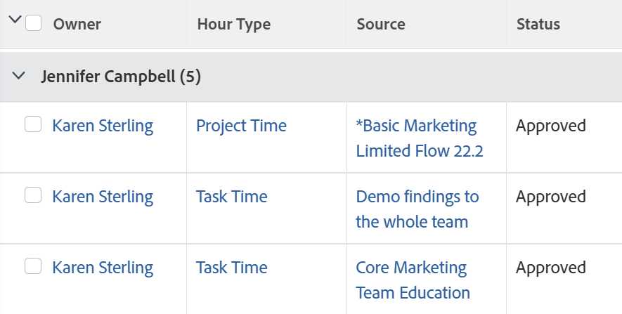

# Gruppierung: Projekt-Sponsor für Stunden

<!--Audited: 10/2024-->

Diese Stundengruppierung organisiert Stunden nach Sponsor des Projekts, in dem die Stunden protokolliert werden. Die standardmäßige Report Builder-Benutzeroberfläche für Ihre Gruppierungen bietet keine Zuordnung zum Feld Projektsponsor . Sie müssen die Textmodus-Oberfläche verwenden, um auf dieses Feld zuzugreifen.



## Zugriffsanforderungen

+++ Erweitern, um die Zugriffsanforderungen für die in diesem Artikel beschriebene Funktionalität anzuzeigen. 

<table style="table-layout:auto"> 
 <col> 
 <col> 
 <tbody> 
  <tr> 
   <td role="rowheader">Adobe Workfront-Paket</td> 
   <td> <p>Beliebig</p> </td> 
  </tr> 
  <tr> 
   <td role="rowheader">Adobe Workfront-Lizenz</td> 
   <td> 
   <p>Mitwirkender oder Anfrage zum Ändern eines Filters </p>
   <p>Standard oder Plan zum Ändern eines Berichts</p>
  </tr> 
  <tr> 
   <td role="rowheader">Konfigurationen der Zugriffsebene</td> 
   <td> <p>Zugriff auf Berichte, Dashboards und Kalender bearbeiten, um einen Bericht zu ändern</p> <p>Zugriff auf Filter, Ansichten, Gruppierungen bearbeiten, um einen Filter zu ändern</p> </td> 
  </tr> 
  <tr> 
   <td role="rowheader">Objektberechtigungen</td> 
   <td> <p>Verwalten von Berechtigungen für einen Bericht</p>  </td> 
  </tr> 
 </tbody> 
</table>

Weitere Details zu den Informationen in dieser Tabelle finden Sie unter [Zugriffsanforderungen in der Dokumentation zu Workfront](/help/quicksilver/administration-and-setup/add-users/access-levels-and-object-permissions/access-level-requirements-in-documentation.md).

+++

## Nach Projektsponsor gruppieren für Stunden

Um diese Gruppierung anzuwenden:

1. Zu einer Stundenliste gehen.
1. Wählen Sie **Dropdown-Menü** Gruppierung“ **Neue Gruppierung** aus.

1. Klicken Sie **In Textmodus wechseln**.
1. Entfernen Sie den Text im angezeigten Bereich und ersetzen Sie ihn durch den folgenden Code:

```
   group.0.linkedname=project:sponsor:name
   group.0.name=
   group.0.valuefield=project:sponsor:name
   group.0.valueformat=HTML
   textmode=true
```

1. Klicken Sie auf **Fertig**.
1. Aktualisieren Sie den Gruppierungsnamen und klicken Sie dann auf **Gruppierung speichern**.
