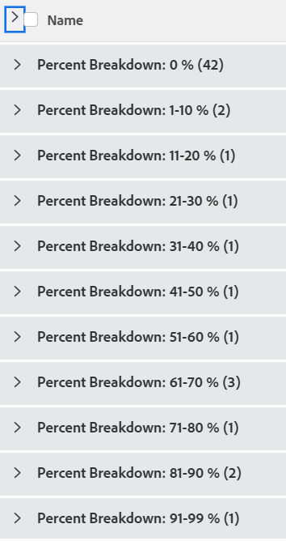

# Gruppierung: prozentuale Aufschlüsselung der Aufgabe 2

<!--Audited: 10/2024-->

In dieser benutzerdefinierten Aufgabengruppe können Sie Aufgaben gruppiert nach einem Bereich ihrer Prozentwerte für den Abschluss anzeigen. Die Aufschlüsselungen zeigen den prozentualen Abschlusswert in Schritten von 10 Prozentpunkten an: 1-10 %, 11-20 % usw.

Die folgende Gruppierung organisiert Projekte nach dem Wert &quot;Prozent abgeschlossen&quot; in einer dieser Gruppierungen:

* 0%
* 1-10 %
* 11-20 %
* 21-30 %
* 31-40 %
* 41-50 %
* 51-60 %
* 61-70 %
* 71-80 %
* 81-90 %
* 91-99 %
* 100%



## Zugriffsanforderungen

+++ Erweitern, um die Zugriffsanforderungen für die in diesem Artikel beschriebene Funktionalität anzuzeigen. 

<table style="table-layout:auto"> 
 <col> 
 <col> 
 <tbody> 
  <tr> 
   <td role="rowheader">Adobe Workfront-Paket</td> 
   <td> <p>Beliebig</p> </td> 
  </tr> 
  <tr> 
   <td role="rowheader">Adobe Workfront-Lizenz</td> 
   <td> 
   <p>Anbieter oder Anforderung zum Ändern eines Filters </p>
   <p>Standard oder Plan zum Ändern eines Berichts</p>
  </tr> 
  <tr> 
   <td role="rowheader">Konfigurationen der Zugriffsebene</td> 
   <td> <p>Zugriff auf Berichte, Dashboards, Kalender bearbeiten, um einen Bericht zu ändern</p> <p>Bearbeitungszugriff auf Filter, Ansichten, Gruppierungen zum Ändern eines Filters</p> </td> 
  </tr> 
  <tr> 
   <td role="rowheader">Objektberechtigungen</td> 
   <td> <p>Berechtigungen für einen Bericht verwalten</p>  </td> 
  </tr> 
 </tbody> 
</table>

Weitere Details zu den Informationen in dieser Tabelle finden Sie unter [Zugriffsanforderungen in der Dokumentation zu Workfront](/help/quicksilver/administration-and-setup/add-users/access-levels-and-object-permissions/access-level-requirements-in-documentation.md).

+++

## Aufschlüsselung nach Vorgangsprozentsatz

So wenden Sie diese Gruppierung an:

1. Wechseln Sie zu einer Liste von Aufgaben.
1. Wählen Sie **Dropdown-Menü** Gruppierung“ **Neue Gruppierung** aus.
1. Klicken Sie **Gruppierung hinzufügen**.

1. Klicken **Wechseln Sie in den Textmodus**.
1. Entfernen Sie den Text im Bereich **Gruppe nach**.
1. Ersetzen Sie den Text durch folgenden Code:

   ```
   group.0.linkedname=direct
   group.0.name=Percent Breakdown
   group.0.notime=false
   group.0.valueexpression=IF({percentComplete}=0,"0 %",IF({percentComplete}<=11,"1-10 %",IF({percentComplete}<=21,"11-20 %",IF({percentComplete}<=31,"21-30 %",IF({percentComplete}<41,"31-40 %",IF({percentComplete}<51,"41-50 %",IF({percentComplete}<61,"51-60 %",IF({percentComplete}<71,"61-70 %",IF({percentComplete}<81,"71-80 %",IF({percentComplete}<91,"81-90 %",IF({percentComplete}<100,"91-99 %","100 %")))))))))))
   textmode=true
   ```

1. Klicken Sie auf **Fertig** > **Gruppierung speichern**.
1. (Optional) Aktualisieren Sie den Gruppierungsnamen, und klicken Sie dann auf **Gruppierung speichern**.
