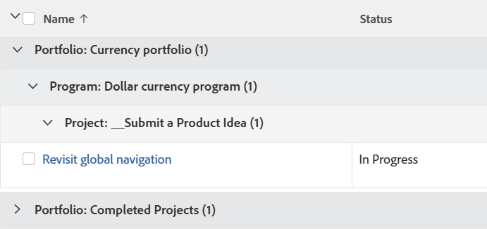

# Gruppierung: Aufgaben nach Portfolio, Programm und Projekt

<!--Audited: 10/2024-->

Verwenden Sie diese Aufgabengruppierung, um Aufgaben nach Portfolio, Programm und Projekt zu gruppieren, dem sie zugeordnet sind.



## Zugriffsanforderungen

+++ Erweitern, um die Zugriffsanforderungen für die in diesem Artikel beschriebene Funktionalität anzuzeigen. 

<table style="table-layout:auto"> 
 <col> 
 <col> 
 <tbody> 
  <tr> 
   <td role="rowheader">Adobe Workfront-Paket</td> 
   <td> <p>Beliebig</p> </td> 
  </tr> 
  <tr> 
   <td role="rowheader">Adobe Workfront-Lizenz</td> 
   <td> 
   <p>Mitwirkender oder Anfrage zum Ändern eines Filters </p>
   <p>Standard oder Plan zum Ändern eines Berichts</p>
  </tr> 
  <tr> 
   <td role="rowheader">Konfigurationen der Zugriffsebene</td> 
   <td> <p>Zugriff auf Berichte, Dashboards und Kalender bearbeiten, um einen Bericht zu ändern</p> <p>Zugriff auf Filter, Ansichten, Gruppierungen bearbeiten, um einen Filter zu ändern</p> </td> 
  </tr> 
  <tr> 
   <td role="rowheader">Objektberechtigungen</td> 
   <td> <p>Verwalten von Berechtigungen für einen Bericht</p>  </td> 
  </tr> 
 </tbody> 
</table>

Weitere Details zu den Informationen in dieser Tabelle finden Sie unter [Zugriffsanforderungen in der Dokumentation zu Workfront](/help/quicksilver/administration-and-setup/add-users/access-levels-and-object-permissions/access-level-requirements-in-documentation.md).

+++

## Aufgaben nach Portfolio, Programm und Projekt gruppieren

Um diese Gruppierung anzuwenden:

1. Zu einer Aufgabenliste gehen.
1. Wählen Sie **Dropdown-Menü** Gruppierung“ **Neue Gruppierung** aus.
1. Klicken Sie **Gruppierung hinzufügen**.

1. Klicken **Wechseln Sie in den Textmodus**.
1. Entfernen Sie den Text im Bereich **Gruppieren nach**.
1. Ersetzen Sie den Text durch den folgenden Code:

   ```
   group.0.linkedname=project
   group.0.namekey=portfolio
   group.0.notime=false
   group.0.valuefield=project:portfolio:name
   group.0.valueformat=string
   group.1.linkedname=project
   group.1.namekey=program
   group.1.notime=false
   group.1.valuefield=project:program:name
   group.1.valueformat=string
   group.2.name=Project
   group.2.valuefield=project:name
   group.2.valueformat=HTML
   textmode=true
   ```

1. Klicken Sie **Fertig** > **Gruppierung speichern**.
1. (Optional) Aktualisieren Sie den Gruppierungsnamen und klicken Sie dann auf **Gruppierung speichern**.

