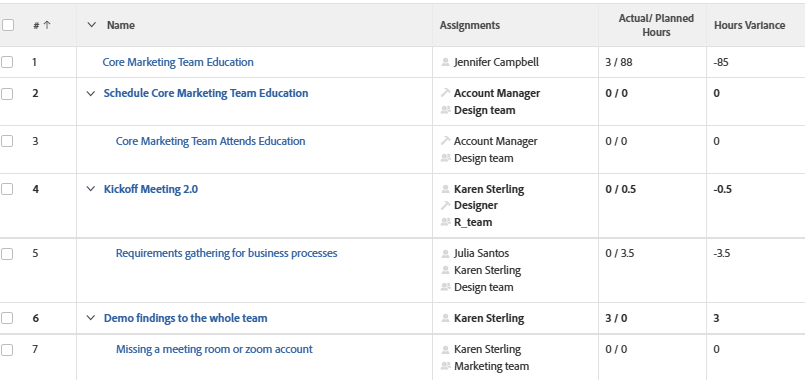

# Ansicht: Tatsächliche Stunden über geplante Stunden in derselben Spalte einer Aufgabenansicht

In dieser Aufgabenansicht wird die tatsächliche Anzahl von Stunden, die für eine Aufgabe aufgezeichnet wurden, über die für jede Aufgabe geplanten Stunden angezeigt. Die Stundenabweichung zwischen den geplanten und den tatsächlichen Stunden wird ebenfalls in einer separaten Spalte angezeigt.



## Zugriffsanforderungen

<!--Audited: 10/2024-->

+++ Erweitern, um die Zugriffsanforderungen für die in diesem Artikel beschriebene Funktionalität anzuzeigen. 

<table style="table-layout:auto"> 
 <col> 
 <col> 
 <tbody> 
  <tr> 
   <td role="rowheader">Adobe Workfront-Paket</td> 
   <td> <p>Beliebig</p> </td> 
  </tr> 
  <tr> 
   <td role="rowheader">Adobe Workfront-Lizenz</td> 
   <td> 
   <p>Mitwirkender oder Anfrage zum Ändern eines Filters </p>
   <p>Standard oder Plan zum Ändern eines Berichts</p>
  </tr> 
  <tr> 
   <td role="rowheader">Konfigurationen der Zugriffsebene</td> 
   <td> <p>Zugriff auf Berichte, Dashboards und Kalender bearbeiten, um einen Bericht zu ändern</p> <p>Zugriff auf Filter, Ansichten, Gruppierungen bearbeiten, um einen Filter zu ändern</p> </td> 
  </tr> 
  <tr> 
   <td role="rowheader">Objektberechtigungen</td> 
   <td> <p>Verwalten von Berechtigungen für einen Bericht</p>  </td> 
  </tr> 
 </tbody> 
</table>

Weitere Details zu den Informationen in dieser Tabelle finden Sie unter [Zugriffsanforderungen in der Dokumentation zu Workfront](/help/quicksilver/administration-and-setup/add-users/access-levels-and-object-permissions/access-level-requirements-in-documentation.md).

+++

## Tatsächliche Stunden über geplante Stunden in einer Aufgabenansicht anzeigen

Um diese Ansicht anzuwenden:

1. Zu einer Aufgabenliste gehen.
1. Wählen Sie **Dropdown** Menü „Ansicht“ die Option **Neue Ansicht**.
1. Entfernen Sie **Bereich „Spaltenvorschau** alle Spalten mit Ausnahme einer Spalte.
1. Klicken Sie auf die Kopfzeile der verbleibenden Spalte und dann auf **In Textmodus wechseln**.
1. Bewegen Sie den Mauszeiger über den Textmodusbereich und klicken Sie auf **Textmodus bearbeiten**.
1. Entfernen Sie den Text aus dem Feld Textmodus und ersetzen Sie ihn durch den folgenden Code:

   ```
   column.0.descriptionkey=name
   column.0.link.linkproperty.0.name=ID
   column.0.link.linkproperty.0.valuefield=ID
   column.0.link.linkproperty.0.valueformat=int
   column.0.link.lookup=link.view
   column.0.link.valuefield=objCode
   column.0.link.valueformat=val
   column.0.linkedname=direct
   column.0.listsort=string(name)
   column.0.namekey=name.abbr
   column.0.querysort=name
   column.0.shortview=false
   column.0.stretch=100
   column.0.valuefield=name
   column.0.valueformat=HTML
   column.0.width=150
   column.1.viewalias=assignments
   column.1.displayname=
   column.1.linkedname=direct
   column.1.namekey=assignments
   column.1.valuefield=assignmentsListString
   column.1.valueformat=HTML
   column.1.tile.name=component.assignmentslist
   column.2.displayname=Actual/ Planned Hours
   column.2.linkedname=direct
   column.2.namekey=actualworkrequired
   column.2.querysort=actualWork
   column.2.textmode=true
   column.2.valueexpression=CONCAT({actualWorkRequired}/60,' / ',{workRequired}/60)
   column.2.valuefield=actualWorkRequired
   column.2.valueformat=compound
   column.2.viewalias=actualworkrequired
   column.3.aggregator.function=SUM
   column.3.aggregator.valueexpression=SUB({actualWork}, {workRequired})
   column.3.aggregator.valueformat=compound
   column.3.displayname=Hours Variance
   column.3.linkedname=direct
   column.3.textmode=true
   column.3.valueexpression=SUB({actualWork}, {workRequired})/60
   column.3.valueformat=customNumberAsString
   ```

1. Klicken Sie **Fertig** und dann **Ansicht speichern**.
