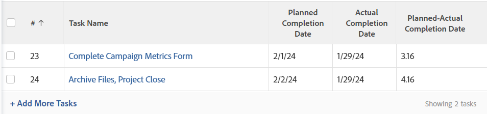

# Ansicht: Uhrzeit- und Datumsunterschiede berechnen

<!-- Audited: 11/2024 -->

>[!IMPORTANT]
>
>Sie können die Zeit- und Datumsdifferenz in Adobe Workfront zwischen zwei verschiedenen Objekten desselben Typs nicht berechnen. Beispielsweise können Sie die Zeit- und Datumsdifferenz zwischen zwei Datumsangaben in zwei verschiedenen Projekten, Vorgängen oder Problemen nicht berechnen.

Sie können den Unterschied zwischen den folgenden berechnen:

* Die Zeit- und Datumsdifferenz zwischen zwei Datumsfeldern im selben Objekt
* Die Zeit- und Datumsdifferenz zwischen einem Feld eines Objekts und einem anderen Feld des übergeordneten Objekts

>[!TIP]
>
>Diese Berechnungen zeigen die Anzahl der Tage zwischen den beiden Datumsangaben an. Das Ergebnis wird in Tagen angezeigt. Der Zeitstempel im Datumsfeld wird ebenfalls berücksichtigt, und auf die Anzahl der Tage können Dezimalstellen folgen, wenn die Zeitstempel nicht übereinstimmen. Wenn die Aufgabe verspätet abgeschlossen wurde, wird die Anzahl der Tage als negativer Wert angezeigt.

## Zugriffsanforderungen

+++ Erweitern, um die Zugriffsanforderungen für die in diesem Artikel beschriebene Funktionalität anzuzeigen.

<table style="table-layout:auto"> 
 <col> 
 <col> 
 <tbody> 
  <tr> 
   <td role="rowheader">Adobe Workfront-Paket</td> 
   <td> <p>Beliebig</p> </td> 
  </tr> 
  <tr> 
   <td role="rowheader">Adobe Workfront-Lizenz</td> 
   <td> 
   <p>Anbieter oder Anforderung zum Ändern eines Filters </p>
   <p>Standard oder Abo zum Ändern eines Berichts</p>
  </tr> 
  <tr> 
   <td role="rowheader">Konfigurationen der Zugriffsebene</td> 
   <td> <p>Zugriff auf Berichte, Dashboards, Kalender bearbeiten, um einen Bericht zu ändern</p> <p>Bearbeitungszugriff auf Filter, Ansichten, Gruppierungen zum Ändern eines Filters</p> </td> 
  </tr> 
  <tr> 
   <td role="rowheader">Objektberechtigungen</td> 
   <td> <p>Berechtigungen für einen Bericht verwalten</p>  </td> 
  </tr> 
 </tbody> 
</table>

Weitere Details zu den Informationen in dieser Tabelle finden Sie unter [Zugriffsanforderungen in der Dokumentation zu Workfront](/help/quicksilver/administration-and-setup/add-users/access-levels-and-object-permissions/access-level-requirements-in-documentation.md).

+++

## Berechnen der Zeit- und Datumsdifferenz zwischen zwei Datumsfeldern im selben Objekt

Sie können beispielsweise die Differenz zwischen dem geplanten Abschlussdatum und dem aktuellen Abschlussdatum eines Vorgangs berechnen.



1. Wechseln Sie zu einer Liste von Aufgaben.
1. Klicken Sie im Dropdown-Menü **Ansicht** auf **Neue Ansicht**.

1. Klicken Sie auf **Spalte hinzufügen**, und geben Sie im Feld **In dieser Spalte anzeigen** &quot;Geplantes Abschlussdatum&quot; ein. Wählen Sie diese Spalte aus, wenn sie in der Liste angezeigt wird.

1. Klicken Sie auf **Spalte hinzufügen**, und geben Sie im Feld **In dieser Spalte anzeigen** &quot;Aktuelles Abschlussdatum&quot; ein. Wählen Sie diese Spalte aus, wenn sie in der Liste angezeigt wird.

1. Klicken Sie auf **Spalte hinzufügen**, und klicken Sie dann auf **In Textmodus wechseln**.

1. Bewegen Sie den Mauszeiger über den Textmodusbereich und klicken Sie auf **Klicken Sie, um Text zu bearbeiten**.
1. Entfernen Sie den Text, den Sie im Feld **Textmodus** finden, und ersetzen Sie ihn durch folgenden Code:

   ```
    displayname=Planned-Actual Completion Date
    linkedname=direct
    querysort=plannedCompletionDate
    textmode=true
    valueexpression=ROUND(DATEDIFF({plannedCompletionDate},{actualCompletionDate}),2)
    valueformat=HTML
   ```

1. Klicken Sie auf **Speichern** und anschließend auf **Ansicht speichern**.

## Berechnen der Zeit- und Datumsdifferenz zwischen dem Feld eines Objekts und einem anderen Feld eines übergeordneten Objekts

Eine Liste der Objekte und ihrer übergeordneten Objekte finden Sie im Abschnitt &quot;Verstehen der Interdependenz und Hierarchie von Objekten&quot; in [Verstehen von Objekten in Adobe Workfront](../../../workfront-basics/navigate-workfront/workfront-navigation/understand-objects.md).\
Sie können beispielsweise die Differenz zwischen dem geplanten Abschlussdatum eines Vorgangs und dem geplanten Abschlussdatum des übergeordneten Vorgangs oder des Projekts, an dem sich der Vorgang befindet, berechnen.


1. Wechseln Sie zu einer Liste von Aufgaben.
1. Klicken Sie im Dropdown-Menü **Ansicht** auf **Neue Ansicht**.

1. Klicken Sie auf **Spalte hinzufügen** und geben Sie im Feld **In dieser Spalte anzeigen** das Feld &quot; Projekt geplant Abschlussdatum&quot; oder &quot;Übergeordnetes Abschlussdatum&quot; ein. Wählen Sie es dann aus, wenn es in der Liste angezeigt wird.

1. Klicken Sie auf **Spalte hinzufügen**, und geben Sie im Feld **In dieser Spalte anzeigen** &quot;Geplantes Abschlussdatum&quot; ein. Wählen Sie diese Spalte aus, wenn sie in der Liste angezeigt wird.

1. Klicken Sie auf **Spalte hinzufügen**, und klicken Sie dann auf **In Textmodus wechseln** > **Textmodus bearbeiten**.
1. Entfernen Sie den Text, den Sie im Feld **Textmodus bearbeiten** finden, und ersetzen Sie ihn durch einen der folgenden Codes:

   * So zeigen Sie die Differenz zwischen dem geplanten Abschlussdatum des Projekts und dem des Vorgangs an:

     ```
      displayname=Project Planned Completion - Task Planned Completion (Days)
      textmode=true
      valueexpression=ROUND(DATEDIFF({project}.{plannedCompletionDate},{plannedCompletionDate}),2)
      valueformat=HTML
     ```

   * So zeigen Sie die Differenz zwischen dem geplanten Abschlussdatum des übergeordneten Vorgangs und dem des Vorgangs an:

     ```
      valueexpression=ROUND(DATEDIFF({parent}.{plannedCompletionDate},{plannedCompletionDate}),2)
      textmode=true<br>valueformat=HTML
      displayname=Parent Planned Completion - Planned Completion (Days)
     ```

1. Klicken Sie auf **Fertig** und anschließend auf **Ansicht speichern**.
