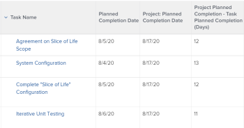

# Ansicht: Zeit- und Datumsunterschiede berechnen

>[!IMPORTANT]
>
>Sie können die Zeit- und Datumsdifferenz in Adobe Workfront nicht zwischen zwei verschiedenen Objekten desselben Typs berechnen. Sie können beispielsweise nicht die Zeit- und Datumsdifferenz zwischen zwei Daten aus zwei verschiedenen Projekten, Aufgaben oder Problemen berechnen.

Sie können den Unterschied zwischen den folgenden Werten berechnen:

* Zeit- und Datumsdifferenz zwischen zwei Datumsfeldern im selben Objekt
* Die Zeit- und Datumsdifferenz zwischen dem Feld eines Objekts und einem anderen Feld des übergeordneten Objekts

>[!TIP]
>
>Diese Berechnungen zeigen die Anzahl der Tage zwischen den beiden Daten an. Das Ergebnis wird in Tagen angezeigt. Der Zeitstempel im Datumsfeld wird ebenfalls berücksichtigt, und die Anzahl der Tage kann von Dezimalstellen gefolgt werden, wenn die Zeitstempel nicht übereinstimmen. Wenn die Aufgabe zu spät abgeschlossen wurde, wird die Anzahl der Tage als negativer Wert angezeigt.

## Zugriffsanforderungen

Sie müssen über folgenden Zugriff verfügen, um die Schritte in diesem Artikel ausführen zu können:

<table style="table-layout:auto"> 
 <col> 
 <col> 
 <tbody> 
  <tr> 
   <td role="rowheader">Adobe Workfront-Plan*</td> 
   <td> <p>Beliebig</p> </td> 
  </tr> 
  <tr> 
   <td role="rowheader">Adobe Workfront-Lizenz*</td> 
   <td> <p>Anforderung zum Ändern einer Ansicht </p>
   <p>Berichtänderung planen</p> </td> 
  </tr> 
  <tr> 
   <td role="rowheader">Konfigurationen auf Zugriffsebene*</td> 
   <td> <p>Zugriff auf Berichte, Dashboards und Kalender bearbeiten, um einen Bericht zu ändern</p> <p>Zugriff auf Filter, Ansichten und Gruppierungen bearbeiten, um eine Ansicht zu ändern</p> <p><b>NOTIZ</b>

Wenn Sie immer noch keinen Zugriff haben, fragen Sie Ihren Workfront-Administrator, ob er zusätzliche Zugriffsbeschränkungen für Ihre Zugriffsebene festlegt. Informationen dazu, wie ein Workfront-Administrator Ihre Zugriffsebene ändern kann, finden Sie unter <a href="../../../administration-and-setup/add-users/configure-and-grant-access/create-modify-access-levels.md" class="MCXref xref">Benutzerdefinierte Zugriffsebenen erstellen oder ändern</a>.</p> </td>
</tr>  
  <tr> 
   <td role="rowheader">Objektberechtigungen</td> 
   <td> <p>Berechtigungen für einen Bericht verwalten</p> <p>Informationen zum Anfordern von zusätzlichem Zugriff finden Sie unter <a href="../../../workfront-basics/grant-and-request-access-to-objects/request-access.md" class="MCXref xref">Zugriff auf Objekte anfordern </a>.</p> </td> 
  </tr> 
 </tbody> 
</table>

&#42;Wenden Sie sich an Ihren Workfront-Administrator, um zu erfahren, welchen Plan, welchen Lizenztyp oder welchen Zugriff Sie haben.

## die Zeit- und Datumsdifferenz zwischen zwei Datumsfeldern desselben Objekts berechnen

Sie können beispielsweise die Differenz zwischen dem geplanten Abschlussdatum und dem tatsächlichen Abschlussdatum einer Aufgabe berechnen.


1. Gehen Sie zu einer Liste von Aufgaben.
1. Aus dem **Ansicht** Dropdown-Menü, klicken Sie auf **Neue Ansicht**.

1. Klicks **Spalte hinzufügen** und beginnen Sie mit der Eingabe von &quot;Geplantes Abschlussdatum&quot;im **In dieser Spalte anzeigen** und wählen Sie es aus, wenn es in der Liste angezeigt wird.

1. Klicks **Spalte hinzufügen** und beginnen Sie mit der Eingabe von &quot;Tatsächliches Abschlussdatum&quot;im **In dieser Spalte anzeigen** und wählen Sie es aus, wenn es in der Liste angezeigt wird.

1. Klicks **Spalte hinzufügen** Klicken Sie auf **In den Textmodus wechseln**.

1. Bewegen Sie den Mauszeiger über den Textmodusbereich und klicken Sie auf **Klicken, um Text zu bearbeiten**.
1. Entfernen Sie den Text, den Sie im **Textmodus** und ersetzen Sie sie durch den folgenden Code:

   ```
   displayname=Planned-Actual Completion Date<br>linkedname=direct<br>querysort=plannedCompletionDate<br>textmode=true<br>valueexpression=ROUND(DATEDIFF({plannedCompletionDate},{actualCompletionDate}),2)<br>valueformat=HTML
   ```

1. Klicks **Speichern**, dann **Ansicht speichern**.

## Berechnung der Zeit- und Datumsdifferenz zwischen dem Feld eines Objekts und einem anderen Feld eines übergeordneten Objekts

Eine Liste der Objekte und ihrer übergeordneten Elemente finden Sie im Abschnitt &quot;Die Interdependenz und Hierarchie von Objekten verstehen&quot;unter [Objekte in Adobe Workfront verstehen](../../../workfront-basics/navigate-workfront/workfront-navigation/understand-objects.md).\
Sie können beispielsweise die Differenz zwischen dem geplanten Abschlussdatum einer Aufgabe und dem geplanten Abschlussdatum der übergeordneten Aufgabe oder des Projekts berechnen, in dem sich die Aufgabe befindet.



1. Gehen Sie zu einer Liste von Aufgaben.
1. Aus dem **Ansicht** Dropdown-Menü, klicken Sie auf **Neue Ansicht**.

1. Klicks **Spalte hinzufügen** und beginnen Sie mit der Eingabe von &quot;Projekt geplant Abschlussdatum&quot;oder &quot;Übergeordnetes Abschlussdatum&quot;in die **In dieser Spalte anzeigen** und wählen Sie es aus, wenn es in der Liste angezeigt wird.

1. Klicks **Spalte hinzufügen** und beginnen Sie mit der Eingabe von &quot;Geplantes Abschlussdatum&quot;im **In dieser Spalte anzeigen** und wählen Sie es aus, wenn es in der Liste angezeigt wird.

1. Klicks **Spalte hinzufügen** Klicken Sie auf **In den Textmodus wechseln**.

1. Bewegen Sie den Mauszeiger über den Textmodusbereich und klicken Sie auf **Klicken, um Text zu bearbeiten**.
1. Entfernen Sie den Text, den Sie im **Textmodus** und ersetzen Sie sie durch einen der folgenden Codes:

   * So zeigen Sie den Unterschied zwischen dem geplanten Abschlussdatum des Projekts und dem der Aufgabe an:

     ```
     displayname=Project Planned Completion - Task Planned Completion (Days)<br>textmode=true<br>valueexpression=ROUND(DATEDIFF({project}.{plannedCompletionDate},{plannedCompletionDate}),2)<br>valueformat=HTML
     ```

   * So zeigen Sie den Unterschied zwischen dem geplanten Abschlussdatum der übergeordneten Aufgabe und dem der Aufgabe an:

     ```
     valueexpression=ROUND(DATEDIFF({parent}.{plannedCompletionDate},{plannedCompletionDate}),2)<br>textmode=true<br>valueformat=HTML<br>displayname=Parent Planned Completion - Planned Completion (Days)
     ```

1. Klicks **Speichern**, dann **Ansicht speichern**.
