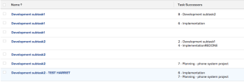

# Ansicht: Hinzufügen einer Liste von Aufgabennachfolgern in einer Spalte

Sie können einer Aufgabenansicht eine Spalte hinzufügen, um eine Liste der Nachfolger der Aufgaben anzuzeigen. Die Spalte **Aufgabenerfolger** enthält die Nummer des Nachfolgers sowie den Namen.

## Zugriffsanforderungen

Sie müssen über folgenden Zugriff verfügen, um die Schritte in diesem Artikel ausführen zu können:

<table style="table-layout:auto"> 
 <col> 
 <col> 
 <tbody> 
  <tr> 
   <td role="rowheader">Adobe Workfront-Plan*</td> 
   <td> 
Alle
 </td> 
  </tr> 
  <tr> 
   <td role="rowheader">Adobe Workfront-Lizenz*</td> 
   <td> 
Anforderung zum Ändern einer Ansicht 

   
Berichtänderung planen
 </td> 
  </tr> 
  <tr> 
   <td role="rowheader">Konfigurationen auf Zugriffsebene*</td> 
   <td> 
Zugriff auf Berichte, Dashboards und Kalender bearbeiten, um einen Bericht zu ändern
 
Zugriff auf Filter, Ansichten und Gruppierungen bearbeiten, um eine Ansicht zu ändern
 
<b>NOTIZ</b>

Wenn Sie immer noch keinen Zugriff haben, fragen Sie Ihren Workfront-Administrator, ob er zusätzliche Zugriffsbeschränkungen für Ihre Zugriffsebene festlegt. Informationen dazu, wie ein Workfront-Administrator Ihre Zugriffsebene ändern kann, finden Sie unter <a href="../../../administration-and-setup/add-users/configure-and-grant-access/create-modify-access-levels.md" class="MCXref xref">Benutzerdefinierte Zugriffsebenen erstellen oder ändern</a>.
 </td>
</tr> 
  <tr> 
   <td role="rowheader">Objektberechtigungen</td> 
   <td> 
Berechtigungen für einen Bericht verwalten
 
Weitere Informationen zum Anfordern von zusätzlichem Zugriff finden Sie unter <a href="../../../workfront-basics/grant-and-request-access-to-objects/request-access.md" class="MCXref xref">Anfordern des Zugriffs auf Objekte </a>.
 </td> 
  </tr> 
 </tbody> 
</table>

&#42;Wenden Sie sich an Ihren Workfront-Administrator, um zu erfahren, welchen Plan, welchen Lizenztyp oder welchen Zugriff Sie haben.

## Hinzufügen einer Liste von Aufgabennachfolgern in einer Spalte

So fügen Sie diese Spalte einer Aufgabenansicht hinzu:

1. Wechseln Sie zu einer vorhandenen Aufgabenansicht.
1. Erweitern Sie das Dropdown-Menü Ansicht und wählen Sie **Ansicht anpassen** aus.
1. Klicken Sie auf **Spalte hinzufügen**.
1. Klicken Sie auf **Wechseln zum Textmodus**.
1. Bewegen Sie den Mauszeiger über den Bereich **In dieser Spalte anzeigen** und klicken Sie auf **Klicken Sie auf , um Text zu bearbeiten**.

1. Entfernen Sie den gesamten Text im Feld Textmodus und ersetzen Sie ihn durch den folgenden Code:
   <pre>displayName=Task Successors listdelimiter=  listmethod=nested(Succors).lists textmode=true type=iterate valueExpression=CONCAT({successor}).{taskNumber},' - ',{successor}.{name}) valueFormat=HTML</pre>

1. Klicken Sie auf **Ansicht speichern**.
