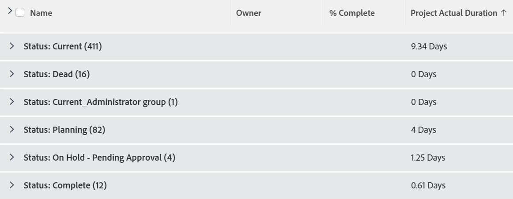

# Ansicht und Gruppierung: Tatsächliche Projektdauer, aggregiert nach dem Durchschnitt in einer Gruppierung anzeigen

<!--Audited: 11/2024-->

Sie können die folgende Spalte in einer Projektansicht hinzufügen, um die tatsächliche Dauer als Durchschnitt in einer Gruppierung aggregiert anzuzeigen.



## Zugriffsanforderungen

+++ Erweitern, um die Zugriffsanforderungen für die in diesem Artikel beschriebene Funktionalität anzuzeigen.

<table style="table-layout:auto"> 
 <col> 
 <col> 
 <tbody> 
  <tr> 
   <td role="rowheader">Adobe Workfront-Paket</td> 
   <td> <p>Beliebig</p> </td> 
  </tr> 
  <tr> 
   <td role="rowheader">Adobe Workfront-Lizenz</td> 
   <td> 
   <p>Mitwirkender oder Anfrage zum Ändern eines Filters </p>
   <p>Standard oder Plan zum Ändern eines Berichts</p>
  </tr> 
  <tr> 
   <td role="rowheader">Konfigurationen der Zugriffsebene</td> 
   <td> <p>Zugriff auf Berichte, Dashboards und Kalender bearbeiten, um einen Bericht zu ändern</p> <p>Zugriff auf Filter, Ansichten, Gruppierungen bearbeiten, um einen Filter zu ändern</p> </td> 
  </tr> 
  <tr> 
   <td role="rowheader">Objektberechtigungen</td> 
   <td> <p>Verwalten von Berechtigungen für einen Bericht</p>  </td> 
  </tr> 
 </tbody> 
</table>

Weitere Details zu den Informationen in dieser Tabelle finden Sie unter [Zugriffsanforderungen in der Dokumentation zu Workfront](/help/quicksilver/administration-and-setup/add-users/access-levels-and-object-permissions/access-level-requirements-in-documentation.md).

+++

## Anzeigen der tatsächlichen Projektdauer aggregiert nach dem Durchschnitt in einer Gruppierung

So fügen Sie diese Spalte einer Projektansicht hinzu:

1. Zu einer Projektliste gehen.
1. (Erforderlich) Um den aggregierten Durchschnittswert der tatsächlichen Projektdauer anzuzeigen, muss Ihrer Projektliste eine Gruppierung hinzugefügt werden.\
   Weitere Informationen zum Erstellen von Gruppierungen finden Sie im Artikel [Gruppierungen - Übersicht in Adobe Workfront](../../../reports-and-dashboards/reports/reporting-elements/groupings-overview.md).
1. Erweitern Sie das **Ansicht** Dropdown-Menü und wählen Sie **Ansicht anpassen**.
1. Klicken Sie auf **Spalte hinzufügen**.
1. Klicken Sie **Wechseln Sie in den Textmodus** und klicken Sie dann auf **Textmodus bearbeiten**.
1. Entfernen Sie den gesamten Text im Feld **Textmodus bearbeiten** und ersetzen Sie ihn durch den folgenden Code:

   ```
   aggregator.displayformat=compound 
   aggregator.function=AVG 
   aggregator.namekey=view.relatedcolumn 
   aggregator.namekeyargkey=actualduration 
   aggregator.valuefield=actualDurationMinutes 
   aggregator.valueformat=val 
   displayname=Project Actual Duration 
   durationunitfield=durationUnit.value 
   linkedname=project 
   namekey=actualduration 
   namekeyargkey=actualduration 
   querysort=actualDurationMinutes 
   textmode=true 
   valuefield=actualDurationMinutes 
   valueformat=compound#M:D 
   viewalias=actualduration
   ```

1. Klicken Sie **Fertig** und dann **Ansicht speichern**.
1. (Optional) Aktualisieren Sie den Ansichtsnamen und klicken Sie dann auf **Ansicht speichern**.
