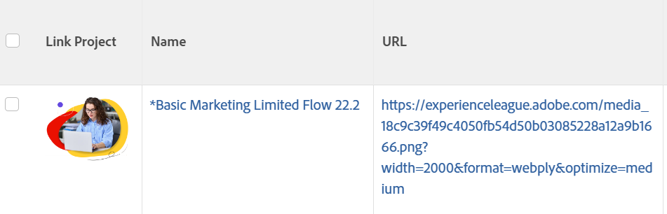

# Ansicht: Ein Bild anstelle einer Zeichenfolge in einer Spalte anzeigen

<!--Audited: 11/2024-->

Sie können den Namen eines Objekts in einer Ansicht mit einem Bild im Textmodus ersetzen. Sie können dem Bild auch einen Link hinzufügen, über den das ersetzte Objekt geöffnet werden kann.

>[!NOTE]
>
>Bilder erscheinen in der tatsächlichen Auflösung. Versuchen Sie daher, kleine Bilder zu verwenden.



## Zugriffsanforderungen

+++ Erweitern, um die Zugriffsanforderungen für die in diesem Artikel beschriebene Funktionalität anzuzeigen. 

<table style="table-layout:auto"> 
 <col> 
 <col> 
 <tbody> 
  <tr> 
   <td role="rowheader">Adobe Workfront-Paket</td> 
   <td> <p>Beliebig</p> </td> 
  </tr> 
  <tr> 
   <td role="rowheader">Adobe Workfront-Lizenz</td> 
   <td> 
   <p>Mitwirkender oder Anfrage zum Ändern eines Filters </p>
   <p>Standard oder Plan zum Ändern eines Berichts</p>
  </tr> 
  <tr> 
   <td role="rowheader">Konfigurationen der Zugriffsebene</td> 
   <td> <p>Zugriff auf Berichte, Dashboards, Kalender bearbeiten, um einen Bericht zu ändern</p> <p>Zugriff auf Filter, Ansichten, Gruppierungen bearbeiten, um einen Filter zu ändern</p> </td> 
  </tr> 
  <tr> 
   <td role="rowheader">Objektberechtigungen</td> 
   <td> <p>Verwalten von Berechtigungen für einen Bericht</p>  </td> 
  </tr> 
 </tbody> 
</table>

Weitere Details zu den Informationen in dieser Tabelle finden Sie unter [Zugriffsanforderungen in der Dokumentation zu Workfront](/help/quicksilver/administration-and-setup/add-users/access-levels-and-object-permissions/access-level-requirements-in-documentation.md).

+++

## Beispiel: Ersetzen Sie den Namen eines Projekts in einer Projektansicht durch ein Bild:

1. Laden Sie ein Bild auf eine Website oder einen externen Server von Adobe Workfront hoch. Sie müssen in der Lage sein, über Ihren Webbrowser auf das Bild zuzugreifen.

   >[!TIP]
   >
   >* Jeder Browser-Typ ist anders, aber alle Browser können URLs anzeigen.
   >* Vermeiden Sie die Verwendung von Bildern, die in Workfront hochgeladen werden. Da in Workfront gespeicherte Bilder nicht öffentlich verfügbar sind und über einen nach einem bestimmten Zeitraum ablaufenden Zugriffstaste verfügen, werden diese Bilder nicht mehr im Zeitverlauf in der Ansicht angezeigt.
   >* Ein auf Ihrem Computer gespeichertes Bild hat keine inhärente URL. Suchen Sie dort eine Website, auf der Bilder gehostet werden, und hosten Sie dort Ihr Bild. Möglicherweise verfügt Ihre Organisation bereits über eine solche Site.

1. Wechseln Sie mithilfe Ihres Webbrowsers zu dem Bild, das Sie gespeichert haben.
1. Rufen Sie die URL des Bildes wie folgt ab:

   <!--
   <p data-mc-conditions="QuicksilverOrClassic.Draft mode">(NOTE: I used this blog post to document what kind of image we need for this: https://www.canto.com/blog/image-url/ (consulting uses this)) </p>
   -->

   1. Klicken Sie mit der rechten Maustaste und wählen **Bildspeicherort kopieren** oder **Link abrufen** je nach Browser. Jetzt haben Sie die URL für dieses bestimmte Bild und können es aus Ihrer Zwischenablage einfügen.
   1. Stellen Sie sicher, dass alle Personen mit diesem Link die Berechtigung zum Anzeigen des Bildes haben, indem sie einfach zu dem Link gehen, und sie benötigen keine Anmeldung, um darauf zuzugreifen.

1. Gehen Sie zu einem Projekt, klicken Sie auf das **Mehr** Menü  neben dem Namen des Projekts und klicken Sie dann auf **Bearbeiten**.

1. Fügen Sie im Feld **URL** den Link zum Bild hinzu.
1. Gehe zu einer Projektansicht in einer Projektliste.
1. Klicken Sie auf das Dropdown-Menü **Ansicht**, und klicken Sie dann auf **Neue Ansicht**.
1. Klicken Sie auf die Kopfzeile der Spalte für den **Projektnamen**, und klicken Sie dann auf **In Textmodus wechseln**.

1. Fügen Sie der Spalte für den vorhandenen Code den folgenden Code hinzu:

   ```
   displayname=Link Project
   image.name=Link Project
   image.valuefield=URL
   link.linkproperty.0.name=projectID
   link.linkproperty.0.value=ID
   link.lookup=link.edit
   link.page=/view
   link.valuefield=objCode
   link.valueformat=val
   textmode=true
   type=image
   valueformat=
   ```

1. Klicken Sie **Fertig** > **Ansicht speichern**.
Das ausgewählte Bild ersetzt den Projektnamen in der Projektansicht, und das Bild ist ein Link zum Projekt.
