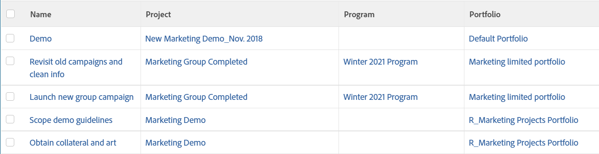

# Ansicht: Informationen zu Programmen und Portfolios in einer Aufgabenansicht anzeigen

Diese Aufgabenansicht zeigt das Programm und Portfolio an, die mit dem Projekt der Aufgabe verknüpft sind. Diese Informationen sind beim Erstellen einer Aufgabenansicht in Report Builder nicht verfügbar. Diese Informationen sind nur im Textmodus verfügbar.

Die Ansicht enthält auch Links zu Projekten, Programmen und Portfolio aus einer Aufgabenliste.



## Zugriffsanforderungen

+++ Erweitern, um die Zugriffsanforderungen für die in diesem Artikel beschriebene Funktionalität anzuzeigen. 

<table style="table-layout:auto"> 
 <col> 
 <col> 
 <tbody> 
  <tr> 
   <td role="rowheader">Adobe Workfront-Paket</td> 
   <td> <p>Beliebig</p> </td> 
  </tr> 
  <tr> 
   <td role="rowheader">Adobe Workfront-Lizenz</td> 
   <td> 
   <p>Mitwirkender oder Anfrage zum Ändern eines Filters </p>
   <p>Standard oder Plan zum Ändern eines Berichts</p>
  </tr> 
  <tr> 
   <td role="rowheader">Konfigurationen der Zugriffsebene</td> 
   <td> <p>Zugriff auf Berichte, Dashboards und Kalender bearbeiten, um einen Bericht zu ändern</p> <p>Zugriff auf Filter, Ansichten, Gruppierungen bearbeiten, um einen Filter zu ändern</p> </td> 
  </tr> 
  <tr> 
   <td role="rowheader">Objektberechtigungen</td> 
   <td> <p>Verwalten von Berechtigungen für einen Bericht</p>  </td> 
  </tr> 
 </tbody> 
</table>

Weitere Details zu den Informationen in dieser Tabelle finden Sie unter [Zugriffsanforderungen in der Dokumentation zu Workfront](/help/quicksilver/administration-and-setup/add-users/access-levels-and-object-permissions/access-level-requirements-in-documentation.md).
+++

## Anzeigen von Programm- und Portfolio-Informationen in einer Aufgabenansicht

1. Zu einer Aufgabenliste gehen.
1. Wählen Sie **Dropdown** Menü „Ansicht“ die Option **Neue Ansicht**.

1. Entfernen Sie **Bereich „Spaltenvorschau** alle Spalten mit Ausnahme einer Spalte.
1. Klicken Sie auf die Kopfzeile der verbleibenden Spalte, klicken Sie auf **Wechseln in den Textmodus** und dann **Textmodus bearbeiten**.
1. Entfernen Sie den Text aus dem Feld **Textmodus bearbeiten** und ersetzen Sie ihn durch den folgenden Code:

   ```
   column.0.descriptionkey=name
   column.0.link.linkproperty.0.name=ID
   column.0.link.linkproperty.0.valuefield=ID
   column.0.link.linkproperty.0.valueformat=int
   column.0.link.lookup=link.view
   column.0.link.valuefield=objCode
   column.0.link.valueformat=val
   column.0.linkedname=direct
   column.0.listsort=string(name)
   column.0.namekey=name.abbr
   column.0.querysort=name
   column.0.shortview=false
   column.0.stretch=100
   column.0.valuefield=name
   column.0.valueformat=HTML
   column.0.width=150
   column.1.descriptionkey=project
   column.1.link.linkproperty.0.name=ID
   column.1.link.linkproperty.0.valuefield=project:ID
   column.1.link.linkproperty.0.valueformat=int
   column.1.link.lookup=link.view
   column.1.link.valuefield=project:objCode
   column.1.link.valueformat=val
   column.1.linkedname=project
   column.1.listsort=nested(project).string(name)
   column.1.namekey=project
   column.1.querysort=project:name
   column.1.shortview=false
   column.1.stretch=0
   column.1.valuefield=project:name
   column.1.valueformat=HTML
   column.1.width=150
   column.2.descriptionkey=program
   column.2.displayname=Program
   column.2.link.linkproperty.0.name=ID
   column.2.link.linkproperty.0.valuefield=project:program:ID
   column.2.link.linkproperty.0.valueformat=int
   column.2.link.lookup=link.view
   column.2.link.valuefield=project:program:objCode
   column.2.link.valueformat=val
   column.2.linkedname=project
   column.2.listsort=nested(project:program).string(name)
   column.2.namekey=project
   column.2.querysort=project:program:name
   column.2.shortview=false
   column.2.stretch=0
   column.2.valuefield=project:program:name
   column.2.valueformat=HTML
   column.2.width=150
   column.3.descriptionkey=portfolio
   column.3.displayname=Portfolio
   column.3.link.linkproperty.0.name=ID
   column.3.link.linkproperty.0.valuefield=project:portfolio:ID
   column.3.link.linkproperty.0.valueformat=int
   column.3.link.lookup=link.view
   column.3.link.valuefield=project:portfolio:objCode
   column.3.link.valueformat=val
   column.3.linkedname=project
   column.3.listsort=nested(project:portfolio).string(name)
   column.3.namekey=project
   column.3.querysort=project:portfolio:name
   column.3.shortview=false
   column.3.stretch=0
   column.3.valuefield=project:portfolio:name
   column.3.valueformat=HTML
   column.3.width=150 
   ```

1. Klicken Sie **Fertig** > **Ansicht speichern**.
