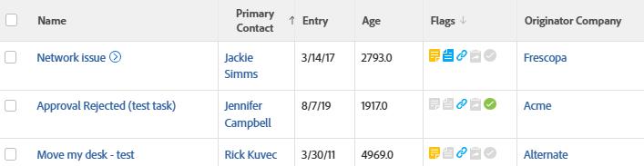

# Ansicht: Probleme mit dem Firmennamen des Urhebers bzw. der Urheberin

<!--Audit: 11/2024-->

In dieser Problemansicht wird der Firmenname angezeigt, der mit dem Benutzer verknüpft ist, der das Problem eingereicht hat.



## Zugriffsanforderungen

+++ Erweitern, um die Zugriffsanforderungen für die in diesem Artikel beschriebene Funktionalität anzuzeigen.

<table style="table-layout:auto"> 
 <col> 
 <col> 
 <tbody> 
  <tr> 
   <td role="rowheader">Adobe Workfront-Paket</td> 
   <td> <p>Beliebig</p> </td> 
  </tr> 
  <tr> 
   <td role="rowheader">Adobe Workfront-Lizenz</td> 
   <td> 
   <p>Mitwirkender oder Anforderung zum Ändern einer Ansicht </p>
   <p>Standard oder Abo zum Ändern eines Berichts</p>
  </tr> 
  <tr> 
   <td role="rowheader">Konfigurationen der Zugriffsebene</td> 
   <td> <p>Zugriff auf Berichte, Dashboards, Kalender bearbeiten, um einen Bericht zu ändern</p> <p>Bearbeitungszugriff auf Filter, Ansichten, Gruppierungen zum Ändern einer Ansicht</p> </td> 
  </tr> 
  <tr> 
   <td role="rowheader">Objektberechtigungen</td> 
   <td> <p>Berechtigungen für einen Bericht verwalten</p>  </td> 
  </tr> 
 </tbody> 
</table>

Weitere Details zu den Informationen in dieser Tabelle finden Sie unter [Zugriffsanforderungen in der Dokumentation zu Workfront](/help/quicksilver/administration-and-setup/add-users/access-levels-and-object-permissions/access-level-requirements-in-documentation.md).


+++

## Probleme mit dem Firmennamen des Erstellers anzeigen

1. Hier finden Sie eine Liste der Probleme.
1. Wählen Sie im Dropdown-Menü **Ansicht** die Option **Neue Ansicht**.
1. Entfernen Sie im Bereich **Spaltenvorschau** alle Spalten mit Ausnahme einer Spalte.
1. Klicken Sie auf die Kopfzeile der verbleibenden Spalte, und klicken Sie auf **In Textmodus wechseln**. Klicken Sie dann auf **Textmodus bearbeiten**.
1. Entfernen Sie den Text, den Sie im Feld **Textmodus bearbeiten** finden, und ersetzen Sie ihn durch folgenden Code:


   ```
   column.0.descriptionkey=name
   column.0.link.linkproperty.0.name=ID
   column.0.link.linkproperty.0.valuefield=ID
   column.0.link.linkproperty.0.valueformat=val
   column.0.link.lookup=link.view
   column.0.link.value=val(objCode)
   column.0.listsort=string(name)
   column.0.namekey=name
   column.0.querysort=name
   column.0.valuefield=name
   column.0.valueformat=HTML
   column.0.width=140
   column.1.descriptionkey=originator
   column.1.link.linkproperty.0.name=ID
   column.1.link.linkproperty.0.valuefield=ownerID
   column.1.link.linkproperty.0.valueformat=int
   column.1.link.lookup=link.view
   column.1.link.valuefield=owner:objCode
   column.1.link.valueformat=val
   column.1.listsort=nested(owner).string(name)
   column.1.namekey=originator.abbr
   column.1.querysort=owner:name
   column.1.valuefield=owner:name
   column.1.valueformat=HTML
   column.1.width=151
   column.2.descriptionkey=entrydate
   column.2.listsort=atDateAsAtDate(entryDate)
   column.2.namekey=entrydate.abbr
   column.2.querysort=entryDate
   column.2.valuefield=entryDate
   column.2.valueformat=atDate
   column.2.width=75
   column.3.descriptionkey=age
   column.3.listsort=doubleAsDouble(age)
   column.3.namekey=age
   column.3.querysort=age
   column.3.valuefield=howOld
   column.3.valueformat=val
   column.3.width=80
   column.4.viewalias=statusicons
   column.4.displayname=Flags
   column.4.linkedname=direct
   column.4.namekey=statusicons
   column.4.valuefield=
   column.4.valueformat=HTML
   column.4.querysort=
   column.4.tile.name=component.issuestatusicons
   column.4.tile.pdfcomponent=issueStatusIcons
   column.4.delimiter=
   column.4.tile.template=/WEB-INF/jsp/lists/components/issueStatusIcons.jsp
   column.5.description=Originator's Company Name
   column.5.link.linkproperty.0.name=ID
   column.5.link.linkproperty.0.valuefield=owner:companyID
   column.5.link.linkproperty.0.valueformat=int
   column.5.link.lookup=link.view
   column.5.link.valuefield=owner:company:objCode
   column.5.link.valueformat=val
   column.5.listsort=nested(owner:company).string(name)
   column.5.name=Originator Company
   column.5.querysort=owner:company:name
   column.5.valuefield=owner:company:name
   column.5.valueformat=HTML
   column.5.width=151
   ```

1. Klicken Sie auf **Fertig** > **Ansicht speichern**.
1. (Optional) Aktualisieren Sie den Anzeigenamen, und klicken Sie dann auf **Ansicht speichern**.
