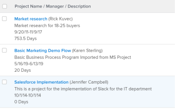

# Ansicht: Mehrzeilige Projektansicht

<!--Audited: 11/2024-->

In dieser Projektansicht haben Sie folgende Möglichkeiten:

* Zeigt Projektinformationen in einem mehrzeiligen Format an.\
  Die Ansicht verwendet das Tag `sharecol=true` , um mehrere Felder unter derselben Spaltenüberschrift zu kombinieren. Weitere Informationen zu diesem Tag finden Sie unter [Anzeigen: Zusammenführungsinformationen aus mehreren Spalten in einer gemeinsamen Spalte](../../../reports-and-dashboards/reports/custom-view-filter-grouping-samples/view-merge-columns.md).

* Verwenden Sie eine Platzhalterspalte, die ein HTML-Zeilenumbruch-Tag (`<br>`) enthält, um beispielsweise die Anzeige der Beschreibung unter dem Projektnamen zu erzwingen.
* Zeigt den Projektbesitzer in Klammern nach dem Projektnamen an.
* Zeigt den Projektnamen als Link zum Projekt an.



## Zugriffsanforderungen

+++ Erweitern, um die Zugriffsanforderungen für die in diesem Artikel beschriebene Funktionalität anzuzeigen.

<table style="table-layout:auto"> 
 <col> 
 <col> 
 <tbody> 
  <tr> 
   <td role="rowheader">Adobe Workfront-Paket</td> 
   <td> <p>Beliebig</p> </td> 
  </tr> 
  <tr> 
   <td role="rowheader">Adobe Workfront-Lizenz</td> 
   <td> 
   <p>Mitwirkender oder Anfrage zum Ändern einer Ansicht </p>
   <p>Standard oder Plan zum Ändern eines Berichts</p>
  </tr> 
  <tr> 
   <td role="rowheader">Konfigurationen der Zugriffsebene</td> 
   <td> <p>Zugriff auf Berichte, Dashboards und Kalender bearbeiten, um einen Bericht zu ändern</p> <p>Zugriff auf Filter, Ansichten, Gruppierungen bearbeiten, um eine Ansicht zu ändern</p> </td> 
  </tr> 
  <tr> 
   <td role="rowheader">Objektberechtigungen</td> 
   <td> <p>Verwalten von Berechtigungen für einen Bericht</p>  </td> 
  </tr> 
 </tbody> 
</table>

Weitere Details zu den Informationen in dieser Tabelle finden Sie unter [Zugriffsanforderungen in der Dokumentation zu Workfront](/help/quicksilver/administration-and-setup/add-users/access-levels-and-object-permissions/access-level-requirements-in-documentation.md).

+++

## Erstellen einer mehrzeiligen Projektansicht

1. Zu einer Projektliste gehen.
1. Klicken Sie **Dropdown** Menü „Ansicht“ auf **Neue Ansicht**.
1. Entfernen Sie alle Spalten in der Ansicht mit Ausnahme einer.
1. Wählen Sie die verbleibende Spalte aus und klicken Sie auf **Wechseln in den Textmodus** und dann **Textmodus bearbeiten**.
1. Entfernen Sie den Text im **Textmodus“,** kopieren Sie dann den Textmodus unter und fügen Sie ihn in die Spalte ein:

   ```
   column.0.linkedname=direct
   column.0.link.valueformat=val
   column.0.link.linkproperty.0.name=ID
   column.0.link.linkproperty.0.valuefield=ID
   column.0.link.linkproperty.0.valueformat=int
   column.0.link.valuefield=objCode
   column.0.link.lookup=link.view
   column.0.sharecol=true
   column.0.descriptionkey=name
   column.0.width=150
   column.0.querysort=name
   column.0.valuefield=name
   column.0.name=Project Name / Manager / Description
   column.0.shortview=false
   column.0.stretch=100
   column.0.textmode=true
   column.0.listsort=string(name)
   column.0.valueformat=HTML
   column.1.valueexpression=CONCAT(" (",{owner}.{name},")")
   column.1.listsort=nested(owner).string(name)
   column.1.width=1
   column.1.linkedname=direct
   column.1.querysort=owner:name
   column.1.textmode=true
   column.1.shortview=false
   column.1.stretch=0
   column.1.valueformat=HTML
   column.1.sharecol=true
   column.2.width=1
   column.2.value=
   column.2.shortview=false
   column.2.sharecol=true
   column.2.stretch=0
   column.2.textmode=true
   column.2.valueformat=HTML
   column.3.styledef.style=font-color:#ccc;
   column.3.descriptionkey=description
   column.3.linkedname=direct
   column.3.valuefield=description
   column.3.listsort=string(description)
   column.3.querysort=description
   column.3.namekey=description.abbr
   column.3.textmode=true
   column.3.sharecol=true
   column.3.stretch=0
   column.3.shortview=false
   column.3.valueformat=HTML
   column.3.width=1
   column.4.shortview=false
   column.4.value=
   column.4.sharecol=true
   column.4.width=1
   column.4.textmode=true
   column.4.valueformat=HTML\
   column.4.stretch=0
   column.5.name=Planned Dates / Duration
   column.5.width=150
   column.5.querysort=plannedStartDate
   column.5.sharecol=true
   column.5.stretch=0
   column.5.textmode=true
   column.5.shortview=false
   column.5.linkedname=direct
   column.5.listsort=atDateAsAtDate(plannedStartDate)
   column.5.valuefield=plannedStartDate
   column.5.valueformat=atDate
   column.6.sharecol=true
   column.6.stretch=0
   column.6.width=1
   column.6.textmode=true
   column.6.value=-
   column.6.valueformat=HTML
   column.6.shortview=false
   column.7.namekey=plannedcompletiondate.abbr
   column.7.width=1
   column.7.sharecol=true
   column.7.shortview=false
   column.7.stretch=0
   column.7.listsort=atDateAsAtDate(plannedCompletionDate)
   column.7.linkedname=direct
   column.7.descriptionkey=plannedcompletiondate
   column.7.textmode=true
   column.7.querysort=plannedCompletionDate
   column.7.valueformat=atDate
   column.7.valuefield=plannedCompletionDate
   column.8.value=
   column.8.width=1
   column.8.textmode=true
   column.8.sharecol=true
   column.8.valueformat=HTML
   column.8.stretch=0
   column.9.textmode=true
   column.9.listsort=intAsInt(durationMinutes)
   column.9.stretch=0
   column.9.valuefield=durationFieldLong
   column.9.descriptionkey=duration
   column.9.viewalias=duration
   column.9.querysort=durationMinutes
   column.9.sharecol=true
   column.9.width=100
   column.9.shortview=false
   column.9.namekey=duration.abbr
   column.9.linkedname=direct
   column.9.valueformat=compound
   column.10.textmode=true
   column.10.stretch=0
   ```


1. Klicken Sie **Fertig** > **Ansicht speichern**.
