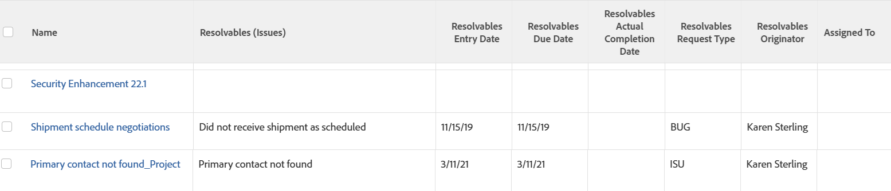

# Ansicht: Ursprüngliche Problemdetails für Aufgaben und Projekte

<!--Audited: 11/2024-->

Wenn ein Problem in einen Vorgang oder ein Projekt konvertiert wird, wird eine auflösende Objektbeziehung zwischen dem Vorgang oder Projekt und dem Problem hergestellt. In dieser Ansicht werden die folgenden Felder des Problems angezeigt, die automatisch abgeschlossen werden, wenn der Vorgang oder das Projekt abgeschlossen ist:

* Name
* Eingabedatum
* Geplantes Abschlussdatum
* Tatsächliches Abschlussdatum
* Anfragetyp
* Name des Urhebers
* Dem Benutzer zugewiesen



Weitere Informationen finden Sie auch unter [Ansicht: Anzeigen der ursprünglichen Probleminformationen in den Aufgaben- oder Projektlisten](../../../reports-and-dashboards/reports/custom-view-filter-grouping-samples/view-display-original-issue-info-task-project-list.md).

## Zugriffsanforderungen

+++ Erweitern, um die Zugriffsanforderungen für die in diesem Artikel beschriebene Funktionalität anzuzeigen.

<table style="table-layout:auto"> 
 <col> 
 <col> 
 <tbody> 
  <tr> 
   <td role="rowheader">Adobe Workfront-Paket</td> 
   <td> <p>Beliebig</p> </td> 
  </tr> 
  <tr> 
   <td role="rowheader">Adobe Workfront-Lizenz</td> 
   <td> 
   <p>Mitwirkender oder Anforderung zum Ändern einer Ansicht </p>
   <p>Standard oder Abo zum Ändern eines Berichts</p>
  </tr> 
  <tr> 
   <td role="rowheader">Konfigurationen der Zugriffsebene</td> 
   <td> <p>Zugriff auf Berichte, Dashboards, Kalender bearbeiten, um einen Bericht zu ändern</p> <p>Bearbeitungszugriff auf Filter, Ansichten, Gruppierungen zum Ändern einer Ansicht</p> </td> 
  </tr> 
  <tr> 
   <td role="rowheader">Objektberechtigungen</td> 
   <td> <p>Berechtigungen für einen Bericht verwalten</p>  </td> 
  </tr> 
 </tbody> 
</table>

Weitere Details zu den Informationen in dieser Tabelle finden Sie unter [Zugriffsanforderungen in der Dokumentation zu Workfront](/help/quicksilver/administration-and-setup/add-users/access-levels-and-object-permissions/access-level-requirements-in-documentation.md).


+++

## Details zur Entstehungsproblematik für Vorgänge und Projekte anzeigen

1. Wechseln Sie zu einer Liste von Vorgängen oder Projekten.
1. Wählen Sie im Dropdown-Menü **Ansicht** die Option **Neue Ansicht**.
1. Entfernen Sie im Bereich **Spaltenvorschau** alle Spalten mit Ausnahme einer Spalte.
1. Klicken Sie auf die Kopfzeile der verbleibenden Spalte, und klicken Sie auf **In Textmodus wechseln** und dann auf **Textmodus bearbeiten**.
1. Entfernen Sie den Text, den Sie im Feld **Textmodus bearbeiten** finden, und ersetzen Sie ihn durch folgenden Code:

   ```
   column.0.textmode=false
   column.0.valuefield=name
   column.0.valueformat=HTML
   column.0.descriptionkey=name
   column.0.linkedname=direct
   column.0.listsort=string(name)
   column.0.namekey=name
   column.0.querysort=name
   column.0.shortview=false
   column.0.stretch=100
   column.0.width=150
   column.1.displayname=Resolvables (Issues)
   column.1.listdelimiter=
   column.1.listmethod=nested(resolvables).lists
   column.1.textmode=true
   column.1.type=iterate
   column.1.valueexpression={name}
   column.1.valueformat=HTML
   column.2.displayname=Resolvables Entry Date
   column.2.listdelimiter=
   column.2.listmethod=nested(resolvables).lists
   column.2.textmode=true
   column.2.type=iterate
   column.2.valueexpression={entryDate}
   column.2.valueformat=HTML
   column.3.displayname=Resolvables Due Date
   column.3.listdelimiter=
   column.3.listmethod=nested(resolvables).lists
   column.3.textmode=true
   column.3.type=iterate
   column.3.valueexpression={plannedCompletionDate}
   column.3.valueformat=HTML
   column.4.displayname=Resolvables Actual Completion Date
   column.4.listdelimiter=
   column.4.listmethod=nested(resolvables).lists
   column.4.textmode=true
   column.4.type=iterate
   column.4.valueexpression={actualCompletionDate}
   column.4.valueformat=HTML
   column.5.displayname=Resolvables Request Type
   column.5.listdelimiter=
   column.5.listmethod=nested(resolvables).lists
   column.5.textmode=true
   column.5.type=iterate
   column.5.valueexpression={opTaskType}
   column.5.valueformat=HTML
   column.6.displayname=Resolvables Originator
   column.6.listdelimiter=
   column.6.listmethod=nested(resolvables).lists
   column.6.textmode=true
   column.6.type=iterate
   column.6.valueexpression={owner}.{name}
   column.6.valueformat=HTML
   column.7.descriptionkey=assignedto
   column.7.linkedname=assignedTo
   column.7.listsort=nested(assignedTo).string(name)
   column.7.namekey=assignedto
   column.7.querysort=assignedTo:name
   column.7.shortview=false
   column.7.stretch=0
   column.7.textmode=true
   column.7.valuefield=assignedTo:name
   column.7.valueformat=HTML
   column.7.width=150
   ```

1. Klicken Sie auf **Fertig** > **Ansicht speichern**.
