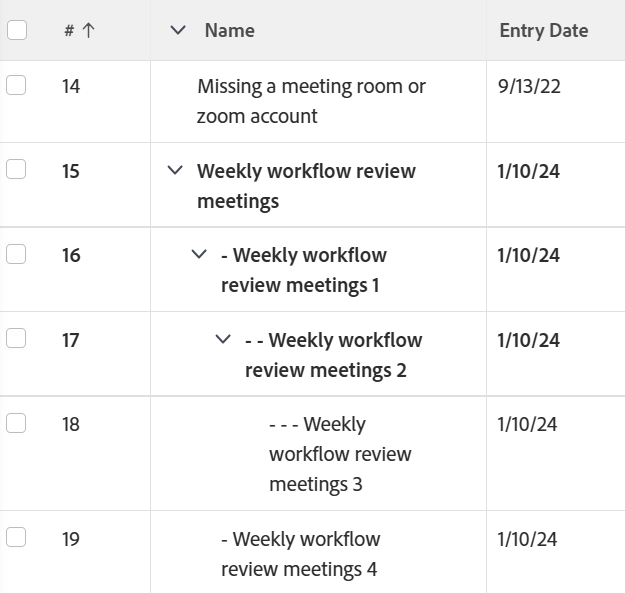

# Ansicht: Anzeigen der übergeordneten/untergeordneten Beziehung in einer Aufgabe durch Einrücken der Aufgaben

Sie können die Unterscheidung zwischen übergeordneten und untergeordneten Beziehungen in einer exportierten Aufgabenliste beibehalten, indem Sie der Aufgabenliste eine benutzerdefinierte Ansicht hinzufügen und sicherstellen, dass diese Ansicht ausgewählt ist, bevor Sie die Liste exportieren.



## Zugriffsanforderungen

Sie müssen über folgenden Zugriff verfügen, um die Schritte in diesem Artikel ausführen zu können:

<table style="table-layout:auto"> 
 <col> 
 <col> 
 <tbody> 
  <tr> 
   <td role="rowheader">Adobe Workfront-Plan*</td> 
   <td> <p>Beliebig</p> </td> 
  </tr> 
  <tr> 
   <td role="rowheader">Adobe Workfront-Lizenz*</td> 
   <td> <p>Anforderung zum Ändern einer Ansicht </p>
   <p>Berichtänderung planen</p> </td> 
  </tr> 
  <tr> 
   <td role="rowheader">Konfigurationen auf Zugriffsebene*</td> 
   <td> <p>Zugriff auf Berichte, Dashboards und Kalender bearbeiten, um einen Bericht zu ändern</p> <p>Zugriff auf Filter, Ansichten und Gruppierungen bearbeiten, um eine Ansicht zu ändern</p> <p><b>NOTIZ</b>

Wenn Sie immer noch keinen Zugriff haben, fragen Sie Ihren Workfront-Administrator, ob er zusätzliche Zugriffsbeschränkungen für Ihre Zugriffsebene festlegt. Informationen dazu, wie ein Workfront-Administrator Ihre Zugriffsebene ändern kann, finden Sie unter <a href="../../../administration-and-setup/add-users/configure-and-grant-access/create-modify-access-levels.md" class="MCXref xref">Benutzerdefinierte Zugriffsebenen erstellen oder ändern</a>.</p> </td>
</tr>  
  <tr> 
   <td role="rowheader">Objektberechtigungen</td> 
   <td> <p>Berechtigungen für einen Bericht verwalten</p> <p>Informationen zum Anfordern von zusätzlichem Zugriff finden Sie unter <a href="../../../workfront-basics/grant-and-request-access-to-objects/request-access.md" class="MCXref xref">Zugriff auf Objekte anfordern </a>.</p> </td> 
  </tr> 
 </tbody> 
</table>

&#42;Wenden Sie sich an Ihren Workfront-Administrator, um zu erfahren, welchen Plan, welchen Lizenztyp oder welchen Zugriff Sie haben.

## Anzeigen der übergeordneten/untergeordneten Beziehung in einer Aufgabe durch Einrücken der Aufgaben

1. Wechseln Sie zum Projekt mit der Aufgabenliste, die Sie exportieren möchten.
1. Klicken Sie auf **Ansicht** und wählen Sie **Neue Ansicht**.

1. Benennen Sie den Filter in der linken oberen Ecke des Bildschirms.
1. Klicken Sie in **Aufgabenname** Spaltenüberschrift.

1. Auswählen **In den Textmodus wechseln** in der oberen rechten Ecke.
1. Klicken Sie auf eine beliebige Stelle im Textfeld, um den Text zu bearbeiten, und entfernen Sie den gesamten vorhandenen Text.
1. Fügen Sie den folgenden Text ein:

   ```
   displayname=<br>linkedname=direct<br>namekey=name<br>querysort=name<br>textmode=true<br>valueexpression=IF({indent}<1,{name},IF({indent}<2,CONCAT(" - ",{name}),IF({indent}<3,CONCAT(" - - ",{name}),IF({indent}<4,CONCAT(" - - - ",{name}),CONCAT(" - - - - ",{name})))))<br>valueformat=HTML
   ```

1. Klicken Sie auf **Speichern**.
1. Klicken **Ansicht speichern**.
