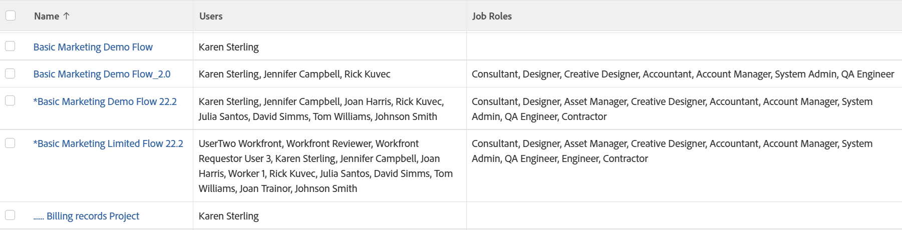

# Ansicht: Projekt mit allen Benutzern und Rollen des Projektteams

Diese Projektansicht zeigt eine Liste von Benutzern und Auftragsrollen, die dem Projektteam zugewiesen sind.

>[!NOTE]
>
>Wenn die Auftragsrolle in derselben Zeile wie ein Benutzer aufgeführt ist, bedeutet dies nicht, dass der Benutzer diese Rolle im Projekt ausfüllt oder dem Benutzer diese Rolle in seinem Profil zugewiesen wird.

## Zugriffsanforderungen

Sie müssen über folgenden Zugriff verfügen, um die Schritte in diesem Artikel ausführen zu können:

<table style="table-layout:auto"> 
 <col> 
 <col> 
 <tbody> 
  <tr> 
   <td role="rowheader">Adobe Workfront-Plan*</td> 
   <td> 
Alle
 </td> 
  </tr> 
  <tr> 
   <td role="rowheader">Adobe Workfront-Lizenz*</td> 
   <td> 
Anforderung zum Ändern einer Ansicht 

   
Berichtänderung planen
 </td> 
  </tr> 
  <tr> 
   <td role="rowheader">Konfigurationen auf Zugriffsebene*</td> 
   <td> 
Zugriff auf Berichte, Dashboards und Kalender bearbeiten, um einen Bericht zu ändern
 
Zugriff auf Filter, Ansichten und Gruppierungen bearbeiten, um eine Ansicht zu ändern
 
<b>NOTIZ</b>

Wenn Sie immer noch keinen Zugriff haben, fragen Sie Ihren Workfront-Administrator, ob er zusätzliche Zugriffsbeschränkungen für Ihre Zugriffsebene festlegt. Informationen dazu, wie ein Workfront-Administrator Ihre Zugriffsebene ändern kann, finden Sie unter <a href="../../../administration-and-setup/add-users/configure-and-grant-access/create-modify-access-levels.md" class="MCXref xref">Benutzerdefinierte Zugriffsebenen erstellen oder ändern</a>.
 </td>
</tr>  
  <tr> 
   <td role="rowheader">Objektberechtigungen</td> 
   <td> 
Berechtigungen für einen Bericht verwalten
 
Weitere Informationen zum Anfordern von zusätzlichem Zugriff finden Sie unter <a href="../../../workfront-basics/grant-and-request-access-to-objects/request-access.md" class="MCXref xref">Anfordern des Zugriffs auf Objekte </a>.
 </td> 
  </tr> 
 </tbody> 
</table>

&#42;Wenden Sie sich an Ihren Workfront-Administrator, um zu erfahren, welchen Plan, welchen Lizenztyp oder welchen Zugriff Sie haben.

## Projekt mit allen Benutzern und Rollen des Projektteams anzeigen

1. Gehen Sie zu einer Projektliste.
1. Wählen Sie aus dem Dropdownmenü **Ansicht** die Option **Neue Ansicht** aus.

1. Im Bereich **Spaltenvorschau** werden alle Spalten mit Ausnahme einer entfernt.
1. Klicken Sie auf die Kopfzeile der verbleibenden Spalte und dann auf **In Textmodus wechseln**.
1. Bewegen Sie den Mauszeiger über den Textmodusbereich und klicken Sie auf **Klicken, um Text zu bearbeiten**.
1. Entfernen Sie den Text, den Sie im Feld **Textmodus** finden, und ersetzen Sie ihn durch den folgenden Code:
   <pre>column.0.link.linkproperty.0.name=ID column.0.link.linkproperty.0.valueField=ID column.0.link.linkproperty.0.valueFormat=int column.0.link.lookup=link.view column.0.link.valueField=objCode column.0.link.valueFormat=val column.0.linkedname=direct column.0.listsort=string(name) column.0.namekey=name.abbr column.0.querysort=name column.0.shortview=false column.0.gestreckch=60 column.0.valueField=name column.0.valueFormat=HTML column.0.width=150 column.1.description=Team Users column.1.link.linkproperty.0.name=ID column.1.link.linkproperty.0.valueField=userID column.1.link.linkproperty.0.valueFormat=1 18}column.1.link.page=/userView.cmd column.1.listdelimiter= column.1.listmethod=nested(projectUsers).lists column.1.namekey=user.plural column.1.gestreckch=30 column.1.type=iterate column 1.valueField=user:name column.1.valueFormat=HTML column.1.width=150 column.2.description=Team Roles column.2.link.linkproperty.0.name=ID column.2.link.linkproperty.0.valueField=ID column.2.link.linkproperty.0.valueFormat=int column.2.link.page=/roleView.cmd column.2.listdelimiter= column.2.listmethod=nested(roles).lists column.2.namekey=jobrole.plural column.2.extending=13 6}column.2.type=iterate column.2.valueField=name column.2.valueFormat=HTML column.2.width=150.gestreckch=0  </pre>

1. Klicken Sie auf **Ansicht speichern**.
