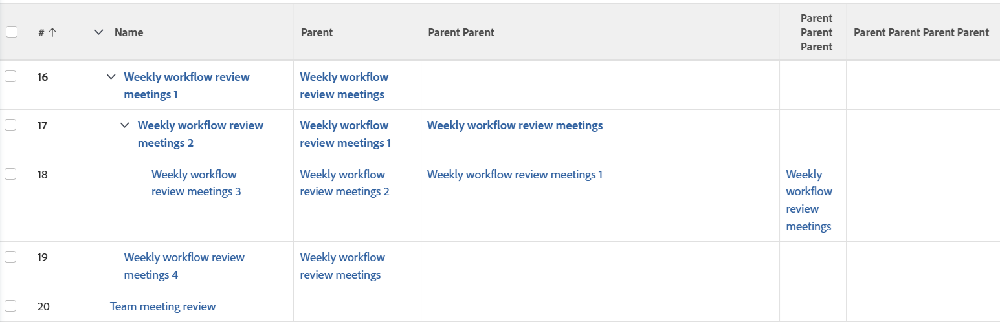

# Anzeigen: Übergeordnete Aufgaben mit einer Tiefe von bis zu 4 Ebenen anzeigen

<!--Audited: 11/2024-->

Diese Aufgabenansicht zeigt den Aufgabennamen in der ersten Spalte und (falls vorhanden) bis zu 4 übergeordnete Aufgaben in separaten Spalten in derselben Liste an.



## Zugriffsanforderungen

+++ Erweitern Sie , um die Zugriffsanforderungen für die -Funktion in diesem Artikel anzuzeigen.

<table style="table-layout:auto"> 
 <col> 
 <col> 
 <tbody> 
  <tr> 
   <td role="rowheader">Adobe Workfront-Paket</td> 
   <td> <p>Beliebig</p> </td> 
  </tr> 
  <tr> 
   <td role="rowheader">Adobe Workfront-Lizenz</td> 
   <td> 
   <p>Mitwirkender oder Anfrage zum Ändern einer Ansicht </p>
   <p>Standard oder Plan zum Ändern eines Berichts</p>
  </tr> 
  <tr> 
   <td role="rowheader">Konfigurationen der Zugriffsebene</td> 
   <td> <p>Zugriff auf Berichte, Dashboards und Kalender bearbeiten, um einen Bericht zu ändern</p> <p>Zugriff auf Filter, Ansichten, Gruppierungen bearbeiten, um eine Ansicht zu ändern</p> </td> 
  </tr> 
  <tr> 
   <td role="rowheader">Objektberechtigungen</td> 
   <td> <p>Verwalten von Berechtigungen für einen Bericht</p>  </td> 
  </tr> 
 </tbody> 
</table>

Weitere Informationen zu den Informationen in dieser Tabelle finden Sie unter [Zugriffsanforderungen in der Dokumentation zu Workfront](/help/quicksilver/administration-and-setup/add-users/access-levels-and-object-permissions/access-level-requirements-in-documentation.md).


+++

## Übergeordnete Aufgaben mit einer Tiefe von bis zu 4 Ebenen anzeigen

1. Zu einer Aufgabenliste gehen.
1. Wählen Sie **Dropdown** Menü „Ansicht“ die Option **Neue Ansicht**.
1. Entfernen Sie im Bereich **Spaltenvorschau** alle Spalten mit Ausnahme einer Spalte.
1. Klicken Sie auf die Kopfzeile der verbleibenden Spalte und dann auf **In Textmodus wechseln** > **Textmodus bearbeiten**.
1. Entfernen Sie den Text aus dem Feld **Textmodus** und ersetzen Sie ihn durch den folgenden Code:


   ```
   column.0.descriptionkey=name
   column.0.link.linkproperty.0.name=ID
   column.0.link.linkproperty.0.valuefield=ID
   column.0.link.linkproperty.0.valueformat=int
   column.0.link.lookup=link.view
   column.0.link.valuefield=objCode
   column.0.link.valueformat=val
   column.0.linkedname=direct
   column.0.listsort=string(name)
   column.0.namekey=name.abbr
   column.0.querysort=name
   column.0.shortview=false
   column.0.valuefield=name
   column.0.valueformat=HTML
   column.0.width=150
   column.1.descriptionkey=parent
   column.1.link.linkproperty.0.name=ID
   column.1.link.linkproperty.0.valuefield=parent:ID
   column.1.link.linkproperty.0.valueformat=int
   column.1.link.lookup=link.view
   column.1.link.valuefield=parent:objCode
   column.1.link.valueformat=val
   column.1.linkedname=parent
   column.1.listsort=nested(parent).string(name)
   column.1.namekey=parent
   column.1.querysort=parent:name
   column.1.shortview=false
   column.1.stretch=0
   column.1.valuefield=parent:name
   column.1.valueformat=HTML
   column.1.width=150
   column.2.description=Parent Parent
   column.2.link.linkproperty.0.name=ID
   column.2.link.linkproperty.0.valuefield=parent:parent:ID
   column.2.link.linkproperty.0.valueformat=int
   column.2.link.lookup=link.view
   column.2.link.valuefield=parent:parent:objCode
   column.2.link.valueformat=val
   column.2.linkedname=parent
   column.2.listsort=nested(parent:parent).string(name)
   column.2.name=Parent Parent
   column.2.querysort=parent:parent:name
   column.2.shortview=false
   column.2.stretch=0
   column.2.valuefield=parent:parent:name
   column.2.valueformat=HTML
   column.2.width=150
   column.3.description=Parent Parent Parent
   column.3.link.linkproperty.0.name=ID
   column.3.link.linkproperty.0.valuefield=parent:parent:parent:ID
   column.3.link.linkproperty.0.valueformat=int
   column.3.link.lookup=link.view
   column.3.link.valuefield=parent:parent:parent:objCode
   column.3.link.valueformat=val
   column.3.linkedname=parent
   column.3.listsort=nested(parent:parent:parent).string(name)
   column.3.name=Parent Parent Parent
   column.3.querysort=parent:parent:parent:name
   column.3.shortview=false
   column.3.stretch=0
   column.3.valuefield=parent:parent:parent:name
   column.3.valueformat=HTML
   column.3.width=150
   column.4.description=Parent Parent Parent Parent
   column.4.link.linkproperty.0.name=ID
   column.4.link.linkproperty.0.valuefield=parent:parent:parent:parent:ID
   column.4.link.linkproperty.0.valueformat=int
   column.4.link.lookup=link.view
   column.4.link.valuefield=parent:parent:parent:parent:objCode
   column.4.link.valueformat=val
   column.4.linkedname=parent
   column.4.listsort=nested(parent:parent:parent:parent).string(name)
   column.4.name=Parent Parent Parent Parent
   column.4.querysort=parent:parent:parent:parent:name
   column.4.shortview=false
   column.4.stretch=100
   column.4.valuefield=parent:parent:parent:parent:name
   column.4.valueformat=HTML
   column.4.width=150
   ```

1. Klicken Sie **Fertig** > **Ansicht speichern**.

   Der Name der Aufgabe wird in der ersten Spalte angezeigt. Wenn die Aufgabe übergeordnete Elemente hat, werden in den verbleibenden Spalten bis zu 4 übergeordnete Elemente angezeigt.
