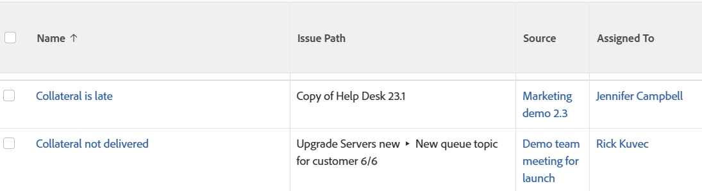

# Anzeigen: Sendepfad für Probleme

<!--Audited: 11/2024-->

Sie können den Pfad, über den ein Problem gesendet wurde, in der Ansicht eines Problemberichts anzeigen. Der Pfad gibt die Warteschlange, die Themengruppe und das Warteschlangenthema an, an die bzw. das das Problem ursprünglich gesendet wurde.



## Zugriffsanforderungen

+++ Erweitern Sie , um die Zugriffsanforderungen für die -Funktion in diesem Artikel anzuzeigen.

<table style="table-layout:auto"> 
 <col> 
 <col> 
 <tbody> 
  <tr> 
   <td role="rowheader">Adobe Workfront-Paket</td> 
   <td> <p>Beliebig</p> </td> 
  </tr> 
  <tr> 
   <td role="rowheader">Adobe Workfront-Lizenz</td> 
   <td> 
   <p>Mitwirkender oder Anfrage zum Ändern einer Ansicht </p>
   <p>Standard oder Plan zum Ändern eines Berichts</p>
  </tr> 
  <tr> 
   <td role="rowheader">Konfigurationen der Zugriffsebene</td> 
   <td> <p>Zugriff auf Berichte, Dashboards und Kalender bearbeiten, um einen Bericht zu ändern</p> <p>Zugriff auf Filter, Ansichten, Gruppierungen bearbeiten, um eine Ansicht zu ändern</p> </td> 
  </tr> 
  <tr> 
   <td role="rowheader">Objektberechtigungen</td> 
   <td> <p>Verwalten von Berechtigungen für einen Bericht</p>  </td> 
  </tr> 
 </tbody> 
</table>

Weitere Informationen zu den Informationen in dieser Tabelle finden Sie unter [Zugriffsanforderungen in der Dokumentation zu Workfront](/help/quicksilver/administration-and-setup/add-users/access-levels-and-object-permissions/access-level-requirements-in-documentation.md).


+++

## Anzeigen des Übermittlungspfads für Probleme

1. Zu einer Problemliste gehen.
1. Wählen Sie **Dropdown** Menü „Ansicht“ die Option **Neue Ansicht**.

1. Klicken Sie im Bereich **Spaltenvorschau** auf **Spalte hinzufügen**.
1. Klicken Sie auf die Kopfzeile der neuen Spalte und dann auf **Wechseln in den Textmodus** > **Textmodus bearbeiten**.
1. Entfernen Sie den Text aus dem Feld **Textmodus bearbeiten** und ersetzen Sie ihn durch den folgenden Code:

   ```
   displayname= Issue Path
   linkedname=direct
   namekey=displayQueueBreadcrumb
   valuefield=displayQueueBreadcrumb
   valueformat=HTML
   ```

1. Klicken Sie **Fertig** > **Ansicht speichern**.
