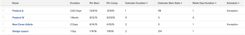

# Ansicht: Von Zeitplanausnahmen betroffene Aufgaben

<!--Audited: 11/2024-->

In dieser Aufgabenansicht werden Aufgaben identifiziert, die aufgrund von Wochenenden, persönlicher Zeitüberschreitung oder anderen Zeitplanausnahmen zu spät abgeschlossen werden müssen.

Diese Ansicht zeigt Folgendes an:

* Dauer von Aufgaben
* Geplante Start- und geplante Abschlussdaten der Aufgaben
* Die Dauer der Aufgaben in Abhängigkeit von der Anzahl der Tage zwischen dem geplanten Start- und dem geplanten Abschlussdatum der Aufgaben (Kalenderdauer)
* Die Nummer des Tages im Zeitplan des Projekts, an dem die Aufgabe beginnt (Startdatum des Kalenders)
* Die Wochentagsdauer der Aufgaben entsprechend der Anzahl der Wochentage zwischen dem geplanten Start- und dem geplanten Abschlussdatum der Aufgaben (Wochentagsdauer)
* Wenn die Wochentagsdauer die Dauer der Aufgaben überschreitet, was darauf hindeutet, dass die Dauer der Aufgaben Ausnahmetage umfasst, werden die Aufgaben als &quot;Ausnahme&quot;markiert.\
  

## Zugriffsanforderungen

+++ Erweitern Sie , um die Zugriffsanforderungen für die Funktionalität in diesem Artikel anzuzeigen.

Sie müssen über folgenden Zugriff verfügen, um die Schritte in diesem Artikel ausführen zu können:

<table style="table-layout:auto"> 
 <col> 
 <col> 
 <tbody> 
  <tr> 
   <td role="rowheader">Adobe Workfront-Abo</td> 
   <td> <p>Alle</p> </td> 
  </tr> 
  <tr> 
   <td role="rowheader">Adobe Workfront-Lizenz</td> 
   <td> <p> Aktuell: 
   <ul>
   <li>Anforderung zum Ändern einer Ansicht</li> 
   <li>Berichtänderung planen</li>
   </ul>
     </p>
     <p> Neu: 
   <ul>
   <li>Mitwirkender beim Ändern einer Ansicht</li> 
   <li>Standard zum Ändern eines Berichts</li>
   </ul>
     </p>
    </td> 
  </tr> 
  <tr> 
   <td role="rowheader">Konfigurationen auf Zugriffsebene*</td> 
   <td> <p>Zugriff auf Berichte, Dashboards und Kalender bearbeiten, um einen Bericht zu ändern</p> <p>Zugriff auf Filter, Ansichten und Gruppierungen bearbeiten, um eine Ansicht zu ändern</p> </td> 
  </tr> 
  <tr> 
   <td role="rowheader">Objektberechtigungen</td> 
   <td> <p>Berechtigungen für einen Bericht verwalten</p> </td> 
  </tr> 
 </tbody> 
</table>

Weitere Informationen zu den Informationen in dieser Tabelle finden Sie unter [Zugriffsanforderungen in der Workfront-Dokumentation](/help/quicksilver/administration-and-setup/add-users/access-levels-and-object-permissions/access-level-requirements-in-documentation.md).

+++

## Anzeigen von Aufgaben, die von planmäßigen Ausnahmen betroffen sind

1. Gehen Sie zu einer Liste von Aufgaben.
1. Wählen Sie aus dem Dropdownmenü **Ansicht** die Option **Neue Ansicht** aus.
1. Im Bereich **Spaltenvorschau** werden alle Spalten mit Ausnahme einer entfernt.
1. Klicken Sie auf die Kopfzeile der verbleibenden Spalte und dann auf **In Textmodus wechseln** > **Textmodus bearbeiten**.
1. Entfernen Sie den Text, den Sie im Feld **Textmodus bearbeiten** finden, und ersetzen Sie ihn durch den folgenden Code:

   ```
   column.0.descriptionkey=name
   column.0.link.linkproperty.0.name=ID
   column.0.link.linkproperty.0.valuefield=ID
   column.0.link.linkproperty.0.valueformat=int
   column.0.link.lookup=link.view
   column.0.link.valuefield=objCode
   column.0.link.valueformat=val
   column.0.linkedname=direct
   column.0.listsort=string(name)
   column.0.namekey=name.abbr
   column.0.querysort=name
   column.0.shortview=false
   column.0.stretch=100
   column.0.valuefield=name
   column.0.valueformat=HTML
   column.0.width=150
   column.1.descriptionkey=duration
   column.1.linkedname=direct
   column.1.listsort=intAsInt(durationMinutes)
   column.1.namekey=duration.abbr
   column.1.querysort=durationMinutes
   column.1.shortview=false
   column.1.stretch=0
   column.1.valuefield=durationFieldLong
   column.1.valueformat=compound
   column.1.viewalias=duration
   column.1.width=80
   column.2.descriptionkey=plannedstartdate
   column.2.linkedname=direct
   column.2.listsort=atDateAsAtDate(plannedStartDate)
   column.2.namekey=plannedstartdate.abbr
   column.2.querysort=plannedStartDate
   column.2.shortview=false
   column.2.stretch=0
   column.2.valuefield=plannedStartDate
   column.2.valueformat=atDate
   column.2.width=80
   column.3.descriptionkey=plannedcompletiondate
   column.3.linkedname=direct
   column.3.listsort=atDateAsAtDate(plannedCompletionDate)
   column.3.namekey=plannedcompletiondate.abbr
   column.3.querysort=plannedCompletionDate
   column.3.shortview=false
   column.3.stretch=0
   column.3.valuefield=plannedCompletionDate
   column.3.valueformat=atDate
   column.3.width=80
   column.4.aggregator.displayformat=int
   column.4.aggregator.function=SUM
   column.4.aggregator.namekey=id
   column.4.aggregator.valueexpression=DATEDIFF({plannedCompletionDate},
   {plannedStartDate})+1
   column.4.aggregator.valueformat=intAsInt
   column.4.descriptionkey=id
   column.4.linkedname=direct
   column.4.listsort=intAsInt(ID)
   column.4.name=Calendar Duration
   column.4.querysort=ID
   column.4.shortview=false
   column.4.stretch=0
   column.4.valueexpression=DATEDIFF({plannedCompletionDate},{plannedStartDate})+1
   column.4.valueformat=int
   column.4.width=80
   column.5.aggregator.displayformat=int
   column.5.aggregator.function=SUM
   column.5.aggregator.namekey=id
   column.5.aggregator.valueexpression=DATEDIFF({plannedStartDate},{project}.
   {plannedStartDate})+0
   column.5.aggregator.valueformat=intAsInt
   column.5.descriptionkey=id
   column.5.linkedname=direct
   column.5.listsort=intAsInt(ID)
   column.5.name=Calendar Start Date
   column.5.querysort=ID
   column.5.shortview=false
   column.5.stretch=0
   column.5.valueexpression=DATEDIFF({plannedStartDate},{project}.{plannedStartDate})+0
   column.5.valueformat=int
   column.5.width=80
   column.6.aggregator.displayformat=int
   column.6.aggregator.function=SUM
   column.6.aggregator.namekey=id
   column.6.aggregator.valueexpression=WEEKDAYDIFF({plannedStartDate},
   {plannedCompletionDate})+0
   column.6.aggregator.valueformat=HTML
   column.6.descriptionkey=id
   column.6.linkedname=direct
   column.6.listsort=intAsInt(ID)
   column.6.name=Week Day Duration
   column.6.querysort=ID
   column.6.shortview=false
   column.6.stretch=0
   column.6.valueexpression=WEEKDAYDIFF({plannedStartDate},{plannedCompletionDate})+0
   column.6.valueformat=int
   column.6.width=80
   column.7.aggregator.displayformat=int
   column.7.aggregator.expression=IF((WEEKDAYDIFF({plannedStartDate},{plannedCompletionDate}))>({duration}/480),"Exception","")
   column.7.aggregator.function=SUM
   column.7.aggregator.namekey=id
   column.7.aggregator.valueformat=HTML
   column.7.linkedname=direct
   column.7.listsort=intAsInt(ID)
   column.7.name=Schedule
   column.7.querysort=ID
   column.7.shortview=false
   column.7.stretch=0
   column.7.valueexpression=IF((WEEKDAYDIFF({plannedStartDate},{plannedCompletionDate}))>({duration}/480),"Exception","")
   column.7.valueformat=HTML
   column.7.width=80
   ```

1. Klicken Sie auf **Fertig** > **Ansicht speichern**.
