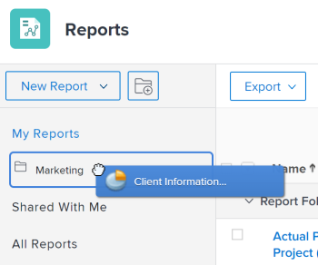

# Berichte aufrufen und organisieren

Sie können Berichte in Adobe Workfront verwenden, um Informationen über Objekte im System zu überprüfen oder zu bearbeiten. Sie können eigene Berichte erstellen, die von Ihnen erstellten Berichte organisieren und Berichte anzeigen, die für Sie freigegeben oder öffentlich freigegeben wurden.

## Zugriffsanforderungen

Sie müssen über folgenden Zugriff verfügen, um die Schritte in diesem Artikel ausführen zu können:

<table style="table-layout:auto"> 
 <col> 
 <col> 
 <tbody> 
  <tr> 
   <td role="rowheader">Adobe Workfront-Plan*</td> 
   <td> 
Beliebig
 </td> 
  </tr> 
  <tr> 
   <td role="rowheader">Adobe Workfront-Lizenz*</td> 
   <td> 
Plan 
 </td> 
  </tr> 
  <tr> 
   <td role="rowheader">Konfigurationen auf Zugriffsebene*</td> 
   <td> 
Zugriff auf Berichte, Dashboards und Kalender bearbeiten
 
Zugriff auf Filter, Ansichten, Gruppierungen bearbeiten
 
Hinweis: Wenn Sie immer noch keinen Zugriff haben, fragen Sie Ihren Workfront-Administrator, ob er zusätzliche Zugriffsbeschränkungen für Ihre Zugriffsebene festlegt. Informationen dazu, wie ein Workfront-Administrator Ihre Zugriffsebene ändern kann, finden Sie unter <a href="../../../administration-and-setup/add-users/configure-and-grant-access/create-modify-access-levels.md" class="MCXref xref">Benutzerdefinierte Zugriffsebenen erstellen oder ändern</a>.
 </td> 
  </tr> 
  <tr> 
   <td role="rowheader">Objektberechtigungen</td> 
   <td> 
Berechtigungen für einen Bericht verwalten
 
Informationen zum Anfordern von zusätzlichem Zugriff finden Sie unter <a href="../../../workfront-basics/grant-and-request-access-to-objects/request-access.md" class="MCXref xref">Zugriff auf Objekte anfordern </a>.
 </td> 
  </tr> 
 </tbody> 
</table>

&#42;Wenden Sie sich an Ihren Workfront-Administrator, um zu erfahren, welchen Plan, welchen Lizenztyp oder welchen Zugriff Sie haben.

## Berichte anzeigen

So greifen Sie auf Berichte zu, die Sie erstellt haben oder die für Sie freigegeben oder öffentlich freigegeben wurden:

1. Aus dem **Hauptmenü** klicken **Berichte**.

1. Klicken Sie je nach Bericht, den Sie anzeigen möchten, auf eine der folgenden Optionen:

   * Klicken **Meine Berichte** , um die von Ihnen erstellten Berichte anzuzeigen.
   * Klicken **Für mich freigegeben** um Berichte anzuzeigen, die andere für Sie freigegeben haben.
   * Klicken **Alle Berichte** , um sowohl die von Ihnen erstellten als auch die Berichte anzuzeigen, die für Sie freigegeben oder öffentlich freigegeben wurden.

## Organisieren von von Ihnen erstellten Berichten

Sie können Ordner verwenden, um die von Ihnen erstellten Berichte zu organisieren. Sie können keine Berichte organisieren, die für Sie freigegeben, öffentlich freigegeben oder Systemberichte erstellt wurden.

* [Neuen Ordner für Berichte erstellen](#create-a-new-folder-for-reports)
* [Berichte zu einem Ordner hinzufügen](#add-reports-to-a-folder)

### Neuen Ordner für Berichte erstellen {#create-a-new-folder-for-reports}

1. Aus dem **Hauptmenü** klicken **Berichte**.

1. Klicken Sie auf **Neuer Ordner** Symbol.\
   

1. Geben Sie einen Namen für den neuen Ordner ein und drücken Sie dann die Eingabetaste.
1. Aus dem **Meine Berichte** -Ordner, fügen Sie dem neuen Ordner Berichte hinzu.\
   Weitere Informationen zum Hinzufügen eines Berichts zu einem neuen Ordner finden Sie unter [Berichte zu einem Ordner hinzufügen](#add-reports-to-a-folder) in diesem Artikel.

   >[!NOTE]
   >
   >Sie können dem **Meine Berichte** Ordner. Es ist nicht möglich, neue Ordner oder Berichte zum **Für mich freigegeben** oder **Alle Berichte** Ordner.

### Berichte zu einem Ordner hinzufügen {#add-reports-to-a-folder}

1. Aus dem **Hauptmenü** klicken **Berichte**.

1. Klicken **Meine Berichte**.\
   Oder\
   Klicken Sie auf einen Ordner, der unter der **Meine Berichte** Ordner.

1. Ziehen Sie einen Bericht aus der Berichtsliste in den Ordner, in dem sich der Bericht befinden soll, und legen Sie ihn ab, wenn Sie den Ordner erreichen.

   >[!NOTE]
   >
   >Sie können Berichte nur aus dem **Meine Berichte** Ordner in andere Ordner, die unter **Meine Berichte**. Berichte können nicht von oder in die **Für mich freigegeben** oder **Alle Berichte** Ordner in oder aus anderen Ordnern.

   
