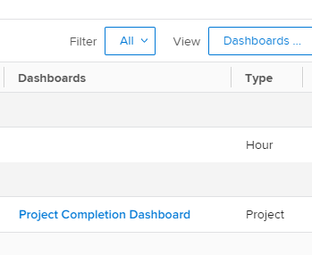

# Verstehen, wie Berichte in einem Dashboard organisiert werden

## Zugriff auf Dashboard-Informationen in einer Berichtsliste

Sie können sehen, ob ein Bericht zu einem Dashboard in Adobe Workfront hinzugefügt wird. Dies kann nützlich sein, wenn Sie entscheiden, welche Berichte Sie behalten können und welche aus dem System gelöscht werden können. Wenn Berichte in Dashboards vorhanden sind, können die Benutzer immer noch auf sie angewiesen sein. Es wird empfohlen, Berichte, die in von Benutzern verwendeten Dashboards aufgeführt sind, nicht zu löschen.\
Weitere Informationen zum Hinzufügen von Berichten zu Dashboards finden Sie im Artikel [Hinzufügen eines Berichts zu einem Dashboard](../../../reports-and-dashboards/dashboards/creating-and-managing-dashboards/add-report-dashboard.md).

Sie können sehen, ob ein Bericht zu einem Dashboard hinzugefügt wird, indem Sie einen der folgenden Schritte ausführen:

* Erstellen einer Ansicht für eine Liste von Berichten und einschließlich Dashboard-Informationen in den Spalten
* Filtern einer Berichtsliste durch ein oder mehrere spezifische Dashboards, von denen Sie wissen, dass sie aktiv verwendet werden
* Erstellen eines Berichts für das Berichtsobjekt und Verwenden einer Ansicht oder eines Filters, die Dashboard-Informationen enthalten

Jeder kann eine Ansicht oder einen Filter erstellen, Sie müssen jedoch über Bearbeitungszugriff auf Berichte auf Ihrer Zugriffsebene verfügen, um einen Bericht zu erstellen.\
Weitere Informationen zum Zugriff auf Berichte finden Sie im Artikel [Gewähren des Zugriffs auf Berichte, Dashboards und Kalender](../../../administration-and-setup/add-users/configure-and-grant-access/grant-access-reports-dashboards-calendars.md).\
Weitere Informationen zum Erstellen eines Berichts finden Sie im Artikel [Erstellen eines benutzerdefinierten Berichts](../../../reports-and-dashboards/reports/creating-and-managing-reports/create-custom-report.md).

## Zugriffsanforderungen

+++ Erweitern, um die Zugriffsanforderungen für die in diesem Artikel beschriebene Funktionalität anzuzeigen. 

<table style="table-layout:auto"> 
 <col> 
 <col> 
 <tbody> 
  <tr> 
   <td role="rowheader">Adobe Workfront-Paket</td> 
   <td> 
Beliebig
 </td> 
  </tr> 
  <tr> 
   <td role="rowheader">Adobe Workfront-Lizenz</td> 
   <td> 
   
Standard

   
Abo 
 </td> 
  </tr> 
  <tr> 
   <td role="rowheader">Konfigurationen der Zugriffsebene</td> 
   <td> 
Zugriff auf Berichte, Dashboards, Kalender bearbeiten
 
Zugriff auf Filter, Ansichten, Gruppierungen bearbeiten
</td> 
  </tr> 
  <tr> 
   <td role="rowheader">Objektberechtigungen</td> 
   <td> 
Verwalten von Berechtigungen für einen Bericht
</td> 
  </tr> 
 </tbody> 
</table>

Weitere Details zu den Informationen in dieser Tabelle finden Sie unter [Zugriffsanforderungen in der Dokumentation zu Workfront](/help/quicksilver/administration-and-setup/add-users/access-levels-and-object-permissions/access-level-requirements-in-documentation.md).

+++

## Anzeigen von Dashboard-Informationen in der Ansicht einer Berichtsliste

>[!WARNING]
>
>Die Einbeziehung der Spalte Dashboards in eine Berichtsliste kann die Ladezeiten erheblich erhöhen, insbesondere bei langen Berichtslisten.

So erstellen Sie eine Ansicht mit Dashboard-Informationen für eine Berichtsliste:

1. Klicken Sie auf **Hauptmenü**-Symbol  in der rechten oberen Ecke von Workfront und dann auf **Berichte**.
1. Klicken Sie in der Berichtsliste auf das **Anzeigen** Dropdown-Menü.
1. Klicken Sie **Neue Ansicht**.
1. Klicken Sie auf **Spalte hinzufügen**.
1. Beginnen Sie, im Feld „Feldname eingeben **„Dashboards“**.
1. Wählen Sie unter **Report**-Objekt **Dashboards** aus.

1. Klicken Sie auf **Ansicht speichern**.\
   Die Dashboards, auf denen ein Bericht angezeigt wird, werden in der Spalte Dashboards der Berichtsliste angezeigt.\
   

## Filtern einer Berichtsliste nach Dashboard-Informationen

So filtern Sie eine Liste von Berichten nach Dashboard-Informationen:

1. Klicken Sie auf **Hauptmenü**-Symbol  in der rechten oberen Ecke von Workfront und dann auf **Berichte**.

1. Klicken Sie in der Berichtsliste auf das **Filter** Dropdown-Menü.
1. Klicken Sie **Neuer Filter** und dann auf **Filterregel hinzufügen**.

1. Beginnen Sie, im Feld „Feldname eingeben **„Dashboards“**.

1. Wählen Sie unter **Objekt** Dashboards“ **Name** aus.

1. Wählen Sie **Dropdown-Menü** Modifikator“ aus und geben Sie dann den Namen des Dashboards ein, nach dem Sie filtern möchten. Sie können mehrere Dashboards für Ihren Filter auswählen.\
   

1. Klicken Sie auf **Speichern + schließen**.\
   Dadurch wird eine Liste von Berichten angezeigt, die nur in den angegebenen Dashboards aufgeführt sind.\
   Sie können auch einen Bericht für das Berichtsobjekt erstellen und diesen Filter im Bericht verwenden.
