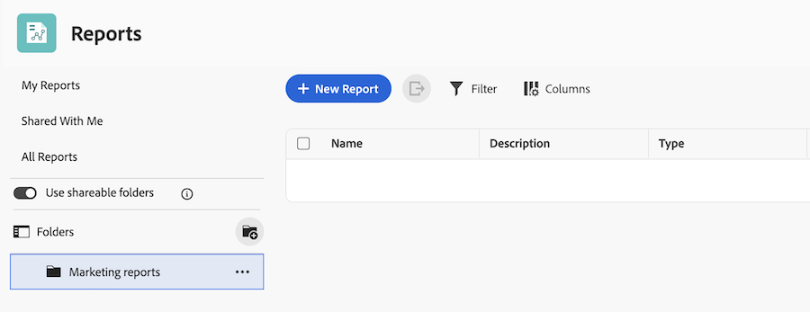

# Verwenden von freigebbaren Berichtsordnern

Die Informationen auf dieser Seite beziehen sich auf Funktionen, die noch nicht allgemein verfügbar sind. Sie ist nur in der Sandbox-Vorschau-Umgebung verfügbar.

<!-- This article is linked in the UI -->

Sie können freigebbare Berichtsordner verwenden, um Berichte zu organisieren und diese Ordner für andere Benutzer freizugeben. Diese Funktion wurde für Teams entwickelt, die große Mengen an Berichten verwalten und eine skalierbare, konsistente Zugriffskontrolle benötigen.

## Zugriffsanforderungen

+++ Erweitern, um die Zugriffsanforderungen für die in diesem Artikel beschriebene Funktionalität anzuzeigen. 

<table style="table-layout:auto"> 
 <col> 
 <col> 
 <tbody> 
  <tr> 
   <td role="rowheader">Adobe Workfront-Paket</td> 
   <td> 
Beliebig
 </td> 
  </tr> 
  <tr> 
   <td role="rowheader">Adobe Workfront-Lizenz</td> 
   <td> 
   
Beliebig
 </td> 
  </tr> 
  <tr> 
   <td role="rowheader">Konfigurationen der Zugriffsebene</td> 
   <td> 
Zugriff auf Berichte, Dashboards, Kalender bearbeiten
 
Zugriff auf Filter, Ansichten, Gruppierungen bearbeiten
</td> 
  </tr> 
  <tr> 
   <td role="rowheader">Objektberechtigungen</td> 
   <td> 
Verwalten von Berechtigungen für einen Bericht
</td> 
  </tr> 
 </tbody> 
</table>

Weitere Details zu den Informationen in dieser Tabelle finden Sie unter [Zugriffsanforderungen in der Dokumentation zu Workfront](/help/quicksilver/administration-and-setup/add-users/access-levels-and-object-permissions/access-level-requirements-in-documentation.md).

+++

## Grundlegendes zu Ordnerberechtigungen

Für freigebbare Berichtsordner werden zwei Berechtigungsebenen verwendet:

* **Anzeigen**: Benutzende können Berichte im Ordner öffnen, aber keine Ordnerdetails bearbeiten, Elemente hinzufügen oder entfernen oder den Ordner löschen. Sie können Benutzern mit Ansichtszugriff erlauben, den Ordner freizugeben, indem Sie die **Freigeben** aktivieren, wenn Sie Zugriff gewähren.
* **Verwalten**: Benutzer können Ordnerdetails bearbeiten und Berichtselemente hinzufügen oder verschieben. Ihnen wird auch Zugriff auf „Verwalten“ von Berichten im Ordner gewährt. Sie können Benutzern mit Verwaltungszugriff erlauben, den Ordner freizugeben oder Ordner zu löschen, indem Sie die Einstellungen **Freigeben** und **Löschen** aktivieren, wenn Sie Zugriff gewähren.

Zusätzliches Verhalten:

* Systemadministratoren können alle Ordner anzeigen.
* Andere Benutzer sehen nur Ordner, auf die sie Zugriff haben.
* Die einem übergeordneten Ordner gewährten Berechtigungen gelten für alle Unterordner und Berichte innerhalb dieser Ordnerstruktur.
* Benutzende mit Zugriff auf einen Unterordner können die übergeordneten Ordner zur Navigation anzeigen, jedoch keine gleichrangigen Ordner, es sei denn, der Zugriff wird gewährt.

## Erstellen eines freigebbaren Berichtsordners

Nur Systemadministratoren können Ordner auf der obersten Ebene erstellen. Nachdem ein freigebbarer Ordner erstellt wurde, können Benutzende mit Verwaltungszugriff darin Unterordner erstellen.

{{step1-to-reports}}

1. Aktivieren Sie den **Freigabe von Berichtsordnern**.
1. Klicken Sie **Ordner erstellen**.
1. Geben Sie einen Namen für den Ordner ein.
1. Klicken Sie auf **Erstellen**.

## Erstellen eines Unterordners in einem freigebbaren Berichtsordner

Sie können in einem freigebbaren Berichtsordner bis zu drei Ebenen von Unterordnern erstellen. Unterordner erben Berechtigungen vom übergeordneten Ordner, Sie können jedoch auch eindeutige Berechtigungen für jeden Unterordner festlegen.

{{step1-to-reports}}

1. Suchen Sie den Ordner, in dem Sie einen Unterordner erstellen möchten.
1. Klicken Sie auf **Mehr** > **Unterordner hinzufügen**.
1. Geben Sie einen Namen für den Unterordner ein.
1. Klicken Sie auf **Erstellen**.

## Freigeben eines Berichtsordners für andere Benutzer

Wenn Sie einen Ordner für Benutzer freigeben, erben diese den Zugriff auf alle Unterordner in dieser Ordnerstruktur. Benutzende müssen außerdem Zugriff auf jeden Bericht haben, entweder über Ordnerberechtigungen oder über die direkte Berichtfreigabe.

{{step1-to-reports}}

1. Suchen Sie den Ordner, den Sie freigeben möchten.
1. Klicken Sie auf **Mehr** > **Freigeben**.
1. Benutzer, Teams, Rollen, Gruppen oder Unternehmen hinzufügen.
1. Wählen Sie **Anzeigen** oder **Verwalten** Zugriff:
   * Mit „Zugriff anzeigen“ können Benutzer Berichte im Ordner öffnen. Sie können Benutzern mit Ansichtszugriff auch erlauben, den Ordner erneut freizugeben, indem Sie **Freigeben** in den zusätzlichen Einstellungen auswählen.
   * Zugriff verwalten ermöglicht Benutzern das Bearbeiten von Ordnerdetails und das Hinzufügen oder Entfernen von Elementen. Sie können Benutzern mit Verwaltungszugriff auch erlauben, Ordner zu löschen oder den Ordner freizugeben, indem Sie **Löschen** und **Freigeben** in den zusätzlichen Einstellungen auswählen.
1. Klicken Sie auf **Speichern**.

   

## Verschieben eines Berichts in einen freigebbaren Ordner

Um einen Bericht in einen Ordner zu verschieben, müssen Sie über **Verwalten** sowohl für den Bericht als auch für den freigebbaren Ordner verfügen.

{{step1-to-reports}}

1. Aktivieren Sie das Kontrollkästchen neben dem Bericht, den Sie verschieben möchten.
1. Klicken **unten** Bildschirm in der Aktionsleiste auf „In Ordner verschieben“.
1. Suchen Sie den Ordner, in den Sie den Bericht verschieben möchten, und klicken Sie dann auf **Verschieben**. Die Berichtsstruktur ist standardmäßig reduziert, sodass Sie möglicherweise die Ordner erweitern müssen, um den Zielordner zu finden.

   

## Freigebbaren Berichtsordner löschen

Wenn Sie einen Ordner löschen, werden auch alle Unterordner in diesem Ordner gelöscht. Sie müssen **Verwalten** Zugriff auf den Ordner haben, um ihn zu löschen. Berichte im Ordner werden nicht gelöscht und befinden sich weiterhin in der Hauptberichtsliste.

Berichtsberechtigungen, die über die Ordnerberechtigungen gewährt werden, werden entfernt, wenn der Ordner gelöscht wird. Berichtsberechtigungen, die direkt aus dem Bericht gewährt oder von einem Dashboard übernommen wurden, bleiben erhalten.

{{step1-to-reports}}

1. Klicken Sie auf **Mehr** > **Löschen**.
1. Klicken Sie **Ja, löschen** zur Bestätigung.

## Neues Listenerlebnis für freigebbare Ordner

Wenn Sie im Bereich Berichte auf freigebbare Ordner zugreifen, wird Ihnen ein neues Listenerlebnis angezeigt, mit dem Sie Ihre Ordner und Berichte einfach anzeigen und verwalten können. Weitere Informationen zum neuen Listenerlebnis finden Sie unter [Verwenden erweiterter Listen](/help/quicksilver/workfront-basics/navigate-workfront/use-lists/enhanced-lists.md).