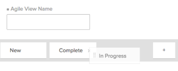

# Erstellen oder Bearbeiten von Ansichten in Adobe Workfront

<!-- Audited: 11/2024 -->

Sie können die Art der Informationen, die Sie auf dem Bildschirm anzeigen, mithilfe von Ansichten anpassen. Sie können in Adobe Workfront verschiedene Ansichtstypen verwenden.

In diesem Artikel wird beschrieben, wie Sie Standardansichten für Listen und Berichte erstellen und bearbeiten und wie Sie Agile-Ansichten erstellen. Weitere Informationen finden Sie unter [Ansichten - Übersicht in Adobe Workfront](../../../reports-and-dashboards/reports/reporting-elements/views-overview.md).

## Zugriffsanforderungen

+++ Erweitern Sie , um die Zugriffsanforderungen für die -Funktion in diesem Artikel anzuzeigen.

Sie müssen über folgenden Zugriff verfügen, um die Schritte in diesem Artikel ausführen zu können:

<table style="table-layout:auto"> 
 <col> 
 <col> 
 <tbody> 
  <tr> 
   <td role="rowheader"><strong>Adobe Workfront-Plan</strong></td> 
   <td> 
Beliebig
 </td> 
  </tr> 
  <tr> 
   <td role="rowheader"><strong>Adobe Workfront-Lizenz*</strong></td> 
   <td> 
      
Neu:

         <ul>
         <li>
Mitwirkender oder höher
</li>
         </ul>
      
Aktuell:

         <ul>
         <li>
Anfrage oder höher
</li>
         </ul>
   </td>
  </tr> 
  <tr> 
   <td role="rowheader"><strong>Konfigurationen der Zugriffsebene*</strong></td> 
   <td> 
Zugriff auf Filter, Ansichten, Gruppierungen bearbeiten
 
Zugriff auf Berichte, Dashboards und Kalender bearbeiten, um eine Ansicht in einem Bericht zu erstellen

   </td> 
  </tr> 
  <tr> 
   <td role="rowheader"><strong>Objektberechtigungen*</strong></td> 
   <td> 
Verwalten der Berechtigungen für einen Bericht zum Erstellen oder Bearbeiten einer Ansicht in einem Bericht
 
Verwalten von Berechtigungen für eine Ansicht, um sie zu bearbeiten

   </td> 
  </tr> 
 </tbody> 
</table>

*Weitere Informationen finden Sie unter [Zugriffsanforderungen in der Dokumentation zu Workfront](/help/quicksilver/administration-and-setup/add-users/access-levels-and-object-permissions/access-level-requirements-in-documentation.md).

+++

## Erstellen oder Anpassen einer Ansicht

Der Prozess zum Erstellen oder Anpassen einer Ansicht unterscheidet sich, je nachdem, ob Sie eine Standardansicht oder eine Agile-Ansicht erstellen oder anpassen.

* [Erstellen oder Anpassen einer Standardansicht](#create-or-customize-a-standard-view)
* [Erstellen oder Anpassen einer Agile-Ansicht](#create-or-customize-an-agile-view)

### Erstellen oder Anpassen einer Standardansicht {#create-or-customize-a-standard-view}

Sie können eine neue Standardansicht erstellen oder eine vorhandene Standardansicht, die Sie zuvor erstellt haben, anpassen.

1. Klicken Sie auf **Dropdown** Menü „Ansicht“ in einer Liste, in der Sie eine Ansicht erstellen oder anpassen möchten.

1. Klicken Sie auf die Schaltfläche **+ Neue Ansicht**, um eine neue Ansicht zu erstellen.
oder
Klicken Sie auf **Bearbeiten**-Symbol , das beim Bewegen der Maus über rechts neben einer vorhandenen Ansicht angezeigt wird, die Sie bearbeiten möchten.
Das **Ansicht anpassen** wird angezeigt.

1. Führen Sie **Abschnitt** Spaltenvorschau“ einen der folgenden Schritte aus:

   * Ändern Sie den Wert einer beliebigen Spalte, indem Sie auf den Spaltentitel klicken und dann ein neues Feld auswählen.
   * Fügen Sie eine Spalte hinzu, indem Sie auf **Spalte hinzufügen** klicken, den Namen der Spalte eingeben, die Sie hinzufügen möchten, und dann auf sie klicken, wenn sie in der Dropdown-Liste angezeigt wird.
   * Passen Sie die Reihenfolge der Spalten an, indem Sie den Spaltentitel an eine neue Position ziehen.

   * Klicken Sie im Bereich **Spalteneinstellungen** auf **Diese Spalte zusammenfassen nach** und wählen Sie aus, wie die Daten in der Spalte angezeigt werden sollen. Diese Option ist für die folgenden Spaltentypen verfügbar:

     <table style="table-layout:auto"> 
         <col> 
         <col> 
         <tbody> 
          <tr> 
           <td role="rowheader"><strong>Datumsfelder</strong></td> 
           <td><ul>
           <li>Maximum</li>
         <li>Minimum</li>
           </ul></td> 
          </tr> 
          <tr>
           <td role="rowheader"><strong>Währungsfelder</strong></td> 
           <td><ul>
           <li>Count</li>
         <li>Summe</li>
           <li>Durchschnitt</li>
         <li>Maximum</li>
           <li>Minimum</li>
         </ul></td> 
          </tr> 
         <tr>
           <td role="rowheader"><strong>Zeichenfolgen- und boolesche Felder</strong></td> 
           <td><ul><li>Count</li></ul>
           
Hinweis: Workfront empfiehlt im Allgemeinen nicht, ein boolesches Feld nach Anzahl zusammenzufassen, da der Wert immer „true“/„false“ sein wird.
</td> 
          </tr> 
         </tbody> 
        </table>

     >[!NOTE]
     >
     >Die folgenden Ausnahmen gelten für übergeordnete Objekte (z. B. übergeordnete Aufgaben), wenn Sie Werte für die folgenden Felder in Gruppierungen zusammenfassen:
     >   
     > * Alle Felder für Zahl und Währung außer Iststunden (z. B. geplante/Ist-Lohnkosten, geplante/Ist-Ausgaben-Kosten, geplante/Ist-Kosten, geplante Stunden) fassen die Werte nur für untergeordnete Aufgaben und eigenständige Aufgaben zusammen. Sie fassen die Werte für die übergeordneten Aufgaben oder die übergeordneten Aufgaben nicht zusammen.
     > * Tatsächliche Stunden fassen die Werte für die übergeordnete Hauptaufgabe und die eigenständigen Aufgaben zusammen. Sie fassen nicht die Zahlen für die übergeordneten Aufgaben oder die untergeordneten Aufgaben zusammen.
     > * Benutzerdefinierte Datenfelder für Zahlen- und Währungswerte fassen alle Aufgaben zusammen: Eltern, Kinder, Eltern von Eltern und eigenständige Aufgaben.
     >
     >Weitere Informationen zur Verwendung von Gruppierungen in einem Bericht finden Sie im Artikel [Gruppierungen - Übersicht in Adobe Workfront](../../../reports-and-dashboards/reports/reporting-elements/groupings-overview.md).

      * (Optional) Klicken Sie auf **Erweiterte Optionen**, um die folgenden Informationen für die Spalte anzugeben:

        <table style="table-layout:auto"> 
         <col> 
         <col> 
         <tbody> 
          <tr> 
           <td role="rowheader"><strong>Benutzerdefiniertes Spalten-Label</strong></td> 
           <td>
Geben Sie eine benutzerdefinierte Beschriftung für die Spalte an. Diese Beschriftung ersetzt die Standardbeschriftung. Es wird empfohlen, nur UTF-8-Zeichen zu verwenden, um Kompatibilitätsprobleme zu vermeiden.
</td> 
          </tr> 
          <tr> 
           <td role="rowheader"><strong>Feldformat</strong></td> 
           <td>Wählen Sie das Format aus, in dem die Werte für Felder in der Spalte angezeigt werden sollen.</td> 
          </tr> 
          <tr> 
           <td role="rowheader"><strong>Diese Spalte im Dashboard anzeigen</strong></td> 
           <td>
Wählen Sie diese Option aus, um diese Spalte auf einem Dashboard anzuzeigen, wenn der Bericht Seite an Seite mit einem anderen Bericht angezeigt wird. Wenn diese Option deaktiviert ist, wird diese Spalte nicht angezeigt, wenn der Bericht in einem Dashboard angezeigt wird, in dem Berichte nebeneinander angezeigt werden.
</td> 
          </tr> 
          <tr> 
           <td role="rowheader"><strong>Spaltenregeln</strong></td> 
           <td>
Klicken Sie auf <strong>+ Regel für diese Spalte hinzufügen</strong> um eine Regel für die Spalte zu definieren. Nachdem Sie eine Regel hinzugefügt haben, können Sie Feld- und Textstile dafür definieren, wie Felder, die dieser Regel entsprechen, angezeigt werden. Klicken Sie <strong>Regel hinzufügen</strong> nachdem Sie die Definition der Regel abgeschlossen haben.
</td> 
          </tr> 
         </tbody> 
        </table>

        Weitere Informationen zur bedingten Formatierung von Ansichten in Berichten finden Sie im Artikel [Verwenden der bedingten Formatierung im Textmodus](../../../reports-and-dashboards/reports/text-mode/use-conditional-formatting-text-mode.md).

1. (Bedingt) Wenn Sie auf **Erweiterte Optionen** geklickt haben, klicken Sie auf **Fertig**.

1. Klicken Sie **Ansicht speichern**, um eine neue Ansicht zu erstellen oder die aktuelle Ansicht durch Ihre Änderungen zu ersetzen.\
   Oder\
   Klicken Sie **Als neue Ansicht speichern**, um Ihre Änderungen als neue Ansicht zu speichern.

   >[!TIP]
   >
   >Die **Als neue Ansicht speichern** ist die einzige Option, die beim Anpassen einer integrierten Workfront-Ansicht verfügbar ist.

   Ihr Zugriff bestimmt, wie die Ansicht gespeichert wird. Wenn Sie die Ansicht ursprünglich erstellt haben, können Sie die Änderungen speichern. Andernfalls werden Sie aufgefordert, eine Version zu speichern. Beachten Sie, dass sich Änderungen an der Ansicht auf Benutzende auswirken, für die die Ansicht freigegeben wurde.

### Erstellen oder Anpassen einer Agile-Ansicht {#create-or-customize-an-agile-view}

Sie können eine Agile-Ansicht erstellen oder eine vorhandene Agile-Ansicht anpassen, die Sie zuvor erstellt haben.

>[!IMPORTANT]
>
>Agile-Ansichten sind nur beim Anzeigen eines Projekts verfügbar.

Weitere Informationen zu Agile-Ansichten finden Sie im Artikel [Verwalten eines Projekts in der Agile-Ansicht](../../../manage-work/projects/manage-projects/manage-projects-in-agile-view.md).

>[!NOTE]
>
>Dieses Verfahren gilt nur für die veraltete Agile-Ansicht, nicht für die Board-Ansicht eines Projekts.

So erstellen oder passen Sie eine Agile-Ansicht an:

1. Navigieren Sie zur Liste der Aufgaben in einem Projekt.
1. Klicken Sie auf das **Board**-Symbol  und klicken Sie dann in der Pinnwand-Ansicht **Ältere** verwenden“.

1. (Bedingt) Anpassen einer vorhandenen Agile-Ansicht:

   1. Klicken Sie auf **Dropdown** Menü „Ansicht“ und wählen Sie dann die Agile-Ansicht aus, die Sie anpassen möchten.\
      Die Agile-Standardansicht kann nicht angepasst werden.

   1. Klicken Sie erneut auf **Dropdown** Menü „Ansicht“ und dann auf **Ansicht anpassen**.\
      

1. (Bedingt) Um eine neue Agile-Ansicht zu erstellen, klicken Sie auf **Neue Ansicht**.\
   Das **Anpassen der Agile-**&quot; wird angezeigt.

1. Geben **im Dialogfeld „Agile** anpassen“ einen Namen für die Agile-Ansicht an.\
   Es wird empfohlen, in Ihrem Ansichtsnamen das Wort „Agile“ einzufügen, damit Benutzende wissen, dass es sich um eine Agile-Ansicht handelt.\
   Dieser Name wird im Dropdown **Menü „Ansicht** angezeigt, wenn Sie eine Ansicht auswählen.

1. Definieren Sie die Statusspalten, die auf dem Story Board in der Agile-Ansicht angezeigt werden sollen. Dies sind die Aufgabenstatus, die vom Workfront-Administrator definiert werden, wie unter &quot;[&#x200B; erstellen oder bearbeiten](../../../administration-and-setup/customize-workfront/creating-custom-status-and-priority-labels/create-or-edit-a-status.md) beschrieben.

   Im Agile-Story-Board stehen nur Systemstatus zur Verwendung zur Verfügung. Wenn ein Status nur für eine einzelne Gruppe verfügbar ist, der Sie angehören, ist der Status nicht im Agile-Story-Board verfügbar. Darüber hinaus werden Aufgaben mit einem Status, der nur für eine benutzerdefinierte Gruppe verfügbar ist, nicht angezeigt, wenn das Projekt in einer Agile-Ansicht angezeigt wird.

   Benutzer können Storys zwischen diesen Statusspalten im Agile-Story-Board verschieben.\
   Beim Definieren von Statusspalten haben Sie folgende Möglichkeiten:

   <table style="table-layout:auto"> 
    <col> 
    <col>
    <tbody> 
     <tr> 
      <td role="rowheader"><strong>Statusspalten neu anordnen:</strong> </td> 
      <td> Ziehen Sie eine Statusspalte in die Reihenfolge, in der sie angezeigt werden soll. </td> 
     </tr> 
     <tr> 
      <td role="rowheader"><strong>Entfernen von Statusspalten:</strong> </td> 
      <td>Klicken Sie auf das Symbol (x) in der Spalte, die Sie entfernen möchten. Sie können den Status „Neu“ nur entfernen, wenn der Ansicht ein benutzerdefinierter Status hinzugefügt wurde und dieser benutzerdefinierte Status mit „Neu“ gleichgesetzt wird. Informationen zum Erstellen eines benutzerdefinierten Status finden Sie unter <a href="../../../administration-and-setup/customize-workfront/creating-custom-status-and-priority-labels/create-or-edit-a-status.md" class="MCXref xref">Erstellen oder Bearbeiten eines Status</a>.</td> 
     </tr> 
     <tr> 
      <td role="rowheader"><strong>Statusspalten hinzufügen:</strong> </td> 
      <td> 
Klicken Sie auf <strong>Plus</strong>-Symbol und wählen Sie dann den Status aus, den Sie hinzufügen möchten. Es werden alle standardmäßigen Systemstatus sowie alle benutzerdefinierten Status angezeigt, die für Sie freigegeben wurden. Sie können bis zu 10 Status konfigurieren, die angezeigt werden sollen.
</td> 
     </tr> 
    </tbody> 
   </table>

   <!--
        
(NOTE FOR ADD STATUS COLUMNS: research this and add: [! What if the status has been shared with me or a group I'm in (so I can see it here), but the status hasn't been shared with another user who also has access to a project where I later apply this view? Can that user still see this status on the project?]) 

       -->

1. Wählen Sie im Bereich **Kartenfarbe zuordnen zu** eine der folgenden Optionen aus:

   <table style="table-layout:auto"> 
    <col> 
    <col>
    <tbody> 
     <tr> 
      <td role="rowheader"><strong>Story:</strong> </td> 
      <td>Alle Teilaufgaben stimmen mit der Farbe der übergeordneten Aufgabe überein, sodass die Farben aller Storys in jedem beliebigen Swimlane gleich sind. Farben werden Aufgaben nach dem Zufallsprinzip zugewiesen, wenn sie erstellt werden, wenn die Aufgabe keine Unteraufgaben hat oder keine übergeordnete Aufgabe hat.</td> 
     </tr> 
     <tr> 
      <td role="rowheader"><strong>Freiform:</strong> </td> 
      <td> Alle Karten werden standardmäßig blau angezeigt, bis ein Benutzer die Farbe manuell ändert, wie im Artikel <a href="../../../agile/use-scrum-in-an-agile-team/scrum-board/categorize-stories-by-color.md" class="MCXref xref">Kategorisieren von Storys nach Farbe auf dem Scrum-Board</a> beschrieben. </td> 
     </tr> 
     <tr> 
      <td role="rowheader"><strong>Priorität:</strong> </td> 
      <td> 
 Mit der Story-Priorität sind folgende Farben verknüpft:
 
       <ul> 
        <li>Hoch = Rot</li> 
        <li>Medium = Gelb</li> 
        <li>Niedrig = Grün Wenn Ihr Workfront-Administrator benutzerdefinierte Prioritäten für Ihr Workfront-System konfiguriert hat, ist die höchste Priorität rot, die zweithöchste gelb und die restlichen grün.</li> 
       </ul> </td> 
     </tr> 
     <tr> 
      <td role="rowheader"><strong>Aufgabenbesitzer:</strong> </td> 
      <td> Alle Storys mit derselben primären Zuweisung haben dieselbe Farbe. Der primäre Zugewiesene ist der Benutzer, der der Aufgabe zum ersten Mal zugewiesen wurde. </td> 
     </tr> 
    </tbody> 
   </table>

1. Klicken Sie im Bereich **Zusätzliche Felder** auf **Feld hinzufügen** und wählen Sie dann das Feld aus, das Sie zu Story-Karten hinzufügen möchten. (Hierbei handelt es sich um dieselben Felder, die Sie hinzufügen können, wenn Sie eine Ansicht anpassen oder Spalten für einen Bericht erstellen.)\
   Wiederholen Sie diesen Vorgang, um den Story-Karten bis zu drei zusätzliche Felder hinzuzufügen.\
   Wenn Sie Felder zu Story-Karten hinzufügen, sind die Felder schreibgeschützt und werden nur angezeigt, wenn das Feld ausgefüllt ist.

   Standardmäßig werden die folgenden Datentypen auf der Story-Karte angezeigt:

   * Name der Story mit einem Link direkt zur Aufgabe
   * Der Projektname mit einem Link direkt zum Projekt\
     Dieser Link wird nur bei Verwendung der Agile-Ansicht bei einer Iteration angezeigt; er wird nicht angezeigt, wenn eine Agile-Ansicht für ein Projekt verwendet wird.
   * Die Aufgabenbeschreibung
   * Laufende Mittelbindung
   * Sie können den abgeschlossenen Prozentsatz anzeigen und bearbeiten, indem Sie entweder den abgeschlossenen Prozentsatz selbst oder die Anzahl der abgeschlossenen Punkte oder Stunden anpassen
   * Zugewiesene Benutzer

   Sie können zusätzliche Daten (einschließlich benutzerdefinierter Daten) auf Story-Karten anzeigen. Möglicherweise möchten Sie aus verschiedenen Gründen zusätzliche Felder auf Story-Karten anzeigen. Beispielsweise können Sie die Kunden-ID anzeigen, wenn Sie an Storys für mehrere Kunden innerhalb des Projekts arbeiten, oder Sie möchten das Startdatum der Aufgabe anzeigen.

1. Klicken Sie auf **Speichern**.\
   Ihr Zugriff bestimmt, wie die Ansicht gespeichert wird. Wenn Sie die Ansicht ursprünglich erstellt haben, können Sie die Änderungen speichern. Andernfalls werden Sie aufgefordert, eine Version zu speichern. Beachten Sie, dass sich Änderungen an der Ansicht auf Benutzende auswirken, für die die Ansicht freigegeben wurde.

1. (Optional) Klicken Sie auf das Symbol **Liste**, um zur Aufgabenliste zurückzukehren.
