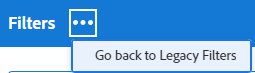
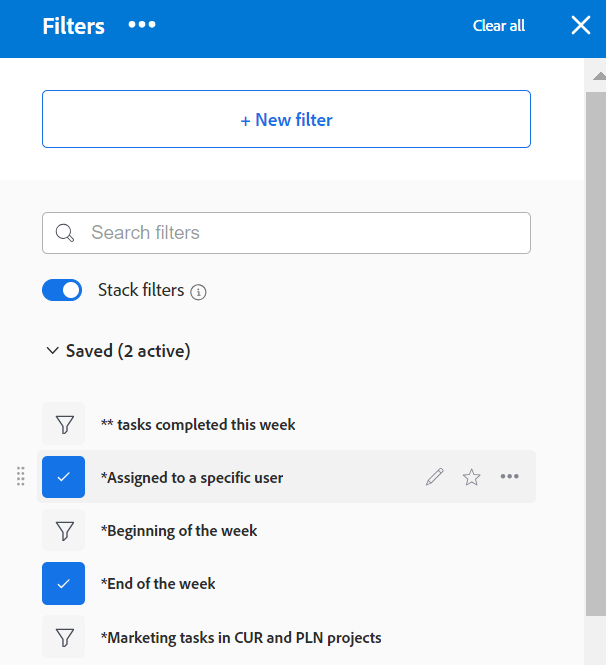

# Filter in Adobe Workfront erstellen oder bearbeiten

Mit einem Filter können Sie die Anzahl der angezeigten Informationen in einer Liste von Elementen einschränken. Sie können bestimmte Kriterien basierend auf bestimmten Informationen über ein Objekt definieren und nur die Objekte anzeigen, die diesen Kriterien entsprechen.

Sie können die folgenden Filtertypen in Adobe Workfront anwenden:

* Schnellfilter in einer Objektliste, um ein Element mithilfe eines Suchbegriffs zu finden. Hierbei handelt es sich um temporäre Filter, die Sie nicht für die zukünftige Verwendung speichern können.

   Informationen zu Schnellfiltern finden Sie unter [Schnellfilter auf Listen anwenden](../../../workfront-basics/navigate-workfront/use-lists/apply-quick-filter-list.md).

* Ständige Filter, die Sie speichern und für mehrere Listen und Berichte verwenden können. In diesem Artikel wird beschrieben, wie Sie einen permanenten Filter erstellen oder einen vorhandenen Filter in einer Liste oder einem Bericht bearbeiten.

* Filter in anderen Bereichen von Workfront außerhalb von Listen und Berichten.

   Eine Liste aller Filter in Workfront und der Bereiche, in denen sie angewendet werden können, finden Sie unter [Filterübersicht in Adobe Workfront](../../../reports-and-dashboards/reports/reporting-elements/filters-overview.md).

## Zugriffsanforderungen

Sie müssen über folgenden Zugriff verfügen, um die Schritte in diesem Artikel ausführen zu können:

<table style="table-layout:auto"> 
 <col> 
 <col> 
 <tbody> 
  <tr> 
   <td role="rowheader"><strong>Adobe Workfront-Plan*</strong></td> 
   <td> 
Beliebig
 </td> 
  </tr> 
  <tr> 
   <td role="rowheader"><strong>Adobe Workfront-Lizenz*</strong></td> 
   <td> 
Anforderung oder höher
 </td> 
  </tr> 
  <tr> 
   <td role="rowheader"><strong>Konfigurationen auf Zugriffsebene*</strong></td> 
   <td> 
Zugriff auf Filter, Ansichten und Gruppierungen bearbeiten
 
Hinweis: Wenn Sie immer noch keinen Zugriff haben, fragen Sie Ihren Workfront-Administrator, ob er zusätzliche Zugriffsbeschränkungen für Ihre Zugriffsebene festlegt. Informationen dazu, wie ein Workfront-Administrator Ihre Zugriffsebene ändern kann, finden Sie unter <a href="../../../administration-and-setup/add-users/configure-and-grant-access/create-modify-access-levels.md" class="MCXref xref">Benutzerdefinierte Zugriffsebenen erstellen oder ändern</a>.
 </td> 
  </tr> 
  <tr> 
   <td role="rowheader"><strong>Objektberechtigungen</strong></td> 
   <td> 
Berechtigungen für Filter verwalten
 
Informationen zum Anfordern von zusätzlichem Zugriff finden Sie unter <a href="../../../workfront-basics/grant-and-request-access-to-objects/request-access.md" class="MCXref xref">Zugriff auf Objekte anfordern </a>.
 </td> 
  </tr> 
 </tbody> 
</table>

&#42;Wenden Sie sich an Ihren Workfront-Administrator, um zu erfahren, welchen Plan, welchen Lizenztyp oder welchen Zugriff Sie haben.

## Typen von Filteraufbauschnittstellen

Sie können Filter anhand der in der folgenden Tabelle beschriebenen Typen von Filtergenerator erstellen:

<table style="table-layout:auto">
<col>
<col>
<col>
<tbody>
<tr>
<td><strong>Builder-Typ</strong></td>
<td><strong>Filterobjekt</strong></td>
<td><strong>soweit verfügbar</strong></td>
</tr>
<tr>
<td>Standard-Builder</td>
<td>
<ul>
<li> 
Projekte
 </li>
<li> 
Aufgaben 
 </li>
<li> 
Probleme
 </li>
<li> 
Portfolios
 </li>
<li> 
Programme
 </li>
<li> 
Benutzende
 </li>
<li> 
Vorlagen
 </li>
<li> 
Gruppen
 </li>
</ul>
</td>
<td>
<ul>
<li> 
Listen 
 </li>
</ul>
<ul>
<li> 
Die Liste "Projekte"im Szenario-Planer
 
Für den Szenario-Planer ist eine zusätzliche Lizenz erforderlich. Weitere Informationen zum Workfront-Szenario-Planer finden Sie unter <a href="../../../scenario-planner/scenario-planner-overview.md">Übersicht über den Szenario-Planer</a>. 
 </li>
</ul>

HINWEIS: Standardgenerator für Filter sind in Berichten nicht verfügbar.
</td>
</tr>
<tr>
<td>Legacy-Builder</td>
<td>Alle Objekte </td>
<td>Listen und Berichte</td>
</tr>
</tbody>
</table>

Weitere Informationen zu Workfront-Objekten finden Sie unter [Objekte in Adobe Workfront verstehen](/help/quicksilver/workfront-basics/navigate-workfront/workfront-navigation/understand-objects.md).

Beachten Sie beim Erstellen von Filtern mit den verschiedenen Schnittstellen Folgendes:

* Sie finden den Standard-Builder an denselben Stellen wie die alte Filterschnittstelle für die in der obigen Tabelle aufgelisteten Bereiche.
* Der Standard-Builder ist das Standarderlebnis für alle Bereiche, in denen er verfügbar ist. Um zum alten Filter-Builder zu wechseln, klicken Sie auf das **Mehr** Menü neben [!UICONTROL **Filter**] und wählen Sie [!UICONTROL **Zurück zu Legacy-Filtern**].

   

* Gespeicherte Filter sind in beiden Buildern verfügbar, unabhängig davon, welches Erlebnis Sie ursprünglich erstellt haben. Wenn Sie beispielsweise einen Filter mit dem Legacy-Builder erstellt haben, können Sie ihn auch in der Standard-Builder-Oberfläche finden und ändern.

   >[!TIP]
   >
   >Der Standard-Builder enthält keinen Filter &quot;Alle&quot;, da alle Listenelemente angezeigt werden, wenn keine Filter angewendet werden. Klicken [!UICONTROL **Alle löschen**] oben rechts im Builder, um alle aktiven Filter zu löschen und alle Elemente anzuzeigen. Wenn [!UICONTROL **Alle löschen**] abgeblendet ist, werden keine Filter angewendet.

* Die Standard- und Legacy-Builder haben beim Erstellen von Filtern mit mehreren Aussagen, die die UND- und ODER-Operatoren kombinieren, eine etwas andere Syntax. Daher können diese Filter beim Wechsel von einem Builder zu einem anderen unterschiedlich angezeigt werden.

   >[!INFO]
   >
   >Das folgende Szenario ist vorhanden:
   >
   >1. Verwenden Sie den Standard-Builder, um einen Filter mit der folgenden Syntax zu erstellen:
   >
   >   `(A OR B) AND C`
   >
   >1. Wechseln Sie zum Legacy-Builder und bearbeiten Sie den Filter anhand der Syntax des Legacy-Builders, wie im Abschnitt [Erstellen oder Bearbeiten von Filtern im Legacy-Builder](#create-filter-in-legacy-builder) in diesem Artikel. Die Syntax für den Legacy-Builder zeigt die Filteranweisungen wie folgt an:
   >
   >   `A AND C`
   >   `OR`
   >   `B AND C`
   >
   >1. Ändern Sie den Filter in der alten Benutzeroberfläche.
   >1. Wechseln Sie zurück zum Standard-Builder. Die Filteranweisung wird entsprechend der Logik angezeigt, die im Legacy-Builder unterstützt wird, wie oben beschrieben.

   >
   >   Der Filter wird in der Standard-Builder-Oberfläche wie folgt angezeigt:
   >  
   >   `A AND C`
   >   `OR`
   >   `B AND C`
   > 
   >   Dies geschieht, weil der Filter in der alten Benutzeroberfläche geändert wurde.

## Erstellen oder Bearbeiten von Filtern im Standard-Builder

Sie können Filter auf folgende Weise mithilfe der Standard-Builder-Oberfläche erstellen:

* Von Grund auf
* Vorhandenen Filter bearbeiten
* Vorhandenen Filter duplizieren
* Duplizieren Sie einen vorhandenen Filter, bearbeiten Sie ihn und speichern Sie ihn als neuen Filter.

Erstellen Sie einen Filter mit der Standard-Builder-Oberfläche:

1. Rufen Sie eine Liste auf, in der Sie einen Filter erstellen möchten oder der den anzupassenden Filter enthält.
1. Klicken Sie auf **Filter** icon  , um die Builder-Oberfläche zu öffnen.

   

1. Überprüfen Sie die folgenden Filterlisten:

   <table style="table-layout:auto">
   <col>
   <col>
   <tbody>
   <tr>
   <td role="rowheader"><strong>Favorit</strong></td>
   <td>Filter, die Sie als Favoriten gekennzeichnet haben. Wenn Sie einen Filter bevorzugen, wird seine ursprüngliche Position unter dem Filternamen angezeigt und er wird aus der ursprünglichen Liste ausgeblendet, es sei denn, Sie entfernen ihn als Favoriten.</td>
   </tr>
   <tr>
   <td role="rowheader"><strong>Gespeichert</strong></td>
   <td>Filter, die Sie selbst erstellt und gespeichert haben.</td>
   </tr>
   <tr>
   <td role="rowheader"><strong>Standardeinstellungen für das System</strong></td>
   <td>Workfront-Systemstandardfilter sowie Filter, die der Workfront-Administrator Ihrer Filterliste entweder auf Systemebene oder in Ihrer Layoutvorlage hinzugefügt hat.</td>
   </tr>
   <tr>
   <td role="rowheader"><strong>Für mich freigegeben</strong></td>
   <td>Filter, die von anderen erstellt und für Sie freigegeben wurden oder die systemweit freigegeben sind.</td>
   </tr>
   </tbody>
   </table>

1. Führen Sie einen der folgenden Schritte aus:

   * Klicken **Neuer Filter** , um einen neuen Filter zu erstellen.
   * Bewegen Sie den Mauszeiger über einen vorhandenen Filter, den Sie verwalten können, und klicken Sie auf die Schaltfläche **Bearbeiten** icon  , um sie zu bearbeiten.

      Oder

      Bewegen Sie den Mauszeiger über einen vorhandenen Filter, den Sie anzeigen können, und klicken Sie auf die Schaltfläche **Mehr** Menü und klicken Sie auf **Duplizieren** , um den vorhandenen Filter zu kopieren und eine Kopie zu bearbeiten.
   

1. (Bedingt) Je nachdem, ob Sie Objekte suchen möchten, die mit allen oder einer der Anweisungen in einer Filtergruppe übereinstimmen, wählen Sie aus den folgenden Optionen aus:

   <table style="table-layout:auto">
   <col>
   <col>
   <tbody>
   <tr>
   <td role="rowheader"><strong>Einschließen, wenn alle wahr sind</strong></td>
   <td>Die vom Filter gefundenen Objekte müssen allen Filterkriterien einer Filtergruppe entsprechen. In diesem Fall werden die Filteranweisungen durch den UND-Operator verbunden. Dies ist die Standardauswahl.</td>
   </tr>
   <tr>
   <td role="rowheader"><strong>Einschließen, wenn eins davon wahr ist</strong></td>
   <td>Die vom Filter gefundenen Objekte müssen allen Filterkriterien einer Filtergruppe entsprechen. In diesem Fall werden die Filteranweisungen durch den ODER-Operator verbunden.</td>
   </tr>
   </tbody>
   </table>

   

   Weitere Informationen zu Filteroperatoren finden Sie unter [Filterübersicht in Adobe Workfront](/help/quicksilver/reports-and-dashboards/reports/reporting-elements/filters-overview.md).

1. Klicken Sie auf das Feld-Dropdown-Menü, um eine Liste der zuletzt verwendeten Felder und der vorgeschlagenen Felder anzuzeigen, nach denen gefiltert werden soll. Die vorgeschlagenen Felder werden derzeit in der Liste angezeigt, die Sie filtern.

   Sie können auch **Felder durchsuchen** um eine Liste aller Felder anzuzeigen, nach denen Sie filtern können. Die Felder der erweiterten Suche werden nach Objektkategorie gruppiert.

   

1. Klicken Sie auf das Dropdown-Menü &quot;Modifikator&quot;, um einen Modifikator auszuwählen. Der Standard-Modifikator ist &quot;Gleich&quot;.

   Weitere Informationen finden Sie unter [Filter- und Bedingungs-Modifikatoren](/help/quicksilver/reports-and-dashboards/reports/reporting-elements/filter-condition-modifiers.md).

   >[!TIP]
   >
   >Beim Erstellen des Filters werden die Ergebnisse sofort in der Liste angezeigt. Wenn der Filterbereich die Liste abdeckt, können Sie sie schließen, um die Anzeige zu sehen. Die eingegebenen Informationen bleiben beim erneuten Öffnen des Bedienfelds im Builder.

1. Geben Sie den Wert eines Felds ein, nach dem Sie filtern möchten. Geben Sie beispielsweise den Namen eines Problems ein, wenn Sie nach `Issue:Name`. Wählen Sie den Wert aus, wenn er in der Liste angezeigt wird.

   >[!TIP]
   >
   >Je nach ausgewähltem Modifikator können Sie mehrere Werte auswählen.

1. Klicken **Filter hinzufügen** , um ein anderes Feld auszuwählen und der Filteranweisung ein neues Filterkriterium hinzuzufügen.
1. (Optional) Klicken Sie auf die **Löschen** icon  um vorhandene Filteranweisungen zu entfernen.

   Oder

   Klicken **Alle löschen** , um alle Filterkriterien zu löschen.

1. (Optional) Klicken Sie auf **Filtergruppe hinzufügen** , um einen weiteren Satz von Filterkriterien hinzuzufügen. Der Standardoperator zwischen den Sets ist AND. Klicken Sie auf den Operator, um ihn in OR zu ändern.

   >[!TIP]
   >
   >Möglicherweise möchten Sie eine andere Filtergruppe verwenden, wenn die Gruppen von einem anderen Operator als dem Operator in einer Filteranweisung verbunden werden sollen.

   >[!INFO]
   >
   >Wenn Sie nach Projekten filtern, die &quot;Marketing&quot;im Namen enthalten, die entweder nicht vollständig sind und sich nicht auf &quot;Auf Halten&quot;befinden, können Sie die folgenden Filtergruppen verwenden:
   >`(Project: Name Contains Marketing AND Project: Percent Complete Does not equal 100)`
   >`OR`
   >`(Project: Name Contains Marketing AND Project: Status Does not equal On Hold)`
   >In diesem Fall ist jede Filteranweisung durch ein UND verbunden und die Filtergruppen sind durch ein ODER verbunden.

1. (Optional) Klicken Sie auf **Textmodus** , um mit der Erstellung des Filters im Textmodus fortzufahren.

   

   Die Textmodus-Benutzeroberfläche wird geöffnet.

   

   >[!TIP]
   >
   >Es wird empfohlen, so viele Filter wie möglich mit der Standard-Builder-Oberfläche zu erstellen und nur den Textmodus zu verwenden, wenn Sie Änderungen am Filter vornehmen müssen, die nur im Textmodus unterstützt werden.

   Weitere Informationen zum Erstellen eines Filters mithilfe der Textmodus-Benutzeroberfläche finden Sie unter [Filter im Textmodus bearbeiten](/help/quicksilver/reports-and-dashboards/reports/text-mode/edit-text-mode-in-filter.md).

1. Klicken **Textmodus beenden** , um zur standardmäßigen Builder-Oberfläche zurückzukehren.

   >[!WARNING]
   >
   >Einige Textmodusanweisungen werden im Standard-Builder oder in der alten Benutzeroberfläche nicht unterstützt. Wenn Sie den Textmodus beenden, wenn Sie diese Arten von Anweisungen erstellt haben, wird möglicherweise eine Warnmeldung angezeigt.

1. (Optional) Klicken Sie auf **Anwenden** , um den Filter auf die Liste anzuwenden und die Ergebnisse anzuzeigen.

   Wenn der Filter keine Ergebnisse liefert, ist die Liste leer.

1. Klicken **Als neu speichern** , um den Filter für die zukünftige Verwendung zu speichern.

   

1. Auswählen **Unbenannter Filter** und geben Sie stattdessen den Namen des neuen Filters ein.

   >[!TIP]
   >
   >Benennen Sie den Filter unbedingt, damit Sie ihn später finden können. Wenn Sie den Filter nicht benennen, wird er im System als unbenannter Filter bezeichnet.

1. Wählen Sie ein Symbol für den neuen Filter aus der **Symbol** Dropdown-Menü.

   

1. (Optional) Fügen Sie eine Beschreibung für den Filter hinzu, um anzugeben, was eindeutig ist. Die Beschreibung wird unter dem Filternamen in der Filterliste angezeigt.

   >[!TIP]
   >
   >Klicken **Abbrechen** Sie gelangen jederzeit zurück zum Filterbaubereich.

1. Klicken **Speichern**. Der Filter wird in der Liste &quot;Gespeichert&quot;gespeichert und auf die Liste der Elemente angewendet.
1. (Optional) Um einen Filter in die Liste &quot;Favoriten&quot;zu verschieben, bewegen Sie den Mauszeiger über einen Filter in der Filterleiste und klicken Sie auf das Symbol &quot;Favoriten&quot; .

   Oder

   Bewegen Sie den Mauszeiger über einen Filter in der Filterleiste und klicken Sie auf das Menü Mehr . und klicken Sie auf **Favorit**.

1. (Optional) Klicken Sie auf die **Filter stapeln** Schaltfläche zum Aktivieren von gestapelten Filtern. Mit dieser Option können Sie mehr als einen gespeicherten Filter anwenden. Die Filterregeln werden in der Reihenfolge ihrer Auswahl angewendet.

   >[!TIP]
   >
   >Die Anzahl der Filter, die Sie auswählen können, ist unbegrenzt.
   >
   >Wenn Sie mehrere Filter auswählen, müssen alle zugehörigen Bedingungen gleichzeitig erfüllt sein, um übereinstimmende Ergebnisse anzuzeigen.

   

   Die Anzahl der ausgewählten Filter wird neben dem Filtersymbol oben in der Elementliste angezeigt.

   

1. (Optional) Führen Sie einen der folgenden Schritte aus:

   * Geben Sie den Filter für andere frei oder stellen Sie ihn systemweit zur Verfügung. Weitere Informationen finden Sie unter [Filter, Ansichten oder Gruppierungen freigeben](/help/quicksilver/reports-and-dashboards/reports/reporting-elements/share-filter-view-grouping.md).

   * Löschen Sie den Filter, wenn er nicht mehr gültig ist oder ein Duplikat ist. Sie können nur Filter löschen, deren Inhaber Sie sind. Sie können Filter entfernen, die für Sie freigegeben wurden. Weitere Informationen finden Sie unter [Entfernen von Filtern, Ansichten und Gruppierungen](/help/quicksilver/reports-and-dashboards/reports/reporting-elements/remove-filters-views-groupings.md).

## Erstellen oder Bearbeiten von Filtern im Legacy-Builder {#create-filter-in-legacy-builder}

Sie können veraltete Filter in Listen und Berichten wie folgt erstellen:

* Von Grund auf
* Vorhandenen Filter bearbeiten und als neuen Filter speichern

Unabhängig von der Methode, die Sie zum Erstellen von Filtern verwenden, ist das Erstellen eines Filters von Grund auf oder aus einem vorhandenen Filter ähnlich.

1. Markieren Sie eine Liste oder einen Bericht mit dem anzupassenden Filter.
1. Klicken Sie auf **Filter** icon .

   >[!TIP]
   >
   >Der Ersteller des Berichts muss die Bearbeitung von Filtern zulassen, damit die Dropdownliste Filter in einem Bericht angezeigt werden kann. Der Filter Berichtsstandard wird standardmäßig auf einen Bericht angewendet. Der Filter Berichtsstandard kann nur angepasst werden, wenn Sie den Bericht bearbeiten.

   

1. Klicken **Neuer Filter** oben in der Filterliste.

   Oder

   Bewegen Sie den Mauszeiger über den zu ändernden Filter und klicken Sie auf die Schaltfläche **Bearbeiten** icon .

   Der Builder zum Anpassen der Filterstarts.

1. Führen Sie einen der folgenden Schritte aus:

   * Ändern Sie vorhandene Filterregeln, indem Sie auf die vorhandene Regel klicken und eine neue Option auswählen.
   * Hinzufügen einer Filterregel durch Klicken auf **Hinzufügen einer weiteren Filterregel** eingeben, beginnen Sie mit der Eingabe des Namens der Option, für die Sie eine Regel im **Eingabe des Feldnamens beginnen** und klicken Sie dann auf ihn, wenn er in der Dropdown-Liste angezeigt wird.

      Die mit dem Objekt Ihres Filters verknüpften Felder werden im Abschnitt **Eingabe des Feldnamens beginnen** ankreuzen.

   * Klicken **UND** oder **ODER** beim Hinzufügen einer neuen Filterregel.\
      Verwenden Sie beim Hinzufügen von Filterregeln die Filter-Modifikatoren, um die Bedingung Ihres Filters festzulegen. Weitere Informationen zu Filtermodifikatoren finden Sie unter [Filter- und Bedingungs-Modifikatoren](../../../reports-and-dashboards/reports/reporting-elements/filter-condition-modifiers.md).

      >[!NOTE]
      >
      >Wenn Sie eine Gruppe von UND-Anweisungen durch mehrere OR-Anweisungen verbinden, müssen Sie die Felder wiederholen, die sich zwischen den OR-Anweisungen für jede Gruppe von Anweisungen nicht ändern.
      >
      >
      >
      >Wenn Sie einen Filter für Aufgaben erstellen, die das Wort &quot;Marketing&quot;enthalten und sich in Projekten mit dem Status &quot;Aktuell&quot;oder &quot;Planung&quot;befinden, müssen Sie über die folgenden Filterregeln verfügen:
      >
      >`Task: Name Contains Marketing`
      >`AND`
      >`Project: Status Equals Current`
      >`OR`
      >`Task: Name Contains Marketing`
      >`AND`
      >`Project: Status Equals Planning`
      >
      >Obgleich Aufgabe: Name Enthält &quot;Marketing&quot;ändert sich nicht zwischen den beiden UND-Filtergruppen, sondern muss in der zweiten Gruppe wiederholt werden.

   * Löschen Sie eine vorhandene Filterregel, indem Sie auf das X-Symbol klicken.

1. (Optional) Klicken Sie auf **In den Textmodus wechseln** , um über die Benutzeroberfläche des Textmodus einen Filter hinzuzufügen.

   Weitere Informationen zum Erstellen eines Filters mithilfe der Textmodus-Benutzeroberfläche finden Sie unter [Filter im Textmodus bearbeiten](../../../reports-and-dashboards/reports/text-mode/edit-text-mode-in-filter.md).

1. Klicken **Filter speichern** , um einen neuen Filter zu erstellen oder den ausgewählten Filter durch Ihre Änderungen zu ersetzen.

   Oder

   Klicken **Als neuen Filter speichern** , um einen neuen Filter aus dem ausgewählten Filter zu erstellen.

   Der neue Filter wird in der Filterliste angezeigt und automatisch auf die ausgewählte Liste oder den ausgewählten Bericht angewendet.

1. (Optional) Führen Sie einen der folgenden Schritte aus:

   * Geben Sie von Ihnen erstellte Filter für andere Benutzer frei oder stellen Sie sie systemweit zur Verfügung. Weitere Informationen finden Sie unter [Filter, Ansichten oder Gruppierungen freigeben](/help/quicksilver/reports-and-dashboards/reports/reporting-elements/share-filter-view-grouping.md).
   * Entfernen Sie Filter, die nicht mehr in der Liste angezeigt werden sollen. Weitere Informationen finden Sie unter [Entfernen von Filtern, Ansichten und Gruppierungen](/help/quicksilver/reports-and-dashboards/reports/reporting-elements/remove-filters-views-groupings.md).

