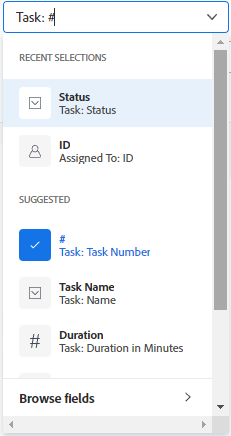

# Erstellen oder Bearbeiten von Filtern in Adobe Workfront

<!-- Audited: 11/2024 -->

Sie können die Informationsmenge, die auf dem Bildschirm angezeigt wird, in einer Liste von Elementen mit einem Filter begrenzen. Sie können bestimmte Kriterien basierend auf bestimmten Informationen über ein Objekt definieren und nur die Objekte anzeigen, die diese Kriterien erfüllen.

Sie können die folgenden Filtertypen in Adobe Workfront anwenden:

* Schnellfilter in einer Liste von Objekten, um ein Element mithilfe eines Keywords zu finden. Hierbei handelt es sich um temporäre Filter, die Sie nicht für die zukünftige Verwendung speichern können.

  Informationen zu Schnellfiltern finden Sie unter [Anwenden des Schnellfilters auf eine Liste](../../../workfront-basics/navigate-workfront/use-lists/apply-quick-filter-list.md).

* Permanente Filter, die Sie mehrmals speichern und für mehrere Listen und Berichte verwenden können. In diesem Artikel wird beschrieben, wie Sie einen permanenten Filter erstellen oder einen vorhandenen Filter in einer Liste oder einem Bericht bearbeiten.

* Filter in anderen Bereichen von Workfront, außerhalb von Listen und Berichten.

  Eine Liste aller Filter in Workfront und der Bereiche, in denen Sie sie anwenden können, finden Sie unter [Filterübersicht](../../../reports-and-dashboards/reports/reporting-elements/filters-overview.md).

## Zugriffsanforderungen

+++ Erweitern Sie , um die Zugriffsanforderungen für die -Funktion in diesem Artikel anzuzeigen.

<table style="table-layout:auto"> 
 <col> 
 <col> 
 <tbody> 
  <tr> 
   <td role="rowheader">Adobe Workfront-Paket</td> 
   <td> 
Beliebig
 </td> 
  </tr> 
  <tr> 
   <td role="rowheader">Adobe Workfront-Lizenz</strong></td> 
   <td> 
    
Mitwirkender oder Anfrage zum Ändern eines Filters

    
Standard oder Plan zum Ändern eines Filters in einem Bericht

   </td>
  </tr> 
  <tr> 
   <td role="rowheader">Konfigurationen der Zugriffsebene</td> 
   <td> 
Zugriff auf Filter, Ansichten, Gruppierungen bearbeiten
 
Zugriff auf Berichte, Dashboards, Kalender bearbeiten

   </td> 
  </tr> 
  <tr> 
   <td role="rowheader">Objektberechtigungen</td> 
   <td> 
Verwalten der Berechtigungen für einen Filter

   </td> 
  </tr> 
 </tbody> 
</table>

Weitere Informationen zu den Informationen in dieser Tabelle finden Sie unter [Zugriffsanforderungen in der Dokumentation zu Workfront](/help/quicksilver/administration-and-setup/add-users/access-levels-and-object-permissions/access-level-requirements-in-documentation.md).

+++

## Typen von Schnittstellen zum Erstellen von Filtern

Sie können Filter mithilfe der in der folgenden Tabelle beschriebenen Typen von Filter-Buildern erstellen:

<table style="table-layout:auto">
<col>
<col>
<col>
<tbody>
<tr>
<td><strong>Builder-Typ</strong></td>
<td><strong>Objekt filtern</strong></td>
<td><strong>Sofern verfügbar</strong></td>
</tr>
<tr>
<td>Standard-Builder</td>
<td>
<ul>
<li> 
Projekte
 </li>
<li> 
Aufgaben 
 </li>
<li> 
Probleme
 </li>
<li> 
Portfolios
 </li>
<li> 
Programme
 </li>
<li> 
Benutzende
 </li>
<li> 
Vorlagen
 </li>
<li> 
Gruppen
 </li>
</ul>
</td>
<td>
<ul>
<li> 
Listen 
 </li>
</ul>
<ul>
<li> 
Die Liste „Projekte“ im Szenario-Planer
 
Für den Szenario-Planer ist eine zusätzliche Lizenz erforderlich. Weitere Informationen zum Workfront-Szenarioplaner finden Sie unter <a href="../../../scenario-planner/scenario-planner-overview.md">Szenarioplaner - Übersicht</a>. 
 </li>
</ul>

<b>HINWEIS:</b>
 
Standard-Builder für Filter sind in Berichten nicht verfügbar.
</td>
</tr>
<tr>
<td>Legacy-Builder</td>
<td>Alle Objekte </td>
<td>Listen und Berichte</td>
</tr>
</tbody>
</table>

Weitere Informationen zu Workfront-Objekten finden Sie unter [Objekte in Adobe Workfront ](/help/quicksilver/workfront-basics/navigate-workfront/workfront-navigation/understand-objects.md).

Beachten Sie beim Erstellen von Filtern mit den verschiedenen Benutzeroberflächen Folgendes:

* Sie finden den Standard Builder an denselben Stellen, an denen Sie die alte Filterschnittstelle für die in der obigen Tabelle aufgeführten Bereiche finden.
* Der Standard Builder ist das Standarderlebnis für alle Bereiche, in denen er verfügbar ist. Um zum Legacy-Filter-Builder zu wechseln, klicken Sie auf das Menü **Mehr** neben [!UICONTROL **Filter**] und wählen Sie [!UICONTROL **Zurück zu Legacy-Filtern**].

  

* Gespeicherte Filter sind in beiden Buildern verfügbar, unabhängig davon, welches Erlebnis Sie ursprünglich für ihre Erstellung verwendet haben. Wenn Sie beispielsweise einen Filter mit dem Legacy-Builder erstellt haben, können Sie ihn auch in der Standard-Builder-Oberfläche suchen und ändern.

  >[!TIP]
  >
  >Ein Filter „Alle“ ist nicht im Standard-Builder enthalten, da alle Listenelemente angezeigt werden, wenn keine Filter angewendet werden. Klicken [!UICONTROL **oben rechts**] Builder auf „Alle löschen“, um alle aktiven Filter zu löschen und alle Elemente anzuzeigen. Wenn [!UICONTROL **Alle löschen**] abgeblendet ist, werden keine Filter angewendet.

* Die Syntax der Standard- und Legacy-Builder unterscheidet sich geringfügig beim Erstellen von Filtern mit mehreren Anweisungen, die die AND- und OR-Operatoren kombinieren. Daher werden diese Filter beim Wechsel von einem Builder zu einem anderen möglicherweise anders angezeigt.

  >[!INFO]
  >
  >Das folgende Szenario ist vorhanden:
  >
  >1. Verwenden Sie den Standard-Builder, um einen Filter mit der folgenden Syntax zu erstellen:
  >
  >      `(A OR B) AND C`
  >
  >1. Wechseln Sie zum Legacy-Builder und bearbeiten Sie den Filter mithilfe der Syntax des Legacy-Builders, wie im Abschnitt [Erstellen oder Bearbeiten eines Filters im Legacy-Builder](#create-filter-in-legacy-builder) in diesem Artikel beschrieben. Die Syntax für den alten Builder zeigt die Filteranweisungen wie folgt an:
  >
  >      `A AND C`
  >      `OR`
  >      `B AND C`
  >
  >1. Ändern Sie den Filter in der Legacy-Benutzeroberfläche.
  >1. Wechseln Sie zurück zum Standard-Builder. Die Filteranweisung wird gemäß der im Legacy-Builder unterstützten Logik angezeigt, wie oben beschrieben.
  >
  >      Der Filter wird in der Standard Builder-Benutzeroberfläche wie folgt angezeigt:
  >  
  >      `A AND C`
  >      `OR`
  >      `B AND C`
  > 
  >      Dies geschieht, weil der Filter in der veralteten Benutzeroberfläche geändert wurde.

## Erstellen oder Bearbeiten eines Filters im Standard Builder

Sie können Filter mithilfe der Standard-Builder-Oberfläche wie folgt erstellen:

* Neu
* Vorhandenen Filter bearbeiten
* Duplizieren eines vorhandenen Filters
* Vorhandenen Filter duplizieren, bearbeiten und als neuen Filter speichern

Erstellen eines Filters mithilfe der Standard Builder-Oberfläche:

1. Navigieren Sie zu einer Liste, in der Sie einen Filter erstellen möchten oder die den Filter enthält, den Sie anpassen möchten.
1. Klicken Sie auf **Filter**-Symbol , um die Builder-Benutzeroberfläche zu öffnen.

   

1. Überprüfen Sie die folgenden Filterlisten:

   <table style="table-layout:auto">
   <col>
   <col>
   <tbody>
   <tr>
   <td role="rowheader"><strong>Favorit</strong></td>
   <td>Filter, die Sie als Favoriten markiert haben. Wenn Sie einen Filter als Favoriten festlegen, wird seine ursprüngliche Position unter dem Filternamen angezeigt und in der Originalliste ausgeblendet, es sei denn, Sie entfernen ihn als Favoriten.</td>
   </tr>
   <tr>
   <td role="rowheader"><strong>Gespeichert</strong></td>
   <td>Von Ihnen selbst erstellte und gespeicherte Filter. Standardmäßig werden in dieser Liste gespeicherte Filter in der Reihenfolge der zuletzt gespeicherten angezeigt. Sie können die Filternamen jedoch ziehen, um die Liste manuell neu anzuordnen.</td>
   </tr>
   <tr>
   <td role="rowheader"><strong>Standardeinstellungen für das System</strong></td>
   <td>Workfront-Systemstandardfilter und -filter, die der Workfront-Administrator Ihrer Filterliste hinzugefügt hat, entweder auf Systemebene oder in Ihrer Layout-Vorlage.</td>
   </tr>
   <tr>
   <td role="rowheader"><strong>Für mich freigegeben</strong></td>
   <td>Filter, die von anderen erstellt und für Sie freigegeben wurden oder die systemweit freigegeben sind.</td>
   </tr>
   </tbody>
   </table>

1. Führen Sie einen der folgenden Schritte aus:

   * Klicken Sie **Neuer Filter**, um einen Filter von Grund auf zu erstellen.
   * Bewegen Sie den Mauszeiger über einen vorhandenen Filter, für den Sie über die Berechtigungen zum Verwalten verfügen, und klicken Sie auf **Bearbeiten**-Symbol , um ihn zu bearbeiten.

     Oder

     Bewegen Sie den Mauszeiger über einen vorhandenen Filter, für den Sie über die Berechtigung zum Anzeigen verfügen, klicken Sie auf das Menü **Mehr**  und klicken Sie auf **Duplizieren**, um den vorhandenen Filter zu kopieren und eine Kopie zu bearbeiten.

   

1. (Bedingt) Je nachdem, ob Sie Objekte finden möchten, die allen oder einem der Anweisungen in einer Filtergruppe entsprechen, wählen Sie eine der folgenden Optionen aus:

   <table style="table-layout:auto">
   <col>
   <col>
   <tbody>
   <tr>
   <td role="rowheader"><strong>Einschließen, wenn alle wahr sind</strong></td>
   <td>Die vom Filter gefundenen Objekte müssen allen Filterkriterien in einer Filtergruppe entsprechen. In diesem Fall werden die Filteranweisungen durch den AND-Operator verbunden. Dies ist die Standardauswahl.</td>
   </tr>
   <tr>
   <td role="rowheader"><strong>Einschließen, wenn eins davon wahr ist</strong></td>
   <td>Die vom Filter gefundenen Objekte müssen allen Filterkriterien in einer Filtergruppe entsprechen. In diesem Fall werden die Filteranweisungen durch den OR-Operator verbunden.</td>
   </tr>
   </tbody>
   </table>

   

   Weitere Informationen zu Filteroperatoren finden Sie unter [Filterübersicht](/help/quicksilver/reports-and-dashboards/reports/reporting-elements/filters-overview.md).

1. Klicken Sie auf das Dropdown-Menü Feld , um eine Liste der zuletzt verwendeten Felder und der vorgeschlagenen Felder anzuzeigen, nach denen gefiltert werden soll. Die vorgeschlagenen Felder werden derzeit in der Liste angezeigt, die Sie filtern.

   Sie können auch **Felder durchsuchen** auswählen, um eine Liste aller Felder anzuzeigen, nach denen Sie filtern können. Die Felder in der erweiterten Suche sind nach Objektkategorie gruppiert.

   

1. Klicken Sie auf das Dropdown-Menü Modifikator , um einen Modifikator auszuwählen. Der Standardmodifikator ist „Gleich“.

   Weitere Informationen finden Sie unter [Filter und Bedingungsmodifikatoren](/help/quicksilver/reports-and-dashboards/reports/reporting-elements/filter-condition-modifiers.md).

   >[!TIP]
   >
   >Beim Erstellen des Filters werden die Ergebnisse sofort in der Liste angezeigt. Wenn das Filterbedienfeld die Liste abdeckt, können Sie sie schließen, um die Anzeige anzuzeigen. Die eingegebenen Informationen bleiben im Builder erhalten, wenn Sie das Bedienfeld erneut öffnen.

1. Geben Sie den Wert eines Felds ein, nach dem Sie filtern möchten. Beginnen Sie beispielsweise, den Namen eines Problems einzugeben, wenn Sie nach `Issue:Name` filtern möchten. Wählen Sie den Wert aus, wenn er in der Liste angezeigt wird.

   >[!TIP]
   >
   >Je nachdem, welchen Modifikator Sie ausgewählt haben, können Sie mehrere Werte auswählen.

1. Klicken Sie **Filter hinzufügen**, um ein anderes Feld auszuwählen und der Filteranweisung Filterkriterien hinzuzufügen.
1. (Optional) Klicken Sie auf das **Löschen**-Symbol , um vorhandene Filteranweisungen zu entfernen.

   Oder

   Klicken Sie **Alle löschen**, um alle Filterkriterien zu löschen.

1. (Optional) Klicken Sie auf **Filtergruppe hinzufügen**, um einen weiteren Satz von Filterkriterien hinzuzufügen. Der Standardoperator zwischen den Sätzen ist **AND**. Klicken Sie auf den Operator, um ihn in &quot;**&quot;** ändern.

   >[!TIP]
   >
   >Es empfiehlt sich, eine andere Filtergruppe zu verwenden, wenn die Gruppen in einer Filteranweisung über einen anderen Operator verbunden sein sollen als den Operator .

   >[!INFO]
   >
   >Wenn Sie nach Projekten filtern, die „Marketing“ im Namen enthalten, die entweder nicht vollständig sind oder nicht zurückgestellt wurden, können Sie die folgenden mehreren Filtergruppen verwenden:
   >`(Project: Name Contains Marketing AND Project: Percent Complete Does not equal 100)`
   >`OR`
   >`(Project: Name Contains Marketing AND Project: Status Does not equal On Hold)`
   >In diesem Fall ist jede Filteranweisung durch ein UND verbunden, und die Filtergruppen sind durch ein ODER verbunden.

1. (Optional) Klicken Sie auf **Textmodus**, um den Filter im Textmodus weiter zu erstellen.

   

   Die Benutzeroberfläche für den Textmodus wird geöffnet.

   

   >[!TIP]
   >
   >Es wird empfohlen, so viel Filter wie möglich mit der Standard-Builder-Oberfläche und nur im Textmodus zu erstellen, wenn Sie die Filter ändern müssen, die nur im Textmodus unterstützt werden.

   Weitere Informationen zum Erstellen eines Filters mithilfe der Textmodusschnittstelle finden Sie unter [Bearbeiten eines Filters mithilfe des Textmodus](/help/quicksilver/reports-and-dashboards/reports/text-mode/edit-text-mode-in-filter.md).

1. Klicken Sie **Textmodus beenden**, um zur Standard-Builder-Benutzeroberfläche zurückzukehren.

   >[!WARNING]
   >
   >Einige Textmodusanweisungen werden im Standard-Builder oder in der veralteten Benutzeroberfläche nicht unterstützt. Wenn Sie den Textmodus beenden, nachdem Sie diese Art von Anweisungen erstellt haben, kann dies eine Warnmeldung auslösen.

1. (Optional) Klicken Sie auf **Anwenden**, um den Filter auf die Liste anzuwenden und die Ergebnisse anzuzeigen.

   Wenn der Filter keine Ergebnisse erzeugt, ist die Liste leer.

1. Klicken Sie **Als neu speichern**, um den Filter für die zukünftige Verwendung zu speichern.

   

1. Wählen Sie **Nicht benannter Filter** aus und geben Sie stattdessen den Namen des neuen Filters ein.

   >[!TIP]
   >
   >Benennen Sie den Filter, damit Sie ihn später finden können. Wenn Sie den Filter nicht benennen, wird er im System als Nicht benannter Filter bezeichnet.

1. Wählen Sie im Dropdown-Menü **Symbol“ ein Symbol** den neuen Filter aus.

   

1. (Optional) Fügen Sie eine Beschreibung für den Filter hinzu, um anzugeben, was eindeutig ist. Die Beschreibung wird unter dem Filternamen in der Liste der Filter angezeigt.

   >[!TIP]
   >
   >Wenn Sie **auf** Abbrechen“ klicken, gelangen Sie zurück zum Bereich der Filtererstellung.

1. Klicken Sie **Speichern**. Der Filter wird in der Liste Gespeichert gespeichert und auf die Liste der Elemente angewendet.
1. (Optional) Um einen Filter in die Favoritenliste zu verschieben, bewegen Sie den Mauszeiger über einen beliebigen Filter im Filtereinzug und klicken Sie auf das Symbol **Favorit** .

   Oder

   Bewegen Sie den Mauszeiger über einen beliebigen Filter im Filtereinzug, klicken Sie auf das Menü Mehr  und klicken Sie auf **Favorit**.

1. (Optional) Klicken Sie auf die Schaltfläche **Filter stapeln**, um gestapelte Filter zu aktivieren. Mit dieser Option können Sie mehr als einen gespeicherten Filter anwenden. Die Filterregeln werden in der Reihenfolge angewendet, in der Sie sie auswählen.

   >[!TIP]
   >
   >Die Anzahl der Filter, die Sie auswählen können, ist unbegrenzt.
   >
   >Wenn Sie mehrere Filter auswählen, müssen alle zugehörigen Bedingungen gleichzeitig erfüllt sein, damit übereinstimmende Ergebnisse angezeigt werden.

   

   Die Anzahl der ausgewählten Filter wird neben dem Filtersymbol oben in der Liste der Elemente angezeigt.

   

1. (Optional) Führen Sie einen der folgenden Schritte aus:

   * Geben Sie den Filter für andere frei oder stellen Sie ihn systemweit zur Verfügung. Weitere Informationen finden Sie unter [Freigeben von Filtern, Ansichten oder Gruppierungen](/help/quicksilver/reports-and-dashboards/reports/reporting-elements/share-filter-view-grouping.md).

   * Löschen Sie den Filter, wenn er nicht mehr gültig ist oder ein Duplikat vorliegt. Sie können nur Filter löschen, deren Inhaber Sie sind. Sie können Filter entfernen, die für Sie freigegeben wurden. Weitere Informationen finden Sie [Filter, Ansichten und Gruppierungen entfernen](/help/quicksilver/reports-and-dashboards/reports/reporting-elements/remove-filters-views-groupings.md).

## Erstellen oder Bearbeiten eines Filters im Legacy-Builder {#create-filter-in-legacy-builder}

Sie können Legacy-Filter in Listen und Berichten wie folgt erstellen:

* Neu
* Bearbeiten Sie einen vorhandenen Filter und speichern Sie ihn als neuen Filter

Unabhängig von der Methode, die Sie zum Erstellen von Filtern verwenden, ist das Erstellen eines Filters von Grund auf oder aus einem vorhandenen Filter ähnlich.

1. Navigieren Sie zu einer Liste oder einem Bericht, die bzw. der den Filter enthält, den Sie anpassen möchten.
1. Klicken Sie auf das **Filter**-Symbol , klicken Sie dann auf das **Mehr**-Symbol  und klicken Sie auf **Zurück zu Legacy-Filtern**.

   >[!TIP]
   >
   >Der Ersteller des Berichts muss die Bearbeitung von Filtern zulassen, damit die Dropdown-Liste „Filter“ für einen Bericht angezeigt wird. Der Standardfilter für Berichte wird standardmäßig auf Berichte angewendet. Der Standardfilter für Berichte kann nur angepasst werden, wenn Sie den Bericht bearbeiten.

1. Klicken Sie oben **der Filterliste auf**+ Neuer Filter .

   Oder

   Bewegen Sie den Mauszeiger über den Filter, den Sie ändern möchten, und klicken Sie auf das **Bearbeiten**-Symbol .

   Der Builder zum Anpassen der Filterstarts.

1. Führen Sie einen der folgenden Schritte aus:

   * Ändern Sie vorhandene Filterregeln, indem Sie auf die vorhandene Regel klicken und eine neue Option auswählen.
   * Fügen Sie eine Filterregel hinzu, indem Sie auf **Weitere Filterregel hinzufügen** klicken, beginnen Sie mit der Eingabe des Namens der Option, für die Sie eine Regel hinzufügen möchten, in das Feld **Feldnamen eingeben** und klicken Sie dann auf sie, wenn sie in der Dropdown-Liste angezeigt wird.

     Felder, die mit dem Objekt Ihres Filters verknüpft sind, werden im Feld **Feldnamen eingeben** aufgeführt.

   * Klicken Sie **UND** oder **ODER** wenn Sie eine Filterregel hinzufügen.\
     Verwenden Sie beim Hinzufügen von Filterregeln die Filtermodifikatoren, um die Bedingung Ihres Filters festzulegen. Weitere Informationen zu Filtermodifikatoren finden Sie unter [Filter- und Bedingungsmodifikatoren](../../../reports-and-dashboards/reports/reporting-elements/filter-condition-modifiers.md).

     >[!NOTE]
     >
     >Wenn Sie eine Gruppe von AND-Anweisungen über mehrere OR-Anweisungen verbinden, müssen Sie die Felder wiederholen, die sich zwischen den OR-Anweisungen für jede Gruppe von Anweisungen nicht ändern.
     >
     >
     >
     >Wenn Sie einen Filter für Aufgaben erstellen, die das Wort „Marketing“ enthalten und sich in Projekten mit dem Status „Aktuell“ oder „Planung“ befinden, müssen Sie über die folgenden Filterregeln verfügen:
     >
     >`Task: Name Contains Marketing`
     >`AND`
     >`Project: Status Equals Current`
     >`OR`
     >`Task: Name Contains Marketing`
     >`AND`
     >`Project: Status Equals Planning`
     >
     >Obwohl sich der Aufgabenname „enthält“ zwischen den beiden UND-Filtergruppen nicht ändert, muss er in der zweiten Gruppe wiederholt werden.

   * Löschen Sie eine vorhandene Filterregel durch Klicken auf das Symbol „X“.

1. (Optional) Klicken Sie auf **In Textmodus wechseln**, um einen Filter über die Textmodus-Oberfläche hinzuzufügen.

   Weitere Informationen zum Erstellen eines Filters mithilfe der Textmodusschnittstelle finden Sie unter [Bearbeiten eines Filters mithilfe des Textmodus](../../../reports-and-dashboards/reports/text-mode/edit-text-mode-in-filter.md).

1. Klicken Sie **Filter speichern**, um einen Filter zu erstellen oder den ausgewählten Filter durch Ihre Änderungen zu ersetzen.

   Oder

   Klicken Sie **Als neuen Filter speichern**, um einen neuen Filter aus dem ausgewählten zu erstellen.

   Der neue Filter wird in der Liste der Filter angezeigt und automatisch auf die ausgewählte Liste oder den ausgewählten Bericht angewendet.

1. (Optional) Führen Sie einen der folgenden Schritte aus:

   * Filter freigeben, die Sie für andere Benutzer erstellen, oder sie systemweit verfügbar machen. Weitere Informationen finden Sie [Freigeben von Filtern, Ansichten oder Gruppierungen](/help/quicksilver/reports-and-dashboards/reports/reporting-elements/share-filter-view-grouping.md).
   * Filter entfernen, die nicht mehr in der Liste angezeigt werden sollen. Weitere Informationen finden Sie [Filter, Ansichten und Gruppierungen entfernen](/help/quicksilver/reports-and-dashboards/reports/reporting-elements/remove-filters-views-groupings.md).

