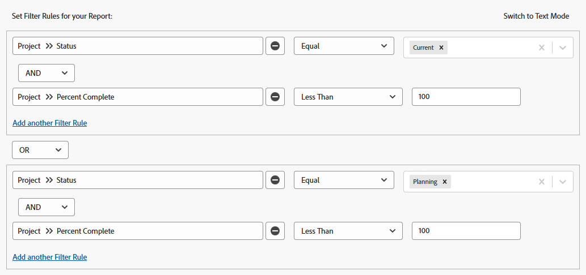
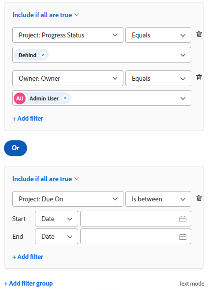

# Filterübersicht in Adobe Workfront

Beachten Sie, dass in der Vorschau-Umgebung das erweiterte Filtererlebnis (zuvor als &quot;Beta&quot;bezeichnet) jetzt standardmäßig verwendet wird. Diese verbesserten Filter sind jetzt &quot;Standard&quot;und das ältere Filtererlebnis ist &quot;alt&quot;.

Sie können Filter in Adobe Workfront verwenden, um die Anzahl der auf dem Bildschirm angezeigten Informationen in Listen, Berichten oder anderen Bereichen zu reduzieren.

>[!NOTE]
>
>In diesem Artikel werden alle Bereiche beschrieben, in denen Sie Filter in Workfront anwenden können, sowie allgemeine Informationen zu Filtern in Listen und Berichten. Weitere Informationen zu Filtern in bestimmten Bereichen außer Listen und Berichten finden Sie in den unten verlinkten Artikeln.

## Typen von Workfront-Filtern

In Workfront gibt es mehrere Filtertypen. Alle Filter erfüllen den gleichen Zweck, die Anzahl der angezeigten Informationen zu begrenzen.

Im Folgenden finden Sie Filtertypen, die Sie in Workfront verwenden können:

<table style="table-layout:auto"> 
 <col> 
 <col> 
 <tbody> 
  <tr> 
   <td><strong>Temporäre Filter</strong></td> 
   <td> 
Ein einmaliger Schnellfilter basierend auf einer Suchbegriffsuche, um schnell ein Element in einer Liste zu finden. 
 </td> 
  </tr> 
  <tr> 
   <td><strong>Ständige Filter für Listen und Berichte</strong></td> 
   <td>Wird von Workfront erstellt oder von Ihnen oder anderen Benutzern angepasst. Sie können sie mehrmals verwenden. Wenn Sie über die richtigen Berechtigungen und Zugriffsrechte verfügen, können Sie sie in mehreren Bereichen benennen, speichern und wiederverwenden. Sie können diese Filter auch für andere Benutzer freigeben. Sie sind in Listen oder Berichten von Objekten verfügbar. </td> 
  </tr> 
  <tr> 
   <td><strong>Temporäre oder dauerhafte Filter für Sondergebiete</strong></td> 
   <td>Wird von Workfront erstellt oder von Ihnen oder anderen Benutzern angepasst. Sie können permanente Filter speichern und mehr als einmal verwenden oder sie vorübergehend anwenden, um Ihre unmittelbaren Anforderungen zu erfüllen, ohne sie zu speichern. Nicht gespeicherte Filter können nicht freigegeben oder gelöscht werden. Sie sind in speziellen Bereichen verfügbar, wie im Abschnitt beschrieben. <a href="#workfront-filters-for-special-areas" class="MCXref xref">Workfront-Filter für Sonderbereiche</a> in diesem Artikel. </td> 
  </tr> 
 </tbody> 
</table>

## Temporäre Workfront-Filter

Schnellfilter ermöglichen die Suche nach einem Element auf dem Bildschirm mithilfe eines Suchbegriffs. Nach dem Aktualisieren der Seite wird der temporäre Schnellfilter gelöscht. Sie können temporäre Filter nicht speichern, um sie wiederzuverwenden.

Informationen zu Schnellfiltern finden Sie unter [Schnellfilter auf Listen anwenden](../../../workfront-basics/navigate-workfront/use-lists/apply-quick-filter-list.md).

## Workfront-permanente Filter für Listen und Berichte

Sie können permanente Filter verwenden, die Sie, andere Benutzer oder Workfront in Listen oder Berichten von Objekten erstellt haben.

Informationen zu Objekten in Workfront und zu Objekten, für die Sie Berichte erstellen können, finden Sie unter [Objekte in Adobe Workfront verstehen](../../../workfront-basics/navigate-workfront/workfront-navigation/understand-objects.md).

Weitere Informationen zu Filtern in Listen und Berichten finden Sie in den folgenden Artikeln:

* [Filter in Adobe Workfront erstellen oder bearbeiten](../../../reports-and-dashboards/reports/reporting-elements/create-filters.md)
* [Entfernen von Filtern, Ansichten und Gruppierungen](../../../reports-and-dashboards/reports/reporting-elements/remove-filters-views-groupings.md)
* [Filter, Ansichten oder Gruppierungen freigeben](../../../reports-and-dashboards/reports/reporting-elements/share-filter-view-grouping.md)

## Workfront-Filter für Sonderbereiche {#workfront-filters-for-special-areas}

Sie können in den folgenden Bereichen von Workfront entweder integrierte Filter oder benutzerdefinierte Filter verwenden:

* Startseite\
   Weitere Informationen finden Sie unter [Arbeitsliste filtern](../../../workfront-basics/using-home/using-the-home-area/display-items-in-home-work-list.md#filtering-by-item-type) im Artikel [Anzeigen von Elementen in der Arbeitsliste im Startbereich](../../../workfront-basics/using-home/using-the-home-area/display-items-in-home-work-list.md).
* Anforderungsbereich. Filter können im Bereich Anforderungen nicht angepasst werden.

   Weitere Informationen finden Sie unter [Gesendete Anforderungen suchen](../../../manage-work/requests/create-requests/locate-submitted-requests.md).

* Ressourcenplaner\
   Weitere Informationen finden Sie im Artikel [Filtern von Informationen im Ressourcenplaner](../../../resource-mgmt/resource-planning/filter-resource-planner.md).

* Nutzungsbericht

   Weitere Informationen finden Sie im Abschnitt . [Informationen zur Filterauslastung](../../../resource-mgmt/resource-utilization/view-utilization-information.md#filtering-utilization-information) im Artikel [Informationen zur Ressourcenauslastung anzeigen](../../../resource-mgmt/resource-utilization/view-utilization-information.md).

* Workload-Balancer

   Weitere Informationen finden Sie unter [Filtern von Informationen im Arbeitslastausgleich](../../../resource-mgmt/workload-balancer/filter-information-workload-balancer.md).

* Analytics-Bereich

   Weitere Informationen finden Sie unter [Filter in erweiterten Analysen anwenden](../../../enhanced-analytics/use-enhanced-analytics-filters.md).

* Blueprint-Bereich

   Weitere Informationen finden Sie unter [Blueprint installieren](../../../administration-and-setup/blueprints/blueprints-install.md).

* Szenarienplaner

   Für den Szenario-Planer ist eine zusätzliche Lizenz erforderlich. Weitere Informationen zum Workfront-Szenario-Planer finden Sie unter [Übersicht über den Szenario-Planer](../../../scenario-planner/scenario-planner-overview.md).

   >[!TIP]
   >
   >Filter können im Szenario-Planer nicht angepasst werden.

   <!--
  
(NOTE: the tip above: this might change with the beta filters??)

  -->

   Sie können integrierte Filter für Pläne, Initiativen oder Projekte verwenden und Projektfilter im Szenario-Planer anpassen.

   Weitere Informationen finden Sie in den folgenden Artikeln:

   * [Erstellen und Bearbeiten von Plänen im Szenario-Planer](../../../scenario-planner/create-and-edit-plans.md)
   * [Aktualisieren oder Erstellen von Projekten durch Veröffentlichen von Initiativen im Szenario-Planer](../../../scenario-planner/publish-scenarios-update-projects.md)
   * [Importieren von Projekten in Pläne im Szenario-Planer](../../../scenario-planner/import-projects-to-plans.md)

* Ziele

   Ziele erfordern eine zusätzliche Lizenz. Weitere Informationen zu Workfront-Zielen finden Sie unter [Übersicht über Adobe Workfront-Ziele](../../../workfront-goals/goal-management/wf-goals-overview.md).

   Sie können integrierte Filterkriterien verwenden, aber Sie können keine benutzerdefinierten Filter erstellen, um sie für den Zielbereich wiederzuverwenden.

   Weitere Informationen finden Sie unter [Informationen in Adobe Workfront-Zielen filtern](../../../workfront-goals/goal-management/filter-information-wf-goals.md).

* Pinnwände

   Sie können integrierte Filter anwenden, aber Sie können keine benutzerdefinierten Filter erstellen, um sie im Bereich &quot;Pinnwände&quot;wiederzuverwenden.

   Weitere Informationen finden Sie unter [Filtern und Suchen in einer Pinnwand](../../../agile/get-started-with-boards/filter-search-in-board.md).

## Übersicht über Filter in Listen und Berichten

Beim Arbeiten mit Listen und Berichten können Sie Informationen auf dem Bildschirm mithilfe der folgenden Filtertypen filtern:

* integrierte Filter
* neue Filter, die Sie oder andere von Grund auf neu erstellen
* benutzerdefinierte vorhandene Filter, die von anderen erstellt und für Sie freigegeben wurden
* kopierte und bearbeitete Filter basierend auf vorhandenen Filtern

>[!IMPORTANT]
>
>Beim Erstellen oder Bearbeiten von Filtern in Berichten müssen Sie den Bericht bearbeiten, damit der neue Filter zum Standardfilter für den Bericht wird. Wenn Sie nur den Filter bearbeiten, wird der Standardfilter des Berichts außerhalb des ReportBuilder nicht aktualisiert.\
>Informationen zum Bearbeiten eines Berichts finden Sie im Artikel [Benutzerdefinierten Bericht erstellen](../../../reports-and-dashboards/reports/creating-and-managing-reports/create-custom-report.md).

Weitere Informationen zu Workfront-Listen finden Sie im Artikel [Erste Schritte mit Listen in Adobe Workfront](../../../workfront-basics/navigate-workfront/use-lists/view-items-in-a-list.md).\
Weitere Informationen zu Workfront-Berichten finden Sie im Artikel [Erste Schritte mit Berichten in Adobe Workfront](../../../reports-and-dashboards/reports/reporting/get-started-reports-workfront.md).

Beachten Sie beim Arbeiten mit Filtern in Listen oder Berichten Folgendes:

* Sie können vorhandene Filter in Listen und Berichten anpassen. Alle Benutzer mit Berechtigungen für die Filter können Ihre Änderungen ebenfalls sehen.

* Ihr Workfront-Administrator muss Ihnen die Option Zugriff auf Filter, Ansichten und Gruppierungen bearbeiten gewähren, um permanente Filter zu erstellen.

   Informationen zum Gewähren des Zugriffs auf Filter, Ansichten und Gruppierungen finden Sie unter [Zugriff auf Filter, Ansichten und Gruppierungen gewähren](../../../administration-and-setup/add-users/configure-and-grant-access/grant-access-fvg.md).

* Ihre Berechtigungen für einen Filter bestimmen, wie Filter gespeichert werden. Wenn Sie den Filter ursprünglich erstellt haben, können Sie die Änderungen speichern. Andernfalls werden Sie aufgefordert, eine Version des zu ändernden Filters zu speichern.

   >[!TIP]
   >
   >Denken Sie daran, wenn Sie Änderungen an einem Filter vornehmen, den Sie für andere freigegeben haben, wirken sich die Änderungen auch auf diese aus.

* Sie können einen Filter anpassen, der nur für Sie freigegeben wurde, wenn der Benutzer, der den Filter freigegeben hat, Ihnen Zugriff auf Verwalten gewährt hat. Informationen zum Freigeben eines Filters finden Sie unter [Filter, Ansichten oder Gruppierungen freigeben](../../../reports-and-dashboards/reports/reporting-elements/share-filter-view-grouping.md).

## Elemente eines Filters

Wenn Sie einen Filter erstellen, verbinden Sie mehrere Elemente, aus denen Filteranweisungen bestehen. Sie können über mehrere Filteranweisungen verfügen, die die Kriterien für Ihren Filter definieren.

Dies ist ein Beispiel für den standardmäßigen Filter-Builder:

Dies ist ein Beispiel für den Beta-Filter-Builder:

Ein Filter enthält die folgenden Elemente:

<table style="table-layout:auto"> 
 <col> 
 <col> 
 <tbody> 
  <tr> 
   <td><strong>Objekt</strong></td> 
   <td> 
Das Workfront-Datenbankobjekt des Filters. Informationen darüber, welche Objekte in Workfront gemeldet werden können, finden Sie unter <a href="../../../workfront-basics/navigate-workfront/workfront-navigation/understand-objects.md" class="MCXref xref">Objekte in Adobe Workfront verstehen</a>. 
 
Beispielsweise können Projekte, Aufgaben, Probleme, Benutzer, Dokumente das Objekt eines Filters sein. 
 </td> 
  </tr> 
  <tr> 
   <td><strong>Feld</strong></td> 
   <td> 
Das -Attribut des Objekts, nach dem Sie filtern. 
 
Sie können beispielsweise nach dem Projektnamen oder Projektnamen filtern. In diesem Fall sind "Name"und "Eigentümer"Felder des Portfolios und des Projektobjekts. 
 </td> 
  </tr> 
  <tr> 
   <td> 
<strong>Wert</strong>
 </td> 
   <td>Der tatsächliche Name des Felds in Workfront. Beispielsweise kann "Complete"der Wert eines Felds "Project Status"sein. </td> 
  </tr> 
  <tr> 
   <td><strong>Operator</strong></td> 
   <td>Verbindet mehrere Filteranweisungen. Weitere Informationen finden Sie im Abschnitt . <a href="#filter-operators" class="MCXref xref">Filteroperatoren</a> in diesem Artikel. </td> 
  </tr> 
  <tr> 
   <td><strong>Modifikator</strong></td> 
   <td>Gibt an, welche Art von Informationen mit Ihren Daten übereinstimmen sollen. Weitere Informationen finden Sie im Abschnitt . <a href="#filter-modifiers" class="MCXref xref">Filter-Modifikatoren</a> in diesem Artikel. </td> 
  </tr> 
 </tbody> 
</table>

## Filteroperatoren {#filter-operators}

Workfront verfügt über zwei Filteroperatoren, die jede Filteranweisung miteinander verbinden:

* **UND**: Wenn Sie zwei Filteranweisungen durch den UND -Operator verbinden, geben Sie an, dass beide Filteranweisungen gleichzeitig erfüllt werden sollen.

   Standardmäßig werden die Anweisungen in einem Filter durch den UND -Operator verbunden.

* **ODER**: Wenn Sie zwei Filteranweisungen des ODER-Operators verbinden, geben Sie an, dass beide Anweisungen erfüllt werden sollen.

   >[!TIP]
   >
   >Wenn Sie Ihre AND-Anweisungen in OR-Anweisungen ändern, sollte die Anzahl der Elemente in Ihrem Bericht erhöht werden.

## Filter-Modifikatoren {#filter-modifiers}

Sie können Filter-Modifikatoren verwenden, um anzugeben, welche Art von Informationen mit Ihren Daten übereinstimmen soll.

>[!INFO]
>
>**Beispiel:**
>Sie können nach Projekten filtern, die einen Prozentwert von 100 % abschließen. In diesem Fall können Sie den Modifikator &quot;gleich&quot;in der folgenden Filteranweisung verwenden:
>
>`Project: Percent Complete Equal(Case Sensitive) 100`

Weitere Informationen zu Filtermodifikatoren finden Sie unter [Filter- und Bedingungs-Modifikatoren](../../../reports-and-dashboards/reports/reporting-elements/filter-condition-modifiers.md).

## Erstellen von Filtern in der Builder-Oberfläche

Sie können Filter wie folgt mithilfe der Standard- oder Beta-Builder-Oberfläche erstellen:

* Von Grund auf
* Vorhandenen Filter ändern
* Vorhandenen Filter kopieren

Informationen zum Erstellen eines Filters mit der Standard- oder Beta-Builder-Oberfläche finden Sie unter [Filter in Adobe Workfront erstellen oder bearbeiten](../../../reports-and-dashboards/reports/reporting-elements/create-filters.md).

## Erstellen von Filtern über die Benutzeroberfläche des Textmodus

Sie können Filter mithilfe der Textmodus-Benutzeroberfläche erstellen. Es wird empfohlen, die meisten Filteranweisungen mithilfe der Standard- oder Beta-Builder-Oberfläche zu erstellen und den Code des Filters nur als letzten Schritt zu bearbeiten. Es wird nicht empfohlen, einen völlig neuen Filter mithilfe der Textmodus-Oberfläche zu erstellen.

Weitere Informationen zum Erstellen eines Filters mithilfe der Textmodus-Benutzeroberfläche finden Sie unter [Filter im Textmodus bearbeiten](../../../reports-and-dashboards/reports/text-mode/edit-text-mode-in-filter.md).

## Filter für komplexe Felder erstellen

* [Filter für Felder erstellen, deren Werte Kommas enthalten](#create-filters-for-fields-whose-values-contain-commas)
* [Erstellen von Filtern, deren Werte ein benutzerdefiniertes Mehrfachauswahlfeld sind](#create-filters-for-whose-values-are-a-multi-select-custom-field)

### Filter für Felder erstellen, deren Werte Kommas enthalten {#create-filters-for-fields-whose-values-contain-commas}

Wenn Sie einen Filter im Textmodus erstellen und nach Feldwerten filtern, die Kommas enthalten, müssen Sie vor den Kommas, die die Werte trennen, einen Schrägstrich (&quot;/&quot;) hinzufügen, um sicherzustellen, dass der Wert als eine Filteroption gelesen wird. Dies gilt nur für die folgenden Feldtypen:

* Dropdowns
* Optionsschaltflächen
* Kontrollkästchen

Sie haben beispielsweise ein Optionsfeld für ein Projekt mit dem Namen &quot;Farbe&quot;und die folgenden Optionen:

* Rot
* Blau
* Rot, blau

Wenn Sie einen Filter erstellen möchten, der nur Projekte findet, bei denen die dritte Option ausgewählt ist, sollte die Filteranweisung in der Textmodus-Oberfläche wie folgt lauten:

`DE:check=red/, blue`

`DE:check_Mod=in`

Diese Syntax stellt sicher, dass die Werte als eine Option zusammen gelesen werden. Wenn Sie den Schrägstrich weglassen, liest Workfront das Komma als &quot;OR&quot;. In diesem Fall werden nur die Projekte ausgewählt, die entweder die erste oder die zweite Option aufweisen.

Diese Syntax gilt auch bei der Erstellung von Eingabeaufforderungen. Weitere Informationen zur Verwendung von Eingabeaufforderungen finden Sie unter [Hinzufügen einer Eingabeaufforderung zu einem Bericht](../../../reports-and-dashboards/reports/creating-and-managing-reports/add-prompt-report.md).

### Erstellen von Filtern, deren Werte ein benutzerdefiniertes Mehrfachauswahlfeld sind {#create-filters-for-whose-values-are-a-multi-select-custom-field}

Sie können Berichte zu benutzerdefinierten Feldern mit Mehrfachauswahl erstellen. Sie können beispielsweise Berichte zu Feldern erstellen, die Kontrollkästchen sind.

Wenn Sie jedoch Ergebnisse ausschließen möchten, für die nur eine der Optionen ausgewählt ist, zeigt der Bericht alle Objekte an, für die diese Option aktiviert ist, sowie alle anderen ausgewählten Optionen.

Wenn Sie beispielsweise ein Feld mit 3 Optionen (A, B und C) haben und 2 der 3 Optionen (A und B, aber nicht C) für ein Objekt auswählen, können Sie einen Bericht mit einem Filter mit dem Qualifikator Nicht gleich für Optionen A und B erstellen. Dieser filtert nur Projekte heraus, für die A und B, aber nicht nur A und nicht nur B ausgewählt sind. Wenn Sie einen Filter mit einem Qualifikator für Option A nicht gleich erstellen, werden nur Objekte herausgefiltert, für die nur A ausgewählt ist. Wenn A und B ausgewählt sind, werden diese Objekte jedoch weiterhin im Bericht angezeigt.

## Einschränkungen beim Verbinden mehrerer Filterregeln

Beim Erstellen eines Filters in Workfront können Sie nur auf fünf Objekte verweisen, mit Ausnahme des Berichtsobjekts.
