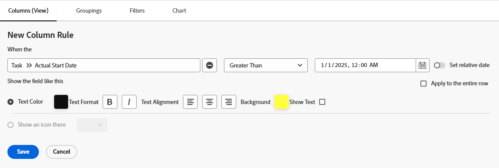
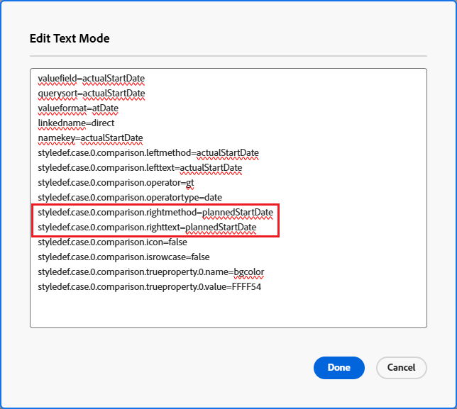

# Vergleichen von Feldern in bedingter Formatierung

<!-- Audited: 1/2025 -->

Sie können bedingte Formatierungen verwenden, um zwei verschiedene Felder in einer Ansicht zu vergleichen und sie hervorzuheben, wenn bestimmte Kriterien zwischen den Feldern erfüllt sind.

## Zugriffsanforderungen

+++ Erweitern, um die Zugriffsanforderungen für die in diesem Artikel beschriebene Funktionalität anzuzeigen. 

<table style="table-layout:auto"> 
 <col> 
 <col> 
 <tbody> 
  <tr> 
   <td role="rowheader">Adobe Workfront-Paket</td> 
   <td> <p>Beliebig</p> </td> 
  </tr> 
  <tr> 
   <td role="rowheader">Adobe Workfront-Lizenz</td> 
   <td> 
     <p>Standard</p>
     <p>Abo</p>
   </td> 
  </tr> 
  <tr> 
   <td role="rowheader">Konfigurationen der Zugriffsebene</td> 
   <td> <p>Bearbeitungszugriff auf Filter, Ansichten, Gruppierungen</p> <p>Zugriff auf Berichte, Dashboards und Kalender bearbeiten, um die Ansicht in einem Bericht zu bearbeiten</p></td> 
  </tr> 
  <tr> 
   <td role="rowheader">Objektberechtigungen</td> 
   <td> <p>Berechtigungen für einen Bericht verwalten, um die Ansicht in einem Bericht zu bearbeiten</p> <p>Berechtigungen für eine Ansicht verwalten</p></td> 
  </tr> 
 </tbody> 
</table>

Weitere Details zu den Informationen in dieser Tabelle finden Sie unter [Zugriffsanforderungen in der Dokumentation zu Workfront](/help/quicksilver/administration-and-setup/add-users/access-levels-and-object-permissions/access-level-requirements-in-documentation.md).

+++

## Beispiel: Aktuelles Startdatum und geplantes Startdatum vergleichen

Wenn z. B. das tatsächliche Startdatum eines Vorgangs nach dem geplanten Startdatum liegt, können Sie die Spalte &quot;Geplantes Startdatum&quot; mithilfe der bedingten Formatierung markieren.

So vergleichen Sie das geplante Startdatum und das tatsächliche Startdatum eines Vorgangs mithilfe der bedingten Formatierung:

1. Wechseln Sie zu einer Aufgabenansicht oder einem Bericht.
1. (Bedingt) Wenn Sie mit einem Bericht arbeiten, klicken Sie auf der Registerkarte **Spalten (Ansicht)** im Berichts-Editor auf den Header der Spalte, die Sie bedingt formatieren möchten, um sie auszuwählen.\
   Wählen Sie beispielsweise die Spalte **Aktuelles Startdatum** aus, wenn Sie ihr die bedingte Formatierung hinzufügen möchten, indem Sie die Felder &quot;Geplantes Startdatum&quot; und &quot;Aktuelles Startdatum&quot; vergleichen.

1. Klicken Sie auf **Erweiterte Optionen**, und klicken Sie dann auf **Regel für diese Spalte hinzufügen**.

1. Geben Sie die Vergleichskriterien mithilfe vorhandener Werte aus dem Generator ein und geben Sie die bedingte Formatierung an.\
   Beispielsweise möchten wir Aufgaben hervorheben, deren tatsächliches Startdatum nach dem geplanten Startdatum liegt (oder größer ist). Wählen Sie den Modifizierer &quot;Größer als&quot; und wählen Sie im Datumsfeld ein aktuelles Datum aus.

   

1. (Optional) Wählen Sie **Auf ganze Zeile anwenden**, wenn Sie die Formatierung auf die gesamte Zeile anwenden möchten.
1. Klicken Sie auf **Speichern**.

1. Wählen Sie die Spalte **Aktuelles Startdatum** aus, und klicken Sie dann auf **In Textmodus wechseln**.

1. Klicken Sie auf **Textmodus bearbeiten**, und fügen Sie dann die folgende Textzeile hinzu:

   ```
   styledef.case.0.comparison.rightmethod= <field to compare>
   ```

   In unserem Beispiel:

   ```
   styledef.case.0.comparison.rightmethod=plannedStartDate
   ```

   >[!NOTE]
   >
   >Wenn Sie ein systemeigenes Workfront-Feld vergleichen, verwenden Sie die Kamelschreibungssyntax für den Feldnamen. Wenn Sie ein benutzerdefiniertes Feld vergleichen, verwenden Sie **DE:Actual Name des Felds** für das Namensfeld, das Sie mit dem ersten Feld vergleichen.\
   >Wenn Sie beispielsweise das **Ist-Startdatum** mit einem benutzerdefinierten Feld mit der Bezeichnung **Lieferdatum** vergleichen, fügen Sie in Ihrem Textmoduscode die folgende Anweisung hinzu:
   >
   >`styledef.case.0.comparison.rightmethod=DE:Delivery Date`

1. Stellen Sie sicher, dass die Codezeile &quot;`righttext`&quot; mit der Anweisung in der Codezeile &quot;`rightmethod`&quot; übereinstimmt.

   

1. Klicken Sie auf **Speichern**.
1. Klicken Sie auf **Speichern + schließen**.

   In der Spalte werden die Felder hervorgehoben, die Ihre Kriterien erfüllen.
