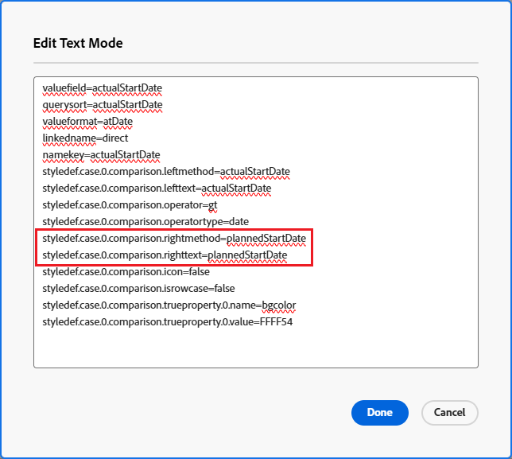

# Felder in bedingter Formatierung vergleichen

Sie können bedingte Formatierungen verwenden, um zwei verschiedene Felder in einer Ansicht zu vergleichen und sie hervorzuheben, wenn bestimmte Kriterien zwischen den Feldern erfüllt sind.

## Zugriffsanforderungen

Sie müssen über folgenden Zugriff verfügen, um die Schritte in diesem Artikel ausführen zu können:

<table style="table-layout:auto"> 
 <col> 
 <col> 
 <tbody> 
  <tr> 
   <td role="rowheader">Adobe Workfront-Plan*</td> 
   <td> <p>Beliebig</p> </td> 
  </tr> 
  <tr> 
   <td role="rowheader">Adobe Workfront-Lizenz*</td> 
   <td> <p>Plan </p> </td> 
  </tr> 
  <tr> 
   <td role="rowheader">Konfigurationen auf Zugriffsebene*</td> 
   <td> <p>Zugriff auf Filter, Ansichten, Gruppierungen bearbeiten</p> <p>Zugriff auf Berichte, Dashboards und Kalender bearbeiten, um die Ansicht in einem Bericht zu bearbeiten</p> <p>Hinweis: Wenn Sie immer noch keinen Zugriff haben, fragen Sie Ihren Workfront-Administrator, ob er zusätzliche Zugriffsbeschränkungen für Ihre Zugriffsebene festlegt. Informationen dazu, wie ein Workfront-Administrator Ihre Zugriffsebene ändern kann, finden Sie unter <a href="../../../administration-and-setup/add-users/configure-and-grant-access/create-modify-access-levels.md" class="MCXref xref">Benutzerdefinierte Zugriffsebenen erstellen oder ändern</a>.</p> </td> 
  </tr> 
  <tr> 
   <td role="rowheader">Objektberechtigungen</td> 
   <td> <p>Berechtigungen für einen Bericht verwalten, um die Ansicht in einem Bericht zu bearbeiten</p> <p>Berechtigungen für eine Ansicht verwalten</p> <p>Informationen zum Anfordern von zusätzlichem Zugriff finden Sie unter <a href="../../../workfront-basics/grant-and-request-access-to-objects/request-access.md" class="MCXref xref">Zugriff auf Objekte anfordern </a>.</p> </td> 
  </tr> 
 </tbody> 
</table>

&#42;Wenden Sie sich an Ihren Workfront-Administrator, um zu erfahren, welchen Plan, welchen Lizenztyp oder welchen Zugriff Sie haben.

## Beispiel: Tatsächliches Startdatum und geplantes Startdatum vergleichen

Wenn beispielsweise das tatsächliche Startdatum einer Aufgabe nach dem geplanten Startdatum liegt, können Sie die Spalte &quot;Geplantes Startdatum&quot;mit bedingter Formatierung markieren.

So vergleichen Sie das geplante Startdatum mit dem tatsächlichen Startdatum der Aufgabe mithilfe der bedingten Formatierung:

1. Rufen Sie eine Aufgabenansicht oder einen Bericht auf.
1. (Bedingt) Wenn Sie mit einem Bericht arbeiten, erhalten Sie von der **Spalten (Ansicht)** klicken Sie auf die Kopfzeile der Spalte, die Sie bedingt formatieren möchten, um sie auszuwählen.\
   Wählen Sie beispielsweise die **Tatsächliches Startdatum** Spalte, wenn Sie die bedingte Formatierung hinzufügen möchten, indem Sie die Felder für das geplante Startdatum und das tatsächliche Startdatum vergleichen.

1. Klicken **Erweiterte Optionen** Klicken Sie auf Hinzufügen **Regel für diese Spalte**.

1. Geben Sie die Vergleichskriterien anhand der vorhandenen Werte im Builder an und geben Sie Ihre bedingte Formatierung an.\
   Beispielsweise möchten wir Aufgaben hervorheben, bei denen das tatsächliche Startdatum nach dem geplanten Startdatum liegt (oder darüber liegt). Wählen Sie den Modifikator Größer als und danach ein Datum im Datumsfeld aus.\
     

1. (Optional) Wählen Sie **Auf ganze Zeile anwenden** , wenn Sie die Formatierung auf die gesamte Zeile anwenden möchten.
1. Klicken **Regel hinzufügen**, dann **Fertig**.

1. Wählen Sie die **Tatsächliches Startdatum** und klicken Sie auf **In den Textmodus wechseln**.

1. **Klicken, um Text zu bearbeiten** -Modus und fügen Sie dann die folgende Textzeile hinzu:

   ```
   styledef.case.0.comparison.rightmethod= <field to compare>
   ```

   In unserem Beispiel: 

   ```
   styledef.case.0.comparison.rightmethod=plannedStartDate
   ```

   >[!NOTE]
   >
   >Wenn Sie ein natives Workfront-Feld vergleichen, verwenden Sie für den Feldnamen die Binnenmajuskel-Groß-/Kleinschreibung-Syntax. Wenn Sie ein benutzerdefiniertes Feld vergleichen, verwenden Sie **DE:Tatsächlicher Name des Felds** für das Namensfeld, das Sie mit dem ersten Feld vergleichen.\
   >Wenn Sie beispielsweise die **Tatsächliches Startdatum** mit einem benutzerdefinierten Feld mit der Bezeichnung **Versanddatum** Fügen Sie in Ihrem Textmoduscode die folgende Anweisung hinzu:
   >
   >`styledef.case.0.comparison.rightmethod=DE:Delivery Date`

1. Stellen Sie sicher, dass `righttext` Codezeile entspricht der Anweisung im `rightmethod` Codezeile.

   

1. Klicken Sie auf **Speichern**.
1. Klicken **Speichern und schließen**.

   In der Spalte werden die Felder hervorgehoben, die Ihren Kriterien entsprechen.
