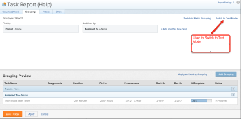

# Textmodus - Übersicht

<!--

(NOTE: Linked to the UI (for the areas mentioned in the comments below and the new NWE filters as well))

-->

<!--

(NOTE: Alina: ***Linked to other articles. Do not move, rename or change url.Linked to the product, in the report builder, when using a field that is not recognized in standard mode.)

-->

<!--

(NOTE: This will be linked to the Ninja feature about adding a filter to the User typeahead field (which originally is open only for text mode filters). Update the Context Sensitive sheet at release time) 

-->

Sie können einen Bericht oder eine Liste in Adobe Workfront erstellen, indem Sie beim Erstellen der Elemente, aus denen der Bericht oder die Liste besteht, entweder die Standard- oder die Textmodus-Benutzeroberfläche verwenden. Über die Standardoberfläche können Sie auf Felder und deren Attribute verweisen, die in der Benutzeroberfläche von Workfront jederzeit verfügbar sind. Mithilfe des Textmodus können Sie auf Felder und Attribute verweisen, die möglicherweise nicht im Standardmodus verfügbar sind, aber in der Workfront-Datenbank verfügbar sind.

## Überlegungen vor der Verwendung des Textmodus

>[!TIP]
>
>Sie können auch die Funktionen berechneter benutzerdefinierter Felder erweitern, indem Sie eine Version des Textmodus für benutzerdefinierte Felder verwenden. Syntax und Regeln zum Erstellen eines berechneten benutzerdefinierten Felds unterscheiden sich von denen, die Sie in Berichten und Listen verwenden. Informationen zum Hinzufügen eines berechneten benutzerdefinierten Felds finden Sie unter [Hinzufügen errechneter Daten zu einem benutzerdefinierten Formular](../../../administration-and-setup/customize-workfront/create-manage-custom-forms/add-calculated-data-to-custom-form.md).

* Bevor Sie mit der Verwendung des Textmodus in Ihren Berichten beginnen, empfehlen wir dringend, unsere Klassen für erweiterte Berichte zu verwenden, um ein tieferes Verständnis unserer Textmodussprache zu erhalten. <!--outdated: For training materials on reporting see [Workfront Reports and Dashboards Learning Paths](https://one.workfront.com/s/learningpath2/workfront-reporting-20Y0z000000blhLEAQ).-->
* Es wird empfohlen, den Standardmodus zu verwenden, um sicherzustellen, dass die erstellten Berichte bei der Aktualisierung der Workfront-Software intakt bleiben. Während der Textmodus es Ihnen ermöglicht, komplexere Ansichten, Filter und Gruppierungen zu erstellen, ist die Wartung ebenfalls komplizierter und wird bei der Aktualisierung der Workfront-Software nicht garantiert.
* Es wird empfohlen, immer zu versuchen, alle Berichterstellungselemente in der Standardschnittstelle zu erstellen und nur für wenige Anpassungen zum Textmodus-Builder zu wechseln.

   >[!TIP]
   >
   >Mithilfe des Standard-Builders erhalten Sie wichtige Bausteine und Codemuster, die Sie dann beim Ändern des Codes im Textmodus verwenden können.

* Es gibt einen Satz von Regeln und eine eindeutige Syntax, die Sie verwenden müssen, um Berichte und Listen im Textmodus erfolgreich zu erstellen. Vergewissern Sie sich, dass Sie mit der Workfront-Syntax für den Textmodus vertraut sind, bevor Sie beginnen.

   Informationen zur Syntax und den Regeln für die Verwendung des Textmodus finden Sie unter [Übersicht über die Syntax der Textmodi](../../../reports-and-dashboards/reports/text-mode/text-mode-syntax-overview.md).

* Nachdem Sie ein Berichterstellungselement im Textmodus angepasst haben, können Sie entweder nicht wieder in den Standardmodus wechseln (in einer Ansicht) oder der Code für das von Ihnen erstellte Element wird möglicherweise gelöscht (in Filtern und Gruppierungen). Dies liegt daran, dass nicht alle Felder, die im Textmodus unterstützt werden, im Standardmodus unterstützt werden.

## Benutzeroberfläche im Standardmodus

In der Benutzeroberfläche für den Standardmodus werden Felder angezeigt, mit denen Sie die Anwendungselemente zuordnen können, die in einem Bericht oder einer Liste angezeigt werden sollen. Die Benutzeroberfläche des Standardmodus besteht aus einer Reihe von Dropdown-Menüs, aus denen Sie die Felder auswählen können, die in Ihren Berichten oder Listen angezeigt werden sollen.

Weitere Informationen zur Benutzeroberfläche des Standardmodus und zum Erstellen eines Berichts oder einer Liste finden Sie unter:

* [Benutzerdefinierten Bericht erstellen](../../../reports-and-dashboards/reports/creating-and-managing-reports/create-custom-report.md).
* [Berichterstellungselemente: Filter, Ansichten und Gruppierungen](../../../reports-and-dashboards/reports/reporting-elements/reporting-elements-filters-views-groupings.md)

## Textmodus-Benutzeroberfläche

<!--

(NOTE: add a section or note with a link to an another article about the syntax of text mode >> link to the Calc custom fields vc calc. columns)

-->

Im Textmodus können Sie komplexere Ansichten, Filter, Gruppierungen und Eingabeaufforderungen erstellen, indem Sie Felder verwenden, die in der Benutzeroberfläche des Standardmodus nicht verfügbar sind. Im Workfront-Textmodus ist eine Sammlung kodierter Anweisungen, die angeben, welche Objekte in einem Bericht oder einer Liste angezeigt werden sollen.

Eine vollständige Liste aller unserer berichtspflichtigen Felder finden Sie im Abschnitt [API-Explorer](../../../wf-api/general/api-explorer.md).

>[!NOTE]
>
>Nicht alle über die API verfügbaren Felder sind über die Textmodus-Oberfläche verfügbar. Wenn Sie das richtige Feld in Ihrem Textmoduscode verwenden und die erwarteten Ergebnisse nicht anzeigen, kann das Feld nur über die API gemeldet werden.

* [Zugriff auf Berichterstellungselemente und Bearbeitungsmodus](#access-reporting-elements-and-edit-text-mode)
* [Allgemeine Gründe für die Verwendung des Textmodus](#common-reasons-to-use-text-mode)

## Zugriff auf Berichterstellungselemente und Bearbeitungsmodus {#access-reporting-elements-and-edit-text-mode}

Der Zugriff auf die Textmodus-Benutzeroberfläche ist für Ansichten, Gruppierungen und Filter ähnlich, wenn auf sie über einen Bericht oder eine Liste zugegriffen wird.

Informationen zur Verwendung des Textmodus in Ansichten, Filtern und Gruppierungen finden Sie unter:

<!--

(NOTE: see what articles these sections are linked to and edit those articles to link to the individual ones)

-->

* [Bearbeiten einer Ansicht im Textmodus](../../../reports-and-dashboards/reports/text-mode/edit-text-mode-in-view.md)
* [Filter im Textmodus bearbeiten](../../../reports-and-dashboards/reports/text-mode/edit-text-mode-in-filter.md)
* [Textmodus in einer Gruppierung bearbeiten](../../../reports-and-dashboards/reports/text-mode/edit-text-mode-in-grouping.md)

Benutzerdefinierte Eingabeaufforderungen können nur im Textmodus bearbeitet werden. Sie können nur über einen Bericht auf Eingabeaufforderungen zugreifen.

Informationen zum Zugriff auf die Textmodus-Benutzeroberfläche für benutzerdefinierte Eingabeaufforderungen finden Sie unter [Hinzufügen einer Eingabeaufforderung zu einem Bericht](../../../reports-and-dashboards/reports/creating-and-managing-reports/add-prompt-report.md).

<!--

Editing the text mode code inside views, filters, and groupings has some differences outlined below.

-->

<!--

(NOTE: everything below, and the four subsections >>> drafted and created individual articles.)

-->

<!--
  <li data-mc-conditions="QuicksilverOrClassic.Draft mode"><a href="#edit-text-mode-in-a-view" class="MCXref xref">Edit text mode in a view</a> </li>
  -->

<!--
  <li data-mc-conditions="QuicksilverOrClassic.Draft mode"><a href="#edit-text-mode-in-a-filter" class="MCXref xref">Edit text mode in a filter</a> </li>
  -->

<!--
  <li data-mc-conditions="QuicksilverOrClassic.Draft mode"><a href="#edit-text-mode-in-a-grouping" class="MCXref xref">Edit text mode in a grouping</a> </li>
  -->

<!--
  <li data-mc-conditions="QuicksilverOrClassic.Draft mode"><a href="#edit-a-custom-prompt" class="MCXref xref">Edit a custom prompt</a> </li>
  -->

<!--
<h4 data-mc-conditions="QuicksilverOrClassic.Draft mode" id="edit-text-mode-in-a-view"><strong>Edit text mode in a view</strong> </h4>
-->

<!--
<note type="tip">
We recommend that you build as much of the view as possible in standard mode, then convert it to text mode to edit it.
</note>
-->

<!--

To access the text mode interface for a view:

-->

<!--
   
Find the report you want to modify in text mode.

   -->

<!--
   
You must have manage permissions to a report in order to be able to edit it.

   -->

<!--
   <li value="2" data-mc-conditions="QuicksilverOrClassic.Draft mode">Click <strong>Report Actions</strong>. </li>
   -->

<!--
   <li value="3" data-mc-conditions="QuicksilverOrClassic.Draft mode">Click <strong>Edit</strong>.</li>
   -->

<!--
   <li value="4" data-mc-conditions="QuicksilverOrClassic.Draft mode">On the <strong>Columns (View)</strong> tab of the report builder, select a column in the report.</li>
   -->

<!--
   
Click <strong>Apply</strong> if you want to save your changes and continue editing the report.

   -->

<!--
   
Click <strong>Save + Close</strong> to save your report.

   -->

<!--
   
Click <strong>Switch to Text Mode</strong> in the upper-right corner of the report builder.

   -->

<!--
   <note type="note">
   When you edit a column in text mode, Workfront adds the
   <code>textmode=true</code> line of code to the column. This indicates that the column is modified in text mode.
   </note>
   -->

<!--
   
The following table outlines the key lines in a text mode view or grouping:

   -->

<!--
   <table style="table-layout:auto">
   <col>
   <col>
   <thead>
   <tr>
   <th data-mc-conditions="QuicksilverOrClassic.Draft mode"><strong>Sample Line</strong> </th>
   <th data-mc-conditions="QuicksilverOrClassic.Draft mode"><strong>Description</strong> </th>
   </tr>
   </thead>
   <tbody>
   <tr>
   <td>
   
<strong>valuefield</strong>=

   </td>
   <td>
   
This is the name of the object or of the field as it appears in the database. For more information about how objects and fields appear in the database, see <a href="../../../wf-api/general/api-explorer.md" class="MCXref xref">API Explorer</a>.

   
The following scenarios exist:

   <ol>
   <li value="1" data-mc-conditions="QuicksilverOrClassic.Draft mode"> If the name of the field you display is a phrase instead of a single noun, you must use camel case syntax for the <code>valuefield</code>. For example, for the Planned Start Date of a task the code is: <code>valuefield=plannedStartDate</code></li>
   <li value="2">
   
If you want to display a custom field, the <code>valuefield</code> value is the actual name of the field, as you see it in the interface. For example, for a custom field named "More information", the code is:

   
<code>valuefield=More information</code> 

   </li>
   <li value="3">
   
If you want to display objects that are related to other objects in a view using the <code>valuefield</code> line of code the object names and attributes are separated by colons. 

   
For example, a column in a task view that would display the name of the Portfolio Owner has the following value for the valuefield line:

   
<code>valuefield=project:portfolio:owner:name</code> 

   
This indicates that from the object of the report (task), you can access the next related object (project), from there, you can access the following related object from project (portfolio), then the portfolio owner (owner) and then their name (name). 

   </li>
   </ol>
   
For information about how objects connect to one another, see the section <a href="../../../workfront-basics/navigate-workfront/workfront-navigation/understand-objects.md#understanding-interdependency-and-hierarchy-of-objects" class="MCXref xref">Interdependency and hierarchy of objects</a> in <a href="../../../workfront-basics/navigate-workfront/workfront-navigation/understand-objects.md" class="MCXref xref">Understand objects in Adobe Workfront</a>.

   <note type="note">
   If you choose a field in text mode that is not valid in the standard interface, you are not able to switch back to the standard interface within the column.
   </note>
   </td>
   </tr>
   <tr>
   <td data-mc-conditions="QuicksilverOrClassic.Draft mode"><strong>valueformat=</strong> </td>
   <td>
   
This line represents the format used to display the <code>valuefield</code>. The <code>valueformat</code> identifies whether an object or field displays as text, number, percentage, or date.

   
We recommend using <code>HTML</code> for your <code>valueformat</code>, especially when using <code>valueexpression</code>, to ensure the most accurate display of your information. 

   
For information about additional values for this line, see <a href="../../../reports-and-dashboards/reports/text-mode/use-conditional-formatting-text-mode.md" class="MCXref xref">Use conditional formatting in Text Mode</a>.

   </td>
   </tr>
   <tr>
   <td>
   
<strong>valueexpression=</strong> 

   </td>
   <td>
   
You can add this line to replace <code>valuefield</code>, if you want to display a calculated field in the column.

   
You must enclose the <code>valuefield</code> of the objects in curly brackets every time you use it in a <code>valueexpression</code>.

   
The following scenarios exist: 

   <ol>
   <li value="1">
   
If you want to display a field in a column in upper case, you would use:

   
<code>valueexpression=UPPER({valuefield})</code> 

   
The <code>valuefield</code> of the object is spelled as it appears in the API Explorer. 

   </li>
   <li value="2" data-mc-conditions="QuicksilverOrClassic.Draft mode">If you want to add multiple <code>valuefields</code> by stringing them together, you must separate them by a period.</li>
   <li value="3">
   
For example, if you want to display the name of the Primary Assignee of a task using <code>valueexpression</code>, you would use:

   
<code>valueexpreesion={assignedTo}.{name}</code> 

   </li>
   <li value="4">
   
If you want to use a custom field in a <code>valueexpression</code> line you must precede the name of the field by <code>DE:</code> to indicate that it is a custom field. The name of the field is spelled as it appears in the interface. 

   <note type="important">
   When you use a custom field that is placed in a custom form section that has restricted permissions for some users, the calculation of the valueexpression is blank when those users view this calculation in a report. For information about adjusting permissions on custom form sections, see
   <a href="../../../administration-and-setup/customize-workfront/create-manage-custom-forms/create-or-edit-a-custom-form.md" class="MCXref xref">Create or edit a custom form</a>.
   </note>
   
For example, if you have a custom field labeled "Developer Name" and you want to display this field in upper case in a column, you can use the following <code>valueexpression</code> to indicate this:

   
<code>valueexpression=UPPER({DE:Developer Name}</code>) 

   
When referencing a Typeahead type custom field, use the following expression to reference the name of the object selected in a field labeled "Developer Name":

   
<code>valueexpression=UPPER({DE:Developer Name:name})</code> 

   </li>
   </ol> </td>
   </tr>
   <tr>
   <td>
   
<strong>descriptionkey= / description=</strong> 

   </td>
   <td data-mc-conditions="QuicksilverOrClassic.Draft mode">This line defines the text of a tool tip as you mouse over the name of the column. In this case it is using a key to translate the name value in the description text. If you want to modify the description, change this line to read: <code>description=Your Value</code>.</td>
   </tr>
   <tr>
   <td data-mc-conditions="QuicksilverOrClassic.Draft mode"><strong>namekey= / name=</strong> </td>
   <td>
   
This line defines the column label. In this case it is using the abbreviated value based on the key.

   
If you want to modify the column name you can change this value to: <code>name=Your Value</code>

   
<code>Name</code> allows you to enter any text for the column name, while<code>namekey</code> requires you enter a key that is used to translate the name of a column.

   
To change the column name you can also add the <code>displayname </code>line, if one is not present.

   </td>
   </tr>
   <tr>
   <td data-mc-conditions="QuicksilverOrClassic.Draft mode"><strong>displayname =</strong> </td>
   <td>
   
You can add the following line to change the name of a column, which suspends the <code>namekey/name</code> value:

   
<code>displayname=Your Value</code> 

   </td>
   </tr>
   <tr>
   <td data-mc-conditions="QuicksilverOrClassic.Draft mode"><strong>querysort=</strong> </td>
   <td data-mc-conditions="QuicksilverOrClassic.Draft mode">This line defines how the results are sorted when the column header is clicked. If it is not present then the column cannot be sorted after the report is run.</td>
   </tr>
   <tr>
   <td data-mc-conditions="QuicksilverOrClassic.Draft mode"><strong>width=</strong> </td>
   <td>
   
This line represents the number of pixels that are used for the column. If the line is omitted or set to 0 (zero) then the column does not appear in the view.

   
When you modify this field manually in text mode, you must also add the <code>usewidths=true</code> value to your column.

   </td>
   </tr>
   <tr>
   <td data-mc-conditions="QuicksilverOrClassic.Draft mode"><strong>usewidths=true</strong> </td>
   <td>
   
You must use this line in addition to the <code>width=</code> line when customizing the width of a column. 

   </td>
   </tr>
   <tr>
   <td data-mc-conditions="QuicksilverOrClassic.Draft mode"><strong>makeFieldEditable=</strong> </td>
   <td>
   
This line defines whether the value displayed in a column is inline editable or not. If this line equals <strong>true,</strong> the value in the column is inline editable. If this line equals <code>false</code>, the value in the column is not inline editable.

   </td>
   </tr>
   <tr>
   <td data-mc-conditions="QuicksilverOrClassic.Draft mode"><strong>link.valuefield=</strong> </td>
   <td>
   
Insert this line only when you want the value displayed in a column to link to the object associated with it. The link opens the details page of the object. This value should match the <code>valuefield=</code> line. When you insert this, you must also add the <code>link.valueformat=</code> line. 

   
 For example, you can insert link.valuefield=priority in an issue view, and the Priority of the issue displays as a link. Clicking this link opens the Issue page.

   --> </td>
</tr>
   <tr> <!--
   <td data-mc-conditions="QuicksilverOrClassic.Draft mode"><strong>link.valueformat=</strong> </td>
<td>
   
Insert this line only when you have inserted the <code>link.valuefield</code> line to add a link to the value in a column. The link opens the details page of the object. This value should match the <code>valueformat=</code> line and indicates the format used to display the <code>valuefield</code>. 

   <note type="important">
   When viewing the text mode in a built-in column that also includes a link, you notice a number of lines referring to the link. Some of those lines might no longer be supported or are unnecessary when you create your own custom column in text mode and add the link statements to it. The lines that are mandatory when adding a linked value are
   <code> link.valuefield</code> and
   <code>link.valueformat</code>.
   </note>
   </td>
   </tr>
   </tbody>
   </table>
   -->

<!--
   <li value="8" data-mc-conditions="QuicksilverOrClassic.Draft mode">Click <strong>Apply</strong> if you want to save your changes and continue editing the report.</li>
   -->

<!--
   <li value="9" data-mc-conditions="QuicksilverOrClassic.Draft mode">Click <strong>Save + Close</strong> to save your report.</li>
   -->

<!--
<h4 data-mc-conditions="QuicksilverOrClassic.Draft mode" id="edit-text-mode-in-a-filter"><strong>Edit text mode in a filter</strong> </h4>
-->

<!--
<note type="tip">
We recommend that you build as much of the filter of the report as possible in standard mode, then convert the filter to text mode to edit it.
</note>
-->

<!--

For more information about building filters, see <a href="../../../reports-and-dashboards/reports/reporting-elements/filters-overview.md" class="MCXref xref">Filters overview in Adobe Workfront</a>.

-->

<!--

To access the text mode interface for a filter:

-->

<!--
   
Find the report you want to modify in text mode.

   -->

<!--
   
You must have manage permissions to a report in order to be able to edit it.

   -->

<!--
   <li value="2" data-mc-conditions="QuicksilverOrClassic.Draft mode">Click <strong>Report Actions</strong>.</li>
   -->

<!--
   <li value="3" data-mc-conditions="QuicksilverOrClassic.Draft mode">Click <strong>Edit</strong>.</li>
   -->

<!--
   <li value="4" data-mc-conditions="QuicksilverOrClassic.Draft mode">On the <strong>Filters</strong> tab of the report, choose either <strong>Apply Existing Filter</strong>, or <strong>Add a Filter Rule.</strong></li>
   -->

<!--
   
Define the conditions of your filter.

   -->

<!--
   
Use the filter modifiers to define the condition of your filter. For more information about filter modifiers, see <a href="../../../reports-and-dashboards/reports/reporting-elements/filter-condition-modifiers.md" class="MCXref xref">Filter and condition modifiers</a>.

   -->

<!--
   
Click <strong>Switch to Text Mode</strong> in the upper-right corner of the report builder.

   -->

<!--
   <li value="7" data-mc-conditions="QuicksilverOrClassic.Draft mode">When using filter modifiers that are available only in text mode, remember that for each filter condition you have two lines of code: one defines the condition and the second one defines the modifier of the filter.</li>
   -->

<!--
   <li value="8" data-mc-conditions="QuicksilverOrClassic.Draft mode">For example, if you want to filter for users who are in the same Home Group but not in the same Home Team as the logged in user, your filter should look like the following, in text mode:</li>
   -->

<!--
   <pre data-mc-conditions="QuicksilverOrClassic.Draft mode">homeGroupID=$$USER.homeGroupID</pre>
   -->

<!--
   <pre data-mc-conditions="QuicksilverOrClassic.Draft mode">homeGroupID_Mod=in</pre>
   -->

<!--
   <pre data-mc-conditions="QuicksilverOrClassic.Draft mode">homeTeamID=$$USER.homeTeamID</pre>
   -->

<!--
   <pre data-mc-conditions="QuicksilverOrClassic.Draft mode">homeTeamID_Mod=notin</pre>
   -->

<!--
   <li value="13" data-mc-conditions="QuicksilverOrClassic.Draft mode">For a complete list of filter modifiers in text mode, see the article <a href="../../../reports-and-dashboards/reports/reporting-elements/filter-condition-modifiers.md" class="MCXref xref">Filter and condition modifiers</a>.</li>
   -->

<!--
   <li value="14" data-mc-conditions="QuicksilverOrClassic.Draft mode">Click <strong>Apply</strong> if you want to save your changes and continue editing the report.</li>
   -->

<!--
   <li value="15" data-mc-conditions="QuicksilverOrClassic.Draft mode">Click <strong>Save + Close</strong> to save your report.</li>
   -->

<!--
<h4 data-mc-conditions="QuicksilverOrClassic.Draft mode" id="edit-text-mode-in-a-grouping"><strong>Edit text mode in a grouping</strong> </h4>
-->

<!--
<note type="tip">
We recommend that you build as much of the grouping as possible in standard mode, then convert it to text mode to edit it.
</note>
-->

<!--

To access the text mode interface for a grouping:

-->

<!--
   
Find the report you want to modify in text mode.

   -->

<!--
   
You must have manage permissions to a report in order to be able to edit it.

   -->

<!--
   <li value="2" data-mc-conditions="QuicksilverOrClassic.Draft mode">Click <strong>Report Actions</strong>.</li>
   -->

<!--
   <li value="3" data-mc-conditions="QuicksilverOrClassic.Draft mode">Click <strong>Edit</strong>.</li>
   -->

<!--
   <li value="4" data-mc-conditions="QuicksilverOrClassic.Draft mode">On the <strong>Groupings</strong> tab of the report builder, choose either <strong>Apply Existing Grouping</strong>, or <strong>Add Grouping.</strong></li>
   -->

<!--
   
Start typing the name of a field that you want to group by.

   -->

<!--
   
Select the name of the field when you see it in the list.

   -->

<!--
   
 Click <strong>Switch to Text Mode</strong> in the upper-right corner of the report builder.

   -->

<!--
   <note type="note">
   When you edit a grouping in text mode, Workfront adds the
   <code>textmode=true</code> line of code to the grouping. This indicates that the grouping is modified in text mode.
   </note>
   -->

<!--
   
  

   -->

<!--
   
The grouping is then displayed in text mode. 

   -->

<!--
   
For example, if you want to group a list of tasks by the Project Name and then by the name of the Primary Assignee, your grouping should look like the following, in text mode: 

   -->

<!--
   
<code>textmode=true</code> 

   -->

<!--
   
<code>group.0.linkedname=project</code> 

   -->

<!--
   
<code>group.0.namekey=view.relatedcolumn</code> 

   -->

<!--
   
<code>group.0.valuefield=project:name</code> 

   -->

<!--
   
<code>group.0.namekeyargkey.0=project</code> 

   -->

<!--
   
<code>group.0.namekeyargkey.1=name</code> 

   -->

<!--
   
<code>group.0.valueformat=string</code> 

   -->

<!--
   
<code>group.1.linkedname=assignedTo</code> 

   -->

<!--
   
<code>group.1.namekey=view.relatedcolumn</code> 

   -->

<!--
   
<code>group.1.valuefield=assignedTo:name</code> 

   -->

<!--
   
<code>group.1.namekeyargkey.0=assignedTo</code> 

   -->

<!--
   
<code>group.1.namekeyargkey.1=nam</code>e

   -->

<!--
   
<code>group.1.valueformat=string</code> 

   -->

<!--
   
Each field in the grouping has several lines of code that refer to that field. 

   -->

<!--
   
The lines of code that refer to the same field selected in the grouping are numbered with the same number, as follows:

   -->

    &lt;!—
    &lt;li data-mc-conditions=&quot;QuicksilverOrClassic.Draft mode&quot;>Die erste Gruppierung des Berichts hat die Gruppennummer 0. Alle Zeilen, die auf die erste Gruppierung verweisen, beginnen mit group.0.&lt;/code>&lt;/li>
    —>
    
    &lt;!>—
    &lt;li data-mc-conditions=&quot;QuicksilverOrClassic.Draft mode&quot;>Die zweite Gruppierung des Berichts hat die Gruppennummer 1. Alle Zeilen, die auf die zweite Gruppierung verweisen, beginnen mit &lt;code>group.1&lt;/code>.&lt;/em>&lt;/li>
    —>
    
    &lt;!>—
    &lt;li data-mc-conditions=&quot;QuicksilverOrClassic.Draft mode&quot;>Die dritte Gruppierung des Berichts besteht aus der 2. Alle Zeilen, die auf die dritte Gruppierung verweisen, beginnen mit &lt;code>group.2&lt;/code>.&lt;/em>&lt;/li>
    —>
    
    &lt;!>—
    &lt;li data-mc-conditions=&quot;QuicksilverOrClassic.Draft mode&quot;>Nur im Textmodus können Sie die Gruppennummer 3 für eine vierte Gruppierung hinzufügen. Alle Zeilen, die auf die vierte Gruppierung verweisen, beginnen mit &lt;code>group.3&lt;/code>.&lt;/em>&lt;/li>
    —>

<!--
   <note type="note">
   Four groupings are not supported in the report builder. They are only supported when using text mode. Workfront does not support more than four levels of groupings.
   </note>
   -->

<!--
   
The key lines in a text mode grouping are similar to the fields available in views. The only lines that are not found in a grouping but are found in a view are <code>width</code> and <code>makeFieldEditable</code>. 

   -->

<!--
   
For more information about the key lines in text mode in a view or grouping, see the section <a href="#edit-text-mode-in-a-view" class="MCXref xref">Edit text mode in a view</a> in this article. 

   -->

<!--
   
(Optional) Add one of the following lines of code to any grouping to indicate whether the results in the grouping should display in an expanded or collapsed list. By default, groupings display expanded:

   -->

<!--   
   <li data-mc-conditions="QuicksilverOrClassic.Draft mode"><code>group.0.iscollapsed=true </code>if you want the grouping to display with the results collapsed</li>   
   -->

<!--   
   
<code>group.0.iscollapsed=false</code> if you want the grouping to display with the results expanded
   
   -->

<!--   
   
(NOTE: the tips repeat in the Create groupings to organize results article, Common uses of text mode, Edit groupings to organize reports, Create a Custom Report)
   
   -->

>[!TIP]
>
>Wenn Sie Gruppierungen bei der Anzeige einer Liste manuell anpassen, behält sich Workfront Ihre manuellen Voreinstellungen vor, bis Sie sich abmelden. Wenn Sie sich wieder anmelden, wird die Liste entsprechend dieser Einstellung angezeigt.
>
>Die Ergebnisse einer Gruppierung werden immer erweitert, nachdem sie über ein Diagrammelement aufgerufen wurden.

<!--
   <li value="8" data-mc-conditions="QuicksilverOrClassic.Draft mode">Click <strong>Apply</strong> if you want to save your changes and continue editing the report.</li>
   -->

<!--
   <li value="9" data-mc-conditions="QuicksilverOrClassic.Draft mode">Click <strong>Save + Close</strong> to save your report.</li>
   -->

<!--
<h4 data-mc-conditions="QuicksilverOrClassic.Draft mode" id="edit-a-custom-prompt">Edit a custom prompt</h4>
-->

<!--

Custom prompts can only be edited in text mode. 

-->

<!--

For more information about creating a custom prompt, see <a href="../../../reports-and-dashboards/reports/creating-and-managing-reports/add-prompt-report.md" class="MCXref xref">Add a prompt to a report</a>.

-->

## Allgemeine Gründe für die Verwendung des Textmodus {#common-reasons-to-use-text-mode}

Neben der Erstellung benutzerdefinierter Eingabeaufforderungen, die nur im Textmodus konfiguriert werden können, empfehlen wir, die Berichterstellung zu verwenden, um Ansichten, Filter und Gruppierungen zu erstellen. Es gibt jedoch einige Fälle, in denen Sie den Textmodus verwenden können, um Ihre Berichte und Listen zu verbessern.

Weitere Informationen zu häufigen Verwendungen für den Textmodus finden Sie unter [Übersicht über die häufigsten Verwendungen für den Textmodus](../../../reports-and-dashboards/reports/text-mode/understand-common-uses-text-mode.md).
